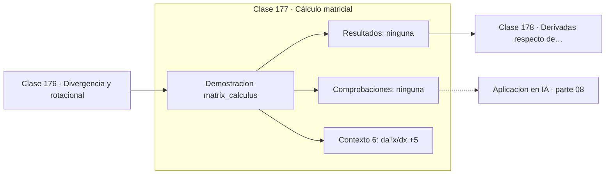

# 177 — Cálculo matricial

> [⬅️ 176 Divergencia y rotacional](../176-divergencia-y-rotacional/README.md) · [📚 Parte 08](../README.md) · [🏠 Programa](../../../README.md) · [178 Derivadas respecto de vectores y matrices ➡️](../178-derivadas-respecto-de-vectores-y-matrices/README.md)

**Parte:** 08 — Cálculo multivariable, matricial y autodiferenciación · **Nivel:** `universitario-avanzado` · **Horas estimadas:** 4
**Motor:** `engines.part08` · **Demostración:** `matrix_calculus` · **Clase 17 de 20** de la parte

---

## 🎯 Propósito

**El cálculo matricial da fórmulas cerradas para gradientes respecto a vectores y matrices.**

Derivadas parciales, gradiente, Jacobiano, Hessiano, Taylor multivariable, multiplicadores de Lagrange, cálculo matricial y autodiferenciación.

## ✅ Resultados de aprendizaje

Al terminar podrás:

1. Explicar **Cálculo matricial** con lenguaje cotidiano y con notación matemática.
2. Resolver un caso pequeño a mano y anticipar el orden de magnitud del resultado.
3. Ejecutar y modificar `lab.py`, que corre la demostración `matrix_calculus`.
4. Interpretar las 6 salidas del laboratorio y decir qué comprueba cada una.
5. Detectar el error típico de esta parte: suponer que el hessiano es definido positivo sin comprobarlo.

## 🧩 Fórmulas de la clase

```text
∂(aᵀx)/∂x = a
∂(xᵀAx)/∂x = (A + Aᵀ)x,  y 2Ax si A es simétrica
∂‖x‖²/∂x = 2x
```

## 🗺️ Ubicación en el programa



## 📖 Fundamentos

Derivar respecto a un vector o una matriz componente a componente es tedioso y propenso a
error. El cálculo matricial ofrece fórmulas cerradas para los patrones que aparecen una y
otra vez, y saberlas de memoria acelera cualquier deducción en machine learning.

Las dos más útiles son inmediatas: la derivada de una forma lineal `aᵀx` es `a`, y la de
una forma cuadrática `xᵀAx` es `(A + Aᵀ)x`, que se reduce a `2Ax` cuando `A` es simétrica
—el caso habitual, porque toda forma cuadrática se puede escribir con matriz simétrica—.

El escollo práctico es la **convención de layout**. En la convención del denominador el
gradiente es un vector columna; en la del numerador, una fila. Ambas son correctas y las
fórmulas difieren en una transposición. Mezclarlas produce errores de shape que a veces
no se detectan porque las dimensiones cuadran por casualidad.

La recomendación práctica es fijar una convención, declararla en el código y verificar
**siempre** las fórmulas contra diferencias finitas. El laboratorio hace exactamente eso, y
es lo mismo que hace `torch.autograd.gradcheck`.

## 🧮 Ejemplo trabajado

Dos identidades verificadas numéricamente.

```text
x = (1, 2),  a = (4, −1),  A = [[2,1],[1,3]] (simétrica)

Forma lineal aᵀx:
  fórmula:  ∂/∂x = a = (4, −1)
  numérica: (4.000000, −1.000000)          ✓

Forma cuadrática xᵀAx:
  fórmula:  (A + Aᵀ)x = 2Ax = (8, 14)
  numérica: (8.00000, 14.00000)            ✓

Convención usada: denominador (gradiente como columna)
```

## 🔬 Qué ejecuta el laboratorio

`matrix_calculus` — Identidades básicas de cálculo matricial.

| Grupo | Salidas |
|---|---|
| 🔢 Resultados numéricos (0) | — |
| ✅ Comprobaciones de invariante (0) | — |

Las claves booleanas no son adorno: si alguna fuera `False`, el resultado numérico
no sería fiable aunque el programa terminase sin error.

```bash
python classes/part-08-calculo-multivariable-matricial-y-autodiferenciacion/177-calculo-matricial/lab.py
compmath run 177
```

> [!TIP]
> Antes de ejecutar, **escribe tu predicción**. Un laboratorio que confirma lo que
> esperabas enseña tanto como uno que te contradice, pero solo si la predicción
> existía antes del resultado.

## ⚠️ Errores conceptuales frecuentes

1. Mezclar convenciones de layout entre partes del mismo código.
2. Aplicar la fórmula 2Ax a una matriz no simétrica.
3. No verificar las fórmulas contra diferencias finitas.

## 🚀 Dónde se usa de verdad

Deducción de gradientes de funciones de pérdida, backpropagation analítica, métodos de
segundo orden y cualquier derivación en un paper de machine learning.

## 🤖 Conexión con IA

Autograd de PyTorch y JAX es exactamente el modo reverso del grafo de cómputo que se construye en esta parte a mano.

## 📓 Notebooks

| Archivo | Para qué |
|---|---|
| [`notebook.ipynb`](notebook.ipynb) | recorrido guiado con la demostración ejecutada |
| [`notebook_student.ipynb`](notebook_student.ipynb) | versión con `TODO` para resolver |
| [`notebook_solution.ipynb`](notebook_solution.ipynb) | solución de referencia verificada |

## 📝 Evaluación

| Criterio | Peso |
|---|---:|
| Comprensión conceptual | 25 % |
| Resolución manual | 25 % |
| Implementación y verificación | 25 % |
| Interpretación y comunicación | 15 % |
| Conexión con aplicación real | 10 % |

Detalle y criterios de error crítico en [`assessment.md`](assessment.md).

## ❓ Preguntas de comprobación

1. ¿Cuál es la entrada, cuál la salida y qué unidades tienen?
2. ¿Qué operación domina el comportamiento del resultado?
3. ¿Qué caso extremo revelaría un error conceptual?
4. ¿Cómo verificarías el resultado por un método independiente?
5. ¿Dónde aparece esto en optimización multivariable?

Si necesitas releer el código para responderlas, la clase todavía no está superada.

## 📥 Entregable

`notebook_student.ipynb` resuelto más un párrafo que explique el resultado **sin citar
código**: qué entra, qué sale, qué invariante se comprueba y qué pasaría en un caso límite.

## 🔗 Referencias

- [Petersen & Pedersen. *The Matrix Cookbook*, 2012](https://www.math.uwaterloo.ca/~hwolkowi/matrixcookbook.pdf)
- [Magnus & Neudecker. *Matrix Differential Calculus*, 3ª ed., Wiley, 2019](https://www.wiley.com/en-us/Matrix+Differential+Calculus+with+Applications+in+Statistics+and+Econometrics%2C+3rd+Edition-p-9781119541202)

Bibliografía completa de la parte en [`../../../docs/BIBLIOGRAPHY.md`](../../../docs/BIBLIOGRAPHY.md).

## 📂 Material de la clase

[`intuition.md`](intuition.md) · [`theory.md`](theory.md) · [`derivation.md`](derivation.md) · [`exercises.md`](exercises.md) · [`assessment.md`](assessment.md) · [`where-is-this-used.md`](where-is-this-used.md) · [`lesson.yaml`](lesson.yaml)

---

> [⬅️ 176 Divergencia y rotacional](../176-divergencia-y-rotacional/README.md) · [📚 Parte 08](../README.md) · [🏠 Programa](../../../README.md) · [178 Derivadas respecto de vectores y matrices ➡️](../178-derivadas-respecto-de-vectores-y-matrices/README.md)
