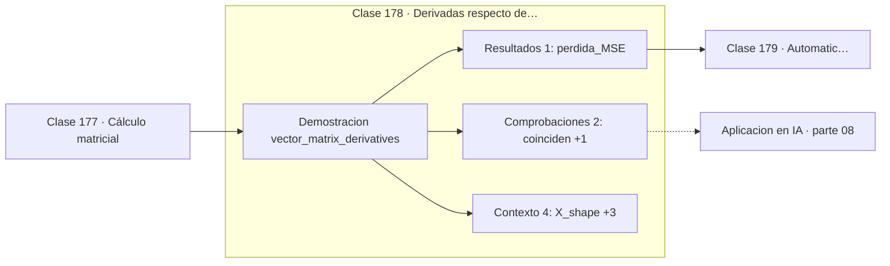

# 178 — Derivadas respecto de vectores y matrices

> [⬅️ 177 Cálculo matricial](../177-calculo-matricial/README.md) · [📚 Parte 08](../README.md) · [🏠 Programa](../../../README.md) · [179 Automatic differentiation y computational graphs ➡️](../179-automatic-differentiation-y-computational-graphs/README.md)

**Parte:** 08 — Cálculo multivariable, matricial y autodiferenciación · **Nivel:** `universitario-avanzado` · **Horas estimadas:** 4
**Motor:** `engines.part08` · **Demostración:** `vector_matrix_derivatives` · **Clase 18 de 20** de la parte

---

## 🎯 Propósito

**El gradiente de la pérdida cuadrática es 2Xᵀ(Xw − y)/n: esa expresión es el gradiente de una capa lineal.**

Derivadas parciales, gradiente, Jacobiano, Hessiano, Taylor multivariable, multiplicadores de Lagrange, cálculo matricial y autodiferenciación.

## ✅ Resultados de aprendizaje

Al terminar podrás:

1. Explicar **Derivadas respecto de vectores y matrices** con lenguaje cotidiano y con notación matemática.
2. Resolver un caso pequeño a mano y anticipar el orden de magnitud del resultado.
3. Ejecutar y modificar `lab.py`, que corre la demostración `vector_matrix_derivatives`.
4. Interpretar las 7 salidas del laboratorio y decir qué comprueba cada una.
5. Detectar el error típico de esta parte: olvidar acumular gradientes cuando un nodo se reutiliza en el grafo.

## 🧩 Fórmulas de la clase

```text
L(w) = ‖Xw − y‖²/n
∇L = 2Xᵀ(Xw − y)/n
```

## 🗺️ Ubicación en el programa



## 📖 Fundamentos

Esta clase deduce la fórmula que más se usa en todo el machine learning. La pérdida
cuadrática media de un modelo lineal es `‖Xw − y‖²/n`, y su gradiente respecto a los pesos
es `2Xᵀr/n`, donde `r = Xw − y` es el vector de residuos.

La estructura de esa expresión merece leerse despacio, porque es la misma en modelos mucho
más complejos. El residuo mide el error de cada observación; `Xᵀ` lo proyecta de vuelta al
espacio de parámetros, atribuyendo a cada peso la parte del error que le corresponde
según su feature; y la división por `n` promedia.

En una red neuronal ocurre exactamente lo mismo capa a capa: se calcula el error en la
salida y se «retropropaga» multiplicando por la transpuesta de la matriz de pesos. La
aparición de `Wᵀ` en backpropagation no es un truco: es esta fórmula.

Igualar el gradiente a cero da `XᵀXw = Xᵀy`, las ecuaciones normales de la clase 131.
Optimización iterativa y solución cerrada llegan al mismo sitio; la primera escala a
millones de parámetros y la segunda no.

## 🧮 Ejemplo trabajado

Gradiente de la pérdida cuadrática de un modelo lineal.

```text
X = [[1,2],[2,1],[3,4]]   y = (5, 4, 11)   w = (1, 1)

predicciones: Xw = (3, 3, 7)
residuos r = Xw − y = (−2, −1, −4)

MSE = (4 + 1 + 16)/3 = 7.0

∇w = 2Xᵀr/n = 2·(−16, −21)/3 = (−10.6667, −14.0)
numérico:                       (−10.6667, −14.0)   ✓

Igualar a cero → ecuaciones normales XᵀXw = Xᵀy
```

## 🔬 Qué ejecuta el laboratorio

`vector_matrix_derivatives` — Gradiente de una pérdida cuadrática respecto de los pesos.

| Grupo | Salidas |
|---|---|
| 🔢 Resultados numéricos (1) | `perdida_MSE` |
| ✅ Comprobaciones de invariante (2) | `coinciden`, `esto_es_una_capa_lineal` |

Las claves booleanas no son adorno: si alguna fuera `False`, el resultado numérico
no sería fiable aunque el programa terminase sin error.

```bash
python classes/part-08-calculo-multivariable-matricial-y-autodiferenciacion/178-derivadas-respecto-de-vectores-y-matrices/lab.py
compmath run 178
```

> [!TIP]
> Antes de ejecutar, **escribe tu predicción**. Un laboratorio que confirma lo que
> esperabas enseña tanto como uno que te contradice, pero solo si la predicción
> existía antes del resultado.

## ⚠️ Errores conceptuales frecuentes

1. Olvidar el factor 2 o la división por n.
2. Transponer X en el lado equivocado y obtener un shape incorrecto.
3. Confundir el residuo (predicción menos objetivo) con su opuesto: cambia el signo del gradiente.

## 🚀 Dónde se usa de verdad

Gradiente de una capa lineal, regresión por descenso de gradiente, deducción de
backpropagation y toda función de pérdida cuadrática.

## 🤖 Conexión con IA

Autograd de PyTorch y JAX es exactamente el modo reverso del grafo de cómputo que se construye en esta parte a mano.

## 📓 Notebooks

| Archivo | Para qué |
|---|---|
| [`notebook.ipynb`](notebook.ipynb) | recorrido guiado con la demostración ejecutada |
| [`notebook_student.ipynb`](notebook_student.ipynb) | versión con `TODO` para resolver |
| [`notebook_solution.ipynb`](notebook_solution.ipynb) | solución de referencia verificada |

## 📝 Evaluación

| Criterio | Peso |
|---|---:|
| Comprensión conceptual | 25 % |
| Resolución manual | 25 % |
| Implementación y verificación | 25 % |
| Interpretación y comunicación | 15 % |
| Conexión con aplicación real | 10 % |

Detalle y criterios de error crítico en [`assessment.md`](assessment.md).

## ❓ Preguntas de comprobación

1. ¿Cuál es la entrada, cuál la salida y qué unidades tienen?
2. ¿Qué operación domina el comportamiento del resultado?
3. ¿Qué caso extremo revelaría un error conceptual?
4. ¿Cómo verificarías el resultado por un método independiente?
5. ¿Dónde aparece esto en optimización multivariable?

Si necesitas releer el código para responderlas, la clase todavía no está superada.

## 📥 Entregable

`notebook_student.ipynb` resuelto más un párrafo que explique el resultado **sin citar
código**: qué entra, qué sale, qué invariante se comprueba y qué pasaría en un caso límite.

## 🔗 Referencias

- [Petersen & Pedersen. *The Matrix Cookbook*, 2012](https://www.math.uwaterloo.ca/~hwolkowi/matrixcookbook.pdf)
- [Goodfellow, Bengio & Courville. *Deep Learning*. MIT Press, 2016, cap. 5](https://www.deeplearningbook.org/)

Bibliografía completa de la parte en [`../../../docs/BIBLIOGRAPHY.md`](../../../docs/BIBLIOGRAPHY.md).

## 📂 Material de la clase

[`intuition.md`](intuition.md) · [`theory.md`](theory.md) · [`derivation.md`](derivation.md) · [`exercises.md`](exercises.md) · [`assessment.md`](assessment.md) · [`where-is-this-used.md`](where-is-this-used.md) · [`lesson.yaml`](lesson.yaml)

---

> [⬅️ 177 Cálculo matricial](../177-calculo-matricial/README.md) · [📚 Parte 08](../README.md) · [🏠 Programa](../../../README.md) · [179 Automatic differentiation y computational graphs ➡️](../179-automatic-differentiation-y-computational-graphs/README.md)
