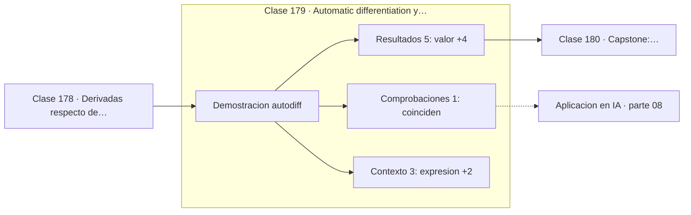

# 179 — Automatic differentiation y computational graphs

> [⬅️ 178 Derivadas respecto de vectores y matrices](../178-derivadas-respecto-de-vectores-y-matrices/README.md) · [📚 Parte 08](../README.md) · [🏠 Programa](../../../README.md) · [180 Capstone: backpropagation manual y automática ➡️](../180-capstone-backpropagation-manual-y-automatica/README.md)

**Parte:** 08 — Cálculo multivariable, matricial y autodiferenciación · **Nivel:** `universitario-avanzado` · **Horas estimadas:** 4
**Motor:** `engines.part08` · **Demostración:** `autodiff` · **Clase 19 de 20** de la parte

---

## 🎯 Propósito

**La autodiferenciación en modo reverso obtiene todos los gradientes con un barrido hacia adelante y uno hacia atrás.**

Derivadas parciales, gradiente, Jacobiano, Hessiano, Taylor multivariable, multiplicadores de Lagrange, cálculo matricial y autodiferenciación.

## ✅ Resultados de aprendizaje

Al terminar podrás:

1. Explicar **Automatic differentiation y computational graphs** con lenguaje cotidiano y con notación matemática.
2. Resolver un caso pequeño a mano y anticipar el orden de magnitud del resultado.
3. Ejecutar y modificar `lab.py`, que corre la demostración `autodiff`.
4. Interpretar las 9 salidas del laboratorio y decir qué comprueba cada una.
5. Detectar el error típico de esta parte: confundir la convención de layout (numerador vs denominador) en cálculo matricial.

## 🧩 Fórmulas de la clase

```text
coste del modo reverso: O(1) barridos, independiente del número de variables
coste de diferencias finitas: 2 evaluaciones por variable
```

## 🗺️ Ubicación en el programa



## 📖 Fundamentos

La autodiferenciación no es derivación simbólica ni numérica: es una **tercera opción**.
Registra las operaciones elementales que se ejecutan formando un grafo de cómputo, y luego
aplica la regla de la cadena sobre ese grafo. El resultado es exacto salvo redondeo, sin
la explosión de expresiones del cálculo simbólico ni el error de truncamiento de las
diferencias finitas.

El **modo reverso** es el que usan los frameworks de deep learning. Hace un barrido hacia
adelante guardando valores intermedios y otro hacia atrás propagando derivadas, y obtiene
**todas** las derivadas parciales en ese único par de barridos. Con un millón de
parámetros, las diferencias finitas necesitarían dos millones de evaluaciones; el modo
reverso necesita el equivalente a unas pocas.

El precio es la memoria: hay que guardar los valores intermedios del barrido hacia
adelante para usarlos en el de vuelta. Esa es la razón por la que entrenar consume mucha
más memoria que inferir, y por la que existe el *gradient checkpointing*, que recalcula
partes en lugar de guardarlas.

La implementación del programa (`Var` en `part08.py`) tiene unas cien líneas y hace
exactamente lo mismo que PyTorch en su núcleo: cada operación registra cómo propagar el
gradiente, `backward()` construye el orden topológico y lo recorre al revés acumulando.
Lo que añaden los frameworks reales es tensores, GPU, fusión de operaciones y compilación,
no un mecanismo distinto.

## 🧮 Ejemplo trabajado

Autodiferenciación de una expresión con dos variables.

```text
z = (x·y + sin x)·y²    en x = 2, y = 3

valor: 63.1852

dz/dx autodiff:  30.7482
dz/dx numérico:  30.7482                     ✓
dz/dy autodiff:  60.7902
dz/dy numérico:  60.7902                     ✓

Coste:
  autodiff:            1 barrido adelante + 1 atrás
  diferencias finitas: 2 evaluaciones por variable
```

## 🔬 Qué ejecuta el laboratorio

`autodiff` — Autodiferenciación en modo reverso sobre el grafo de cómputo.

| Grupo | Salidas |
|---|---|
| 🔢 Resultados numéricos (5) | `valor`, `dz/dx_autodiff`, `dz/dx_numerico`, `dz/dy_autodiff`, `dz/dy_numerico` |
| ✅ Comprobaciones de invariante (1) | `coinciden` |

Las claves booleanas no son adorno: si alguna fuera `False`, el resultado numérico
no sería fiable aunque el programa terminase sin error.

```bash
python classes/part-08-calculo-multivariable-matricial-y-autodiferenciacion/179-automatic-differentiation-y-computational-graphs/lab.py
compmath run 179
```

> [!TIP]
> Antes de ejecutar, **escribe tu predicción**. Un laboratorio que confirma lo que
> esperabas enseña tanto como uno que te contradice, pero solo si la predicción
> existía antes del resultado.

## ⚠️ Errores conceptuales frecuentes

1. Confundir autodiferenciación con derivación simbólica o numérica.
2. Olvidar acumular gradientes en nodos reutilizados.
3. Usar el modo directo cuando hay muchas entradas y una salida.

## 🚀 Dónde se usa de verdad

Entrenamiento de cualquier red neuronal, optimización de hiperparámetros por gradiente,
física diferenciable y gradientes de simuladores.

## 🤖 Conexión con IA

Autograd de PyTorch y JAX es exactamente el modo reverso del grafo de cómputo que se construye en esta parte a mano.

## 📓 Notebooks

| Archivo | Para qué |
|---|---|
| [`notebook.ipynb`](notebook.ipynb) | recorrido guiado con la demostración ejecutada |
| [`notebook_student.ipynb`](notebook_student.ipynb) | versión con `TODO` para resolver |
| [`notebook_solution.ipynb`](notebook_solution.ipynb) | solución de referencia verificada |

## 📝 Evaluación

| Criterio | Peso |
|---|---:|
| Comprensión conceptual | 25 % |
| Resolución manual | 25 % |
| Implementación y verificación | 25 % |
| Interpretación y comunicación | 15 % |
| Conexión con aplicación real | 10 % |

Detalle y criterios de error crítico en [`assessment.md`](assessment.md).

## ❓ Preguntas de comprobación

1. ¿Cuál es la entrada, cuál la salida y qué unidades tienen?
2. ¿Qué operación domina el comportamiento del resultado?
3. ¿Qué caso extremo revelaría un error conceptual?
4. ¿Cómo verificarías el resultado por un método independiente?
5. ¿Dónde aparece esto en optimización multivariable?

Si necesitas releer el código para responderlas, la clase todavía no está superada.

## 📥 Entregable

`notebook_student.ipynb` resuelto más un párrafo que explique el resultado **sin citar
código**: qué entra, qué sale, qué invariante se comprueba y qué pasaría en un caso límite.

## 🔗 Referencias

- [Baydin, A. et al. *Automatic Differentiation in Machine Learning: a Survey*. JMLR, 2018](https://jmlr.org/papers/v18/17-468.html) — *uso:* obra de referencia consultada en «Automatic differentiation y computational graphs».
- [Griewank & Walther. *Evaluating Derivatives*, 2ª ed., SIAM, 2008](https://epubs.siam.org/doi/book/10.1137/1.9780898717761) — *uso:* desarrollo formal del tema en «Automatic differentiation y computational graphs».

Bibliografía completa de la parte en [`../../../docs/BIBLIOGRAPHY.md`](../../../docs/BIBLIOGRAPHY.md) · localizador verificable de cada obra en [`sources/bibliography.json`](../../../sources/bibliography.json).

## 📂 Material de la clase

[`intuition.md`](intuition.md) · [`theory.md`](theory.md) · [`derivation.md`](derivation.md) · [`exercises.md`](exercises.md) · [`assessment.md`](assessment.md) · [`where-is-this-used.md`](where-is-this-used.md) · [`lesson.yaml`](lesson.yaml)

---

> [⬅️ 178 Derivadas respecto de vectores y matrices](../178-derivadas-respecto-de-vectores-y-matrices/README.md) · [📚 Parte 08](../README.md) · [🏠 Programa](../../../README.md) · [180 Capstone: backpropagation manual y automática ➡️](../180-capstone-backpropagation-manual-y-automatica/README.md)
