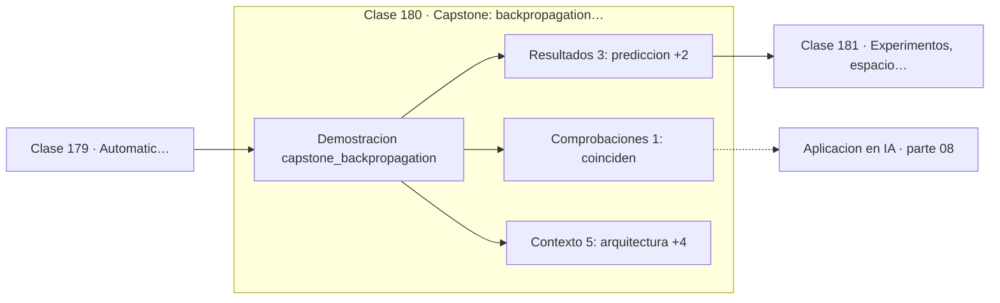

# 180 — Capstone: backpropagation manual y automática

> [⬅️ 179 Automatic differentiation y computational graphs](../179-automatic-differentiation-y-computational-graphs/README.md) · [📚 Parte 08](../README.md) · [🏠 Programa](../../../README.md) · [181 Experimentos, espacio muestral y eventos ➡️](../../part-09-probabilidad-y-procesos-aleatorios/181-experimentos-espacio-muestral-y-eventos/README.md)

**Parte:** 08 — Cálculo multivariable, matricial y autodiferenciación · **Nivel:** `universitario-avanzado` · **Horas estimadas:** 4
**Motor:** `engines.part08` · **Demostración:** `capstone_backpropagation` · **Clase 20 de 20** de la parte

---

## 🎯 Propósito

**Backpropagation manual y autodiferenciación dan exactamente el mismo número: autograd no es magia.**

Derivadas parciales, gradiente, Jacobiano, Hessiano, Taylor multivariable, multiplicadores de Lagrange, cálculo matricial y autodiferenciación.

## ✅ Resultados de aprendizaje

Al terminar podrás:

1. Explicar **Capstone: backpropagation manual y automática** con lenguaje cotidiano y con notación matemática.
2. Resolver un caso pequeño a mano y anticipar el orden de magnitud del resultado.
3. Ejecutar y modificar `lab.py`, que corre la demostración `capstone_backpropagation`.
4. Interpretar las 9 salidas del laboratorio y decir qué comprueba cada una.
5. Detectar el error típico de esta parte: suponer que el hessiano es definido positivo sin comprobarlo.

## 🧩 Fórmulas de la clase

```text
cadena hacia atrás: dL/dw = dL/da · da/dz · dz/dw
tanh': 1 − tanh²
```

## 🗺️ Ubicación en el programa



## 📖 Fundamentos

El capstone cierra la parte comparando dos caminos hacia el mismo resultado. Se define una
red mínima —dos capas con `tanh` y pérdida cuadrática—, se derivan sus gradientes a mano
aplicando la regla de la cadena paso a paso, y se calculan también con el motor de
autodiferenciación. Ambos deben coincidir hasta el último dígito.

La derivación manual hace explícito lo que autograd oculta. Se empieza por `dL/da₂`, se
multiplica por la derivada de la activación para obtener `dL/dz₂`, y se distribuye a los
parámetros de esa capa. Después se propaga hacia atrás multiplicando por el peso, se
vuelve a multiplicar por la derivada de la activación, y se distribuye a la capa anterior.
Ese patrón —error, derivada de activación, distribución, propagación— se repite capa a
capa.

Que los dos caminos coincidan exactamente es la comprobación que convierte autograd de
caja negra en herramienta comprendida. Un practicante que ha hecho este ejercicio una vez
sabe qué está calculando `loss.backward()`, por qué hace falta `zero_grad()` y por qué el
gradiente se desvanece en redes profundas.

Es también la técnica de depuración estándar: cuando un gradiente personalizado parece mal,
se compara contra diferencias finitas. `torch.autograd.gradcheck` hace exactamente esa
comparación, y es la primera herramienta que hay que usar al implementar una capa nueva.

## 🧮 Ejemplo trabajado

Comparar backpropagation manual y automática.

```text
Red: x → tanh(w₁x + b₁) → tanh(w₂h + b₂) → MSE
x = 0.5, objetivo = 1.0
w₁ = 1.2, b₁ = −0.3, w₂ = 0.8, b₂ = 0.1

predicción: 0.5216
pérdida:    0.2288

parámetro   manual      autodiff     coinciden
w₁         −0.1495     −0.1495          ✓
b₁         −0.2990     −0.2990          ✓
w₂         −0.2016     −0.2016          ✓
b₂         −0.6970     −0.6970          ✓

Conclusión: autograd es la regla de la cadena
en orden topológico inverso.
```

## 🔬 Qué ejecuta el laboratorio

`capstone_backpropagation` — Capstone: backpropagation manual y automática sobre la misma red.

| Grupo | Salidas |
|---|---|
| 🔢 Resultados numéricos (3) | `prediccion`, `objetivo`, `perdida` |
| ✅ Comprobaciones de invariante (1) | `coinciden` |

Las claves booleanas no son adorno: si alguna fuera `False`, el resultado numérico
no sería fiable aunque el programa terminase sin error.

```bash
python classes/part-08-calculo-multivariable-matricial-y-autodiferenciacion/180-capstone-backpropagation-manual-y-automatica/lab.py
compmath run 180
```

> [!TIP]
> Antes de ejecutar, **escribe tu predicción**. Un laboratorio que confirma lo que
> esperabas enseña tanto como uno que te contradice, pero solo si la predicción
> existía antes del resultado.

## ⚠️ Errores conceptuales frecuentes

1. Olvidar multiplicar por la derivada de la activación en cada capa.
2. Confundir el orden de propagación: se va de la pérdida hacia las entradas.
3. No verificar un gradiente personalizado contra diferencias finitas.

## 🚀 Dónde se usa de verdad

Depuración de gradientes, implementación de capas personalizadas, comprensión de
`loss.backward()` y diagnóstico de gradientes que se desvanecen.

## 🤖 Conexión con IA

Autograd de PyTorch y JAX es exactamente el modo reverso del grafo de cómputo que se construye en esta parte a mano.

## 📓 Notebooks

| Archivo | Para qué |
|---|---|
| [`notebook.ipynb`](notebook.ipynb) | recorrido guiado con la demostración ejecutada |
| [`notebook_student.ipynb`](notebook_student.ipynb) | versión con `TODO` para resolver |
| [`notebook_solution.ipynb`](notebook_solution.ipynb) | solución de referencia verificada |

## 📝 Evaluación

| Criterio | Peso |
|---|---:|
| Comprensión conceptual | 25 % |
| Resolución manual | 25 % |
| Implementación y verificación | 25 % |
| Interpretación y comunicación | 15 % |
| Conexión con aplicación real | 10 % |

Detalle y criterios de error crítico en [`assessment.md`](assessment.md).

## ❓ Preguntas de comprobación

1. ¿Cuál es la entrada, cuál la salida y qué unidades tienen?
2. ¿Qué operación domina el comportamiento del resultado?
3. ¿Qué caso extremo revelaría un error conceptual?
4. ¿Cómo verificarías el resultado por un método independiente?
5. ¿Dónde aparece esto en optimización multivariable?

Si necesitas releer el código para responderlas, la clase todavía no está superada.

## 📥 Entregable

`notebook_student.ipynb` resuelto más un párrafo que explique el resultado **sin citar
código**: qué entra, qué sale, qué invariante se comprueba y qué pasaría en un caso límite.

## 🔗 Referencias

- [Rumelhart, Hinton & Williams. *Learning representations by back-propagating errors*. Nature, 1986](https://www.nature.com/articles/323533a0)
- [PyTorch: `torch.autograd.gradcheck`](https://pytorch.org/docs/stable/generated/torch.autograd.gradcheck.html)

Bibliografía completa de la parte en [`../../../docs/BIBLIOGRAPHY.md`](../../../docs/BIBLIOGRAPHY.md).

## 📂 Material de la clase

[`intuition.md`](intuition.md) · [`theory.md`](theory.md) · [`derivation.md`](derivation.md) · [`exercises.md`](exercises.md) · [`assessment.md`](assessment.md) · [`where-is-this-used.md`](where-is-this-used.md) · [`lesson.yaml`](lesson.yaml)

---

> [⬅️ 179 Automatic differentiation y computational graphs](../179-automatic-differentiation-y-computational-graphs/README.md) · [📚 Parte 08](../README.md) · [🏠 Programa](../../../README.md) · [181 Experimentos, espacio muestral y eventos ➡️](../../part-09-probabilidad-y-procesos-aleatorios/181-experimentos-espacio-muestral-y-eventos/README.md)
