# 🌐 Parte 08 — Cálculo multivariable, matricial y autodiferenciación

> [⬅️ Parte 07 — Cálculo diferencial e integral](../part-07-calculo-diferencial-e-integral/README.md) · [🏠 Programa](../../README.md) · [📇 Catálogo](../README.md) · [Parte 09 — Probabilidad y procesos aleatorios ➡️](../part-09-probabilidad-y-procesos-aleatorios/README.md)

**Nivel:** `universitario-avanzado` · **Clases:** 20 · **Horas estimadas:** 80 · **Motor:** [`part08.py`](../../src/computational_math/engines/part08.py)

---

## 🎯 De qué trata esta parte

Derivadas parciales, gradiente, Jacobiano, Hessiano, Taylor multivariable, multiplicadores de Lagrange, cálculo matricial y autodiferenciación.

## 🧠 Ideas centrales

- El gradiente apunta al mayor ascenso; por eso se desciende en su dirección opuesta.
- El Jacobiano generaliza la derivada a funciones vectoriales.
- El Hessiano describe la curvatura y decide el tipo de punto crítico.
- Modo reverso calcula todas las derivadas en un solo barrido hacia atrás.
- Lagrange convierte una restricción en un término de la función objetivo.

## 🤖 Por qué importa en IA

> [!IMPORTANT]
> Autograd de PyTorch y JAX es exactamente el modo reverso del grafo de cómputo que se construye en esta parte a mano.

## ⚠️ Errores frecuentes de esta parte

- Confundir la convención de layout (numerador vs denominador) en cálculo matricial.
- Suponer que el Hessiano es definido positivo sin comprobarlo.
- Olvidar acumular gradientes cuando un nodo se reutiliza en el grafo.

## 🧭 Secuencia de la parte

```mermaid
flowchart LR
    subgraph B1["Bloque 1"]
        direction TB
        L161["161 · Funciones de varias variables"]
        L162["162 · Superficies y curvas de nivel"]
        L163["163 · Derivadas parciales"]
        L164["164 · Gradiente"]
        L165["165 · Derivada direccional"]
        L161 --> L162
        L162 --> L163
        L163 --> L164
        L164 --> L165
    end
    subgraph B2["Bloque 2"]
        direction TB
        L166["166 · Plano tangente"]
        L167["167 · Regla de la cadena…"]
        L168["168 · Jacobiano"]
        L169["169 · Hessiano"]
        L170["170 · Taylor multivariable"]
        L166 --> L167
        L167 --> L168
        L168 --> L169
        L169 --> L170
    end
    subgraph B3["Bloque 3"]
        direction TB
        L171["171 · Optimización sin restricciones"]
        L172["172 · Multiplicadores de Lagrange"]
        L173["173 · Integrales dobles"]
        L174["174 · Integrales triples"]
        L175["175 · Campos vectoriales"]
        L171 --> L172
        L172 --> L173
        L173 --> L174
        L174 --> L175
    end
    subgraph B4["Bloque 4"]
        direction TB
        L176["176 · Divergencia y rotacional"]
        L177["177 · Cálculo matricial"]
        L178["178 · Derivadas respecto de…"]
        L179["179 · Automatic differentiation y…"]
        L180["180 · Capstone: backpropagation…"]
        L176 --> L177
        L177 --> L178
        L178 --> L179
        L179 --> L180
    end
    L165 --> L166
    L170 --> L171
    L175 --> L176
```



## 📚 Las clases

| # | Clase | Demostración | Idea central |
|---|---|---|---|
| `161` | [Funciones de varias variables](161-funciones-de-varias-variables/README.md) | `multivariable_functions` | Una función de dos variables evaluada sobre una malla. |
| `162` | [Superficies y curvas de nivel](162-superficies-y-curvas-de-nivel/README.md) | `level_curves` | Curvas de nivel: dónde la función vale lo mismo. |
| `163` | [Derivadas parciales](163-derivadas-parciales/README.md) | `partial_derivatives` | Derivadas parciales: mover una variable congelando el resto. |
| `164` | [Gradiente](164-gradiente/README.md) | `gradient` | El gradiente apunta al mayor ascenso. |
| `165` | [Derivada direccional](165-derivada-direccional/README.md) | `directional_derivative` | Derivada direccional como proyección del gradiente. |
| `166` | [Plano tangente](166-plano-tangente/README.md) | `tangent_plane` | Plano tangente: la aproximación lineal en dos variables. |
| `167` | [Regla de la cadena multivariable](167-regla-de-la-cadena-multivariable/README.md) | `multivariable_chain_rule` | Regla de la cadena con variables intermedias. |
| `168` | [Jacobiano](168-jacobiano/README.md) | `jacobian` | Jacobiano de una función vectorial. |
| `169` | [Hessiano](169-hessiano/README.md) | `hessian` | Hessiano: curvatura y clasificación del punto crítico. |
| `170` | [Taylor multivariable](170-taylor-multivariable/README.md) | `multivariable_taylor` | Taylor de segundo orden en dos variables. |
| `171` | [Optimización sin restricciones](171-optimizacion-sin-restricciones/README.md) | `unconstrained_optimization` | Descenso de gradiente sobre una cuadrática con historial. |
| `172` | [Multiplicadores de Lagrange](172-multiplicadores-de-lagrange/README.md) | `lagrange_multipliers` | Maximizar xy sujeto a x+y=10 con multiplicadores de Lagrange. |
| `173` | [Integrales dobles](173-integrales-dobles/README.md) | `double_integrals` | Integral doble sobre un rectángulo por suma de Riemann. |
| `174` | [Integrales triples](174-integrales-triples/README.md) | `triple_integrals` | Volumen y masa de un cubo con densidad variable. |
| `175` | [Campos vectoriales](175-campos-vectoriales/README.md) | `vector_fields` | Campo vectorial, líneas de flujo y campo conservativo. |
| `176` | [Divergencia y rotacional](176-divergencia-y-rotacional/README.md) | `divergence_curl` | Divergencia y rotacional calculados numéricamente. |
| `177` | [Cálculo matricial](177-calculo-matricial/README.md) | `matrix_calculus` | Identidades básicas de cálculo matricial. |
| `178` | [Derivadas respecto de vectores y matrices](178-derivadas-respecto-de-vectores-y-matrices/README.md) | `vector_matrix_derivatives` | Gradiente de una pérdida cuadrática respecto de los pesos. |
| `179` | [Automatic differentiation y computational graphs](179-automatic-differentiation-y-computational-graphs/README.md) | `autodiff` | Autodiferenciación en modo reverso sobre el grafo de cómputo. |
| `180` | [Capstone: backpropagation manual y automática](180-capstone-backpropagation-manual-y-automatica/README.md) | `capstone_backpropagation` | Capstone: backpropagation manual y automática sobre la misma red. |

## 🧰 Stack de referencia

`math`, `numpy (opcional)`, `jax/torch (opcional)`

Los laboratorios se ejecutan con biblioteca estándar; estas herramientas aparecen
como contraste profesional, no como requisito.

## 🧪 Ejecutar toda la parte

```bash
compmath run --part 08
compmath catalog --part 08
```

## 📊 Evaluación de la parte

| Componente | Peso |
|---|---:|
| Clases y ejercicios | 40 % |
| Laboratorios y notebooks | 25 % |
| Explicación oral o escrita | 15 % |
| Capstone ([180](180-capstone-backpropagation-manual-y-automatica/README.md)) | 20 % |

## 📖 Bibliografía

- Petersen, K.; Pedersen, M. *The Matrix Cookbook*. 2012.
- Baydin, A. et al. *Automatic Differentiation in Machine Learning: a Survey*. JMLR, 2018.
- Magnus, J.; Neudecker, H. *Matrix Differential Calculus*. 3ª ed., Wiley, 2019.

---

> [⬅️ Parte 07 — Cálculo diferencial e integral](../part-07-calculo-diferencial-e-integral/README.md) · [🏠 Programa](../../README.md) · [📇 Catálogo](../README.md) · [Parte 09 — Probabilidad y procesos aleatorios ➡️](../part-09-probabilidad-y-procesos-aleatorios/README.md)
