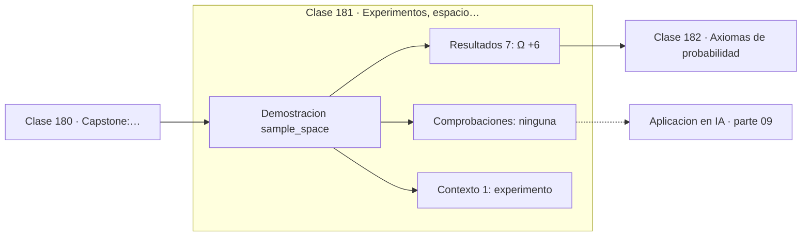

# 181 — Experimentos, espacio muestral y eventos

> [⬅️ 180 Capstone: backpropagation manual y automática](../../part-08-calculo-multivariable-matricial-y-autodiferenciacion/180-capstone-backpropagation-manual-y-automatica/README.md) · [📚 Parte 09](../README.md) · [🏠 Programa](../../../README.md) · [182 Axiomas de probabilidad ➡️](../182-axiomas-de-probabilidad/README.md)

**Parte:** 09 — Probabilidad y procesos aleatorios · **Nivel:** `universitario` · **Horas estimadas:** 4
**Motor:** `engines.part09` · **Demostración:** `sample_space` · **Clase 1 de 20** de la parte

---

## 🎯 Propósito

**Antes de calcular ninguna probabilidad hay que escribir el espacio muestral.**

Axiomas, probabilidad condicional, Bayes, variables aleatorias, esperanza, varianza, distribuciones clave, LGN, TCL, Monte Carlo y cadenas de Markov.

## ✅ Resultados de aprendizaje

Al terminar podrás:

1. Explicar **Experimentos, espacio muestral y eventos** con lenguaje cotidiano y con notación matemática.
2. Resolver un caso pequeño a mano y anticipar el orden de magnitud del resultado.
3. Ejecutar y modificar `lab.py`, que corre la demostración `sample_space`.
4. Interpretar las 8 salidas del laboratorio y decir qué comprueba cada una.
5. Detectar el error típico de esta parte: asumir independencia sin justificarla.

## 🧩 Fórmulas de la clase

```text
Ω = conjunto de resultados posibles
A ⊆ Ω  es un evento
modelo equiprobable: P(A) = |A| / |Ω|
```

## 🗺️ Ubicación en el programa



## 📖 Fundamentos

Un **experimento aleatorio** es cualquier procedimiento cuyo resultado individual no se
puede predecir pero cuyo comportamiento agregado sí se puede describir. Lanzar dos dados,
medir el tiempo entre dos peticiones a un servidor o muestrear el siguiente token de un
modelo de lenguaje son experimentos aleatorios en ese sentido técnico.

El **espacio muestral** `Ω` es el conjunto de todos los resultados posibles, y escribirlo
explícitamente es el paso que más problemas resuelve. La mayoría de los errores clásicos
de probabilidad —el problema de Monty Hall, la paradoja de los dos niños, la del
cumpleaños— no son errores de cálculo: son espacios muestrales mal escritos.

Un **evento** es un subconjunto de `Ω`. «La suma es 7» no es un resultado, es el conjunto
de los seis pares que suman 7. Esta identificación entre eventos y conjuntos es lo que
permite usar unión, intersección y complemento como operaciones lógicas: «A o B» es
`A∪B`, «A y B» es `A∩B`, «no A» es `Aᶜ`.

El **modelo equiprobable** —contar casos favorables entre casos posibles— es solo un caso
particular, válido cuando hay simetría física que justifique que todos los resultados
pesan igual. Con dos dados, `Ω` tiene 36 pares ordenados, no 21 sumas: las sumas **no**
son equiprobables, y confundir «resultados» con «valores de interés» es el error que hace
que la gente calcule `P(suma=7) = 1/11`.

## 🧮 Ejemplo trabajado

Dos dados equilibrados: el espacio muestral y dos eventos.

```text
Ω = {(1,1), (1,2), ..., (6,6)}            |Ω| = 6 × 6 = 36

A = "la suma es 7"
  = {(1,6), (2,5), (3,4), (4,3), (5,2), (6,1)}     |A| = 6
  P(A) = 6/36 = 1/6 ≈ 0,1667

B = "ambos dados son pares"
  = {2,4,6} × {2,4,6}                              |B| = 9
  P(B) = 9/36 = 0,25

Error frecuente: tomar Ω = {2,3,...,12} y decir P(suma=7) = 1/11.
Esas 11 sumas NO son equiprobables: 7 sale de 6 formas, 2 sale de 1.
```

## 🔬 Qué ejecuta el laboratorio

`sample_space` — Espacio muestral, eventos y su probabilidad en un modelo equiprobable.

| Grupo | Salidas |
|---|---|
| 🔢 Resultados numéricos (7) | `|Ω|`, `evento_suma_7`, `P(suma=7)`, `evento_ambos_pares`, `P(ambos_pares)`, `P(complemento_suma_7)`, `suma_mas_probable` |
| ✅ Comprobaciones de invariante (0) | — |

Las claves booleanas no son adorno: si alguna fuera `False`, el resultado numérico
no sería fiable aunque el programa terminase sin error.

```bash
python classes/part-09-probabilidad-y-procesos-aleatorios/181-experimentos-espacio-muestral-y-eventos/lab.py
compmath run 181
```

> [!TIP]
> Antes de ejecutar, **escribe tu predicción**. Un laboratorio que confirma lo que
> esperabas enseña tanto como uno que te contradice, pero solo si la predicción
> existía antes del resultado.

## ⚠️ Errores conceptuales frecuentes

1. Calcular antes de escribir Ω.
2. Suponer equiprobabilidad sobre valores agregados en vez de sobre resultados elementales.
3. Confundir el evento con uno de sus resultados.

## 🚀 Dónde se usa de verdad

Diseño de experimentos, cálculo de tasas de colisión en tablas hash, análisis de casos en
pruebas aleatorizadas y cualquier modelado que empiece por enumerar lo que puede pasar.

## 🤖 Conexión con IA

Un modelo de lenguaje es una distribución condicional sobre el siguiente token; la difusión es un proceso estocástico con reverso aprendido.

## 📓 Notebooks

| Archivo | Para qué |
|---|---|
| [`notebook.ipynb`](notebook.ipynb) | recorrido guiado con la demostración ejecutada |
| [`notebook_student.ipynb`](notebook_student.ipynb) | versión con `TODO` para resolver |
| [`notebook_solution.ipynb`](notebook_solution.ipynb) | solución de referencia verificada |

## 📝 Evaluación

| Criterio | Peso |
|---|---:|
| Comprensión conceptual | 25 % |
| Resolución manual | 25 % |
| Implementación y verificación | 25 % |
| Interpretación y comunicación | 15 % |
| Conexión con aplicación real | 10 % |

Detalle y criterios de error crítico en [`assessment.md`](assessment.md).

## ❓ Preguntas de comprobación

1. ¿Cuál es la entrada, cuál la salida y qué unidades tienen?
2. ¿Qué operación domina el comportamiento del resultado?
3. ¿Qué caso extremo revelaría un error conceptual?
4. ¿Cómo verificarías el resultado por un método independiente?
5. ¿Dónde aparece esto en riesgo?

Si necesitas releer el código para responderlas, la clase todavía no está superada.

## 📥 Entregable

`notebook_student.ipynb` resuelto más un párrafo que explique el resultado **sin citar
código**: qué entra, qué sale, qué invariante se comprueba y qué pasaría en un caso límite.

## 🔗 Referencias

- [Blitzstein, J.; Hwang, J. *Introduction to Probability*, 2ª ed., CRC, 2019, cap. 1](https://projects.iq.harvard.edu/stat110/home)
- [Ross, S. *A First Course in Probability*, 10ª ed., Pearson, 2018, cap. 2](https://www.pearson.com/)

Bibliografía completa de la parte en [`../../../docs/BIBLIOGRAPHY.md`](../../../docs/BIBLIOGRAPHY.md).

## 📂 Material de la clase

[`intuition.md`](intuition.md) · [`theory.md`](theory.md) · [`derivation.md`](derivation.md) · [`exercises.md`](exercises.md) · [`assessment.md`](assessment.md) · [`where-is-this-used.md`](where-is-this-used.md) · [`lesson.yaml`](lesson.yaml)

---

> [⬅️ 180 Capstone: backpropagation manual y automática](../../part-08-calculo-multivariable-matricial-y-autodiferenciacion/180-capstone-backpropagation-manual-y-automatica/README.md) · [📚 Parte 09](../README.md) · [🏠 Programa](../../../README.md) · [182 Axiomas de probabilidad ➡️](../182-axiomas-de-probabilidad/README.md)
