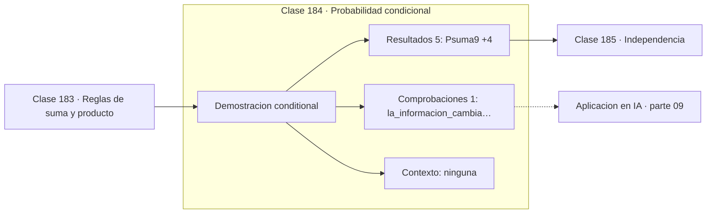

# 184 — Probabilidad condicional

> [⬅️ 183 Reglas de suma y producto](../183-reglas-de-suma-y-producto/README.md) · [📚 Parte 09](../README.md) · [🏠 Programa](../../../README.md) · [185 Independencia ➡️](../185-independencia/README.md)

**Parte:** 09 — Probabilidad y procesos aleatorios · **Nivel:** `universitario` · **Horas estimadas:** 4
**Motor:** `engines.part09` · **Demostración:** `conditional` · **Clase 4 de 20** de la parte

---

## 🎯 Propósito

**Condicionar es reducir el espacio muestral, no cambiar la realidad.**

Axiomas, probabilidad condicional, Bayes, variables aleatorias, esperanza, varianza, distribuciones clave, LGN, TCL, Monte Carlo y cadenas de Markov.

## ✅ Resultados de aprendizaje

Al terminar podrás:

1. Explicar **Probabilidad condicional** con lenguaje cotidiano y con notación matemática.
2. Resolver un caso pequeño a mano y anticipar el orden de magnitud del resultado.
3. Ejecutar y modificar `lab.py`, que corre la demostración `conditional`.
4. Interpretar las 6 salidas del laboratorio y decir qué comprueba cada una.
5. Detectar el error típico de esta parte: asumir independencia sin justificarla.

## 🧩 Fórmulas de la clase

```text
P(A|B) = P(A∩B) / P(B),  con P(B) > 0
P(A∩B) = P(B)·P(A|B)
en general P(A|B) ≠ P(B|A)
```

## 🗺️ Ubicación en el programa



## 📖 Fundamentos

La probabilidad condicional responde a: «sabiendo que ocurrió B, ¿cuál es ahora la
probabilidad de A?». La fórmula `P(A|B) = P(A∩B)/P(B)` se entiende mejor leída como un
cambio de universo: el denominador reemplaza a `P(Ω) = 1` porque el nuevo espacio muestral
es `B`, y el numerador cuenta la parte de A que sobrevive dentro de él.

Nada cambia en el mundo al condicionar. Los dados ya cayeron; lo que cambia es **la
información disponible**, y con ella el reparto de probabilidad. Esta lectura evita la
idea mágica de que observar algo «modifica» el resultado, y explica por qué la
probabilidad condicional es la herramienta natural para razonar con evidencia parcial.

La consecuencia práctica es que `P(A|B)` y `P(B|A)` son cantidades distintas. `P(positivo
| enfermo)` es una propiedad del test; `P(enfermo | positivo)` es lo que le importa al
paciente, y depende además de cuánta gente está enferma. Intercambiarlas es la **falacia
del fiscal**, y la clase 186 pone los números.

Condicionar es además una técnica de cálculo. La **ley de probabilidad total** parte el
espacio en casos disjuntos y suma:
`P(A) = Σ P(A|Bᵢ)·P(Bᵢ)`. Casi todo problema difícil de probabilidad se vuelve fácil al
condicionar sobre la primera cosa que ocurre.

## 🧮 Ejemplo trabajado

Dos dados: probabilidad de que la suma pase de 9, sabiendo que el primero salió 6.

```text
A = "suma > 9"          |A| = 6      P(A) = 6/36 = 0,1667
B = "primer dado = 6"   |B| = 6      P(B) = 6/36 = 0,1667

A∩B = {(6,4), (6,5), (6,6)}         P(A∩B) = 3/36 = 0,0833

P(A|B) = 0,0833 / 0,1667 = 0,5

Lectura directa: el espacio se reduce de 36 a 6 pares,
y 3 de esos 6 cumplen la condición → 3/6 = 0,5           ✓

La información triplicó la probabilidad: de 0,1667 a 0,5.
```

## 🔬 Qué ejecuta el laboratorio

`conditional` — P(A|B) cambia el espacio muestral, no la realidad.

| Grupo | Salidas |
|---|---|
| 🔢 Resultados numéricos (5) | `P(suma>9)`, `P(primer_dado=6)`, `P(suma>9 | primer=6)`, `formula_P(A∩B)/P(B)`, `espacio_reducido` |
| ✅ Comprobaciones de invariante (1) | `la_informacion_cambia_la_probabilidad` |

Las claves booleanas no son adorno: si alguna fuera `False`, el resultado numérico
no sería fiable aunque el programa terminase sin error.

```bash
python classes/part-09-probabilidad-y-procesos-aleatorios/184-probabilidad-condicional/lab.py
compmath run 184
```

> [!TIP]
> Antes de ejecutar, **escribe tu predicción**. Un laboratorio que confirma lo que
> esperabas enseña tanto como uno que te contradice, pero solo si la predicción
> existía antes del resultado.

## ⚠️ Errores conceptuales frecuentes

1. Intercambiar P(A|B) con P(B|A).
2. Condicionar sobre un evento de probabilidad cero.
3. Creer que observar el condicionante altera físicamente el experimento.

## 🚀 Dónde se usa de verdad

Diagnóstico médico, filtros de spam, sistemas de recomendación y toda la factorización
condicional que usan los modelos generativos.

## 🤖 Conexión con IA

Un modelo de lenguaje es una distribución condicional sobre el siguiente token; la difusión es un proceso estocástico con reverso aprendido.

## 📓 Notebooks

| Archivo | Para qué |
|---|---|
| [`notebook.ipynb`](notebook.ipynb) | recorrido guiado con la demostración ejecutada |
| [`notebook_student.ipynb`](notebook_student.ipynb) | versión con `TODO` para resolver |
| [`notebook_solution.ipynb`](notebook_solution.ipynb) | solución de referencia verificada |

## 📝 Evaluación

| Criterio | Peso |
|---|---:|
| Comprensión conceptual | 25 % |
| Resolución manual | 25 % |
| Implementación y verificación | 25 % |
| Interpretación y comunicación | 15 % |
| Conexión con aplicación real | 10 % |

Detalle y criterios de error crítico en [`assessment.md`](assessment.md).

## ❓ Preguntas de comprobación

1. ¿Cuál es la entrada, cuál la salida y qué unidades tienen?
2. ¿Qué operación domina el comportamiento del resultado?
3. ¿Qué caso extremo revelaría un error conceptual?
4. ¿Cómo verificarías el resultado por un método independiente?
5. ¿Dónde aparece esto en riesgo?

Si necesitas releer el código para responderlas, la clase todavía no está superada.

## 📥 Entregable

`notebook_student.ipynb` resuelto más un párrafo que explique el resultado **sin citar
código**: qué entra, qué sale, qué invariante se comprueba y qué pasaría en un caso límite.

## 📚 Bibliografía de la clase

Esta clase enseña **Probabilidad · Procesos estocásticos**. Cada obra dice qué aporta aquí y cómo se comprobó su localizador:

- [Blitzstein, J.; Hwang, J. *Introduction to Probability*, 2ª ed., CRC, 2019, cap. 2](https://projects.iq.harvard.edu/stat110/home) — Probabilidad: el tema de esta clase · URL de la fuente primaria, pendiente de resolver.
- [Ross, S. *A First Course in Probability*, 10ª ed., Pearson, 2018, cap. 3](https://openlibrary.org/isbn/9780134753119) — Probabilidad: el tema de esta clase · ISBN-13 `9780134753119` verificado en International ISBN Agency (2026-08-20).

Bibliografía de todas las clases, con el porqué de cada obra, en [`docs/BIBLIOGRAPHY.md`](../../../docs/BIBLIOGRAPHY.md) · localizador y estado de cada obra en [`sources/bibliography.json`](../../../sources/bibliography.json).

## 📂 Material de la clase

[`intuition.md`](intuition.md) · [`theory.md`](theory.md) · [`derivation.md`](derivation.md) · [`exercises.md`](exercises.md) · [`assessment.md`](assessment.md) · [`where-is-this-used.md`](where-is-this-used.md) · [`lesson.yaml`](lesson.yaml)

---

> [⬅️ 183 Reglas de suma y producto](../183-reglas-de-suma-y-producto/README.md) · [📚 Parte 09](../README.md) · [🏠 Programa](../../../README.md) · [185 Independencia ➡️](../185-independencia/README.md)
