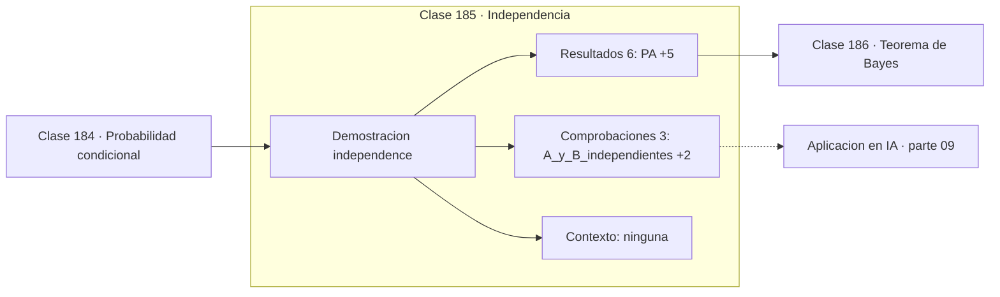

# 185 — Independencia

> [⬅️ 184 Probabilidad condicional](../184-probabilidad-condicional/README.md) · [📚 Parte 09](../README.md) · [🏠 Programa](../../../README.md) · [186 Teorema de Bayes ➡️](../186-teorema-de-bayes/README.md)

**Parte:** 09 — Probabilidad y procesos aleatorios · **Nivel:** `universitario` · **Horas estimadas:** 4
**Motor:** `engines.part09` · **Demostración:** `independence` · **Clase 5 de 20** de la parte

---

## 🎯 Propósito

**La independencia es una igualdad que se verifica, no una suposición cómoda.**

Axiomas, probabilidad condicional, Bayes, variables aleatorias, esperanza, varianza, distribuciones clave, LGN, TCL, Monte Carlo y cadenas de Markov.

## ✅ Resultados de aprendizaje

Al terminar podrás:

1. Explicar **Independencia** con lenguaje cotidiano y con notación matemática.
2. Resolver un caso pequeño a mano y anticipar el orden de magnitud del resultado.
3. Ejecutar y modificar `lab.py`, que corre la demostración `independence`.
4. Interpretar las 9 salidas del laboratorio y decir qué comprueba cada una.
5. Detectar el error típico de esta parte: ignorar la probabilidad base al interpretar un test positivo.

## 🧩 Fórmulas de la clase

```text
A ⫫ B  ⟺  P(A∩B) = P(A)·P(B)
equivalente: P(A|B) = P(A)
independencia mutua exige la factorización para todo subconjunto
```

## 🗺️ Ubicación en el programa



## 📖 Fundamentos

Dos eventos son independientes cuando saber que uno ocurrió no cambia la probabilidad del
otro. La definición operativa es la factorización `P(A∩B) = P(A)·P(B)`, y la forma
equivalente `P(A|B) = P(A)` deja claro el contenido intuitivo: la información no aporta
nada.

Independencia no es lo mismo que **exclusión mutua**; de hecho son casi opuestas. Si A y B
son excluyentes y ambos tienen probabilidad positiva, saber que ocurrió A garantiza que B
no ocurrió, lo cual es una dependencia máxima. Confundir ambos conceptos es el error más
común de esta clase.

Con más de dos eventos, la independencia **por pares** no basta. Existen tríos donde cada
par factoriza pero el trío no, y en esos casos las conclusiones extraídas de suponer
independencia mutua son falsas. La independencia mutua exige que la factorización se
cumpla para todos los subconjuntos, no solo para los pares.

En la práctica, la independencia casi nunca es exacta: es una aproximación de modelado.
Naive Bayes supone que las palabras de un texto son condicionalmente independientes dadas
las clases, lo cual es falso, y aun así funciona razonablemente. El pecado no es suponer
independencia, es suponerla **sin decirlo** y luego interpretar los resultados como si
fuera cierta.

## 🧮 Ejemplo trabajado

Tres eventos sobre dos lanzamientos de moneda.

```text
Ω = {CC, CX, XC, XX}, equiprobables

A = "primera cara"       P(A) = 0,5
B = "segunda cara"       P(B) = 0,5
C = "ambas iguales"      P(C) = 0,5

A∩B = {CC}   P = 0,25 = 0,5 × 0,5     A ⫫ B    ✓
A∩C = {CC}   P = 0,25 = 0,5 × 0,5     A ⫫ C    ✓
B∩C = {CC}   P = 0,25 = 0,5 × 0,5     B ⫫ C    ✓

A∩B∩C = {CC}  P = 0,25
producto de los tres = 0,125          0,25 ≠ 0,125

Independientes por pares, NO mutuamente independientes.
```

## 🔬 Qué ejecuta el laboratorio

`independence` — Independencia se comprueba, no se supone.

| Grupo | Salidas |
|---|---|
| 🔢 Resultados numéricos (6) | `P(A)`, `P(B)`, `P(A∩B)`, `P(C)`, `P(A∩C)`, `P(A∩B∩C)` |
| ✅ Comprobaciones de invariante (3) | `A_y_B_independientes`, `A_y_C_independientes`, `independencia_por_pares_no_implica_conjunta` |

Las claves booleanas no son adorno: si alguna fuera `False`, el resultado numérico
no sería fiable aunque el programa terminase sin error.

```bash
python classes/part-09-probabilidad-y-procesos-aleatorios/185-independencia/lab.py
compmath run 185
```

> [!TIP]
> Antes de ejecutar, **escribe tu predicción**. Un laboratorio que confirma lo que
> esperabas enseña tanto como uno que te contradice, pero solo si la predicción
> existía antes del resultado.

## ⚠️ Errores conceptuales frecuentes

1. Confundir independencia con exclusión mutua.
2. Deducir independencia mutua a partir de independencia por pares.
3. Suponer independencia entre observaciones correlacionadas en el tiempo.

## 🚀 Dónde se usa de verdad

Naive Bayes, análisis de fiabilidad de componentes, validación cruzada con datos
temporales y todo supuesto de muestras iid en aprendizaje automático.

## 🤖 Conexión con IA

Un modelo de lenguaje es una distribución condicional sobre el siguiente token; la difusión es un proceso estocástico con reverso aprendido.

## 📓 Notebooks

| Archivo | Para qué |
|---|---|
| [`notebook.ipynb`](notebook.ipynb) | recorrido guiado con la demostración ejecutada |
| [`notebook_student.ipynb`](notebook_student.ipynb) | versión con `TODO` para resolver |
| [`notebook_solution.ipynb`](notebook_solution.ipynb) | solución de referencia verificada |

## 📝 Evaluación

| Criterio | Peso |
|---|---:|
| Comprensión conceptual | 25 % |
| Resolución manual | 25 % |
| Implementación y verificación | 25 % |
| Interpretación y comunicación | 15 % |
| Conexión con aplicación real | 10 % |

Detalle y criterios de error crítico en [`assessment.md`](assessment.md).

## ❓ Preguntas de comprobación

1. ¿Cuál es la entrada, cuál la salida y qué unidades tienen?
2. ¿Qué operación domina el comportamiento del resultado?
3. ¿Qué caso extremo revelaría un error conceptual?
4. ¿Cómo verificarías el resultado por un método independiente?
5. ¿Dónde aparece esto en riesgo?

Si necesitas releer el código para responderlas, la clase todavía no está superada.

## 📥 Entregable

`notebook_student.ipynb` resuelto más un párrafo que explique el resultado **sin citar
código**: qué entra, qué sale, qué invariante se comprueba y qué pasaría en un caso límite.

## 📚 Bibliografía de la clase

Esta clase enseña **Probabilidad · Procesos estocásticos**. Cada obra dice qué aporta aquí y cómo se comprobó su localizador:

- [Blitzstein, J.; Hwang, J. *Introduction to Probability*, 2ª ed., CRC, 2019, cap. 2](https://projects.iq.harvard.edu/stat110/home) — Probabilidad: el tema de esta clase · URL de la fuente primaria, pendiente de resolver.
- [Durrett, R. *Probability: Theory and Examples*, 5ª ed., Cambridge, 2019](https://services.math.duke.edu/~rtd/PTE/pte.html) — Probabilidad: el tema de esta clase · URL de la fuente primaria comprobada en services.math.duke.edu (2026-08-19).

Bibliografía de todas las clases, con el porqué de cada obra, en [`docs/BIBLIOGRAPHY.md`](../../../docs/BIBLIOGRAPHY.md) · localizador y estado de cada obra en [`sources/bibliography.json`](../../../sources/bibliography.json).

## 📂 Material de la clase

[`intuition.md`](intuition.md) · [`theory.md`](theory.md) · [`derivation.md`](derivation.md) · [`exercises.md`](exercises.md) · [`assessment.md`](assessment.md) · [`where-is-this-used.md`](where-is-this-used.md) · [`lesson.yaml`](lesson.yaml)

---

> [⬅️ 184 Probabilidad condicional](../184-probabilidad-condicional/README.md) · [📚 Parte 09](../README.md) · [🏠 Programa](../../../README.md) · [186 Teorema de Bayes ➡️](../186-teorema-de-bayes/README.md)
