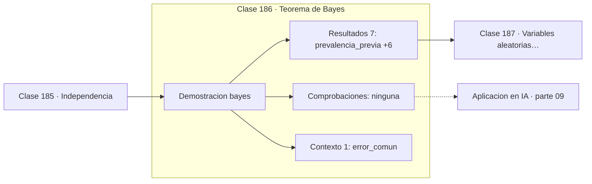

# 186 — Teorema de Bayes

> [⬅️ 185 Independencia](../185-independencia/README.md) · [📚 Parte 09](../README.md) · [🏠 Programa](../../../README.md) · [187 Variables aleatorias discretas ➡️](../187-variables-aleatorias-discretas/README.md)

**Parte:** 09 — Probabilidad y procesos aleatorios · **Nivel:** `universitario` · **Horas estimadas:** 4
**Motor:** `engines.part09` · **Demostración:** `bayes` · **Clase 6 de 20** de la parte

---

## 🎯 Propósito

**Un test muy preciso sobre una enfermedad rara produce sobre todo falsos positivos.**

Axiomas, probabilidad condicional, Bayes, variables aleatorias, esperanza, varianza, distribuciones clave, LGN, TCL, Monte Carlo y cadenas de Markov.

## ✅ Resultados de aprendizaje

Al terminar podrás:

1. Explicar **Teorema de Bayes** con lenguaje cotidiano y con notación matemática.
2. Resolver un caso pequeño a mano y anticipar el orden de magnitud del resultado.
3. Ejecutar y modificar `lab.py`, que corre la demostración `bayes`.
4. Interpretar las 8 salidas del laboratorio y decir qué comprueba cada una.
5. Detectar el error típico de esta parte: reportar resultados monte carlo sin semilla ni intervalo.

## 🧩 Fórmulas de la clase

```text
P(H|E) = P(E|H)·P(H) / P(E)
P(E) = P(E|H)·P(H) + P(E|Hᶜ)·P(Hᶜ)
posterior ∝ verosimilitud × prior
```

## 🗺️ Ubicación en el programa



## 📖 Fundamentos

El teorema de Bayes invierte el condicionamiento: convierte `P(E|H)`, que suele ser lo
que se sabe del mecanismo, en `P(H|E)`, que es lo que se quiere saber tras observar la
evidencia. Su demostración cabe en una línea —basta escribir `P(H∩E)` de las dos maneras
posibles— y su importancia es difícil de exagerar.

La lectura que hay que interiorizar es `posterior ∝ verosimilitud × prior`. La
verosimilitud `P(E|H)` mide cuán bien la hipótesis explica lo observado; el prior `P(H)`
mide cuán plausible era la hipótesis de entrada. **Un test excelente no puede compensar un
prior muy bajo**, y esa es la fuente de la falacia de la tasa base.

El caso numérico canónico: enfermedad con prevalencia 0,1 %, test con 99 % de sensibilidad
y 99 % de especificidad. Entre 100 000 personas hay 100 enfermas, de las que el test marca
99, y 99 900 sanas, de las que marca 999. Total de positivos: 1098, de los cuales solo 99
están enfermos. `P(enfermo | positivo) ≈ 9 %`. Diez falsos positivos por cada verdadero, y
el test no tiene ningún defecto.

La misma estructura aparece en juicios —«la probabilidad de esta coincidencia por azar es
1 entre un millón» no es la probabilidad de inocencia—, en detección de fraude, en alertas
de seguridad y en cualquier clasificador aplicado a una clase minoritaria. Por eso los
sistemas de detección de eventos raros se evalúan con precisión y exhaustividad, no con
exactitud.

## 🧮 Ejemplo trabajado

Prevalencia 0,1 %, sensibilidad 99 %, especificidad 99 %.

```text
Sobre 100 000 personas:

                 enfermos (100)   sanos (99 900)   total
  test +              99               999          1 098
  test −               1            98 901         98 902

P(enfermo | +) = 99 / 1 098 = 0,0902  ≈  9 %

Por la fórmula:
  P(+) = 0,99 × 0,001 + 0,01 × 0,999 = 0,01098
  P(enfermo|+) = (0,99 × 0,001) / 0,01098 = 0,0902     ✓

falsos positivos por cada verdadero: 999 / 99 ≈ 10,1

Si la prevalencia sube al 10 %, P(enfermo|+) sube al 92 %.
Cambió el prior, no el test.
```

## 🔬 Qué ejecuta el laboratorio

`bayes` — Test médico: por qué un positivo no significa enfermedad.

| Grupo | Salidas |
|---|---|
| 🔢 Resultados numéricos (7) | `prevalencia_previa`, `sensibilidad_P(+|enfermo)`, `especificidad_P(-|sano)`, `P(+)`, `P(enfermo|+)`, `falsos_positivos_por_verdadero`, `con_prevalencia_10%` |
| ✅ Comprobaciones de invariante (0) | — |

Las claves booleanas no son adorno: si alguna fuera `False`, el resultado numérico
no sería fiable aunque el programa terminase sin error.

```bash
python classes/part-09-probabilidad-y-procesos-aleatorios/186-teorema-de-bayes/lab.py
compmath run 186
```

> [!TIP]
> Antes de ejecutar, **escribe tu predicción**. Un laboratorio que confirma lo que
> esperabas enseña tanto como uno que te contradice, pero solo si la predicción
> existía antes del resultado.

## ⚠️ Errores conceptuales frecuentes

1. Leer la sensibilidad del test como probabilidad de estar enfermo.
2. Ignorar la prevalencia al interpretar un positivo.
3. Evaluar clasificadores de clases raras con exactitud global.

## 🚀 Dónde se usa de verdad

Cribado médico, detección de fraude, filtros antispam, pruebas forenses y evaluación de
clasificadores con clases desbalanceadas.

## 🤖 Conexión con IA

Un modelo de lenguaje es una distribución condicional sobre el siguiente token; la difusión es un proceso estocástico con reverso aprendido.

## 📓 Notebooks

| Archivo | Para qué |
|---|---|
| [`notebook.ipynb`](notebook.ipynb) | recorrido guiado con la demostración ejecutada |
| [`notebook_student.ipynb`](notebook_student.ipynb) | versión con `TODO` para resolver |
| [`notebook_solution.ipynb`](notebook_solution.ipynb) | solución de referencia verificada |

## 📝 Evaluación

| Criterio | Peso |
|---|---:|
| Comprensión conceptual | 25 % |
| Resolución manual | 25 % |
| Implementación y verificación | 25 % |
| Interpretación y comunicación | 15 % |
| Conexión con aplicación real | 10 % |

Detalle y criterios de error crítico en [`assessment.md`](assessment.md).

## ❓ Preguntas de comprobación

1. ¿Cuál es la entrada, cuál la salida y qué unidades tienen?
2. ¿Qué operación domina el comportamiento del resultado?
3. ¿Qué caso extremo revelaría un error conceptual?
4. ¿Cómo verificarías el resultado por un método independiente?
5. ¿Dónde aparece esto en riesgo?

Si necesitas releer el código para responderlas, la clase todavía no está superada.

## 📥 Entregable

`notebook_student.ipynb` resuelto más un párrafo que explique el resultado **sin citar
código**: qué entra, qué sale, qué invariante se comprueba y qué pasaría en un caso límite.

## 🔗 Referencias

- [Blitzstein, J.; Hwang, J. *Introduction to Probability*, 2ª ed., CRC, 2019, cap. 2](https://projects.iq.harvard.edu/stat110/home)
- [Gelman, A. et al. *Bayesian Data Analysis*, 3ª ed., CRC, 2013](http://www.stat.columbia.edu/~gelman/book/)

Bibliografía completa de la parte en [`../../../docs/BIBLIOGRAPHY.md`](../../../docs/BIBLIOGRAPHY.md).

## 📂 Material de la clase

[`intuition.md`](intuition.md) · [`theory.md`](theory.md) · [`derivation.md`](derivation.md) · [`exercises.md`](exercises.md) · [`assessment.md`](assessment.md) · [`where-is-this-used.md`](where-is-this-used.md) · [`lesson.yaml`](lesson.yaml)

---

> [⬅️ 185 Independencia](../185-independencia/README.md) · [📚 Parte 09](../README.md) · [🏠 Programa](../../../README.md) · [187 Variables aleatorias discretas ➡️](../187-variables-aleatorias-discretas/README.md)
