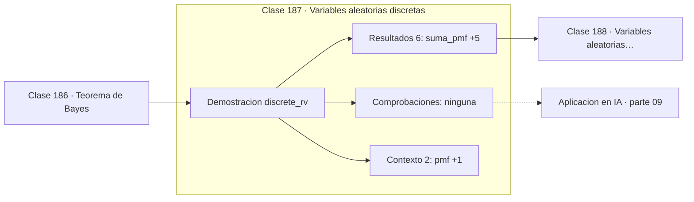

# 187 — Variables aleatorias discretas

> [⬅️ 186 Teorema de Bayes](../186-teorema-de-bayes/README.md) · [📚 Parte 09](../README.md) · [🏠 Programa](../../../README.md) · [188 Variables aleatorias continuas ➡️](../188-variables-aleatorias-continuas/README.md)

**Parte:** 09 — Probabilidad y procesos aleatorios · **Nivel:** `universitario` · **Horas estimadas:** 4
**Motor:** `engines.part09` · **Demostración:** `discrete_rv` · **Clase 7 de 20** de la parte

---

## 🎯 Propósito

**Una variable aleatoria discreta se describe por su masa de probabilidad y su acumulada.**

Axiomas, probabilidad condicional, Bayes, variables aleatorias, esperanza, varianza, distribuciones clave, LGN, TCL, Monte Carlo y cadenas de Markov.

## ✅ Resultados de aprendizaje

Al terminar podrás:

1. Explicar **Variables aleatorias discretas** con lenguaje cotidiano y con notación matemática.
2. Resolver un caso pequeño a mano y anticipar el orden de magnitud del resultado.
3. Ejecutar y modificar `lab.py`, que corre la demostración `discrete_rv`.
4. Interpretar las 8 salidas del laboratorio y decir qué comprueba cada una.
5. Detectar el error típico de esta parte: asumir independencia sin justificarla.

## 🧩 Fórmulas de la clase

```text
pmf: p(x) = P(X = x),  Σ p(x) = 1
cdf: F(x) = P(X ≤ x)
P(a < X ≤ b) = F(b) − F(a)
```

## 🗺️ Ubicación en el programa



## 📖 Fundamentos

Una **variable aleatoria** es una función que asigna un número a cada resultado del
espacio muestral. El nombre es histórico y engañoso: ni es una variable en el sentido del
álgebra, ni es aleatoria —la función es perfectamente determinista; lo aleatorio es su
argumento—. Verla como función es lo que permite sumarlas, componerlas y tomar esperanzas.

Cuando el conjunto de valores es finito o numerable, la variable es **discreta** y queda
descrita por su **función de masa** `p(x) = P(X = x)`. Las dos condiciones que debe
cumplir son las heredadas de los axiomas: valores no negativos y suma total igual a 1.
Cualquier vector de números que cumpla eso es una distribución discreta válida, y una
salida softmax lo es por construcción.

La **función de distribución acumulada** `F(x) = P(X ≤ x)` recoge la misma información en
otra forma. Es no decreciente, empieza en 0 y termina en 1, y sirve para calcular
probabilidades de intervalos restando. En la práctica, la cdf es también el mecanismo para
**generar muestras**: aplicar su inversa a un uniforme produce muestras de la
distribución, técnica que la clase 198 usa.

El paso de un espacio muestral a una variable aleatoria es una simplificación deliberada:
se pierde información sobre qué resultado ocurrió y se conserva solo el número de interés.
Esa pérdida es justamente lo que hace manejable el modelado.

## 🧮 Ejemplo trabajado

Una variable con cinco valores: masa, acumulada y esperanza.

```text
x        0     1     2     3     4
p(x)    0,1   0,2   0,4   0,2   0,1     suma = 1,0    ✓
F(x)    0,1   0,3   0,7   0,9   1,0     no decreciente ✓

P(X ≤ 2) = F(2) = 0,7
P(X > 2) = 1 − 0,7 = 0,3
P(1 < X ≤ 3) = F(3) − F(1) = 0,9 − 0,3 = 0,6

E[X] = 0(0,1) + 1(0,2) + 2(0,4) + 3(0,2) + 4(0,1) = 2,0

La distribución es simétrica en torno a 2, y la esperanza lo confirma.
```

## 🔬 Qué ejecuta el laboratorio

`discrete_rv` — Variable aleatoria discreta: pmf, cdf y coherencia.

| Grupo | Salidas |
|---|---|
| 🔢 Resultados numéricos (6) | `suma_pmf`, `P(X<=2)`, `P(X>2)`, `esperanza`, `moda`, `mediana` |
| ✅ Comprobaciones de invariante (0) | — |

Las claves booleanas no son adorno: si alguna fuera `False`, el resultado numérico
no sería fiable aunque el programa terminase sin error.

```bash
python classes/part-09-probabilidad-y-procesos-aleatorios/187-variables-aleatorias-discretas/lab.py
compmath run 187
```

> [!TIP]
> Antes de ejecutar, **escribe tu predicción**. Un laboratorio que confirma lo que
> esperabas enseña tanto como uno que te contradice, pero solo si la predicción
> existía antes del resultado.

## ⚠️ Errores conceptuales frecuentes

1. Escribir una pmf cuyos valores no suman 1.
2. Confundir p(x) con F(x) al calcular probabilidades de intervalos.
3. Restar mal los extremos: P(a ≤ X ≤ b) incluye a, F(b) − F(a) no.

## 🚀 Dónde se usa de verdad

Distribuciones sobre vocabularios en modelos de lenguaje, conteos de eventos, modelado de
clases en clasificación y muestreo por transformada inversa.

## 🤖 Conexión con IA

Un modelo de lenguaje es una distribución condicional sobre el siguiente token; la difusión es un proceso estocástico con reverso aprendido.

## 📓 Notebooks

| Archivo | Para qué |
|---|---|
| [`notebook.ipynb`](notebook.ipynb) | recorrido guiado con la demostración ejecutada |
| [`notebook_student.ipynb`](notebook_student.ipynb) | versión con `TODO` para resolver |
| [`notebook_solution.ipynb`](notebook_solution.ipynb) | solución de referencia verificada |

## 📝 Evaluación

| Criterio | Peso |
|---|---:|
| Comprensión conceptual | 25 % |
| Resolución manual | 25 % |
| Implementación y verificación | 25 % |
| Interpretación y comunicación | 15 % |
| Conexión con aplicación real | 10 % |

Detalle y criterios de error crítico en [`assessment.md`](assessment.md).

## ❓ Preguntas de comprobación

1. ¿Cuál es la entrada, cuál la salida y qué unidades tienen?
2. ¿Qué operación domina el comportamiento del resultado?
3. ¿Qué caso extremo revelaría un error conceptual?
4. ¿Cómo verificarías el resultado por un método independiente?
5. ¿Dónde aparece esto en riesgo?

Si necesitas releer el código para responderlas, la clase todavía no está superada.

## 📥 Entregable

`notebook_student.ipynb` resuelto más un párrafo que explique el resultado **sin citar
código**: qué entra, qué sale, qué invariante se comprueba y qué pasaría en un caso límite.

## 🔗 Referencias

- [Blitzstein, J.; Hwang, J. *Introduction to Probability*, 2ª ed., CRC, 2019, cap. 3](https://projects.iq.harvard.edu/stat110/home) — *uso:* exposición alternativa del tema en «Variables aleatorias discretas».
- [Ross, S. *A First Course in Probability*, 10ª ed., Pearson, 2018, cap. 4](https://www.pearson.com/) — *uso:* obra de referencia consultada en «Variables aleatorias discretas».

Bibliografía completa de la parte en [`../../../docs/BIBLIOGRAPHY.md`](../../../docs/BIBLIOGRAPHY.md) · localizador verificable de cada obra en [`sources/bibliography.json`](../../../sources/bibliography.json).

## 📂 Material de la clase

[`intuition.md`](intuition.md) · [`theory.md`](theory.md) · [`derivation.md`](derivation.md) · [`exercises.md`](exercises.md) · [`assessment.md`](assessment.md) · [`where-is-this-used.md`](where-is-this-used.md) · [`lesson.yaml`](lesson.yaml)

---

> [⬅️ 186 Teorema de Bayes](../186-teorema-de-bayes/README.md) · [📚 Parte 09](../README.md) · [🏠 Programa](../../../README.md) · [188 Variables aleatorias continuas ➡️](../188-variables-aleatorias-continuas/README.md)
