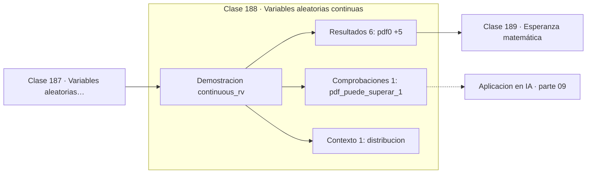

# 188 — Variables aleatorias continuas

> [⬅️ 187 Variables aleatorias discretas](../187-variables-aleatorias-discretas/README.md) · [📚 Parte 09](../README.md) · [🏠 Programa](../../../README.md) · [189 Esperanza matemática ➡️](../189-esperanza-matematica/README.md)

**Parte:** 09 — Probabilidad y procesos aleatorios · **Nivel:** `universitario` · **Horas estimadas:** 4
**Motor:** `engines.part09` · **Demostración:** `continuous_rv` · **Clase 8 de 20** de la parte

---

## 🎯 Propósito

**En una variable continua la densidad no es probabilidad y puede superar 1.**

Axiomas, probabilidad condicional, Bayes, variables aleatorias, esperanza, varianza, distribuciones clave, LGN, TCL, Monte Carlo y cadenas de Markov.

## ✅ Resultados de aprendizaje

Al terminar podrás:

1. Explicar **Variables aleatorias continuas** con lenguaje cotidiano y con notación matemática.
2. Resolver un caso pequeño a mano y anticipar el orden de magnitud del resultado.
3. Ejecutar y modificar `lab.py`, que corre la demostración `continuous_rv`.
4. Interpretar las 8 salidas del laboratorio y decir qué comprueba cada una.
5. Detectar el error típico de esta parte: ignorar la probabilidad base al interpretar un test positivo.

## 🧩 Fórmulas de la clase

```text
P(a < X ≤ b) = ∫ₐᵇ f(x) dx
∫ f(x) dx = 1  sobre todo el soporte
P(X = c) = 0 para todo c
```

## 🗺️ Ubicación en el programa



## 📖 Fundamentos

Una variable continua toma valores en un intervalo, y ahí ocurre algo que sorprende: la
probabilidad de **cualquier valor concreto es cero**. No porque sea imposible, sino porque
hay infinitos valores y la probabilidad total es 1. Lo que tiene probabilidad positiva son
los intervalos, y se obtiene integrando.

La **función de densidad** `f(x)` no es una probabilidad: es una probabilidad **por unidad
de x**. Por eso puede valer más de 1 sin contradicción alguna, igual que una velocidad
puede ser de 100 km/h sin que se recorran 100 km. La exponencial con `λ = 2` tiene
densidad 2 en el origen, y no hay nada roto.

La cdf sigue siendo `F(x) = P(X ≤ x)`, ahora la integral de la densidad, y sigue siendo la
forma cómoda de calcular: `P(a < X ≤ b) = F(b) − F(a)`. Como los puntos no aportan
probabilidad, en el caso continuo da igual usar `<` o `≤`, algo que en el discreto sí
importa.

La consecuencia práctica más olvidada aparece al comparar modelos: la **verosimilitud** de
datos continuos es una densidad, no una probabilidad, y por eso puede ser mayor que 1 y su
logaritmo puede ser positivo. Ver un log-likelihood positivo en un modelo continuo no es
un error; verlo en uno discreto sí lo es.

## 🧮 Ejemplo trabajado

Exponencial con λ = 2: densidad, probabilidad puntual e intervalos.

```text
f(x) = 2·e^(−2x)   para x ≥ 0
F(x) = 1 − e^(−2x)

f(0) = 2,0            densidad > 1, perfectamente válido
P(X = 0,5) = 0        todo punto tiene probabilidad cero

P(X ≤ 0,5)      = 1 − e^(−1)   = 0,6321
P(0,5 < X ≤ 1)  = F(1) − F(0,5)
                = (1 − e^(−2)) − (1 − e^(−1))
                = 0,8647 − 0,6321 = 0,2325

Comprobación: el área total bajo f es 1.
```

## 🔬 Qué ejecuta el laboratorio

`continuous_rv` — Variable continua: la densidad no es una probabilidad.

| Grupo | Salidas |
|---|---|
| 🔢 Resultados numéricos (6) | `pdf(0)`, `P(X=0.5)`, `P(X<=0.5)`, `P(0.5<X<=1)`, `integral_total`, `media_1/λ` |
| ✅ Comprobaciones de invariante (1) | `pdf_puede_superar_1` |

Las claves booleanas no son adorno: si alguna fuera `False`, el resultado numérico
no sería fiable aunque el programa terminase sin error.

```bash
python classes/part-09-probabilidad-y-procesos-aleatorios/188-variables-aleatorias-continuas/lab.py
compmath run 188
```

> [!TIP]
> Antes de ejecutar, **escribe tu predicción**. Un laboratorio que confirma lo que
> esperabas enseña tanto como uno que te contradice, pero solo si la predicción
> existía antes del resultado.

## ⚠️ Errores conceptuales frecuentes

1. Interpretar f(x) como P(X = x).
2. Alarmarse porque una densidad supera 1.
3. Arrastrar la distinción entre < y ≤ del caso discreto al continuo.

## 🚀 Dónde se usa de verdad

Modelado de tiempos de espera, verosimilitudes gaussianas, modelos de difusión y todo
estimador de densidad.

## 🤖 Conexión con IA

Un modelo de lenguaje es una distribución condicional sobre el siguiente token; la difusión es un proceso estocástico con reverso aprendido.

## 📓 Notebooks

| Archivo | Para qué |
|---|---|
| [`notebook.ipynb`](notebook.ipynb) | recorrido guiado con la demostración ejecutada |
| [`notebook_student.ipynb`](notebook_student.ipynb) | versión con `TODO` para resolver |
| [`notebook_solution.ipynb`](notebook_solution.ipynb) | solución de referencia verificada |

## 📝 Evaluación

| Criterio | Peso |
|---|---:|
| Comprensión conceptual | 25 % |
| Resolución manual | 25 % |
| Implementación y verificación | 25 % |
| Interpretación y comunicación | 15 % |
| Conexión con aplicación real | 10 % |

Detalle y criterios de error crítico en [`assessment.md`](assessment.md).

## ❓ Preguntas de comprobación

1. ¿Cuál es la entrada, cuál la salida y qué unidades tienen?
2. ¿Qué operación domina el comportamiento del resultado?
3. ¿Qué caso extremo revelaría un error conceptual?
4. ¿Cómo verificarías el resultado por un método independiente?
5. ¿Dónde aparece esto en riesgo?

Si necesitas releer el código para responderlas, la clase todavía no está superada.

## 📥 Entregable

`notebook_student.ipynb` resuelto más un párrafo que explique el resultado **sin citar
código**: qué entra, qué sale, qué invariante se comprueba y qué pasaría en un caso límite.

## 📚 Bibliografía de la clase

Esta clase enseña **Probabilidad · Procesos estocásticos**. Cada obra dice qué aporta aquí y cómo se comprobó su localizador:

- [Blitzstein, J.; Hwang, J. *Introduction to Probability*, 2ª ed., CRC, 2019, cap. 5](https://projects.iq.harvard.edu/stat110/home) — Probabilidad: el tema de esta clase · URL de la fuente primaria, pendiente de resolver.
- [Wasserman, L. *All of Statistics*, Springer, 2004, cap. 2](https://link.springer.com/book/10.1007/978-0-387-21736-9) — Probabilidad: el tema de esta clase · ISBN-13 `9780387217369` verificado en International ISBN Agency (2026-08-19).

Bibliografía de todas las clases, con el porqué de cada obra, en [`docs/BIBLIOGRAPHY.md`](../../../docs/BIBLIOGRAPHY.md) · localizador y estado de cada obra en [`sources/bibliography.json`](../../../sources/bibliography.json).

## 📂 Material de la clase

[`intuition.md`](intuition.md) · [`theory.md`](theory.md) · [`derivation.md`](derivation.md) · [`exercises.md`](exercises.md) · [`assessment.md`](assessment.md) · [`where-is-this-used.md`](where-is-this-used.md) · [`lesson.yaml`](lesson.yaml)

---

> [⬅️ 187 Variables aleatorias discretas](../187-variables-aleatorias-discretas/README.md) · [📚 Parte 09](../README.md) · [🏠 Programa](../../../README.md) · [189 Esperanza matemática ➡️](../189-esperanza-matematica/README.md)
