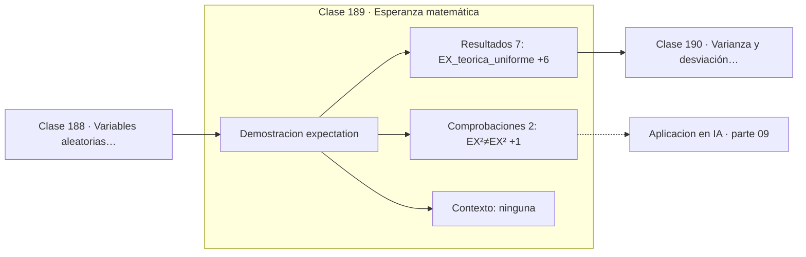

# 189 — Esperanza matemática

> [⬅️ 188 Variables aleatorias continuas](../188-variables-aleatorias-continuas/README.md) · [📚 Parte 09](../README.md) · [🏠 Programa](../../../README.md) · [190 Varianza y desviación estándar ➡️](../190-varianza-y-desviacion-estandar/README.md)

**Parte:** 09 — Probabilidad y procesos aleatorios · **Nivel:** `universitario` · **Horas estimadas:** 4
**Motor:** `engines.part09` · **Demostración:** `expectation` · **Clase 9 de 20** de la parte

---

## 🎯 Propósito

**La esperanza es lineal siempre, incluso cuando las variables son dependientes.**

Axiomas, probabilidad condicional, Bayes, variables aleatorias, esperanza, varianza, distribuciones clave, LGN, TCL, Monte Carlo y cadenas de Markov.

## ✅ Resultados de aprendizaje

Al terminar podrás:

1. Explicar **Esperanza matemática** con lenguaje cotidiano y con notación matemática.
2. Resolver un caso pequeño a mano y anticipar el orden de magnitud del resultado.
3. Ejecutar y modificar `lab.py`, que corre la demostración `expectation`.
4. Interpretar las 9 salidas del laboratorio y decir qué comprueba cada una.
5. Detectar el error típico de esta parte: reportar resultados monte carlo sin semilla ni intervalo.

## 🧩 Fórmulas de la clase

```text
E[X] = Σ x·p(x)   ó   ∫ x·f(x) dx
E[aX + bY] = a·E[X] + b·E[Y]   sin exigir independencia
en general E[g(X)] ≠ g(E[X])
```

## 🗺️ Ubicación en el programa



## 📖 Fundamentos

La esperanza es la media ponderada por probabilidad: el valor alrededor del cual se
equilibra la distribución. No tiene por qué ser un valor posible —la esperanza de un dado
es 3,5— porque describe el comportamiento agregado, no un resultado individual.

Su propiedad más útil es la **linealidad**, y es más fuerte de lo que suele recordarse:
`E[X + Y] = E[X] + E[Y]` vale **siempre**, sin ninguna hipótesis de independencia. Esa
generosidad convierte problemas aparentemente imposibles en sumas triviales: el número
esperado de puntos fijos de una permutación aleatoria es 1, y se obtiene sumando
indicadores fuertemente dependientes.

Lo que **no** vale es intercambiar la esperanza con una función no lineal.
`E[X²] ≠ E[X]²`, y la diferencia entre ambas es exactamente la varianza. Para funciones
convexas, la **desigualdad de Jensen** dice que `E[g(X)] ≥ g(E[X])`, y ese detalle es el
que separa la media de los logaritmos del logaritmo de la media en toda derivación de
ELBO o de verosimilitud.

En aprendizaje automático la esperanza está en la definición misma del objetivo: el riesgo
es `E[pérdida]` sobre la distribución de datos, y como esa distribución es desconocida se
estima con la media empírica. Toda la teoría del aprendizaje trata de cuánto se parece esa
media a la esperanza que se quería minimizar.

## 🧮 Ejemplo trabajado

Uniforme en el intervalo unitario: teoría frente a simulación.

```text
X ~ Uniforme(0,1)

teórico            simulado con 10⁶ muestras
  E[X]   = 0,5       0,499912
  E[X²]  = 1/3       0,333282

E[X]² = 0,25   ≠   E[X²] = 0,3333

diferencia = 0,3333 − 0,25 = 0,0833 = 1/12 = Var(X)     ✓

Linealidad sin independencia:
  E[X + X] = 2·E[X] = 1,0    aunque X no es independiente de sí misma
```

## 🔬 Qué ejecuta el laboratorio

`expectation` — Linealidad de la esperanza, incluso sin independencia.

| Grupo | Salidas |
|---|---|
| 🔢 Resultados numéricos (7) | `E[X]_teorica_uniforme`, `E[X]_muestral`, `E[X²]_teorica`, `E[X²]_muestral`, `E[X]²`, `E[2X+3Y]`, `2E[X]+3E[Y]` |
| ✅ Comprobaciones de invariante (2) | `E[X²]≠E[X]²`, `linealidad_sin_independencia` |

Las claves booleanas no son adorno: si alguna fuera `False`, el resultado numérico
no sería fiable aunque el programa terminase sin error.

```bash
python classes/part-09-probabilidad-y-procesos-aleatorios/189-esperanza-matematica/lab.py
compmath run 189
```

> [!TIP]
> Antes de ejecutar, **escribe tu predicción**. Un laboratorio que confirma lo que
> esperabas enseña tanto como uno que te contradice, pero solo si la predicción
> existía antes del resultado.

## ⚠️ Errores conceptuales frecuentes

1. Exigir independencia para sumar esperanzas.
2. Escribir E[g(X)] = g(E[X]) con g no lineal.
3. Esperar que la esperanza sea un valor alcanzable.

## 🚀 Dónde se usa de verdad

Riesgo esperado en aprendizaje, valoración de apuestas y carteras, análisis del tiempo
medio de ejecución y estimadores de gradiente por muestreo.

## 🤖 Conexión con IA

Un modelo de lenguaje es una distribución condicional sobre el siguiente token; la difusión es un proceso estocástico con reverso aprendido.

## 📓 Notebooks

| Archivo | Para qué |
|---|---|
| [`notebook.ipynb`](notebook.ipynb) | recorrido guiado con la demostración ejecutada |
| [`notebook_student.ipynb`](notebook_student.ipynb) | versión con `TODO` para resolver |
| [`notebook_solution.ipynb`](notebook_solution.ipynb) | solución de referencia verificada |

## 📝 Evaluación

| Criterio | Peso |
|---|---:|
| Comprensión conceptual | 25 % |
| Resolución manual | 25 % |
| Implementación y verificación | 25 % |
| Interpretación y comunicación | 15 % |
| Conexión con aplicación real | 10 % |

Detalle y criterios de error crítico en [`assessment.md`](assessment.md).

## ❓ Preguntas de comprobación

1. ¿Cuál es la entrada, cuál la salida y qué unidades tienen?
2. ¿Qué operación domina el comportamiento del resultado?
3. ¿Qué caso extremo revelaría un error conceptual?
4. ¿Cómo verificarías el resultado por un método independiente?
5. ¿Dónde aparece esto en riesgo?

Si necesitas releer el código para responderlas, la clase todavía no está superada.

## 📥 Entregable

`notebook_student.ipynb` resuelto más un párrafo que explique el resultado **sin citar
código**: qué entra, qué sale, qué invariante se comprueba y qué pasaría en un caso límite.

## 📚 Bibliografía de la clase

Esta clase enseña **Probabilidad · Procesos estocásticos**. Cada obra dice qué aporta aquí y cómo se comprobó su localizador:

- [Blitzstein, J.; Hwang, J. *Introduction to Probability*, 2ª ed., CRC, 2019, cap. 4](https://projects.iq.harvard.edu/stat110/home) — Probabilidad: el tema de esta clase · URL de la fuente primaria, pendiente de resolver.
- [Ross, S. *A First Course in Probability*, 10ª ed., Pearson, 2018, cap. 7](https://openlibrary.org/isbn/9780134753119) — Probabilidad: el tema de esta clase · ISBN-13 `9780134753119` verificado en International ISBN Agency (2026-08-20).

Bibliografía de todas las clases, con el porqué de cada obra, en [`docs/BIBLIOGRAPHY.md`](../../../docs/BIBLIOGRAPHY.md) · localizador y estado de cada obra en [`sources/bibliography.json`](../../../sources/bibliography.json).

## 📂 Material de la clase

[`intuition.md`](intuition.md) · [`theory.md`](theory.md) · [`derivation.md`](derivation.md) · [`exercises.md`](exercises.md) · [`assessment.md`](assessment.md) · [`where-is-this-used.md`](where-is-this-used.md) · [`lesson.yaml`](lesson.yaml)

---

> [⬅️ 188 Variables aleatorias continuas](../188-variables-aleatorias-continuas/README.md) · [📚 Parte 09](../README.md) · [🏠 Programa](../../../README.md) · [190 Varianza y desviación estándar ➡️](../190-varianza-y-desviacion-estandar/README.md)
