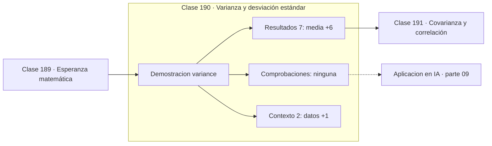

# 190 — Varianza y desviación estándar

> [⬅️ 189 Esperanza matemática](../189-esperanza-matematica/README.md) · [📚 Parte 09](../README.md) · [🏠 Programa](../../../README.md) · [191 Covarianza y correlación ➡️](../191-covarianza-y-correlacion/README.md)

**Parte:** 09 — Probabilidad y procesos aleatorios · **Nivel:** `universitario` · **Horas estimadas:** 4
**Motor:** `engines.part09` · **Demostración:** `variance` · **Clase 10 de 20** de la parte

---

## 🎯 Propósito

**La varianza mide dispersión al cuadrado; dividir entre n−1 la vuelve insesgada.**

Axiomas, probabilidad condicional, Bayes, variables aleatorias, esperanza, varianza, distribuciones clave, LGN, TCL, Monte Carlo y cadenas de Markov.

## ✅ Resultados de aprendizaje

Al terminar podrás:

1. Explicar **Varianza y desviación estándar** con lenguaje cotidiano y con notación matemática.
2. Resolver un caso pequeño a mano y anticipar el orden de magnitud del resultado.
3. Ejecutar y modificar `lab.py`, que corre la demostración `variance`.
4. Interpretar las 9 salidas del laboratorio y decir qué comprueba cada una.
5. Detectar el error típico de esta parte: asumir independencia sin justificarla.

## 🧩 Fórmulas de la clase

```text
Var(X) = E[(X − μ)²] = E[X²] − E[X]²
σ = √Var(X)
muestral insesgada: s² = Σ(xᵢ − x̄)² / (n − 1)
```

## 🗺️ Ubicación en el programa



## 📖 Fundamentos

La varianza promedia el cuadrado de las desviaciones respecto de la media. Se eleva al
cuadrado, y no se toma el valor absoluto, porque así la varianza de una suma de variables
independientes es la suma de varianzas —una propiedad que el valor absoluto no tiene— y
porque el resultado es derivable, lo cual importa al optimizar.

El precio es que la varianza vive en **unidades al cuadrado**: si los datos son euros, la
varianza son euros al cuadrado, y no se puede comparar con la media. Por eso se define la
**desviación estándar** como su raíz, que vuelve a las unidades originales y sí es
comparable e interpretable.

La fórmula computacional `Var(X) = E[X²] − E[X]²` es cómoda pero numéricamente peligrosa:
resta dos números grandes y parecidos, que es exactamente la cancelación catastrófica de
la parte 01. Con datos alejados del origen puede devolver varianzas negativas. Las
bibliotecas serias usan el algoritmo de Welford en una pasada, no esa fórmula.

La **corrección de Bessel** —dividir entre `n−1`— compensa que las desviaciones se calculan
respecto de la media **muestral**, que está ajustada a los propios datos y por tanto los
aproxima demasiado bien. Se han gastado un grado de libertad al estimar la media, y
devolverlo hace que el estimador sea insesgado.

## 🧮 Ejemplo trabajado

Ocho observaciones: dos denominadores, dos resultados.

```text
datos: 2, 4, 4, 4, 5, 5, 7, 9      n = 8
media: 40 / 8 = 5,0

desviaciones:  −3, −1, −1, −1, 0, 0, 2, 4
cuadrados:      9,  1,  1,  1, 0, 0, 4, 16      suma = 32

varianza poblacional  = 32 / 8 = 4,0        σ = 2,0
varianza muestral     = 32 / 7 = 4,5714     s = 2,1381

Con n grande la diferencia se desvanece; con n = 8 es del 14 %.
```

## 🔬 Qué ejecuta el laboratorio

`variance` — Varianza, desviación estándar y el estimador insesgado.

| Grupo | Salidas |
|---|---|
| 🔢 Resultados numéricos (7) | `media`, `varianza_poblacional_/n`, `varianza_muestral_/(n-1)`, `desviacion_estandar`, `statistics.pstdev`, `statistics.stdev`, `Var(aX)=a²Var(X)` |
| ✅ Comprobaciones de invariante (0) | — |

Las claves booleanas no son adorno: si alguna fuera `False`, el resultado numérico
no sería fiable aunque el programa terminase sin error.

```bash
python classes/part-09-probabilidad-y-procesos-aleatorios/190-varianza-y-desviacion-estandar/lab.py
compmath run 190
```

> [!TIP]
> Antes de ejecutar, **escribe tu predicción**. Un laboratorio que confirma lo que
> esperabas enseña tanto como uno que te contradice, pero solo si la predicción
> existía antes del resultado.

## ⚠️ Errores conceptuales frecuentes

1. Comparar una varianza con una media: las unidades no coinciden.
2. Usar E[X²] − E[X]² con datos grandes y sufrir cancelación.
3. Elegir n o n−1 sin saber si se describe una población o se estima.

## 🚀 Dónde se usa de verdad

Normalización de características, batch normalization, control de calidad, medición de
riesgo financiero y análisis de estabilidad de entrenamientos.

## 🤖 Conexión con IA

Un modelo de lenguaje es una distribución condicional sobre el siguiente token; la difusión es un proceso estocástico con reverso aprendido.

## 📓 Notebooks

| Archivo | Para qué |
|---|---|
| [`notebook.ipynb`](notebook.ipynb) | recorrido guiado con la demostración ejecutada |
| [`notebook_student.ipynb`](notebook_student.ipynb) | versión con `TODO` para resolver |
| [`notebook_solution.ipynb`](notebook_solution.ipynb) | solución de referencia verificada |

## 📝 Evaluación

| Criterio | Peso |
|---|---:|
| Comprensión conceptual | 25 % |
| Resolución manual | 25 % |
| Implementación y verificación | 25 % |
| Interpretación y comunicación | 15 % |
| Conexión con aplicación real | 10 % |

Detalle y criterios de error crítico en [`assessment.md`](assessment.md).

## ❓ Preguntas de comprobación

1. ¿Cuál es la entrada, cuál la salida y qué unidades tienen?
2. ¿Qué operación domina el comportamiento del resultado?
3. ¿Qué caso extremo revelaría un error conceptual?
4. ¿Cómo verificarías el resultado por un método independiente?
5. ¿Dónde aparece esto en riesgo?

Si necesitas releer el código para responderlas, la clase todavía no está superada.

## 📥 Entregable

`notebook_student.ipynb` resuelto más un párrafo que explique el resultado **sin citar
código**: qué entra, qué sale, qué invariante se comprueba y qué pasaría en un caso límite.

## 🔗 Referencias

- [Blitzstein, J.; Hwang, J. *Introduction to Probability*, 2ª ed., CRC, 2019, cap. 4](https://projects.iq.harvard.edu/stat110/home)
- [Wasserman, L. *All of Statistics*, Springer, 2004, cap. 3](https://link.springer.com/book/10.1007/978-0-387-21736-9)

Bibliografía completa de la parte en [`../../../docs/BIBLIOGRAPHY.md`](../../../docs/BIBLIOGRAPHY.md).

## 📂 Material de la clase

[`intuition.md`](intuition.md) · [`theory.md`](theory.md) · [`derivation.md`](derivation.md) · [`exercises.md`](exercises.md) · [`assessment.md`](assessment.md) · [`where-is-this-used.md`](where-is-this-used.md) · [`lesson.yaml`](lesson.yaml)

---

> [⬅️ 189 Esperanza matemática](../189-esperanza-matematica/README.md) · [📚 Parte 09](../README.md) · [🏠 Programa](../../../README.md) · [191 Covarianza y correlación ➡️](../191-covarianza-y-correlacion/README.md)
