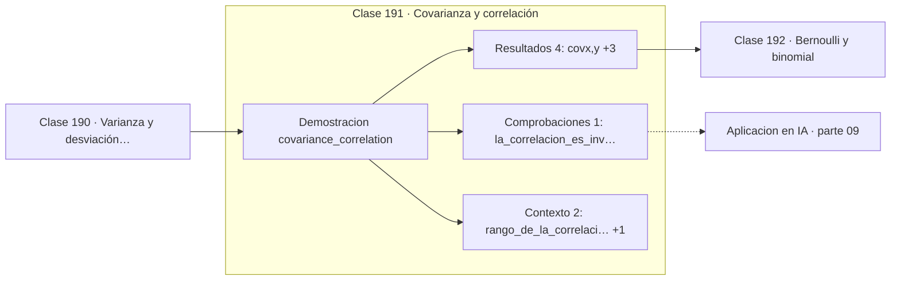

# 191 — Covarianza y correlación

> [⬅️ 190 Varianza y desviación estándar](../190-varianza-y-desviacion-estandar/README.md) · [📚 Parte 09](../README.md) · [🏠 Programa](../../../README.md) · [192 Bernoulli y binomial ➡️](../192-bernoulli-y-binomial/README.md)

**Parte:** 09 — Probabilidad y procesos aleatorios · **Nivel:** `universitario` · **Horas estimadas:** 4
**Motor:** `engines.part09` · **Demostración:** `covariance_correlation` · **Clase 11 de 20** de la parte

---

## 🎯 Propósito

**La covarianza depende de las unidades; la correlación no, pero solo ve lo lineal.**

Axiomas, probabilidad condicional, Bayes, variables aleatorias, esperanza, varianza, distribuciones clave, LGN, TCL, Monte Carlo y cadenas de Markov.

## ✅ Resultados de aprendizaje

Al terminar podrás:

1. Explicar **Covarianza y correlación** con lenguaje cotidiano y con notación matemática.
2. Resolver un caso pequeño a mano y anticipar el orden de magnitud del resultado.
3. Ejecutar y modificar `lab.py`, que corre la demostración `covariance_correlation`.
4. Interpretar las 7 salidas del laboratorio y decir qué comprueba cada una.
5. Detectar el error típico de esta parte: ignorar la probabilidad base al interpretar un test positivo.

## 🧩 Fórmulas de la clase

```text
Cov(X,Y) = E[(X − μₓ)(Y − μᵧ)]
ρ = Cov(X,Y) / (σₓ·σᵧ),   −1 ≤ ρ ≤ 1
Var(X+Y) = Var(X) + Var(Y) + 2·Cov(X,Y)
```

## 🗺️ Ubicación en el programa



## 📖 Fundamentos

La covarianza mide si dos variables se desvían de su media en el mismo sentido. Positiva
significa que suelen subir juntas; negativa, que una sube cuando la otra baja; cero, que
no hay tendencia lineal conjunta. Su defecto es que su magnitud depende de las escalas:
medir en milímetros en vez de metros multiplica la covarianza por mil sin que la relación
haya cambiado.

La **correlación de Pearson** arregla eso dividiendo por las desviaciones estándar. El
resultado es adimensional y está acotado en `[−1, 1]`, con los extremos alcanzados solo si
la relación es exactamente lineal. Esa acotación es la desigualdad de Cauchy-Schwarz
aplicada a variables centradas, y conecta con el ángulo entre vectores de la parte 05:
la correlación **es** el coseno del ángulo entre los datos centrados.

La limitación crítica es que la correlación solo detecta relaciones **lineales**. Si
`Y = X²` con `X` simétrica alrededor de cero, la correlación es exactamente 0 y la
dependencia es total. Correlación cero no implica independencia; la implicación solo va en
un sentido, y solo bajo normalidad conjunta se convierte en equivalencia.

La fórmula de la varianza de una suma muestra por qué la covarianza importa en la práctica:
diversificar una cartera, promediar predictores en un ensemble o combinar estimadores
reduce la varianza solo en la medida en que las covarianzas sean bajas. Modelos muy
correlacionados no se ayudan al promediarse.

## 🧮 Ejemplo trabajado

Invariancia de escala: multiplicar una variable por mil.

```text
x = 1, 2, 3, 4, 5 ...        y correlacionada con x
z = 1000·y                   misma relación, otras unidades

Cov(x, y) =    4,925
Cov(x, z) = 4 925,0          × 1000, como la escala

corr(x, y) = 0,998830
corr(x, z) = 0,998830        idéntica                     ✓

Dependencia no lineal invisible:
  x = −2, −1, 0, 1, 2      y = x² = 4, 1, 0, 1, 4
  corr(x, y) = 0    y sin embargo y está determinada por x
```

## 🔬 Qué ejecuta el laboratorio

`covariance_correlation` — Covarianza depende de la escala; la correlación no.

| Grupo | Salidas |
|---|---|
| 🔢 Resultados numéricos (4) | `cov(x,y)`, `cov(x,z)_escala_x1000`, `corr(x,y)`, `corr(x,z)` |
| ✅ Comprobaciones de invariante (1) | `la_correlacion_es_invariante_a_escala` |

Las claves booleanas no son adorno: si alguna fuera `False`, el resultado numérico
no sería fiable aunque el programa terminase sin error.

```bash
python classes/part-09-probabilidad-y-procesos-aleatorios/191-covarianza-y-correlacion/lab.py
compmath run 191
```

> [!TIP]
> Antes de ejecutar, **escribe tu predicción**. Un laboratorio que confirma lo que
> esperabas enseña tanto como uno que te contradice, pero solo si la predicción
> existía antes del resultado.

## ⚠️ Errores conceptuales frecuentes

1. Interpretar la magnitud de una covarianza sin mirar las unidades.
2. Deducir independencia de una correlación cero.
3. Leer correlación como causalidad.

## 🚀 Dónde se usa de verdad

Matrices de covarianza en PCA, selección de características, diversificación de carteras y
diseño de ensembles con predictores poco correlacionados.

## 🤖 Conexión con IA

Un modelo de lenguaje es una distribución condicional sobre el siguiente token; la difusión es un proceso estocástico con reverso aprendido.

## 📓 Notebooks

| Archivo | Para qué |
|---|---|
| [`notebook.ipynb`](notebook.ipynb) | recorrido guiado con la demostración ejecutada |
| [`notebook_student.ipynb`](notebook_student.ipynb) | versión con `TODO` para resolver |
| [`notebook_solution.ipynb`](notebook_solution.ipynb) | solución de referencia verificada |

## 📝 Evaluación

| Criterio | Peso |
|---|---:|
| Comprensión conceptual | 25 % |
| Resolución manual | 25 % |
| Implementación y verificación | 25 % |
| Interpretación y comunicación | 15 % |
| Conexión con aplicación real | 10 % |

Detalle y criterios de error crítico en [`assessment.md`](assessment.md).

## ❓ Preguntas de comprobación

1. ¿Cuál es la entrada, cuál la salida y qué unidades tienen?
2. ¿Qué operación domina el comportamiento del resultado?
3. ¿Qué caso extremo revelaría un error conceptual?
4. ¿Cómo verificarías el resultado por un método independiente?
5. ¿Dónde aparece esto en riesgo?

Si necesitas releer el código para responderlas, la clase todavía no está superada.

## 📥 Entregable

`notebook_student.ipynb` resuelto más un párrafo que explique el resultado **sin citar
código**: qué entra, qué sale, qué invariante se comprueba y qué pasaría en un caso límite.

## 🔗 Referencias

- [Blitzstein, J.; Hwang, J. *Introduction to Probability*, 2ª ed., CRC, 2019, cap. 7](https://projects.iq.harvard.edu/stat110/home) — *uso:* exposición alternativa del tema en «Covarianza y correlación».
- [Wasserman, L. *All of Statistics*, Springer, 2004, cap. 3](https://link.springer.com/book/10.1007/978-0-387-21736-9) — *uso:* desarrollo formal del tema en «Covarianza y correlación».

Bibliografía completa de la parte en [`../../../docs/BIBLIOGRAPHY.md`](../../../docs/BIBLIOGRAPHY.md) · localizador verificable de cada obra en [`sources/bibliography.json`](../../../sources/bibliography.json).

## 📂 Material de la clase

[`intuition.md`](intuition.md) · [`theory.md`](theory.md) · [`derivation.md`](derivation.md) · [`exercises.md`](exercises.md) · [`assessment.md`](assessment.md) · [`where-is-this-used.md`](where-is-this-used.md) · [`lesson.yaml`](lesson.yaml)

---

> [⬅️ 190 Varianza y desviación estándar](../190-varianza-y-desviacion-estandar/README.md) · [📚 Parte 09](../README.md) · [🏠 Programa](../../../README.md) · [192 Bernoulli y binomial ➡️](../192-bernoulli-y-binomial/README.md)
