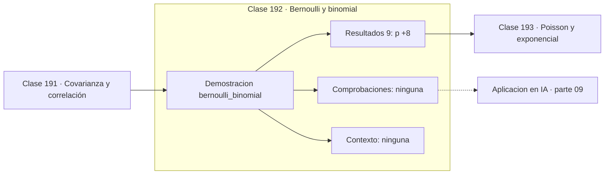

# 192 — Bernoulli y binomial

> [⬅️ 191 Covarianza y correlación](../191-covarianza-y-correlacion/README.md) · [📚 Parte 09](../README.md) · [🏠 Programa](../../../README.md) · [193 Poisson y exponencial ➡️](../193-poisson-y-exponencial/README.md)

**Parte:** 09 — Probabilidad y procesos aleatorios · **Nivel:** `universitario` · **Horas estimadas:** 4
**Motor:** `engines.part09` · **Demostración:** `bernoulli_binomial` · **Clase 12 de 20** de la parte

---

## 🎯 Propósito

**La binomial cuenta éxitos en n ensayos de Bernoulli independientes.**

Axiomas, probabilidad condicional, Bayes, variables aleatorias, esperanza, varianza, distribuciones clave, LGN, TCL, Monte Carlo y cadenas de Markov.

## ✅ Resultados de aprendizaje

Al terminar podrás:

1. Explicar **Bernoulli y binomial** con lenguaje cotidiano y con notación matemática.
2. Resolver un caso pequeño a mano y anticipar el orden de magnitud del resultado.
3. Ejecutar y modificar `lab.py`, que corre la demostración `bernoulli_binomial`.
4. Interpretar las 9 salidas del laboratorio y decir qué comprueba cada una.
5. Detectar el error típico de esta parte: reportar resultados monte carlo sin semilla ni intervalo.

## 🧩 Fórmulas de la clase

```text
Bernoulli: P(X=1) = p,  E[X] = p,  Var(X) = p(1−p)
Binomial: P(X=k) = C(n,k)·pᵏ·(1−p)ⁿ⁻ᵏ
E[X] = np,   Var(X) = np(1−p)
```

## 🗺️ Ubicación en el programa



## 📖 Fundamentos

Un **ensayo de Bernoulli** es el experimento más simple posible: éxito con probabilidad
`p`, fracaso con `1−p`. Su esperanza es `p` y su varianza `p(1−p)`, que alcanza su máximo
en `p = 0,5`: la máxima incertidumbre está en la moneda justa, y decae hacia cero cuando
el resultado es casi seguro en cualquiera de los dos sentidos.

Repetir `n` ensayos independientes con la misma `p` y contar los éxitos da la
**binomial**. Su fórmula tiene tres piezas que conviene leer por separado: `pᵏ` es la
probabilidad de los k éxitos, `(1−p)ⁿ⁻ᵏ` la de los fracasos restantes, y `C(n,k)` cuenta
de cuántas maneras distintas pueden ordenarse. Esa combinatoria es la de la parte 04.

La media `np` y la varianza `np(1−p)` salen sin esfuerzo de la linealidad de la esperanza
y de la aditividad de la varianza bajo independencia: la binomial es una suma de `n`
Bernoullis. Este es el ejemplo más limpio de por qué esas dos propiedades merecían clases
propias.

Las condiciones importan. Si los ensayos no son independientes, o si `p` cambia entre
ellos, la binomial no aplica: extraer cartas sin reposición da una hipergeométrica, no una
binomial. En aprendizaje automático la Bernoulli aparece como salida de toda regresión
logística, y su log-verosimilitud negativa **es** la entropía cruzada binaria.

## 🧮 Ejemplo trabajado

Diez ensayos con probabilidad de éxito 0,3.

```text
n = 10,  p = 0,3

media teórica     = np       = 3,0
varianza teórica  = np(1−p)  = 2,1

P(X = 3) = C(10,3) · 0,3³ · 0,7⁷
         = 120 · 0,027 · 0,0823543
         = 0,266828

simulación con 10⁵ réplicas:  media 2,99145         ✓

Var máxima de un Bernoulli: p = 0,5 → 0,25
Var con p = 0,3            → 0,21
Var con p = 0,01           → 0,0099
```

## 🔬 Qué ejecuta el laboratorio

`bernoulli_binomial` — De un ensayo a n ensayos: Bernoulli y binomial.

| Grupo | Salidas |
|---|---|
| 🔢 Resultados numéricos (9) | `p`, `n`, `media_teorica_np`, `varianza_teorica_np(1-p)`, `media_simulada`, `pmf_k=3`, `frecuencia_simulada_k=3`, `suma_pmf`, `P(X<=3)` |
| ✅ Comprobaciones de invariante (0) | — |

Las claves booleanas no son adorno: si alguna fuera `False`, el resultado numérico
no sería fiable aunque el programa terminase sin error.

```bash
python classes/part-09-probabilidad-y-procesos-aleatorios/192-bernoulli-y-binomial/lab.py
compmath run 192
```

> [!TIP]
> Antes de ejecutar, **escribe tu predicción**. Un laboratorio que confirma lo que
> esperabas enseña tanto como uno que te contradice, pero solo si la predicción
> existía antes del resultado.

## ⚠️ Errores conceptuales frecuentes

1. Aplicar la binomial a ensayos dependientes o con p variable.
2. Olvidar el coeficiente combinatorio y calcular solo pᵏ(1−p)ⁿ⁻ᵏ.
3. Confundir el número de ensayos n con el número de éxitos k.

## 🚀 Dónde se usa de verdad

Tests A/B, tasas de conversión, control de calidad por muestreo, salida de regresión
logística y entropía cruzada binaria.

## 🤖 Conexión con IA

Un modelo de lenguaje es una distribución condicional sobre el siguiente token; la difusión es un proceso estocástico con reverso aprendido.

## 📓 Notebooks

| Archivo | Para qué |
|---|---|
| [`notebook.ipynb`](notebook.ipynb) | recorrido guiado con la demostración ejecutada |
| [`notebook_student.ipynb`](notebook_student.ipynb) | versión con `TODO` para resolver |
| [`notebook_solution.ipynb`](notebook_solution.ipynb) | solución de referencia verificada |

## 📝 Evaluación

| Criterio | Peso |
|---|---:|
| Comprensión conceptual | 25 % |
| Resolución manual | 25 % |
| Implementación y verificación | 25 % |
| Interpretación y comunicación | 15 % |
| Conexión con aplicación real | 10 % |

Detalle y criterios de error crítico en [`assessment.md`](assessment.md).

## ❓ Preguntas de comprobación

1. ¿Cuál es la entrada, cuál la salida y qué unidades tienen?
2. ¿Qué operación domina el comportamiento del resultado?
3. ¿Qué caso extremo revelaría un error conceptual?
4. ¿Cómo verificarías el resultado por un método independiente?
5. ¿Dónde aparece esto en riesgo?

Si necesitas releer el código para responderlas, la clase todavía no está superada.

## 📥 Entregable

`notebook_student.ipynb` resuelto más un párrafo que explique el resultado **sin citar
código**: qué entra, qué sale, qué invariante se comprueba y qué pasaría en un caso límite.

## 📚 Bibliografía de la clase

Esta clase enseña **Probabilidad · Procesos estocásticos**. Cada obra dice qué aporta aquí y cómo se comprobó su localizador:

- [Blitzstein, J.; Hwang, J. *Introduction to Probability*, 2ª ed., CRC, 2019, cap. 3](https://projects.iq.harvard.edu/stat110/home) — Probabilidad: el tema de esta clase · URL de la fuente primaria, pendiente de resolver.
- [Ross, S. *A First Course in Probability*, 10ª ed., Pearson, 2018, cap. 4](https://openlibrary.org/isbn/9780134753119) — Probabilidad: el tema de esta clase · ISBN-13 `9780134753119` verificado en International ISBN Agency (2026-08-20).

Bibliografía de todas las clases, con el porqué de cada obra, en [`docs/BIBLIOGRAPHY.md`](../../../docs/BIBLIOGRAPHY.md) · localizador y estado de cada obra en [`sources/bibliography.json`](../../../sources/bibliography.json).

## 📂 Material de la clase

[`intuition.md`](intuition.md) · [`theory.md`](theory.md) · [`derivation.md`](derivation.md) · [`exercises.md`](exercises.md) · [`assessment.md`](assessment.md) · [`where-is-this-used.md`](where-is-this-used.md) · [`lesson.yaml`](lesson.yaml)

---

> [⬅️ 191 Covarianza y correlación](../191-covarianza-y-correlacion/README.md) · [📚 Parte 09](../README.md) · [🏠 Programa](../../../README.md) · [193 Poisson y exponencial ➡️](../193-poisson-y-exponencial/README.md)
