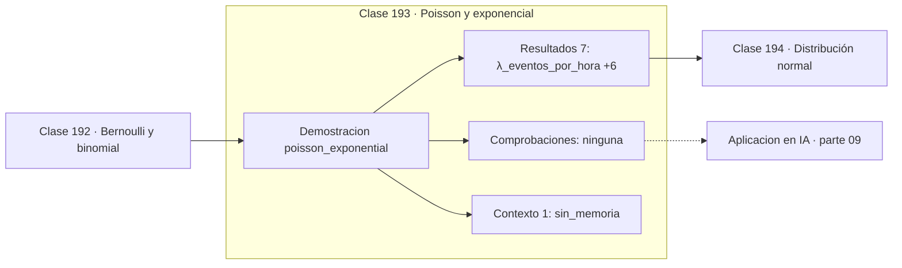

# 193 — Poisson y exponencial

> [⬅️ 192 Bernoulli y binomial](../192-bernoulli-y-binomial/README.md) · [📚 Parte 09](../README.md) · [🏠 Programa](../../../README.md) · [194 Distribución normal ➡️](../194-distribucion-normal/README.md)

**Parte:** 09 — Probabilidad y procesos aleatorios · **Nivel:** `universitario` · **Horas estimadas:** 4
**Motor:** `engines.part09` · **Demostración:** `poisson_exponential` · **Clase 13 de 20** de la parte

---

## 🎯 Propósito

**Poisson cuenta eventos raros por intervalo; la exponencial mide el tiempo entre ellos.**

Axiomas, probabilidad condicional, Bayes, variables aleatorias, esperanza, varianza, distribuciones clave, LGN, TCL, Monte Carlo y cadenas de Markov.

## ✅ Resultados de aprendizaje

Al terminar podrás:

1. Explicar **Poisson y exponencial** con lenguaje cotidiano y con notación matemática.
2. Resolver un caso pequeño a mano y anticipar el orden de magnitud del resultado.
3. Ejecutar y modificar `lab.py`, que corre la demostración `poisson_exponential`.
4. Interpretar las 8 salidas del laboratorio y decir qué comprueba cada una.
5. Detectar el error típico de esta parte: asumir independencia sin justificarla.

## 🧩 Fórmulas de la clase

```text
Poisson: P(N=k) = e^(−λ)·λᵏ / k!,  E[N] = Var(N) = λ
Exponencial: f(t) = λ·e^(−λt),  E[T] = 1/λ
falta de memoria: P(T > s+t | T > s) = P(T > t)
```

## 🗺️ Ubicación en el programa



## 📖 Fundamentos

La distribución de Poisson describe el número de eventos que ocurren en un intervalo
cuando esos eventos son independientes y suceden a una tasa media constante `λ`. Surge
como límite de una binomial con `n` grande y `p` pequeño manteniendo `np = λ`: muchísimas
oportunidades, cada una muy improbable.

Su firma es que **media y varianza coinciden**, ambas iguales a `λ`. Ese hecho sirve de
diagnóstico: si en unos datos de conteo la varianza supera claramente a la media, hay
**sobredispersión** y el modelo de Poisson es inadecuado, normalmente porque la tasa no es
constante o los eventos se agrupan.

La exponencial es la otra cara del mismo proceso: si los conteos son Poisson con tasa `λ`,
los **tiempos entre eventos** son exponenciales con media `1/λ`. Tres eventos por hora
implican una espera media de veinte minutos. Es la misma información contada desde el
tiempo en vez de desde la cuenta.

La propiedad de **falta de memoria** es lo que hace la exponencial única entre las
distribuciones continuas: haber esperado ya media hora no acorta la espera restante. Es
realista para procesos sin desgaste —desintegración radiactiva, llegadas a un servidor— y
claramente falso para procesos con envejecimiento, donde se usan Weibull o gamma.

## 🧮 Ejemplo trabajado

Tres eventos por hora: conteos y esperas.

```text
λ = 3 eventos/hora

Poisson:
  P(N = 0) = e^(−3)              = 0,049787
  P(N = 3) = e^(−3)·3³ / 3!      = 0,224042
  E[N] = 3,0      Var(N) = 3,0      iguales      ✓

Exponencial:
  E[T] = 1/3 hora = 20 minutos
  P(T > 1 h) = e^(−3) = 0,049787

Coherencia: "ningún evento en 1 hora" es lo mismo que
"la primera espera supera 1 hora"   →  mismo 0,049787   ✓

Falta de memoria:
  P(T > 1,5 | T > 0,5) = e^(−3) = P(T > 1)              ✓
```

## 🔬 Qué ejecuta el laboratorio

`poisson_exponential` — Poisson cuenta eventos; la exponencial mide el tiempo entre ellos.

| Grupo | Salidas |
|---|---|
| 🔢 Resultados numéricos (7) | `λ_eventos_por_hora`, `P(N=0)`, `P(N=3)`, `media_poisson`, `varianza_poisson`, `media_de_la_espera_1/λ`, `media_de_espera_simulada` |
| ✅ Comprobaciones de invariante (0) | — |

Las claves booleanas no son adorno: si alguna fuera `False`, el resultado numérico
no sería fiable aunque el programa terminase sin error.

```bash
python classes/part-09-probabilidad-y-procesos-aleatorios/193-poisson-y-exponencial/lab.py
compmath run 193
```

> [!TIP]
> Antes de ejecutar, **escribe tu predicción**. Un laboratorio que confirma lo que
> esperabas enseña tanto como uno que te contradice, pero solo si la predicción
> existía antes del resultado.

## ⚠️ Errores conceptuales frecuentes

1. Modelar conteos sobredispersos con Poisson.
2. Confundir la tasa λ con la media de la espera, que es 1/λ.
3. Suponer falta de memoria en procesos con desgaste o envejecimiento.

## 🚀 Dónde se usa de verdad

Colas y capacidad de servidores, llegadas de peticiones, fiabilidad de componentes,
conteos de defectos y modelos de supervivencia.

## 🤖 Conexión con IA

Un modelo de lenguaje es una distribución condicional sobre el siguiente token; la difusión es un proceso estocástico con reverso aprendido.

## 📓 Notebooks

| Archivo | Para qué |
|---|---|
| [`notebook.ipynb`](notebook.ipynb) | recorrido guiado con la demostración ejecutada |
| [`notebook_student.ipynb`](notebook_student.ipynb) | versión con `TODO` para resolver |
| [`notebook_solution.ipynb`](notebook_solution.ipynb) | solución de referencia verificada |

## 📝 Evaluación

| Criterio | Peso |
|---|---:|
| Comprensión conceptual | 25 % |
| Resolución manual | 25 % |
| Implementación y verificación | 25 % |
| Interpretación y comunicación | 15 % |
| Conexión con aplicación real | 10 % |

Detalle y criterios de error crítico en [`assessment.md`](assessment.md).

## ❓ Preguntas de comprobación

1. ¿Cuál es la entrada, cuál la salida y qué unidades tienen?
2. ¿Qué operación domina el comportamiento del resultado?
3. ¿Qué caso extremo revelaría un error conceptual?
4. ¿Cómo verificarías el resultado por un método independiente?
5. ¿Dónde aparece esto en riesgo?

Si necesitas releer el código para responderlas, la clase todavía no está superada.

## 📥 Entregable

`notebook_student.ipynb` resuelto más un párrafo que explique el resultado **sin citar
código**: qué entra, qué sale, qué invariante se comprueba y qué pasaría en un caso límite.

## 📚 Bibliografía de la clase

Esta clase enseña **Probabilidad · Procesos estocásticos**. Cada obra dice qué aporta aquí y cómo se comprobó su localizador:

- [Blitzstein, J.; Hwang, J. *Introduction to Probability*, 2ª ed., CRC, 2019, cap. 5](https://projects.iq.harvard.edu/stat110/home) — Probabilidad: el tema de esta clase · URL de la fuente primaria, pendiente de resolver.
- [Durrett, R. *Probability: Theory and Examples*, 5ª ed., Cambridge, 2019](https://services.math.duke.edu/~rtd/PTE/pte.html) — Probabilidad: el tema de esta clase · URL de la fuente primaria comprobada en services.math.duke.edu (2026-08-19).

Bibliografía de todas las clases, con el porqué de cada obra, en [`docs/BIBLIOGRAPHY.md`](../../../docs/BIBLIOGRAPHY.md) · localizador y estado de cada obra en [`sources/bibliography.json`](../../../sources/bibliography.json).

## 📂 Material de la clase

[`intuition.md`](intuition.md) · [`theory.md`](theory.md) · [`derivation.md`](derivation.md) · [`exercises.md`](exercises.md) · [`assessment.md`](assessment.md) · [`where-is-this-used.md`](where-is-this-used.md) · [`lesson.yaml`](lesson.yaml)

---

> [⬅️ 192 Bernoulli y binomial](../192-bernoulli-y-binomial/README.md) · [📚 Parte 09](../README.md) · [🏠 Programa](../../../README.md) · [194 Distribución normal ➡️](../194-distribucion-normal/README.md)
