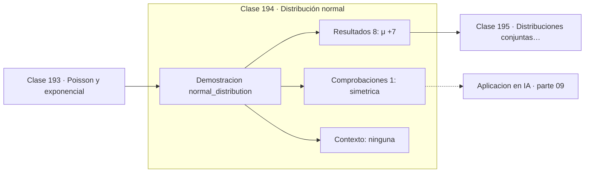

# 194 — Distribución normal

> [⬅️ 193 Poisson y exponencial](../193-poisson-y-exponencial/README.md) · [📚 Parte 09](../README.md) · [🏠 Programa](../../../README.md) · [195 Distribuciones conjuntas y marginales ➡️](../195-distribuciones-conjuntas-y-marginales/README.md)

**Parte:** 09 — Probabilidad y procesos aleatorios · **Nivel:** `universitario` · **Horas estimadas:** 4
**Motor:** `engines.part09` · **Demostración:** `normal_distribution` · **Clase 14 de 20** de la parte

---

## 🎯 Propósito

**La normal queda fijada por media y desviación, y la puntuación z la vuelve universal.**

Axiomas, probabilidad condicional, Bayes, variables aleatorias, esperanza, varianza, distribuciones clave, LGN, TCL, Monte Carlo y cadenas de Markov.

## ✅ Resultados de aprendizaje

Al terminar podrás:

1. Explicar **Distribución normal** con lenguaje cotidiano y con notación matemática.
2. Resolver un caso pequeño a mano y anticipar el orden de magnitud del resultado.
3. Ejecutar y modificar `lab.py`, que corre la demostración `normal_distribution`.
4. Interpretar las 9 salidas del laboratorio y decir qué comprueba cada una.
5. Detectar el error típico de esta parte: ignorar la probabilidad base al interpretar un test positivo.

## 🧩 Fórmulas de la clase

```text
f(x) = 1/(σ√(2π)) · e^(−(x−μ)²/(2σ²))
z = (x − μ) / σ  ⟹  Z ~ Normal(0,1)
68,27 % · 95,45 % · 99,73 % dentro de 1σ, 2σ y 3σ
```

## 🗺️ Ubicación en el programa



## 📖 Fundamentos

La distribución normal es simétrica, unimodal y queda completamente determinada por dos
números: la media `μ`, que fija dónde está el centro, y la desviación `σ`, que fija cuán
ancha es. Ninguna otra distribución tan simple aparece tan a menudo, y la razón no es
estética: es el teorema central del límite de la clase 197.

La **estandarización** `z = (x − μ)/σ` convierte cualquier normal en la normal estándar.
Eso permite tabular una sola distribución y responder cualquier pregunta sobre todas las
demás. La puntuación z se lee directamente como «a cuántas desviaciones del centro está
este valor», y es la forma correcta de comparar magnitudes medidas en escalas distintas.

La **regla 68-95-99,7** conviene memorizarla porque da intuición inmediata: dentro de una
desviación cae el 68 % de los datos, dentro de dos el 95 % y dentro de tres el 99,7 %. Un
valor a más de tres sigmas ocurre menos de tres veces de cada mil, y por eso ese umbral se
usa como criterio de anomalía.

La advertencia habitual: la normal tiene **colas ligeras**, que decaen exponencialmente al
cuadrado. Muchos fenómenos reales —retornos financieros, tamaños de archivo, popularidad
de contenidos— tienen colas mucho más pesadas, y modelarlos como normales subestima
gravemente los eventos extremos. Suponer normalidad sin comprobarla es un error caro.

## 🧮 Ejemplo trabajado

Distribución de CI con media 100 y desviación 15.

```text
μ = 100,  σ = 15

P(85  < X < 115) = 0,6827      1σ
P(70  < X < 130) = 0,9545      2σ
P(55  < X < 145) = 0,9973      3σ

z de 130 = (130 − 100) / 15 = 2,0
P(X > 130) = (1 − 0,9545) / 2 = 0,0228   ≈ 1 de cada 44

Comparación entre escalas:
  130 en CI  (z = 2,0)
  620 en una prueba de μ=500, σ=100  (z = 1,2)
  el primero es más extremo pese al número menor
```

## 🔬 Qué ejecuta el laboratorio

`normal_distribution` — Normal: regla 68-95-99.7 y estandarización.

| Grupo | Salidas |
|---|---|
| 🔢 Resultados numéricos (8) | `μ`, `σ`, `P(μ-σ < X < μ+σ)`, `P(μ-2σ < X < μ+2σ)`, `P(μ-3σ < X < μ+3σ)`, `z_de_130`, `P(X>130)`, `percentil_95_aprox` |
| ✅ Comprobaciones de invariante (1) | `simetrica` |

Las claves booleanas no son adorno: si alguna fuera `False`, el resultado numérico
no sería fiable aunque el programa terminase sin error.

```bash
python classes/part-09-probabilidad-y-procesos-aleatorios/194-distribucion-normal/lab.py
compmath run 194
```

> [!TIP]
> Antes de ejecutar, **escribe tu predicción**. Un laboratorio que confirma lo que
> esperabas enseña tanto como uno que te contradice, pero solo si la predicción
> existía antes del resultado.

## ⚠️ Errores conceptuales frecuentes

1. Suponer normalidad sin comprobarla.
2. Usar la normal para fenómenos con colas pesadas o soporte acotado.
3. Confundir la puntuación z con una probabilidad.

## 🚀 Dónde se usa de verdad

Inicialización de pesos en redes, ruido gaussiano en modelos de difusión, control
estadístico de procesos, intervalos de confianza y detección de anomalías.

## 🤖 Conexión con IA

Un modelo de lenguaje es una distribución condicional sobre el siguiente token; la difusión es un proceso estocástico con reverso aprendido.

## 📓 Notebooks

| Archivo | Para qué |
|---|---|
| [`notebook.ipynb`](notebook.ipynb) | recorrido guiado con la demostración ejecutada |
| [`notebook_student.ipynb`](notebook_student.ipynb) | versión con `TODO` para resolver |
| [`notebook_solution.ipynb`](notebook_solution.ipynb) | solución de referencia verificada |

## 📝 Evaluación

| Criterio | Peso |
|---|---:|
| Comprensión conceptual | 25 % |
| Resolución manual | 25 % |
| Implementación y verificación | 25 % |
| Interpretación y comunicación | 15 % |
| Conexión con aplicación real | 10 % |

Detalle y criterios de error crítico en [`assessment.md`](assessment.md).

## ❓ Preguntas de comprobación

1. ¿Cuál es la entrada, cuál la salida y qué unidades tienen?
2. ¿Qué operación domina el comportamiento del resultado?
3. ¿Qué caso extremo revelaría un error conceptual?
4. ¿Cómo verificarías el resultado por un método independiente?
5. ¿Dónde aparece esto en riesgo?

Si necesitas releer el código para responderlas, la clase todavía no está superada.

## 📥 Entregable

`notebook_student.ipynb` resuelto más un párrafo que explique el resultado **sin citar
código**: qué entra, qué sale, qué invariante se comprueba y qué pasaría en un caso límite.

## 📚 Bibliografía de la clase

Esta clase enseña **Probabilidad · Procesos estocásticos**. Cada obra dice qué aporta aquí y cómo se comprobó su localizador:

- [Blitzstein, J.; Hwang, J. *Introduction to Probability*, 2ª ed., CRC, 2019, cap. 5](https://projects.iq.harvard.edu/stat110/home) — Probabilidad: el tema de esta clase · URL de la fuente primaria, pendiente de resolver.
- [Wasserman, L. *All of Statistics*, Springer, 2004, cap. 2](https://link.springer.com/book/10.1007/978-0-387-21736-9) — Probabilidad: el tema de esta clase · ISBN-13 `9780387217369` verificado en International ISBN Agency (2026-08-19).

Bibliografía de todas las clases, con el porqué de cada obra, en [`docs/BIBLIOGRAPHY.md`](../../../docs/BIBLIOGRAPHY.md) · localizador y estado de cada obra en [`sources/bibliography.json`](../../../sources/bibliography.json).

## 📂 Material de la clase

[`intuition.md`](intuition.md) · [`theory.md`](theory.md) · [`derivation.md`](derivation.md) · [`exercises.md`](exercises.md) · [`assessment.md`](assessment.md) · [`where-is-this-used.md`](where-is-this-used.md) · [`lesson.yaml`](lesson.yaml)

---

> [⬅️ 193 Poisson y exponencial](../193-poisson-y-exponencial/README.md) · [📚 Parte 09](../README.md) · [🏠 Programa](../../../README.md) · [195 Distribuciones conjuntas y marginales ➡️](../195-distribuciones-conjuntas-y-marginales/README.md)
