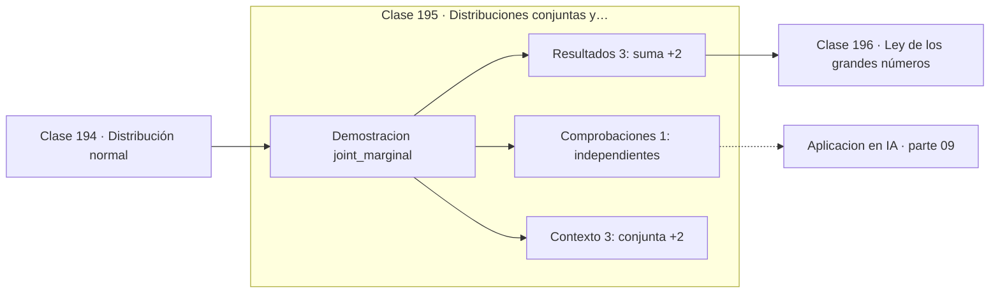

# 195 — Distribuciones conjuntas y marginales

> [⬅️ 194 Distribución normal](../194-distribucion-normal/README.md) · [📚 Parte 09](../README.md) · [🏠 Programa](../../../README.md) · [196 Ley de los grandes números ➡️](../196-ley-de-los-grandes-numeros/README.md)

**Parte:** 09 — Probabilidad y procesos aleatorios · **Nivel:** `universitario` · **Horas estimadas:** 4
**Motor:** `engines.part09` · **Demostración:** `joint_marginal` · **Clase 15 de 20** de la parte

---

## 🎯 Propósito

**De la conjunta se obtienen las marginales sumando y las condicionales dividiendo.**

Axiomas, probabilidad condicional, Bayes, variables aleatorias, esperanza, varianza, distribuciones clave, LGN, TCL, Monte Carlo y cadenas de Markov.

## ✅ Resultados de aprendizaje

Al terminar podrás:

1. Explicar **Distribuciones conjuntas y marginales** con lenguaje cotidiano y con notación matemática.
2. Resolver un caso pequeño a mano y anticipar el orden de magnitud del resultado.
3. Ejecutar y modificar `lab.py`, que corre la demostración `joint_marginal`.
4. Interpretar las 7 salidas del laboratorio y decir qué comprueba cada una.
5. Detectar el error típico de esta parte: reportar resultados monte carlo sin semilla ni intervalo.

## 🧩 Fórmulas de la clase

```text
conjunta: p(x,y) = P(X=x, Y=y),  Σ p(x,y) = 1
marginal: p(x) = Σᵧ p(x,y)
condicional: p(y|x) = p(x,y) / p(x)
independencia ⟺ p(x,y) = p(x)·p(y) para todo par
```

## 🗺️ Ubicación en el programa



## 📖 Fundamentos

Cuando dos variables se observan a la vez, la descripción completa es la **distribución
conjunta**: una probabilidad por cada par de valores. Todo lo demás se deriva de ella, y
esa es la razón de que la conjunta sea el objeto fundamental y las marginales solo
resúmenes.

**Marginalizar** es sumar sobre la variable que no interesa. El nombre viene de las tablas
de doble entrada, donde esas sumas se escribían literalmente en los márgenes. Marginalizar
pierde información: dos conjuntas muy distintas pueden tener exactamente las mismas
marginales, y por eso conocer cada variable por separado no basta para saber cómo se
relacionan.

**Condicionar** es dividir por la marginal correspondiente, lo cual reescala una fila o
columna para que vuelva a sumar 1. La comparación entre `p(x,y)` y `p(x)·p(y)` es el test
de independencia: si coinciden para todos los pares, las variables son independientes; si
difieren en alguno, no lo son.

Esta es la maquinaria de los modelos gráficos y de todo el modelado probabilístico
moderno. Un modelo generativo aprende una conjunta sobre datos y etiquetas; la inferencia
consiste en condicionar sobre lo observado y marginalizar lo latente. En el caso continuo
las sumas se vuelven integrales, y esas integrales intratables son las que motivan la
inferencia variacional y los métodos de la parte 17.

## 🧮 Ejemplo trabajado

Conjunta de dos variables binarias.

```text
p(x,y)        y=0     y=1    | marginal X
x=0           0,20    0,30   |    0,50
x=1           0,10    0,40   |    0,50
------------------------------------------
marginal Y    0,30    0,70   |    1,00     ✓

Condicional:
  p(y=1 | x=1) = 0,40 / 0,50 = 0,80
  p(y=1 | x=0) = 0,30 / 0,50 = 0,60

Test de independencia en el par (1,1):
  p(1,1)        = 0,40
  p(1)·p(1)     = 0,50 × 0,70 = 0,35
  0,40 ≠ 0,35   →  X e Y NO son independientes
```

## 🔬 Qué ejecuta el laboratorio

`joint_marginal` — Distribución conjunta, marginales y condicional.

| Grupo | Salidas |
|---|---|
| 🔢 Resultados numéricos (3) | `suma`, `P(Y=1|X=1)`, `producto_de_marginales_(1,1)` |
| ✅ Comprobaciones de invariante (1) | `independientes` |

Las claves booleanas no son adorno: si alguna fuera `False`, el resultado numérico
no sería fiable aunque el programa terminase sin error.

```bash
python classes/part-09-probabilidad-y-procesos-aleatorios/195-distribuciones-conjuntas-y-marginales/lab.py
compmath run 195
```

> [!TIP]
> Antes de ejecutar, **escribe tu predicción**. Un laboratorio que confirma lo que
> esperabas enseña tanto como uno que te contradice, pero solo si la predicción
> existía antes del resultado.

## ⚠️ Errores conceptuales frecuentes

1. Reconstruir la conjunta a partir de las marginales.
2. Dividir por la marginal equivocada al condicionar.
3. Olvidar comprobar que la conjunta suma 1.

## 🚀 Dónde se usa de verdad

Modelos gráficos probabilísticos, inferencia bayesiana, tablas de contingencia y
distribuciones latentes en modelos generativos.

## 🤖 Conexión con IA

Un modelo de lenguaje es una distribución condicional sobre el siguiente token; la difusión es un proceso estocástico con reverso aprendido.

## 📓 Notebooks

| Archivo | Para qué |
|---|---|
| [`notebook.ipynb`](notebook.ipynb) | recorrido guiado con la demostración ejecutada |
| [`notebook_student.ipynb`](notebook_student.ipynb) | versión con `TODO` para resolver |
| [`notebook_solution.ipynb`](notebook_solution.ipynb) | solución de referencia verificada |

## 📝 Evaluación

| Criterio | Peso |
|---|---:|
| Comprensión conceptual | 25 % |
| Resolución manual | 25 % |
| Implementación y verificación | 25 % |
| Interpretación y comunicación | 15 % |
| Conexión con aplicación real | 10 % |

Detalle y criterios de error crítico en [`assessment.md`](assessment.md).

## ❓ Preguntas de comprobación

1. ¿Cuál es la entrada, cuál la salida y qué unidades tienen?
2. ¿Qué operación domina el comportamiento del resultado?
3. ¿Qué caso extremo revelaría un error conceptual?
4. ¿Cómo verificarías el resultado por un método independiente?
5. ¿Dónde aparece esto en riesgo?

Si necesitas releer el código para responderlas, la clase todavía no está superada.

## 📥 Entregable

`notebook_student.ipynb` resuelto más un párrafo que explique el resultado **sin citar
código**: qué entra, qué sale, qué invariante se comprueba y qué pasaría en un caso límite.

## 🔗 Referencias

- [Blitzstein, J.; Hwang, J. *Introduction to Probability*, 2ª ed., CRC, 2019, cap. 7](https://projects.iq.harvard.edu/stat110/home)
- [Bishop, C. *Pattern Recognition and Machine Learning*, Springer, 2006, cap. 8](https://www.microsoft.com/en-us/research/publication/pattern-recognition-machine-learning/)

Bibliografía completa de la parte en [`../../../docs/BIBLIOGRAPHY.md`](../../../docs/BIBLIOGRAPHY.md).

## 📂 Material de la clase

[`intuition.md`](intuition.md) · [`theory.md`](theory.md) · [`derivation.md`](derivation.md) · [`exercises.md`](exercises.md) · [`assessment.md`](assessment.md) · [`where-is-this-used.md`](where-is-this-used.md) · [`lesson.yaml`](lesson.yaml)

---

> [⬅️ 194 Distribución normal](../194-distribucion-normal/README.md) · [📚 Parte 09](../README.md) · [🏠 Programa](../../../README.md) · [196 Ley de los grandes números ➡️](../196-ley-de-los-grandes-numeros/README.md)
