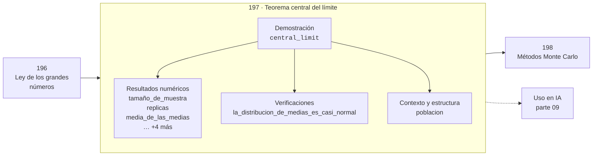

# 197 — Teorema central del límite

> [⬅️ 196 Ley de los grandes números](../196-ley-de-los-grandes-numeros/README.md) · [📚 Parte 09](../README.md) · [🏠 Programa](../../../README.md) · [198 Métodos Monte Carlo ➡️](../198-metodos-monte-carlo/README.md)

**Parte:** 09 — Probabilidad y procesos aleatorios · **Nivel:** `universitario` · **Horas estimadas:** 4
**Motor:** `engines.part09` · **Demostración:** `central_limit` · **Clase 17 de 20** de la parte

---

## 🎯 Propósito

Axiomas, probabilidad condicional, Bayes, variables aleatorias, esperanza, varianza, distribuciones clave, LGN, TCL, Monte Carlo y cadenas de Markov.

Esta clase concreta ese objetivo sobre **Teorema central del límite**: qué es, cómo se
calcula a mano, cómo se implementa sin ocultar el procedimiento y cómo se verifica
que el resultado es correcto y no solo plausible.

## ✅ Resultados de aprendizaje

Al terminar podrás:

1. Explicar **Teorema central del límite** con lenguaje cotidiano y con notación matemática.
2. Resolver un caso pequeño a mano y anticipar el orden de magnitud del resultado.
3. Ejecutar y modificar `lab.py`, que corre la demostración `central_limit`.
4. Interpretar las 9 salidas del laboratorio y decir qué comprueba cada una.
5. Detectar el error típico de esta parte: ignorar la probabilidad base al interpretar un test positivo.

## 🗺️ Ubicación en el programa



## 🧠 Idea rectora de la parte 09

> La esperanza es lineal siempre; la varianza solo bajo independencia.

## 🔬 Qué ejecuta el laboratorio

`central_limit` — El TCL en acción sobre una distribución claramente no normal.

| Grupo | Salidas |
|---|---|
| 🔢 Resultados numéricos (7) | `tamaño_de_muestra`, `replicas`, `media_de_las_medias`, `media_teorica`, `varianza_de_las_medias`, `varianza_teorica_σ²/n`, `error_estandar` |
| ✅ Comprobaciones de invariante (1) | `la_distribucion_de_medias_es_casi_normal` |

Las claves booleanas no son adorno: si alguna fuera `False`, el resultado numérico
no sería fiable aunque el programa terminase sin error.

```bash
python classes/part-09-probabilidad-y-procesos-aleatorios/197-teorema-central-del-limite/lab.py
compmath run 197
```

> [!TIP]
> Antes de ejecutar, **escribe tu predicción**. Un laboratorio que confirma lo que
> esperabas enseña tanto como uno que te contradice, pero solo si la predicción
> existía antes del resultado.

## ⚠️ Errores frecuentes en esta parte

- Asumir independencia sin justificarla.
- Ignorar la probabilidad base al interpretar un test positivo.
- Reportar resultados Monte Carlo sin semilla ni intervalo.

## 🤖 Conexión con IA

Un modelo de lenguaje es una distribución condicional sobre el siguiente token; la difusión es un proceso estocástico con reverso aprendido.

## 📓 Notebooks

| Archivo | Para qué |
|---|---|
| [`notebook.ipynb`](notebook.ipynb) | recorrido guiado con la demostración ejecutada |
| [`notebook_student.ipynb`](notebook_student.ipynb) | versión con `TODO` para resolver |
| [`notebook_solution.ipynb`](notebook_solution.ipynb) | solución de referencia verificada |

## 📝 Evaluación

| Criterio | Peso |
|---|---:|
| Comprensión conceptual | 25 % |
| Resolución manual | 25 % |
| Implementación y verificación | 25 % |
| Interpretación y comunicación | 15 % |
| Conexión con aplicación real | 10 % |

Detalle y criterios de error crítico en [`assessment.md`](assessment.md).

## ❓ Preguntas de comprobación

1. ¿Cuál es la entrada, cuál la salida y qué unidades tienen?
2. ¿Qué operación domina el comportamiento del resultado?
3. ¿Qué caso extremo revelaría un error conceptual?
4. ¿Cómo verificarías el resultado por un método independiente?
5. ¿Dónde aparece esto en riesgo?

Si necesitas releer el código para responderlas, la clase todavía no está superada.

## 📥 Entregable

`notebook_student.ipynb` resuelto más un párrafo que explique el resultado **sin citar
código**: qué entra, qué sale, qué invariante se comprueba y qué pasaría en un caso límite.

## 🔗 Referencias

- Ross, S. *A First Course in Probability*. 10ª ed., Pearson, 2018.
- Blitzstein, J.; Hwang, J. *Introduction to Probability*. 2ª ed., CRC, 2019.
- Durrett, R. *Probability: Theory and Examples*. 5ª ed., Cambridge, 2019.

## 📂 Material de la clase

[`intuition.md`](intuition.md) · [`theory.md`](theory.md) · [`derivation.md`](derivation.md) · [`exercises.md`](exercises.md) · [`assessment.md`](assessment.md) · [`where-is-this-used.md`](where-is-this-used.md) · [`lesson.yaml`](lesson.yaml)

---

> [⬅️ 196 Ley de los grandes números](../196-ley-de-los-grandes-numeros/README.md) · [📚 Parte 09](../README.md) · [🏠 Programa](../../../README.md) · [198 Métodos Monte Carlo ➡️](../198-metodos-monte-carlo/README.md)
