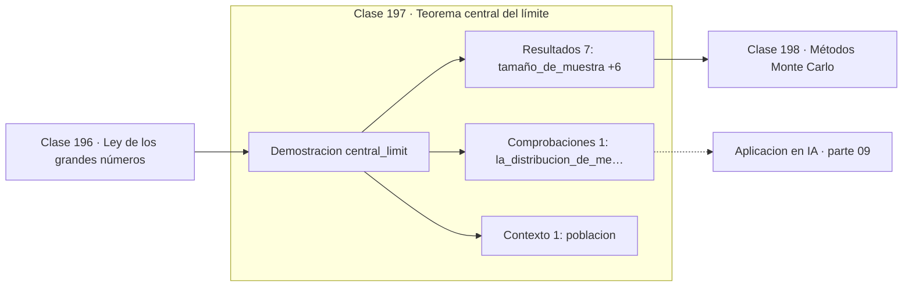

# 197 — Teorema central del límite

> [⬅️ 196 Ley de los grandes números](../196-ley-de-los-grandes-numeros/README.md) · [📚 Parte 09](../README.md) · [🏠 Programa](../../../README.md) · [198 Métodos Monte Carlo ➡️](../198-metodos-monte-carlo/README.md)

**Parte:** 09 — Probabilidad y procesos aleatorios · **Nivel:** `universitario` · **Horas estimadas:** 4
**Motor:** `engines.part09` · **Demostración:** `central_limit` · **Clase 17 de 20** de la parte

---

## 🎯 Propósito

**La media de muchas variables tiende a una normal aunque el origen no lo sea.**

Axiomas, probabilidad condicional, Bayes, variables aleatorias, esperanza, varianza, distribuciones clave, LGN, TCL, Monte Carlo y cadenas de Markov.

## ✅ Resultados de aprendizaje

Al terminar podrás:

1. Explicar **Teorema central del límite** con lenguaje cotidiano y con notación matemática.
2. Resolver un caso pequeño a mano y anticipar el orden de magnitud del resultado.
3. Ejecutar y modificar `lab.py`, que corre la demostración `central_limit`.
4. Interpretar las 9 salidas del laboratorio y decir qué comprueba cada una.
5. Detectar el error típico de esta parte: ignorar la probabilidad base al interpretar un test positivo.

## 🧩 Fórmulas de la clase

```text
x̄ₙ ≈ Normal(μ, σ²/n)  para n grande
(x̄ₙ − μ)/(σ/√n) → Normal(0,1)
error estándar = σ/√n
```

## 🗺️ Ubicación en el programa



## 📖 Fundamentos

El teorema central del límite es el resultado más sorprendente de la probabilidad
elemental: la distribución de la media muestral tiende a una normal **sin importar de qué
distribución vengan los datos**, siempre que tengan media y varianza finitas y sean
independientes. La forma original se olvida; solo sobreviven su media y su varianza.

Mientras la ley de los grandes números dice **hacia dónde** converge la media, el TCL dice
**cómo se distribuye alrededor** de ese límite. Esa información es lo que permite construir
intervalos de confianza y contrastes de hipótesis: sin TCL no habría estadística
inferencial práctica.

El **error estándar** `σ/√n` es la desviación de la media muestral, no de los datos.
Confundir `σ` con `σ/√n` es el error más frecuente al reportar resultados: la primera
describe cuánto varían las observaciones, la segunda cuánto varía la estimación. Sus
valores difieren por un factor `√n`, que con `n = 10 000` es cien.

La regla de «con n ≥ 30 basta» es una guía burda. La velocidad de convergencia depende de
la asimetría de la distribución de origen: para una exponencial `n = 30` ya es razonable,
para una distribución muy sesgada o con valores extremos puede hacer falta mucho más. Y si
la varianza es infinita, el TCL directamente no aplica.

## 🧮 Ejemplo trabajado

Medias de muestras de tamaño 30 de una exponencial claramente asimétrica.

```text
población: Exponencial(1)      media 1,   varianza 1
           fuertemente asimétrica, nada normal

8 000 réplicas de muestras de tamaño n = 30:

  media de las medias    = 0,997036     teórico 1,0        ✓
  varianza de las medias = 0,032656     teórico 1/30 = 0,0333  ✓
  desviación             = 0,1807       teórico 1/√30 = 0,1826 ✓

La distribución de las medias es casi simétrica y acampanada
aunque la población de origen no tenga nada de normal.

error estándar frente a desviación de los datos:
  σ      = 1,0       cuánto varía una observación
  σ/√30  = 0,183     cuánto varía la media
```

## 🔬 Qué ejecuta el laboratorio

`central_limit` — El TCL en acción sobre una distribución claramente no normal.

| Grupo | Salidas |
|---|---|
| 🔢 Resultados numéricos (7) | `tamaño_de_muestra`, `replicas`, `media_de_las_medias`, `media_teorica`, `varianza_de_las_medias`, `varianza_teorica_σ²/n`, `error_estandar` |
| ✅ Comprobaciones de invariante (1) | `la_distribucion_de_medias_es_casi_normal` |

Las claves booleanas no son adorno: si alguna fuera `False`, el resultado numérico
no sería fiable aunque el programa terminase sin error.

```bash
python classes/part-09-probabilidad-y-procesos-aleatorios/197-teorema-central-del-limite/lab.py
compmath run 197
```

> [!TIP]
> Antes de ejecutar, **escribe tu predicción**. Un laboratorio que confirma lo que
> esperabas enseña tanto como uno que te contradice, pero solo si la predicción
> existía antes del resultado.

## ⚠️ Errores conceptuales frecuentes

1. Reportar σ donde corresponde σ/√n.
2. Aplicar el TCL a datos dependientes o con varianza infinita.
3. Creer que el TCL vuelve normales a los datos: normaliza las medias, no las observaciones.

## 🚀 Dónde se usa de verdad

Intervalos de confianza, contrastes de hipótesis, barras de error en experimentos y
justificación del ruido gaussiano en modelos de medición.

## 🤖 Conexión con IA

Un modelo de lenguaje es una distribución condicional sobre el siguiente token; la difusión es un proceso estocástico con reverso aprendido.

## 📓 Notebooks

| Archivo | Para qué |
|---|---|
| [`notebook.ipynb`](notebook.ipynb) | recorrido guiado con la demostración ejecutada |
| [`notebook_student.ipynb`](notebook_student.ipynb) | versión con `TODO` para resolver |
| [`notebook_solution.ipynb`](notebook_solution.ipynb) | solución de referencia verificada |

## 📝 Evaluación

| Criterio | Peso |
|---|---:|
| Comprensión conceptual | 25 % |
| Resolución manual | 25 % |
| Implementación y verificación | 25 % |
| Interpretación y comunicación | 15 % |
| Conexión con aplicación real | 10 % |

Detalle y criterios de error crítico en [`assessment.md`](assessment.md).

## ❓ Preguntas de comprobación

1. ¿Cuál es la entrada, cuál la salida y qué unidades tienen?
2. ¿Qué operación domina el comportamiento del resultado?
3. ¿Qué caso extremo revelaría un error conceptual?
4. ¿Cómo verificarías el resultado por un método independiente?
5. ¿Dónde aparece esto en riesgo?

Si necesitas releer el código para responderlas, la clase todavía no está superada.

## 📥 Entregable

`notebook_student.ipynb` resuelto más un párrafo que explique el resultado **sin citar
código**: qué entra, qué sale, qué invariante se comprueba y qué pasaría en un caso límite.

## 🔗 Referencias

- [Blitzstein, J.; Hwang, J. *Introduction to Probability*, 2ª ed., CRC, 2019, cap. 10](https://projects.iq.harvard.edu/stat110/home) — *uso:* exposición alternativa del tema en «Teorema central del límite».
- [Wasserman, L. *All of Statistics*, Springer, 2004, cap. 5](https://link.springer.com/book/10.1007/978-0-387-21736-9) — *uso:* desarrollo formal del tema en «Teorema central del límite».

Bibliografía completa de la parte en [`../../../docs/BIBLIOGRAPHY.md`](../../../docs/BIBLIOGRAPHY.md) · localizador verificable de cada obra en [`sources/bibliography.json`](../../../sources/bibliography.json).

## 📂 Material de la clase

[`intuition.md`](intuition.md) · [`theory.md`](theory.md) · [`derivation.md`](derivation.md) · [`exercises.md`](exercises.md) · [`assessment.md`](assessment.md) · [`where-is-this-used.md`](where-is-this-used.md) · [`lesson.yaml`](lesson.yaml)

---

> [⬅️ 196 Ley de los grandes números](../196-ley-de-los-grandes-numeros/README.md) · [📚 Parte 09](../README.md) · [🏠 Programa](../../../README.md) · [198 Métodos Monte Carlo ➡️](../198-metodos-monte-carlo/README.md)
