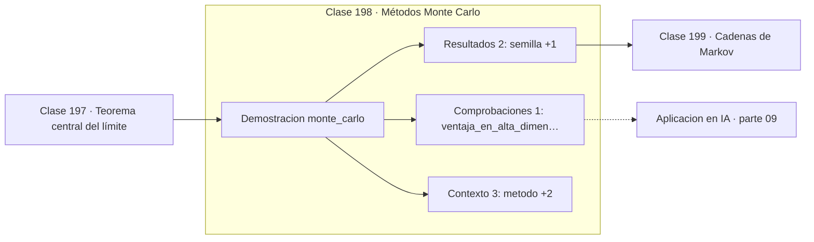

# 198 — Métodos Monte Carlo

> [⬅️ 197 Teorema central del límite](../197-teorema-central-del-limite/README.md) · [📚 Parte 09](../README.md) · [🏠 Programa](../../../README.md) · [199 Cadenas de Markov ➡️](../199-cadenas-de-markov/README.md)

**Parte:** 09 — Probabilidad y procesos aleatorios · **Nivel:** `universitario` · **Horas estimadas:** 4
**Motor:** `engines.part09` · **Demostración:** `monte_carlo` · **Clase 18 de 20** de la parte

---

## 🎯 Propósito

**Monte Carlo estima integrales muestreando, con error 1/√n en cualquier dimensión.**

Axiomas, probabilidad condicional, Bayes, variables aleatorias, esperanza, varianza, distribuciones clave, LGN, TCL, Monte Carlo y cadenas de Markov.

## ✅ Resultados de aprendizaje

Al terminar podrás:

1. Explicar **Métodos Monte Carlo** con lenguaje cotidiano y con notación matemática.
2. Resolver un caso pequeño a mano y anticipar el orden de magnitud del resultado.
3. Ejecutar y modificar `lab.py`, que corre la demostración `monte_carlo`.
4. Interpretar las 6 salidas del laboratorio y decir qué comprueba cada una.
5. Detectar el error típico de esta parte: reportar resultados monte carlo sin semilla ni intervalo.

## 🧩 Fórmulas de la clase

```text
E[g(X)] ≈ (1/n)·Σ g(xᵢ)
error estándar = s/√n
intervalo aproximado: estimación ± 1,96·s/√n
```

## 🗺️ Ubicación en el programa



## 📖 Fundamentos

El método de Monte Carlo resuelve un problema determinista —una integral, un área, una
probabilidad— convirtiéndolo en un experimento aleatorio y promediando. Su justificación
es la ley de los grandes números, y su control de error es el teorema central del límite:
las dos clases anteriores existían para llegar aquí.

El ejemplo clásico estima π lanzando puntos uniformes en el cuadrado unitario y contando
cuántos caen dentro del cuarto de círculo. La proporción tiende a `π/4`. Es un método
malísimo para calcular π —hay algoritmos que dan miles de dígitos— pero perfecto para
entender el mecanismo y su coste.

Ese coste es la convergencia `O(1/√n)`, que es lenta: para un dígito decimal más hacen
falta cien veces más muestras. La compensación es decisiva: **esa velocidad no depende de
la dimensión**. Las reglas de cuadratura clásicas empeoran exponencialmente al crecer la
dimensión, y por encima de unas pocas variables Monte Carlo es la única opción viable.

Dos exigencias de higiene, que la clase trata como obligatorias. Primera: **fijar la
semilla**, porque un resultado no reproducible no es un resultado. Segunda: **reportar el
error estándar** junto a la estimación; un número Monte Carlo sin su incertidumbre no
permite saber si la diferencia observada frente a otro método es real o es ruido.

## 🧮 Ejemplo trabajado

Estimación de π por muestreo uniforme, con semilla fija.

```text
semilla = 20260819

      n     estimación    error      error estándar
  1 000       3,156000    0,014407      0,0519
 10 000       3,145600    0,004007      0,0164
100 000       3,142880    0,001287      0,0052

π real = 3,141593

El error cae como 1/√n:
  n × 100  →  error estándar / 10                        ✓

Intervalo al 95 % con n = 100 000:
  3,142880 ± 1,96 × 0,0052 = [3,13268, 3,15308]
  contiene a π                                           ✓

Ganar un decimal más exigiría n ≈ 10 000 000.
```

## 🔬 Qué ejecuta el laboratorio

`monte_carlo` — Estimar π por Monte Carlo con su error e intervalo.

| Grupo | Salidas |
|---|---|
| 🔢 Resultados numéricos (2) | `semilla`, `pi_real` |
| ✅ Comprobaciones de invariante (1) | `ventaja_en_alta_dimension` |

Las claves booleanas no son adorno: si alguna fuera `False`, el resultado numérico
no sería fiable aunque el programa terminase sin error.

```bash
python classes/part-09-probabilidad-y-procesos-aleatorios/198-metodos-monte-carlo/lab.py
compmath run 198
```

> [!TIP]
> Antes de ejecutar, **escribe tu predicción**. Un laboratorio que confirma lo que
> esperabas enseña tanto como uno que te contradice, pero solo si la predicción
> existía antes del resultado.

## ⚠️ Errores conceptuales frecuentes

1. Publicar una estimación sin semilla ni error estándar.
2. Esperar precisión alta de una simulación corta.
3. Descartar Monte Carlo en alta dimensión, donde es lo único que escala.

## 🚀 Dónde se usa de verdad

Integración en alta dimensión, valoración de opciones, propagación de incertidumbre,
dropout en inferencia y muestreo en modelos generativos.

## 🤖 Conexión con IA

Un modelo de lenguaje es una distribución condicional sobre el siguiente token; la difusión es un proceso estocástico con reverso aprendido.

## 📓 Notebooks

| Archivo | Para qué |
|---|---|
| [`notebook.ipynb`](notebook.ipynb) | recorrido guiado con la demostración ejecutada |
| [`notebook_student.ipynb`](notebook_student.ipynb) | versión con `TODO` para resolver |
| [`notebook_solution.ipynb`](notebook_solution.ipynb) | solución de referencia verificada |

## 📝 Evaluación

| Criterio | Peso |
|---|---:|
| Comprensión conceptual | 25 % |
| Resolución manual | 25 % |
| Implementación y verificación | 25 % |
| Interpretación y comunicación | 15 % |
| Conexión con aplicación real | 10 % |

Detalle y criterios de error crítico en [`assessment.md`](assessment.md).

## ❓ Preguntas de comprobación

1. ¿Cuál es la entrada, cuál la salida y qué unidades tienen?
2. ¿Qué operación domina el comportamiento del resultado?
3. ¿Qué caso extremo revelaría un error conceptual?
4. ¿Cómo verificarías el resultado por un método independiente?
5. ¿Dónde aparece esto en riesgo?

Si necesitas releer el código para responderlas, la clase todavía no está superada.

## 📥 Entregable

`notebook_student.ipynb` resuelto más un párrafo que explique el resultado **sin citar
código**: qué entra, qué sale, qué invariante se comprueba y qué pasaría en un caso límite.

## 🔗 Referencias

- [Blitzstein, J.; Hwang, J. *Introduction to Probability*, 2ª ed., CRC, 2019, cap. 10](https://projects.iq.harvard.edu/stat110/home) — *uso:* exposición alternativa del tema en «Métodos Monte Carlo».
- [Robert, C.; Casella, G. *Monte Carlo Statistical Methods*, 2ª ed., Springer, 2004](https://link.springer.com/book/10.1007/978-1-4757-4145-2) — *uso:* desarrollo formal del tema en «Métodos Monte Carlo».

Bibliografía completa de la parte en [`../../../docs/BIBLIOGRAPHY.md`](../../../docs/BIBLIOGRAPHY.md) · localizador verificable de cada obra en [`sources/bibliography.json`](../../../sources/bibliography.json).

## 📂 Material de la clase

[`intuition.md`](intuition.md) · [`theory.md`](theory.md) · [`derivation.md`](derivation.md) · [`exercises.md`](exercises.md) · [`assessment.md`](assessment.md) · [`where-is-this-used.md`](where-is-this-used.md) · [`lesson.yaml`](lesson.yaml)

---

> [⬅️ 197 Teorema central del límite](../197-teorema-central-del-limite/README.md) · [📚 Parte 09](../README.md) · [🏠 Programa](../../../README.md) · [199 Cadenas de Markov ➡️](../199-cadenas-de-markov/README.md)
