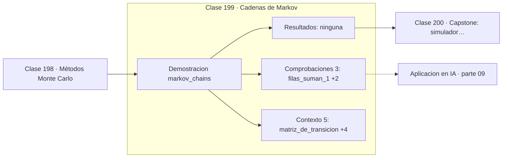

# 199 — Cadenas de Markov

> [⬅️ 198 Métodos Monte Carlo](../198-metodos-monte-carlo/README.md) · [📚 Parte 09](../README.md) · [🏠 Programa](../../../README.md) · [200 Capstone: simulador probabilístico y bayesiano ➡️](../200-capstone-simulador-probabilistico-y-bayesiano/README.md)

**Parte:** 09 — Probabilidad y procesos aleatorios · **Nivel:** `universitario` · **Horas estimadas:** 4
**Motor:** `engines.part09` · **Demostración:** `markov_chains` · **Clase 19 de 20** de la parte

---

## 🎯 Propósito

**Una cadena de Markov olvida su historia y, si es ergódica, olvida también su inicio.**

Axiomas, probabilidad condicional, Bayes, variables aleatorias, esperanza, varianza, distribuciones clave, LGN, TCL, Monte Carlo y cadenas de Markov.

## ✅ Resultados de aprendizaje

Al terminar podrás:

1. Explicar **Cadenas de Markov** con lenguaje cotidiano y con notación matemática.
2. Resolver un caso pequeño a mano y anticipar el orden de magnitud del resultado.
3. Ejecutar y modificar `lab.py`, que corre la demostración `markov_chains`.
4. Interpretar las 8 salidas del laboratorio y decir qué comprueba cada una.
5. Detectar el error típico de esta parte: asumir independencia sin justificarla.

## 🧩 Fórmulas de la clase

```text
P(Xₙ₊₁ | Xₙ, …, X₀) = P(Xₙ₊₁ | Xₙ)
distribución tras n pasos: v·Pⁿ
estacionaria: πP = π,  con Σπᵢ = 1
```

## 🗺️ Ubicación en el programa



## 📖 Fundamentos

Una cadena de Markov es un proceso en el que el futuro depende del presente pero no del
pasado. Esa **propiedad de Markov** es una simplificación drástica y sorprendentemente
útil: basta con la matriz de transición `P`, donde `Pᵢⱼ` es la probabilidad de pasar del
estado i al j, y cada fila suma 1.

La evolución es álgebra lineal pura. Si `v` es la distribución actual sobre los estados,
tras un paso es `vP` y tras `n` pasos es `vPⁿ`. Toda la parte 06 se vuelve relevante aquí:
las potencias de la matriz se calculan con su diagonalización, y la velocidad de
convergencia la marca el segundo autovalor en módulo.

La **distribución estacionaria** `π` cumple `πP = π`: es un autovector izquierdo con
autovalor 1, y describe el régimen de equilibrio. Si la cadena es **ergódica** —se puede
llegar de cualquier estado a cualquier otro y no hay ciclos rígidos— entonces la
estacionaria es única y la cadena converge a ella desde **cualquier** inicio. La condición
inicial se olvida.

Esa propiedad es la base de MCMC: si se quiere muestrear de una distribución imposible de
muestrear directamente, se construye una cadena cuya estacionaria sea esa distribución y
se la deja correr. PageRank es exactamente lo mismo aplicado al grafo de la web, y los
modelos de difusión son un proceso estocástico cuyo reverso se aprende con una red.

## 🧮 Ejemplo trabajado

Cadena de dos estados y su equilibrio.

```text
P = [[0,9   0,1]        filas suman 1        ✓
     [0,5   0,5]]

inicio v = [1,0   0,0]      seguro en el estado A

paso 1:  [0,9000   0,1000]
paso 2:  [0,8600   0,1400]
paso 5:  [0,8346   0,1654]
paso 20: [0,8333   0,1667]

Estacionaria exacta: resolver πP = π con π₀ + π₁ = 1
  0,9π₀ + 0,5π₁ = π₀   →   0,5π₁ = 0,1π₀   →   π₀ = 5π₁
  π = [5/6   1/6] = [0,833333   0,166667]              ✓

Desde v = [0,0  1,0] la cadena converge al mismo π.
```

## 🔬 Qué ejecuta el laboratorio

`markov_chains` — Cadena de Markov: matriz de transición y distribución estacionaria.

| Grupo | Salidas |
|---|---|
| 🔢 Resultados numéricos (0) | — |
| ✅ Comprobaciones de invariante (3) | `filas_suman_1`, `converge`, `olvida_el_estado_inicial` |

Las claves booleanas no son adorno: si alguna fuera `False`, el resultado numérico
no sería fiable aunque el programa terminase sin error.

```bash
python classes/part-09-probabilidad-y-procesos-aleatorios/199-cadenas-de-markov/lab.py
compmath run 199
```

> [!TIP]
> Antes de ejecutar, **escribe tu predicción**. Un laboratorio que confirma lo que
> esperabas enseña tanto como uno que te contradice, pero solo si la predicción
> existía antes del resultado.

## ⚠️ Errores conceptuales frecuentes

1. Usar matrices de transición cuyas filas no suman 1.
2. Confundir filas con columnas al multiplicar por la izquierda o la derecha.
3. Suponer convergencia en cadenas periódicas o reducibles.

## 🚀 Dónde se usa de verdad

PageRank, MCMC, modelos ocultos de Markov, aprendizaje por refuerzo con procesos de
decisión markovianos y procesos de difusión.

## 🤖 Conexión con IA

Un modelo de lenguaje es una distribución condicional sobre el siguiente token; la difusión es un proceso estocástico con reverso aprendido.

## 📓 Notebooks

| Archivo | Para qué |
|---|---|
| [`notebook.ipynb`](notebook.ipynb) | recorrido guiado con la demostración ejecutada |
| [`notebook_student.ipynb`](notebook_student.ipynb) | versión con `TODO` para resolver |
| [`notebook_solution.ipynb`](notebook_solution.ipynb) | solución de referencia verificada |

## 📝 Evaluación

| Criterio | Peso |
|---|---:|
| Comprensión conceptual | 25 % |
| Resolución manual | 25 % |
| Implementación y verificación | 25 % |
| Interpretación y comunicación | 15 % |
| Conexión con aplicación real | 10 % |

Detalle y criterios de error crítico en [`assessment.md`](assessment.md).

## ❓ Preguntas de comprobación

1. ¿Cuál es la entrada, cuál la salida y qué unidades tienen?
2. ¿Qué operación domina el comportamiento del resultado?
3. ¿Qué caso extremo revelaría un error conceptual?
4. ¿Cómo verificarías el resultado por un método independiente?
5. ¿Dónde aparece esto en riesgo?

Si necesitas releer el código para responderlas, la clase todavía no está superada.

## 📥 Entregable

`notebook_student.ipynb` resuelto más un párrafo que explique el resultado **sin citar
código**: qué entra, qué sale, qué invariante se comprueba y qué pasaría en un caso límite.

## 📚 Bibliografía de la clase

Esta clase enseña **Probabilidad · Procesos estocásticos**. Cada obra dice qué aporta aquí y cómo se comprobó su localizador:

- [Blitzstein, J.; Hwang, J. *Introduction to Probability*, 2ª ed., CRC, 2019, cap. 11](https://projects.iq.harvard.edu/stat110/home) — Probabilidad: el tema de esta clase · URL de la fuente primaria, pendiente de resolver.
- [Durrett, R. *Probability: Theory and Examples*, 5ª ed., Cambridge, 2019, cap. 5](https://services.math.duke.edu/~rtd/PTE/pte.html) — Probabilidad: el tema de esta clase · URL de la fuente primaria comprobada en services.math.duke.edu (2026-08-19).

Bibliografía de todas las clases, con el porqué de cada obra, en [`docs/BIBLIOGRAPHY.md`](../../../docs/BIBLIOGRAPHY.md) · localizador y estado de cada obra en [`sources/bibliography.json`](../../../sources/bibliography.json).

## 📂 Material de la clase

[`intuition.md`](intuition.md) · [`theory.md`](theory.md) · [`derivation.md`](derivation.md) · [`exercises.md`](exercises.md) · [`assessment.md`](assessment.md) · [`where-is-this-used.md`](where-is-this-used.md) · [`lesson.yaml`](lesson.yaml)

---

> [⬅️ 198 Métodos Monte Carlo](../198-metodos-monte-carlo/README.md) · [📚 Parte 09](../README.md) · [🏠 Programa](../../../README.md) · [200 Capstone: simulador probabilístico y bayesiano ➡️](../200-capstone-simulador-probabilistico-y-bayesiano/README.md)
