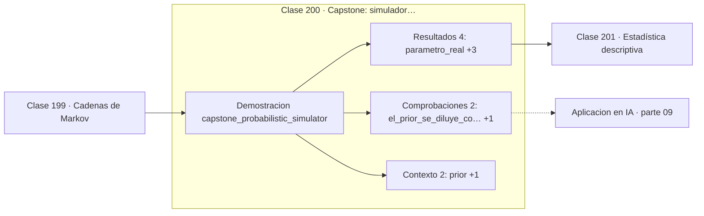

# 200 — Capstone: simulador probabilístico y bayesiano

> [⬅️ 199 Cadenas de Markov](../199-cadenas-de-markov/README.md) · [📚 Parte 09](../README.md) · [🏠 Programa](../../../README.md) · [201 Estadística descriptiva ➡️](../../part-10-estadistica-e-inferencia/201-estadistica-descriptiva/README.md)

**Parte:** 09 — Probabilidad y procesos aleatorios · **Nivel:** `universitario` · **Horas estimadas:** 4
**Motor:** `engines.part09` · **Demostración:** `capstone_probabilistic_simulator` · **Clase 20 de 20** de la parte

---

## 🎯 Propósito

**Con suficientes datos, el prior se diluye y bayesiano y frecuentista convergen.**

Axiomas, probabilidad condicional, Bayes, variables aleatorias, esperanza, varianza, distribuciones clave, LGN, TCL, Monte Carlo y cadenas de Markov.

## ✅ Resultados de aprendizaje

Al terminar podrás:

1. Explicar **Capstone: simulador probabilístico y bayesiano** con lenguaje cotidiano y con notación matemática.
2. Resolver un caso pequeño a mano y anticipar el orden de magnitud del resultado.
3. Ejecutar y modificar `lab.py`, que corre la demostración `capstone_probabilistic_simulator`.
4. Interpretar las 8 salidas del laboratorio y decir qué comprueba cada una.
5. Detectar el error típico de esta parte: ignorar la probabilidad base al interpretar un test positivo.

## 🧩 Fórmulas de la clase

```text
posterior ∝ verosimilitud × prior
Beta(a,b) + k éxitos en n ⟹ Beta(a+k, b+n−k)
media posterior = (a+k) / (a+b+n)
```

## 🗺️ Ubicación en el programa



## 📖 Fundamentos

El capstone reúne toda la parte en un simulador: se fija un parámetro real desconocido
para el observador, se generan datos, y se estima ese parámetro de dos maneras —contando
frecuencias y actualizando una creencia con Bayes— para ver cómo se comportan a medida que
llegan observaciones.

El prior `Beta(2,2)` expresa una creencia previa suave centrada en 0,5. Es **conjugado** de
la binomial, lo que significa que el posterior pertenece a la misma familia y la
actualización se reduce a sumar: `Beta(a+k, b+n−k)`. Esa comodidad algebraica es la razón
histórica de que los priores conjugados dominaran antes de que MCMC hiciera viable
cualquier prior.

Lo que el experimento muestra es la **dilución del prior**. Con pocas observaciones la
media posterior está tirada hacia 0,5 por la creencia previa; con cientos de datos se pega
a la frecuencia observada, y las dos estimaciones se vuelven indistinguibles. El prior
importa cuando hay poca evidencia, que es precisamente cuando hace falta que importe.

La diferencia de fondo entre ambos enfoques no es numérica sino de interpretación. El
frecuentista da un punto y un intervalo con garantías de cobertura a largo plazo; el
bayesiano da una **distribución completa** sobre el parámetro, de la que se leen media,
incertidumbre e intervalo creíble. Esa distribución es lo que la parte 10 formaliza y lo
que hace del enfoque bayesiano el lenguaje natural de la cuantificación de incertidumbre.

## 🧮 Ejemplo trabajado

Parámetro real 0,35, prior Beta(2,2), evidencia creciente.

```text
  n obs   éxitos   media posterior   desv. posterior
      0        0        0,5000           0,2236
     10        3        0,3571           0,1247
     50        16       0,3333           0,0645
    200        58       0,2941           0,0313
  1 000      265        0,2669           0,0140

estimación frecuentista final (265/1000) = 0,2650
estimación bayesiana final                = 0,2696

diferencia = 0,0046  →  el prior ya casi no pesa

peso del prior:  a+b = 4 observaciones equivalentes
  frente a n = 10   pesa un 29 %
  frente a n = 1000 pesa un 0,4 %
```

## 🔬 Qué ejecuta el laboratorio

`capstone_probabilistic_simulator` — Capstone: simulador probabilístico con actualización bayesiana.

| Grupo | Salidas |
|---|---|
| 🔢 Resultados numéricos (4) | `parametro_real`, `estimacion_frecuentista`, `estimacion_bayesiana_final`, `semilla` |
| ✅ Comprobaciones de invariante (2) | `el_prior_se_diluye_con_datos`, `reproducible` |

Las claves booleanas no son adorno: si alguna fuera `False`, el resultado numérico
no sería fiable aunque el programa terminase sin error.

```bash
python classes/part-09-probabilidad-y-procesos-aleatorios/200-capstone-simulador-probabilistico-y-bayesiano/lab.py
compmath run 200
```

> [!TIP]
> Antes de ejecutar, **escribe tu predicción**. Un laboratorio que confirma lo que
> esperabas enseña tanto como uno que te contradice, pero solo si la predicción
> existía antes del resultado.

## ⚠️ Errores conceptuales frecuentes

1. Elegir un prior muy informativo y presentar el resultado como si viniera de los datos.
2. Comparar un intervalo de confianza con uno creíble como si significaran lo mismo.
3. Actualizar dos veces con la misma observación.

## 🚀 Dónde se usa de verdad

Tests A/B bayesianos, bandidos multibrazo con Thompson sampling, calibración de modelos y
estimación de tasas con pocos datos.

## 🤖 Conexión con IA

Un modelo de lenguaje es una distribución condicional sobre el siguiente token; la difusión es un proceso estocástico con reverso aprendido.

## 📓 Notebooks

| Archivo | Para qué |
|---|---|
| [`notebook.ipynb`](notebook.ipynb) | recorrido guiado con la demostración ejecutada |
| [`notebook_student.ipynb`](notebook_student.ipynb) | versión con `TODO` para resolver |
| [`notebook_solution.ipynb`](notebook_solution.ipynb) | solución de referencia verificada |

## 📝 Evaluación

| Criterio | Peso |
|---|---:|
| Comprensión conceptual | 25 % |
| Resolución manual | 25 % |
| Implementación y verificación | 25 % |
| Interpretación y comunicación | 15 % |
| Conexión con aplicación real | 10 % |

Detalle y criterios de error crítico en [`assessment.md`](assessment.md).

## ❓ Preguntas de comprobación

1. ¿Cuál es la entrada, cuál la salida y qué unidades tienen?
2. ¿Qué operación domina el comportamiento del resultado?
3. ¿Qué caso extremo revelaría un error conceptual?
4. ¿Cómo verificarías el resultado por un método independiente?
5. ¿Dónde aparece esto en riesgo?

Si necesitas releer el código para responderlas, la clase todavía no está superada.

## 📥 Entregable

`notebook_student.ipynb` resuelto más un párrafo que explique el resultado **sin citar
código**: qué entra, qué sale, qué invariante se comprueba y qué pasaría en un caso límite.

## 📚 Bibliografía de la clase

Esta clase enseña **Probabilidad · Procesos estocásticos**. Cada obra dice qué aporta aquí y cómo se comprobó su localizador:

- [Gelman, A. et al. *Bayesian Data Analysis*, 3ª ed., CRC, 2013](https://www.stat.columbia.edu/~gelman/book/) — Estadística e inferencia y Inferencia bayesiana: conexión declarada de esta parte · ISBN-13 `9781439840955` verificado en International ISBN Agency (2026-08-19).
- [Blitzstein, J.; Hwang, J. *Introduction to Probability*, 2ª ed., CRC, 2019, cap. 8](https://projects.iq.harvard.edu/stat110/home) — Probabilidad: el tema de esta clase · URL de la fuente primaria, pendiente de resolver.

Bibliografía de todas las clases, con el porqué de cada obra, en [`docs/BIBLIOGRAPHY.md`](../../../docs/BIBLIOGRAPHY.md) · localizador y estado de cada obra en [`sources/bibliography.json`](../../../sources/bibliography.json).

## 📂 Material de la clase

[`intuition.md`](intuition.md) · [`theory.md`](theory.md) · [`derivation.md`](derivation.md) · [`exercises.md`](exercises.md) · [`assessment.md`](assessment.md) · [`where-is-this-used.md`](where-is-this-used.md) · [`lesson.yaml`](lesson.yaml)

---

> [⬅️ 199 Cadenas de Markov](../199-cadenas-de-markov/README.md) · [📚 Parte 09](../README.md) · [🏠 Programa](../../../README.md) · [201 Estadística descriptiva ➡️](../../part-10-estadistica-e-inferencia/201-estadistica-descriptiva/README.md)
