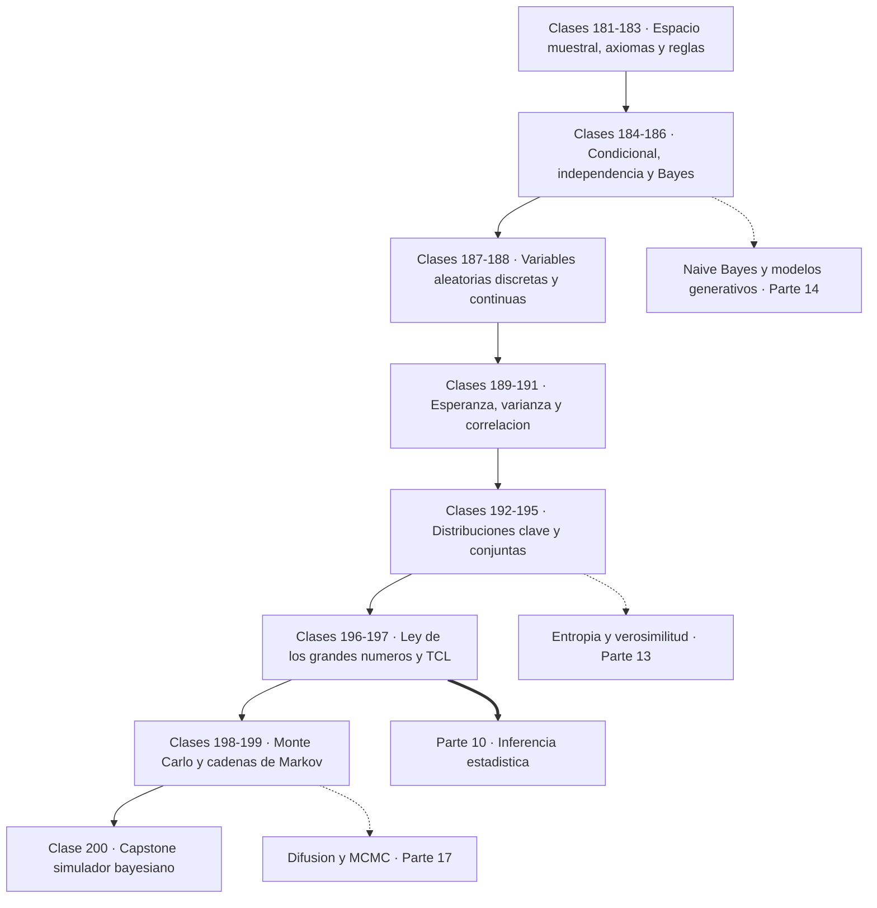

# 🎲 Parte 09 — Probabilidad y procesos aleatorios

> [⬅️ Parte 08 — Cálculo multivariable, matricial y autodiferenciación](../part-08-calculo-multivariable-matricial-y-autodiferenciacion/README.md) · [🏠 Programa](../../README.md) · [📇 Catálogo](../README.md) · [Parte 10 — Estadística e inferencia ➡️](../part-10-estadistica-e-inferencia/README.md)

**Nivel:** `universitario` · **Clases:** 20 · **Horas estimadas:** 80 · **Motor:** [`part09.py`](../../src/computational_math/engines/part09.py)

---

## 🎯 De qué trata esta parte

Axiomas, probabilidad condicional, Bayes, variables aleatorias, esperanza, varianza, distribuciones clave, LGN, TCL, Monte Carlo y cadenas de Markov.

La probabilidad es el lenguaje con el que se habla de lo que no se sabe. No mide ignorancia
vaga: la mide con la misma precisión con la que el álgebra lineal mide una rotación. Esta
parte construye ese lenguaje desde los axiomas hasta las cadenas de Markov, y en el camino
desarma tres o cuatro confusiones que arruinan más análisis de datos que cualquier error de
programación.

Las clases 181 a 186 son los cimientos. Un experimento aleatorio produce resultados de un
**espacio muestral**, un evento es un subconjunto de ese espacio, y una probabilidad es una
función que asigna números a eventos cumpliendo tres axiomas de Kolmogorov. Todo lo demás
—la regla de la suma, la del producto, la probabilidad condicional, la independencia y el
teorema de Bayes— se deduce de ahí. No hay nada más que memorizar.

El punto de inflexión es la clase 184, y merece detenerse: **condicionar es cambiar de
espacio muestral**. `P(A|B)` no es una probabilidad distinta de A, es la probabilidad de A
dentro de un mundo donde B ya ocurrió. De esa lectura sale de forma natural que `P(A|B)` y
`P(B|A)` no tienen por qué parecerse en nada, y la clase 186 lo muestra con el ejemplo más
costoso de la vida real: un test con 99 % de sensibilidad y 99 % de especificidad, aplicado
a una enfermedad que afecta a 1 de cada 1000 personas, produce un positivo que solo acierta
el 9 % de las veces. Diez falsos positivos por cada verdadero. Confundir esas dos
probabilidades se llama **falacia del fiscal** y ha mandado gente a la cárcel.

Las clases 187 a 195 introducen las variables aleatorias y sus resúmenes. Una variable
aleatoria no es una variable ni es aleatoria: es una **función** del espacio muestral a los
números. Ese cambio de perspectiva permite hablar de esperanza, varianza, covarianza y
correlación, y trabajar con distribuciones concretas —Bernoulli, binomial, Poisson,
exponencial y normal— en vez de con espacios muestrales explícitos. Dos hechos hay que
grabar: la esperanza es lineal **siempre**, incluso con variables dependientes; la varianza
solo se suma bajo independencia.

Las clases 196 y 197 son los dos teoremas límite que sostienen toda la estadística. La ley
de los grandes números dice que la media muestral converge a la media real; el teorema
central del límite dice **a qué velocidad y con qué forma**. El TCL es el que explica por
qué la campana de Gauss aparece en fenómenos que no tienen nada de gaussiano: si un
resultado es la suma de muchos efectos pequeños e independientes, su distribución tiende a
la normal, venga de donde venga.

Las clases 198 y 199 pasan a la simulación. Monte Carlo estima integrales y probabilidades
muestreando, con un error que cae como `1/√n`: cuadruplicar el número de muestras solo
duplica la precisión, y esa lentitud es el precio a cambio de que la velocidad **no dependa
de la dimensión**. Las cadenas de Markov formalizan los procesos sin memoria y su
distribución estacionaria, que es la base de MCMC, de PageRank y del proceso de difusión
que genera imágenes.

El vínculo con la inteligencia artificial es directo y no metafórico. Un modelo de lenguaje
es literalmente una distribución condicional `P(token | contexto)`; la temperatura de
muestreo modifica esa distribución; un modelo de difusión es un proceso estocástico cuyo
reverso se aprende; y toda función de pérdida por máxima verosimilitud es un enunciado
probabilístico. Sin esta parte, el resto del programa se lee pero no se entiende.

## 🗺️ Mapa conceptual



## 🧠 Ideas centrales

- P(A|B) y P(B|A) no son intercambiables: confundirlas es la falacia del fiscal.
- La esperanza es lineal siempre; la varianza solo bajo independencia.
- El TCL explica por qué la normal aparece incluso sin normalidad de origen.
- Monte Carlo convierge como 1/√n: cuadruplicar muestras solo duplica la precisión.
- Una cadena de Markov ergódica olvida su estado inicial.

## 🤖 Por qué importa en IA

> [!IMPORTANT]
> Un modelo de lenguaje es una distribución condicional sobre el siguiente token; la difusión es un proceso estocástico con reverso aprendido.

## ⚠️ Errores frecuentes de esta parte

- Asumir independencia sin justificarla.
- Ignorar la probabilidad base al interpretar un test positivo.
- Reportar resultados Monte Carlo sin semilla ni intervalo.

## 🧭 Secuencia de la parte

```mermaid
flowchart LR
    subgraph B1["Bloque 1"]
        direction TB
        L181["181 · Experimentos, espacio…"]
        L182["182 · Axiomas de probabilidad"]
        L183["183 · Reglas de suma y producto"]
        L184["184 · Probabilidad condicional"]
        L185["185 · Independencia"]
        L181 --> L182
        L182 --> L183
        L183 --> L184
        L184 --> L185
    end
    subgraph B2["Bloque 2"]
        direction TB
        L186["186 · Teorema de Bayes"]
        L187["187 · Variables aleatorias discretas"]
        L188["188 · Variables aleatorias continuas"]
        L189["189 · Esperanza matemática"]
        L190["190 · Varianza y desviación estándar"]
        L186 --> L187
        L187 --> L188
        L188 --> L189
        L189 --> L190
    end
    subgraph B3["Bloque 3"]
        direction TB
        L191["191 · Covarianza y correlación"]
        L192["192 · Bernoulli y binomial"]
        L193["193 · Poisson y exponencial"]
        L194["194 · Distribución normal"]
        L195["195 · Distribuciones conjuntas y…"]
        L191 --> L192
        L192 --> L193
        L193 --> L194
        L194 --> L195
    end
    subgraph B4["Bloque 4"]
        direction TB
        L196["196 · Ley de los grandes números"]
        L197["197 · Teorema central del límite"]
        L198["198 · Métodos Monte Carlo"]
        L199["199 · Cadenas de Markov"]
        L200["200 · Capstone: simulador…"]
        L196 --> L197
        L197 --> L198
        L198 --> L199
        L199 --> L200
    end
    L185 --> L186
    L190 --> L191
    L195 --> L196
```



## 📚 Las clases

| # | Clase | Demostración | Idea central |
|---|---|---|---|
| `181` | [Experimentos, espacio muestral y eventos](181-experimentos-espacio-muestral-y-eventos/README.md) | `sample_space` | Antes de calcular ninguna probabilidad hay que escribir el espacio muestral. |
| `182` | [Axiomas de probabilidad](182-axiomas-de-probabilidad/README.md) | `axioms` | Tres axiomas de Kolmogorov generan toda la teoría de la probabilidad. |
| `183` | [Reglas de suma y producto](183-reglas-de-suma-y-producto/README.md) | `sum_product_rules` | La regla de la suma resta la intersección; olvidarla infla la probabilidad. |
| `184` | [Probabilidad condicional](184-probabilidad-condicional/README.md) | `conditional` | Condicionar es reducir el espacio muestral, no cambiar la realidad. |
| `185` | [Independencia](185-independencia/README.md) | `independence` | La independencia es una igualdad que se verifica, no una suposición cómoda. |
| `186` | [Teorema de Bayes](186-teorema-de-bayes/README.md) | `bayes` | Un test muy preciso sobre una enfermedad rara produce sobre todo falsos positivos. |
| `187` | [Variables aleatorias discretas](187-variables-aleatorias-discretas/README.md) | `discrete_rv` | Una variable aleatoria discreta se describe por su masa de probabilidad y su acumulada. |
| `188` | [Variables aleatorias continuas](188-variables-aleatorias-continuas/README.md) | `continuous_rv` | En una variable continua la densidad no es probabilidad y puede superar 1. |
| `189` | [Esperanza matemática](189-esperanza-matematica/README.md) | `expectation` | La esperanza es lineal siempre, incluso cuando las variables son dependientes. |
| `190` | [Varianza y desviación estándar](190-varianza-y-desviacion-estandar/README.md) | `variance` | La varianza mide dispersión al cuadrado; dividir entre n−1 la vuelve insesgada. |
| `191` | [Covarianza y correlación](191-covarianza-y-correlacion/README.md) | `covariance_correlation` | La covarianza depende de las unidades; la correlación no, pero solo ve lo lineal. |
| `192` | [Bernoulli y binomial](192-bernoulli-y-binomial/README.md) | `bernoulli_binomial` | La binomial cuenta éxitos en n ensayos de Bernoulli independientes. |
| `193` | [Poisson y exponencial](193-poisson-y-exponencial/README.md) | `poisson_exponential` | Poisson cuenta eventos raros por intervalo; la exponencial mide el tiempo entre ellos. |
| `194` | [Distribución normal](194-distribucion-normal/README.md) | `normal_distribution` | La normal queda fijada por media y desviación, y la puntuación z la vuelve universal. |
| `195` | [Distribuciones conjuntas y marginales](195-distribuciones-conjuntas-y-marginales/README.md) | `joint_marginal` | De la conjunta se obtienen las marginales sumando y las condicionales dividiendo. |
| `196` | [Ley de los grandes números](196-ley-de-los-grandes-numeros/README.md) | `law_large_numbers` | La media muestral converge a la esperanza, pero a velocidad de raíz cuadrada. |
| `197` | [Teorema central del límite](197-teorema-central-del-limite/README.md) | `central_limit` | La media de muchas variables tiende a una normal aunque el origen no lo sea. |
| `198` | [Métodos Monte Carlo](198-metodos-monte-carlo/README.md) | `monte_carlo` | Monte Carlo estima integrales muestreando, con error 1/√n en cualquier dimensión. |
| `199` | [Cadenas de Markov](199-cadenas-de-markov/README.md) | `markov_chains` | Una cadena de Markov olvida su historia y, si es ergódica, olvida también su inicio. |
| `200` | [Capstone: simulador probabilístico y bayesiano](200-capstone-simulador-probabilistico-y-bayesiano/README.md) | `capstone_probabilistic_simulator` | Con suficientes datos, el prior se diluye y bayesiano y frecuentista convergen. |

## 📖 Glosario de la parte (35 términos)

Definiciones precisas en [`GLOSARIO.md`](GLOSARIO.md).

## 🧰 Stack de referencia

`random`, `statistics`, `math`, `numpy (opcional)`

Los laboratorios se ejecutan con biblioteca estándar; estas herramientas aparecen
como contraste profesional, no como requisito.

## 🧪 Ejecutar toda la parte

```bash
compmath run --part 09
compmath catalog --part 09
```

## 📊 Evaluación de la parte

| Componente | Peso |
|---|---:|
| Clases y ejercicios | 40 % |
| Laboratorios y notebooks | 25 % |
| Explicación oral o escrita | 15 % |
| Capstone ([200](200-capstone-simulador-probabilistico-y-bayesiano/README.md)) | 20 % |

## 📖 Bibliografía

Obras de referencia de la parte:

- Ross, S. *A First Course in Probability*. 10ª ed., Pearson, 2018.
- Blitzstein, J.; Hwang, J. *Introduction to Probability*. 2ª ed., CRC, 2019.
- Durrett, R. *Probability: Theory and Examples*. 5ª ed., Cambridge, 2019.

Las 20 clases de esta parte citan 7 obras distintas. Cuál sostiene cada clase, y por qué, en [`docs/BIBLIOGRAPHY.md`](../../docs/BIBLIOGRAPHY.md#parte-09-probabilidad-y-procesos-aleatorios).

---

> [⬅️ Parte 08 — Cálculo multivariable, matricial y autodiferenciación](../part-08-calculo-multivariable-matricial-y-autodiferenciacion/README.md) · [🏠 Programa](../../README.md) · [📇 Catálogo](../README.md) · [Parte 10 — Estadística e inferencia ➡️](../part-10-estadistica-e-inferencia/README.md)
