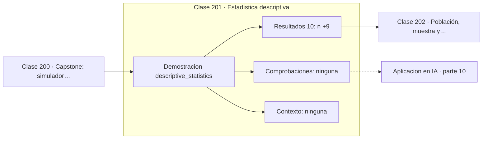

# 201 — Estadística descriptiva

> [⬅️ 200 Capstone: simulador probabilístico y bayesiano](../../part-09-probabilidad-y-procesos-aleatorios/200-capstone-simulador-probabilistico-y-bayesiano/README.md) · [📚 Parte 10](../README.md) · [🏠 Programa](../../../README.md) · [202 Población, muestra y sesgo de selección ➡️](../202-poblacion-muestra-y-sesgo-de-seleccion/README.md)

**Parte:** 10 — Estadística e inferencia · **Nivel:** `universitario-avanzado` · **Horas estimadas:** 4
**Motor:** `engines.part10` · **Demostración:** `descriptive_statistics` · **Clase 1 de 20** de la parte

---

## 🎯 Propósito

**Centro, dispersión y forma responden preguntas distintas y ninguna basta sola.**

Descriptiva, muestreo, estimadores, intervalos de confianza, pruebas de hipótesis, p-value, potencia, verosimilitud, MAP, inferencia bayesiana, bootstrap y A/B testing.

## ✅ Resultados de aprendizaje

Al terminar podrás:

1. Explicar **Estadística descriptiva** con lenguaje cotidiano y con notación matemática.
2. Resolver un caso pequeño a mano y anticipar el orden de magnitud del resultado.
3. Ejecutar y modificar `lab.py`, que corre la demostración `descriptive_statistics`.
4. Interpretar las 10 salidas del laboratorio y decir qué comprueba cada una.
5. Detectar el error típico de esta parte: p-hacking por comparaciones múltiples sin corrección.

## 🧩 Fórmulas de la clase

```text
media = Σxᵢ / n;  mediana = valor central ordenado
IQR = Q3 − Q1;  σ = √(Σ(xᵢ − x̄)²/n)
con cola derecha: media > mediana
```

## 🗺️ Ubicación en el programa



## 📖 Fundamentos

Resumir un conjunto de datos exige responder tres preguntas independientes: dónde está el
centro, cuánto se dispersan los valores y qué forma tiene la distribución. Dar solo la
media es responder una de tres, y muchas veces la menos informativa.

Para el centro hay tres candidatos con propiedades distintas. La **media** usa todos los
valores y por eso un solo dato extremo la arrastra. La **mediana** solo mira la posición
central y es robusta: cambiar el máximo por uno diez veces mayor no la mueve. La **moda**
es la única que sirve para variables categóricas. Que los salarios se reporten por mediana
y no por media no es casualidad.

Para la dispersión, la desviación estándar es la medida clásica y el **rango
intercuartílico** la robusta. El IQR ignora el 25 % de cada cola y es la base del criterio
de valores atípicos por diagrama de caja: fuera de `Q1 − 1,5·IQR` y `Q3 + 1,5·IQR`.

La **forma** es lo que más se olvida. La relación entre media y mediana delata la
asimetría: si la media supera a la mediana, hay cola a la derecha. Y distribuciones
radicalmente distintas pueden compartir media y desviación: el cuarteto de Anscombe y el
Datasaurus son la demostración visual de que resumir sin graficar es peligroso.

## 🧮 Ejemplo trabajado

Veinte mediciones: centro, dispersión y forma.

```text
n = 20

media               = 12,6050
mediana             = 12,6500     media < mediana → ligera cola izquierda
desviación estándar =  0,8630
rango               =  3,2000
Q1                  = 11,9250
Q3                  = 13,2000
IQR                 =  1,2750

Límites de atípicos (criterio 1,5·IQR):
  inferior: 11,925 − 1,9125 = 10,0125
  superior: 13,200 + 1,9125 = 15,1125
  ningún dato queda fuera

Sensibilidad: si el máximo pasara de 14,2 a 30,0
  media   → 13,395   (sube un 6,3 %)
  mediana → 12,650   (no cambia)
```

## 🔬 Qué ejecuta el laboratorio

`descriptive_statistics` — Centro, dispersión y forma: tres preguntas distintas.

| Grupo | Salidas |
|---|---|
| 🔢 Resultados numéricos (10) | `n`, `media`, `mediana`, `desviacion_estandar`, `rango`, `Q1`, `Q3`, `IQR`, `coeficiente_de_variacion_%`, `asimetria_aprox` |
| ✅ Comprobaciones de invariante (0) | — |

Las claves booleanas no son adorno: si alguna fuera `False`, el resultado numérico
no sería fiable aunque el programa terminase sin error.

```bash
python classes/part-10-estadistica-e-inferencia/201-estadistica-descriptiva/lab.py
compmath run 201
```

> [!TIP]
> Antes de ejecutar, **escribe tu predicción**. Un laboratorio que confirma lo que
> esperabas enseña tanto como uno que te contradice, pero solo si la predicción
> existía antes del resultado.

## ⚠️ Errores conceptuales frecuentes

1. Reportar la media de una distribución muy asimétrica sin la mediana.
2. Confundir dispersión con error: son cosas distintas.
3. Resumir sin graficar y perder la forma de los datos.

## 🚀 Dónde se usa de verdad

Exploración inicial de cualquier conjunto de datos, informes de latencia por percentiles,
detección de atípicos y control de calidad.

## 🤖 Conexión con IA

Evaluar un modelo es inferencia estadística: métricas con intervalo, comparaciones múltiples corregidas y detección de leakage.

## 📓 Notebooks

| Archivo | Para qué |
|---|---|
| [`notebook.ipynb`](notebook.ipynb) | recorrido guiado con la demostración ejecutada |
| [`notebook_student.ipynb`](notebook_student.ipynb) | versión con `TODO` para resolver |
| [`notebook_solution.ipynb`](notebook_solution.ipynb) | solución de referencia verificada |

## 📝 Evaluación

| Criterio | Peso |
|---|---:|
| Comprensión conceptual | 25 % |
| Resolución manual | 25 % |
| Implementación y verificación | 25 % |
| Interpretación y comunicación | 15 % |
| Conexión con aplicación real | 10 % |

Detalle y criterios de error crítico en [`assessment.md`](assessment.md).

## ❓ Preguntas de comprobación

1. ¿Cuál es la entrada, cuál la salida y qué unidades tienen?
2. ¿Qué operación domina el comportamiento del resultado?
3. ¿Qué caso extremo revelaría un error conceptual?
4. ¿Cómo verificarías el resultado por un método independiente?
5. ¿Dónde aparece esto en experimentación de producto?

Si necesitas releer el código para responderlas, la clase todavía no está superada.

## 📥 Entregable

`notebook_student.ipynb` resuelto más un párrafo que explique el resultado **sin citar
código**: qué entra, qué sale, qué invariante se comprueba y qué pasaría en un caso límite.

## 🔗 Referencias

- [Wasserman, L. *All of Statistics*, Springer, 2004, cap. 7](https://link.springer.com/book/10.1007/978-0-387-21736-9) — *uso:* desarrollo formal del tema en «Estadística descriptiva».
- [Tukey, J. *Exploratory Data Analysis*, Addison-Wesley, 1977](https://archive.org/details/exploratorydataa0000tuke) — *uso:* obra de referencia consultada en «Estadística descriptiva».

Bibliografía completa de la parte en [`../../../docs/BIBLIOGRAPHY.md`](../../../docs/BIBLIOGRAPHY.md) · localizador verificable de cada obra en [`sources/bibliography.json`](../../../sources/bibliography.json).

## 📂 Material de la clase

[`intuition.md`](intuition.md) · [`theory.md`](theory.md) · [`derivation.md`](derivation.md) · [`exercises.md`](exercises.md) · [`assessment.md`](assessment.md) · [`where-is-this-used.md`](where-is-this-used.md) · [`lesson.yaml`](lesson.yaml)

---

> [⬅️ 200 Capstone: simulador probabilístico y bayesiano](../../part-09-probabilidad-y-procesos-aleatorios/200-capstone-simulador-probabilistico-y-bayesiano/README.md) · [📚 Parte 10](../README.md) · [🏠 Programa](../../../README.md) · [202 Población, muestra y sesgo de selección ➡️](../202-poblacion-muestra-y-sesgo-de-seleccion/README.md)
