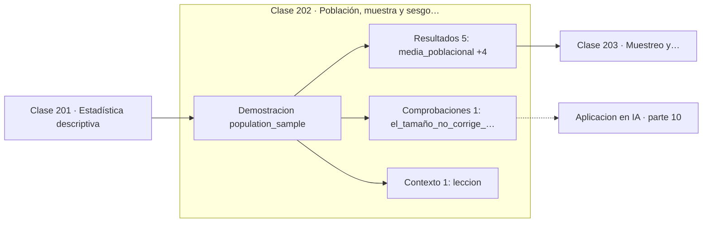

# 202 — Población, muestra y sesgo de selección

> [⬅️ 201 Estadística descriptiva](../201-estadistica-descriptiva/README.md) · [📚 Parte 10](../README.md) · [🏠 Programa](../../../README.md) · [203 Muestreo y distribuciones muestrales ➡️](../203-muestreo-y-distribuciones-muestrales/README.md)

**Parte:** 10 — Estadística e inferencia · **Nivel:** `universitario-avanzado` · **Horas estimadas:** 4
**Motor:** `engines.part10` · **Demostración:** `population_sample` · **Clase 2 de 20** de la parte

---

## 🎯 Propósito

**El sesgo de selección no se corrige con más datos: solo se vuelve más convincente.**

Descriptiva, muestreo, estimadores, intervalos de confianza, pruebas de hipótesis, p-value, potencia, verosimilitud, MAP, inferencia bayesiana, bootstrap y A/B testing.

## ✅ Resultados de aprendizaje

Al terminar podrás:

1. Explicar **Población, muestra y sesgo de selección** con lenguaje cotidiano y con notación matemática.
2. Resolver un caso pequeño a mano y anticipar el orden de magnitud del resultado.
3. Ejecutar y modificar `lab.py`, que corre la demostración `population_sample`.
4. Interpretar las 7 salidas del laboratorio y decir qué comprueba cada una.
5. Detectar el error típico de esta parte: confundir significancia estadística con relevancia práctica.

## 🧩 Fórmulas de la clase

```text
error total = sesgo + error aleatorio
el error aleatorio ~ 1/√n; el sesgo no depende de n
muestra aleatoria simple: toda unidad con igual probabilidad
```

## 🗺️ Ubicación en el programa



## 📖 Fundamentos

Toda inferencia se apoya en un supuesto que rara vez se enuncia: que la muestra representa
a la población. Cuando ese supuesto falla, ninguna técnica posterior lo arregla. La
estadística sofisticada aplicada a una muestra sesgada produce conclusiones sofisticadas y
falsas.

La clave está en distinguir dos fuentes de error. El **error aleatorio** viene de que la
muestra es finita y decae como `1/√n`: más datos lo reducen. El **sesgo** viene de que el
mecanismo de selección favorece a ciertos individuos, y es **constante en n**: más datos
no lo tocan. Peor aún, reducen el error aleatorio y estrechan el intervalo, dando más
confianza a un número equivocado.

Los ejemplos históricos son elocuentes. La encuesta del *Literary Digest* de 1936 recogió
2,4 millones de respuestas y predijo mal las elecciones, porque muestreó de listas de
propietarios de teléfono y automóvil. Gallup acertó con 50 000 respuestas bien muestreadas.
El **sesgo del superviviente** es la variante más traicionera: estudiar solo empresas que
siguen existiendo, aviones que volvieron o usuarios que no abandonaron.

La defensa es de diseño, no de análisis: **aleatorizar la selección**. Cuando no es
posible, hay que declarar el mecanismo de selección y razonar explícitamente sobre a qué
población se puede extrapolar. En aprendizaje automático el mismo problema aparece como
desplazamiento de distribución entre los datos de entrenamiento y los de producción.

## 🧮 Ejemplo trabajado

Misma población, dos mecanismos de muestreo.

```text
población: 10 000 individuos,  media real = 50,02

muestra aleatoria (n = 500)
  media = 49,83        error = 0,20

muestra sesgada (n = 500, favorece valores altos)
  media = 61,36        error = 11,34        57 veces peor

Aumentar el sesgado a n = 5 000:
  error aleatorio ↓        el sesgo se mantiene en ≈ 11
  el intervalo se estrecha alrededor del valor equivocado

Conclusión: 500 datos bien muestreados baten a 5 000 mal muestreados.
```

## 🔬 Qué ejecuta el laboratorio

`population_sample` — Sesgo de selección: la muestra no representa a la población.

| Grupo | Salidas |
|---|---|
| 🔢 Resultados numéricos (5) | `media_poblacional`, `media_muestra_aleatoria`, `error_muestra_aleatoria`, `media_muestra_sesgada`, `error_muestra_sesgada` |
| ✅ Comprobaciones de invariante (1) | `el_tamaño_no_corrige_el_sesgo` |

Las claves booleanas no son adorno: si alguna fuera `False`, el resultado numérico
no sería fiable aunque el programa terminase sin error.

```bash
python classes/part-10-estadistica-e-inferencia/202-poblacion-muestra-y-sesgo-de-seleccion/lab.py
compmath run 202
```

> [!TIP]
> Antes de ejecutar, **escribe tu predicción**. Un laboratorio que confirma lo que
> esperabas enseña tanto como uno que te contradice, pero solo si la predicción
> existía antes del resultado.

## ⚠️ Errores conceptuales frecuentes

1. Creer que un n enorme compensa un muestreo defectuoso.
2. Extrapolar de una muestra de conveniencia a la población general.
3. Analizar solo los casos que sobrevivieron hasta el final del periodo.

## 🚀 Dónde se usa de verdad

Diseño de encuestas, construcción de conjuntos de entrenamiento, auditoría de sesgo en
modelos y detección de desplazamiento de distribución en producción.

## 🤖 Conexión con IA

Evaluar un modelo es inferencia estadística: métricas con intervalo, comparaciones múltiples corregidas y detección de leakage.

## 📓 Notebooks

| Archivo | Para qué |
|---|---|
| [`notebook.ipynb`](notebook.ipynb) | recorrido guiado con la demostración ejecutada |
| [`notebook_student.ipynb`](notebook_student.ipynb) | versión con `TODO` para resolver |
| [`notebook_solution.ipynb`](notebook_solution.ipynb) | solución de referencia verificada |

## 📝 Evaluación

| Criterio | Peso |
|---|---:|
| Comprensión conceptual | 25 % |
| Resolución manual | 25 % |
| Implementación y verificación | 25 % |
| Interpretación y comunicación | 15 % |
| Conexión con aplicación real | 10 % |

Detalle y criterios de error crítico en [`assessment.md`](assessment.md).

## ❓ Preguntas de comprobación

1. ¿Cuál es la entrada, cuál la salida y qué unidades tienen?
2. ¿Qué operación domina el comportamiento del resultado?
3. ¿Qué caso extremo revelaría un error conceptual?
4. ¿Cómo verificarías el resultado por un método independiente?
5. ¿Dónde aparece esto en experimentación de producto?

Si necesitas releer el código para responderlas, la clase todavía no está superada.

## 📥 Entregable

`notebook_student.ipynb` resuelto más un párrafo que explique el resultado **sin citar
código**: qué entra, qué sale, qué invariante se comprueba y qué pasaría en un caso límite.

## 🔗 Referencias

- [Wasserman, L. *All of Statistics*, Springer, 2004, cap. 6](https://link.springer.com/book/10.1007/978-0-387-21736-9) — *uso:* desarrollo formal del tema en «Población, muestra y sesgo de selección».
- [Meng, X.-L. *Statistical paradises and paradoxes in big data*, Annals of Applied Statistics, 2018](https://doi.org/10.1214/18-AOAS1161SF) — *uso:* artículo de origen consultado en «Población, muestra y sesgo de selección».

Bibliografía completa de la parte en [`../../../docs/BIBLIOGRAPHY.md`](../../../docs/BIBLIOGRAPHY.md) · localizador verificable de cada obra en [`sources/bibliography.json`](../../../sources/bibliography.json).

## 📂 Material de la clase

[`intuition.md`](intuition.md) · [`theory.md`](theory.md) · [`derivation.md`](derivation.md) · [`exercises.md`](exercises.md) · [`assessment.md`](assessment.md) · [`where-is-this-used.md`](where-is-this-used.md) · [`lesson.yaml`](lesson.yaml)

---

> [⬅️ 201 Estadística descriptiva](../201-estadistica-descriptiva/README.md) · [📚 Parte 10](../README.md) · [🏠 Programa](../../../README.md) · [203 Muestreo y distribuciones muestrales ➡️](../203-muestreo-y-distribuciones-muestrales/README.md)
