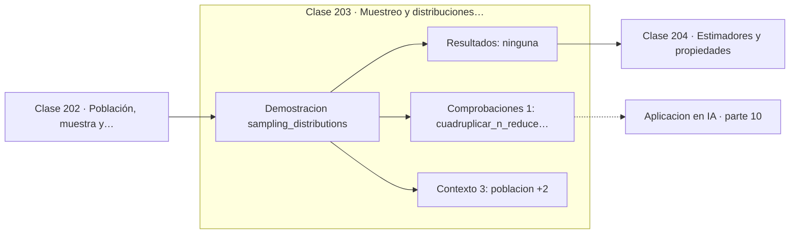

# 203 — Muestreo y distribuciones muestrales

> [⬅️ 202 Población, muestra y sesgo de selección](../202-poblacion-muestra-y-sesgo-de-seleccion/README.md) · [📚 Parte 10](../README.md) · [🏠 Programa](../../../README.md) · [204 Estimadores y propiedades ➡️](../204-estimadores-y-propiedades/README.md)

**Parte:** 10 — Estadística e inferencia · **Nivel:** `universitario-avanzado` · **Horas estimadas:** 4
**Motor:** `engines.part10` · **Demostración:** `sampling_distributions` · **Clase 3 de 20** de la parte

---

## 🎯 Propósito

**El estadístico también tiene distribución, y esa distribución es la que permite inferir.**

Descriptiva, muestreo, estimadores, intervalos de confianza, pruebas de hipótesis, p-value, potencia, verosimilitud, MAP, inferencia bayesiana, bootstrap y A/B testing.

## ✅ Resultados de aprendizaje

Al terminar podrás:

1. Explicar **Muestreo y distribuciones muestrales** con lenguaje cotidiano y con notación matemática.
2. Resolver un caso pequeño a mano y anticipar el orden de magnitud del resultado.
3. Ejecutar y modificar `lab.py`, que corre la demostración `sampling_distributions`.
4. Interpretar las 4 salidas del laboratorio y decir qué comprueba cada una.
5. Detectar el error típico de esta parte: evaluar sobre datos que participaron en la selección del modelo.

## 🧩 Fórmulas de la clase

```text
x̄ ~ Normal(μ, σ²/n)  para n grande
SE = σ/√n
n × 4  ⟹  SE / 2
```

## 🗺️ Ubicación en el programa



## 📖 Fundamentos

La idea que abre la inferencia es un cambio de nivel: si se repitiera el muestreo muchas
veces, cada muestra daría una media distinta, y esas medias tienen su propia distribución.
Esa es la **distribución muestral**, y es el objeto sobre el que se construyen intervalos y
contrastes.

Su desviación estándar recibe el nombre de **error estándar** para distinguirla de la
desviación de los datos. Son cantidades distintas que se confunden constantemente: `σ`
dice cuánto varía una observación individual, `σ/√n` cuánto varía la estimación de la
media. Con `n = 100` difieren por un factor 10.

La forma de esa distribución la garantiza el teorema central del límite de la clase 197:
es aproximadamente normal aunque la población no lo sea. Por eso las mismas fórmulas
funcionan para datos de origen muy variado, y por eso la normal aparece en todas partes en
estadística sin que nadie suponga que los datos son normales.

La raíz cuadrada tiene consecuencias económicas directas. Reducir a la mitad el error
exige **cuadruplicar** el tamaño muestral, y eso normalmente significa cuadruplicar el
coste del experimento. Saber esto antes de diseñar un estudio evita descubrir a mitad de
camino que el presupuesto no alcanza para la precisión prometida.

## 🧮 Ejemplo trabajado

Muestras de una población normal de media 50 y desviación 10.

```text
población: Normal(50, 10)

   n     media de medias   SE observado   SE teórico σ/√n
   5         49,9483          4,4782          4,4721
  20         50,0142          2,2380          2,2361
  80         49,9911          1,1145          1,1180
 320         50,0037          0,5581          0,5590

La media de las medias acierta siempre; lo que cambia es la dispersión.

n de 5 a 20  → ×4  → SE de 4,47 a 2,24  → mitad         ✓
n de 20 a 80 → ×4  → SE de 2,24 a 1,11  → mitad         ✓
```

## 🔬 Qué ejecuta el laboratorio

`sampling_distributions` — La distribución de la media muestral y su error estándar.

| Grupo | Salidas |
|---|---|
| 🔢 Resultados numéricos (0) | — |
| ✅ Comprobaciones de invariante (1) | `cuadruplicar_n_reduce_SE_a_la_mitad` |

Las claves booleanas no son adorno: si alguna fuera `False`, el resultado numérico
no sería fiable aunque el programa terminase sin error.

```bash
python classes/part-10-estadistica-e-inferencia/203-muestreo-y-distribuciones-muestrales/lab.py
compmath run 203
```

> [!TIP]
> Antes de ejecutar, **escribe tu predicción**. Un laboratorio que confirma lo que
> esperabas enseña tanto como uno que te contradice, pero solo si la predicción
> existía antes del resultado.

## ⚠️ Errores conceptuales frecuentes

1. Usar la desviación de los datos donde corresponde el error estándar.
2. Suponer que un n mayor cambia la media esperada del estimador.
3. Ignorar que reducir el error a la mitad cuadruplica el coste.

## 🚀 Dónde se usa de verdad

Dimensionado de experimentos, barras de error en gráficos, comparación de métricas entre
modelos y control de precisión en simulaciones.

## 🤖 Conexión con IA

Evaluar un modelo es inferencia estadística: métricas con intervalo, comparaciones múltiples corregidas y detección de leakage.

## 📓 Notebooks

| Archivo | Para qué |
|---|---|
| [`notebook.ipynb`](notebook.ipynb) | recorrido guiado con la demostración ejecutada |
| [`notebook_student.ipynb`](notebook_student.ipynb) | versión con `TODO` para resolver |
| [`notebook_solution.ipynb`](notebook_solution.ipynb) | solución de referencia verificada |

## 📝 Evaluación

| Criterio | Peso |
|---|---:|
| Comprensión conceptual | 25 % |
| Resolución manual | 25 % |
| Implementación y verificación | 25 % |
| Interpretación y comunicación | 15 % |
| Conexión con aplicación real | 10 % |

Detalle y criterios de error crítico en [`assessment.md`](assessment.md).

## ❓ Preguntas de comprobación

1. ¿Cuál es la entrada, cuál la salida y qué unidades tienen?
2. ¿Qué operación domina el comportamiento del resultado?
3. ¿Qué caso extremo revelaría un error conceptual?
4. ¿Cómo verificarías el resultado por un método independiente?
5. ¿Dónde aparece esto en experimentación de producto?

Si necesitas releer el código para responderlas, la clase todavía no está superada.

## 📥 Entregable

`notebook_student.ipynb` resuelto más un párrafo que explique el resultado **sin citar
código**: qué entra, qué sale, qué invariante se comprueba y qué pasaría en un caso límite.

## 🔗 Referencias

- [Wasserman, L. *All of Statistics*, Springer, 2004, cap. 5](https://link.springer.com/book/10.1007/978-0-387-21736-9) — *uso:* desarrollo formal del tema en «Muestreo y distribuciones muestrales».
- [Blitzstein, J.; Hwang, J. *Introduction to Probability*, 2ª ed., CRC, 2019, cap. 10](https://projects.iq.harvard.edu/stat110/home) — *uso:* exposición alternativa del tema en «Muestreo y distribuciones muestrales».

Bibliografía completa de la parte en [`../../../docs/BIBLIOGRAPHY.md`](../../../docs/BIBLIOGRAPHY.md) · localizador verificable de cada obra en [`sources/bibliography.json`](../../../sources/bibliography.json).

## 📂 Material de la clase

[`intuition.md`](intuition.md) · [`theory.md`](theory.md) · [`derivation.md`](derivation.md) · [`exercises.md`](exercises.md) · [`assessment.md`](assessment.md) · [`where-is-this-used.md`](where-is-this-used.md) · [`lesson.yaml`](lesson.yaml)

---

> [⬅️ 202 Población, muestra y sesgo de selección](../202-poblacion-muestra-y-sesgo-de-seleccion/README.md) · [📚 Parte 10](../README.md) · [🏠 Programa](../../../README.md) · [204 Estimadores y propiedades ➡️](../204-estimadores-y-propiedades/README.md)
