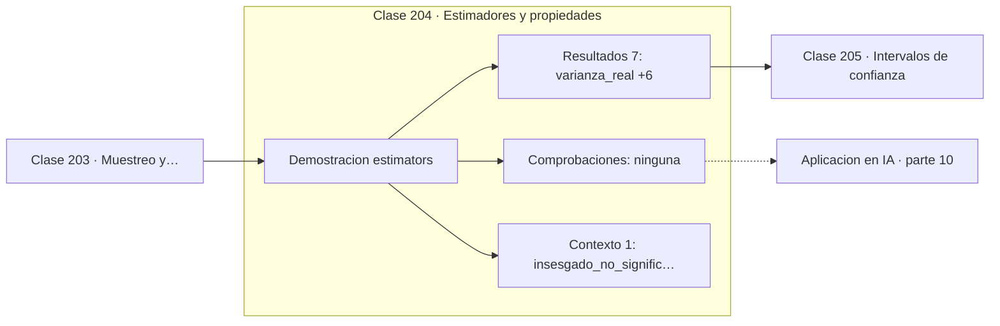

# 204 — Estimadores y propiedades

> [⬅️ 203 Muestreo y distribuciones muestrales](../203-muestreo-y-distribuciones-muestrales/README.md) · [📚 Parte 10](../README.md) · [🏠 Programa](../../../README.md) · [205 Intervalos de confianza ➡️](../205-intervalos-de-confianza/README.md)

**Parte:** 10 — Estadística e inferencia · **Nivel:** `universitario-avanzado` · **Horas estimadas:** 4
**Motor:** `engines.part10` · **Demostración:** `estimators` · **Clase 4 de 20** de la parte

---

## 🎯 Propósito

**Insesgado no significa bueno: hay que mirar también la varianza.**

Descriptiva, muestreo, estimadores, intervalos de confianza, pruebas de hipótesis, p-value, potencia, verosimilitud, MAP, inferencia bayesiana, bootstrap y A/B testing.

## ✅ Resultados de aprendizaje

Al terminar podrás:

1. Explicar **Estimadores y propiedades** con lenguaje cotidiano y con notación matemática.
2. Resolver un caso pequeño a mano y anticipar el orden de magnitud del resultado.
3. Ejecutar y modificar `lab.py`, que corre la demostración `estimators`.
4. Interpretar las 8 salidas del laboratorio y decir qué comprueba cada una.
5. Detectar el error típico de esta parte: p-hacking por comparaciones múltiples sin corrección.

## 🧩 Fórmulas de la clase

```text
sesgo(θ̂) = E[θ̂] − θ
ECM = sesgo² + varianza
consistencia: θ̂ₙ → θ cuando n → ∞
```

## 🗺️ Ubicación en el programa



## 📖 Fundamentos

Un **estimador** es una receta para calcular un parámetro desconocido a partir de la
muestra. Como depende de datos aleatorios, es él mismo una variable aleatoria, y se juzga
por las propiedades de su distribución: sesgo, varianza y comportamiento asintótico.

El **sesgo** mide si el estimador acierta en promedio. Dividir entre `n` al calcular la
varianza muestral produce un estimador sesgado a la baja, porque las desviaciones se miden
respecto de una media ajustada a los propios datos; dividir entre `n−1` corrige ese sesgo.
Es la corrección de Bessel de la clase 190, vista ahora desde la teoría de estimación.

Pero insesgado no equivale a bueno. El **error cuadrático medio** se descompone en
`sesgo² + varianza`, y hay estimadores sesgados con ECM mucho menor que el insesgado. Toda
la regularización en aprendizaje automático se apoya en ese intercambio: introducir sesgo
a cambio de reducir varianza. Es la misma descomposición sesgo-varianza que reaparecerá en
la parte 14.

La **consistencia** es la garantía mínima que se le pide a un estimador: converger al
parámetro cuando los datos crecen. Es una propiedad asintótica y no dice nada sobre el
comportamiento con la muestra que realmente se tiene, que suele ser pequeña y es donde el
sesgo y la varianza deciden.

## 🧮 Ejemplo trabajado

Dos estimadores de la varianza con muestras de tamaño 8.

```text
varianza real = 25,0        n = 8      10 000 réplicas

estimador dividiendo entre n:
  E[σ̂²] = 21,7438        sesgo = −3,2562    (−13 %)

estimador dividiendo entre n−1:
  E[s²]  = 24,8501        sesgo = −0,1499    (−0,6 %)

Factor de corrección teórico: (n−1)/n = 7/8 = 0,875
  21,7438 / 0,875 = 24,85                              ✓

Con n = 100 el sesgo del primero baja al 1 %: ambos son
consistentes, pero solo el segundo es insesgado.
```

## 🔬 Qué ejecuta el laboratorio

`estimators` — Sesgo, varianza y consistencia de dos estimadores de la varianza.

| Grupo | Salidas |
|---|---|
| 🔢 Resultados numéricos (7) | `varianza_real`, `tamaño_muestral`, `E[estimador_/n]`, `sesgo_/n`, `E[estimador_/(n-1)]`, `sesgo_/(n-1)`, `factor_teorico_(n-1)/n` |
| ✅ Comprobaciones de invariante (0) | — |

Las claves booleanas no son adorno: si alguna fuera `False`, el resultado numérico
no sería fiable aunque el programa terminase sin error.

```bash
python classes/part-10-estadistica-e-inferencia/204-estimadores-y-propiedades/lab.py
compmath run 204
```

> [!TIP]
> Antes de ejecutar, **escribe tu predicción**. Un laboratorio que confirma lo que
> esperabas enseña tanto como uno que te contradice, pero solo si la predicción
> existía antes del resultado.

## ⚠️ Errores conceptuales frecuentes

1. Elegir un estimador solo por ser insesgado, sin mirar su varianza.
2. Confiar en garantías asintóticas con muestras pequeñas.
3. Confundir el estimador, que es aleatorio, con la estimación concreta obtenida.

## 🚀 Dónde se usa de verdad

Regularización como sesgo deliberado, estimación de varianza en normalización, evaluación
de estimadores de gradiente y elección entre modelos simples y complejos.

## 🤖 Conexión con IA

Evaluar un modelo es inferencia estadística: métricas con intervalo, comparaciones múltiples corregidas y detección de leakage.

## 📓 Notebooks

| Archivo | Para qué |
|---|---|
| [`notebook.ipynb`](notebook.ipynb) | recorrido guiado con la demostración ejecutada |
| [`notebook_student.ipynb`](notebook_student.ipynb) | versión con `TODO` para resolver |
| [`notebook_solution.ipynb`](notebook_solution.ipynb) | solución de referencia verificada |

## 📝 Evaluación

| Criterio | Peso |
|---|---:|
| Comprensión conceptual | 25 % |
| Resolución manual | 25 % |
| Implementación y verificación | 25 % |
| Interpretación y comunicación | 15 % |
| Conexión con aplicación real | 10 % |

Detalle y criterios de error crítico en [`assessment.md`](assessment.md).

## ❓ Preguntas de comprobación

1. ¿Cuál es la entrada, cuál la salida y qué unidades tienen?
2. ¿Qué operación domina el comportamiento del resultado?
3. ¿Qué caso extremo revelaría un error conceptual?
4. ¿Cómo verificarías el resultado por un método independiente?
5. ¿Dónde aparece esto en experimentación de producto?

Si necesitas releer el código para responderlas, la clase todavía no está superada.

## 📥 Entregable

`notebook_student.ipynb` resuelto más un párrafo que explique el resultado **sin citar
código**: qué entra, qué sale, qué invariante se comprueba y qué pasaría en un caso límite.

## 📚 Bibliografía de la clase

Esta clase enseña **Estadística e inferencia · Metodología experimental · Inferencia bayesiana**. Cada obra dice qué aporta aquí y cómo se comprobó su localizador:

- [Wasserman, L. *All of Statistics*, Springer, 2004, cap. 6](https://link.springer.com/book/10.1007/978-0-387-21736-9) — Estadística e inferencia: el tema de esta clase · ISBN-13 `9780387217369` verificado en International ISBN Agency (2026-08-19).
- [Casella, G.; Berger, R. *Statistical Inference*, 2ª ed., Duxbury, 2002](https://openlibrary.org/isbn/9780534243128) — Estadística e inferencia: el tema de esta clase · ISBN-13 `9780534243128` verificado en International ISBN Agency (2026-08-20).

Bibliografía de todas las clases, con el porqué de cada obra, en [`docs/BIBLIOGRAPHY.md`](../../../docs/BIBLIOGRAPHY.md) · localizador y estado de cada obra en [`sources/bibliography.json`](../../../sources/bibliography.json).

## 📂 Material de la clase

[`intuition.md`](intuition.md) · [`theory.md`](theory.md) · [`derivation.md`](derivation.md) · [`exercises.md`](exercises.md) · [`assessment.md`](assessment.md) · [`where-is-this-used.md`](where-is-this-used.md) · [`lesson.yaml`](lesson.yaml)

---

> [⬅️ 203 Muestreo y distribuciones muestrales](../203-muestreo-y-distribuciones-muestrales/README.md) · [📚 Parte 10](../README.md) · [🏠 Programa](../../../README.md) · [205 Intervalos de confianza ➡️](../205-intervalos-de-confianza/README.md)
