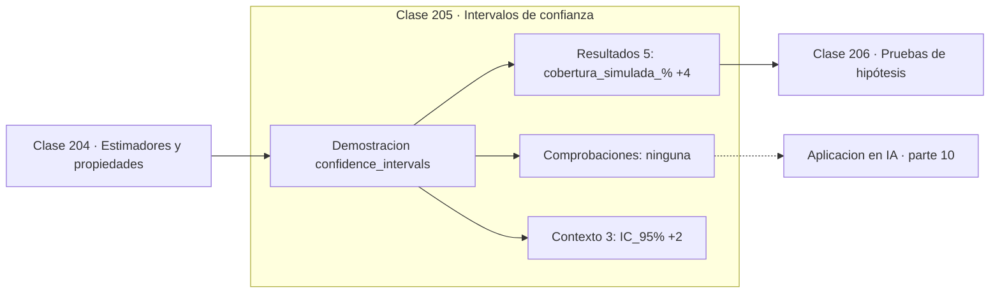

# 205 — Intervalos de confianza

> [⬅️ 204 Estimadores y propiedades](../204-estimadores-y-propiedades/README.md) · [📚 Parte 10](../README.md) · [🏠 Programa](../../../README.md) · [206 Pruebas de hipótesis ➡️](../206-pruebas-de-hipotesis/README.md)

**Parte:** 10 — Estadística e inferencia · **Nivel:** `universitario-avanzado` · **Horas estimadas:** 4
**Motor:** `engines.part10` · **Demostración:** `confidence_intervals` · **Clase 5 de 20** de la parte

---

## 🎯 Propósito

**El 95 % de un intervalo de confianza es una propiedad del procedimiento, no del parámetro.**

Descriptiva, muestreo, estimadores, intervalos de confianza, pruebas de hipótesis, p-value, potencia, verosimilitud, MAP, inferencia bayesiana, bootstrap y A/B testing.

## ✅ Resultados de aprendizaje

Al terminar podrás:

1. Explicar **Intervalos de confianza** con lenguaje cotidiano y con notación matemática.
2. Resolver un caso pequeño a mano y anticipar el orden de magnitud del resultado.
3. Ejecutar y modificar `lab.py`, que corre la demostración `confidence_intervals`.
4. Interpretar las 8 salidas del laboratorio y decir qué comprueba cada una.
5. Detectar el error típico de esta parte: confundir significancia estadística con relevancia práctica.

## 🧩 Fórmulas de la clase

```text
IC 95 % ≈ x̄ ± 1,96·(s/√n)
cobertura: proporción de intervalos que contienen θ al repetir el estudio
amplitud ∝ 1/√n
```

## 🗺️ Ubicación en el programa



## 📖 Fundamentos

La frase «hay un 95 % de probabilidad de que el parámetro esté en el intervalo» es
incorrecta en el marco frecuentista, y es probablemente la frase mal dicha con más
frecuencia en toda la ciencia aplicada. El parámetro es un número fijo: o está en el
intervalo o no está, y no hay probabilidad en ello.

Lo que es aleatorio es el **intervalo**, porque se calcula a partir de datos aleatorios. La
afirmación correcta es sobre el procedimiento: si se repitiera el estudio muchas veces,
alrededor del 95 % de los intervalos construidos así contendrían el parámetro. El 95 % es
una tasa de acierto a largo plazo del método, no una creencia sobre este caso concreto.

La distinción no es pedantería. Cambia lo que se puede concluir, y explica por qué existe
el **intervalo creíble** bayesiano de la clase 217, que sí admite la lectura
probabilística directa porque parte de tratar el parámetro como variable aleatoria. Ambos
son legítimos; lo ilegítimo es dar la interpretación de uno al otro.

La cobertura real puede quedarse por debajo de la nominal cuando los supuestos fallan:
muestras pequeñas, poblaciones muy asimétricas o uso de la normal donde correspondía la t.
Un intervalo del 95 % que en simulación cubre el 93 % está informando de que el modelo es
aproximado, y conviene reportarlo en vez de esconderlo.

## 🧮 Ejemplo trabajado

Cobertura simulada de intervalos al 95 %.

```text
3 000 réplicas del estudio completo

  intervalos que contienen el parámetro: 2 791
  cobertura observada: 93,03 %
  cobertura nominal:   95,00 %

Un intervalo concreto (n = 20):
  media  = 12,6050
  SE     =  0,1930
  IC 95% = (12,2268 , 12,9832)      amplitud 0,7564

Lectura correcta:
  "el procedimiento acierta el 95 % de las veces"
Lectura incorrecta:
  "hay un 95 % de probabilidad de que μ esté aquí"

Con n = 80 la amplitud bajaría a la mitad: 0,378.
```

## 🔬 Qué ejecuta el laboratorio

`confidence_intervals` — Un IC 95 % describe el procedimiento, no una probabilidad del parámetro.

| Grupo | Salidas |
|---|---|
| 🔢 Resultados numéricos (5) | `cobertura_simulada_%`, `cobertura_nominal_%`, `replicas`, `muestra_de_ejemplo_media`, `amplitud` |
| ✅ Comprobaciones de invariante (0) | — |

Las claves booleanas no son adorno: si alguna fuera `False`, el resultado numérico
no sería fiable aunque el programa terminase sin error.

```bash
python classes/part-10-estadistica-e-inferencia/205-intervalos-de-confianza/lab.py
compmath run 205
```

> [!TIP]
> Antes de ejecutar, **escribe tu predicción**. Un laboratorio que confirma lo que
> esperabas enseña tanto como uno que te contradice, pero solo si la predicción
> existía antes del resultado.

## ⚠️ Errores conceptuales frecuentes

1. Leer el 95 % como probabilidad sobre el parámetro.
2. Concluir que no hay efecto porque el intervalo contiene el cero.
3. Ignorar que la cobertura real depende de que se cumplan los supuestos.

## 🚀 Dónde se usa de verdad

Reporte de métricas de modelos, comparación de tratamientos, estimación de tasas de
conversión y cualquier resultado que deba comunicarse con incertidumbre.

## 🤖 Conexión con IA

Evaluar un modelo es inferencia estadística: métricas con intervalo, comparaciones múltiples corregidas y detección de leakage.

## 📓 Notebooks

| Archivo | Para qué |
|---|---|
| [`notebook.ipynb`](notebook.ipynb) | recorrido guiado con la demostración ejecutada |
| [`notebook_student.ipynb`](notebook_student.ipynb) | versión con `TODO` para resolver |
| [`notebook_solution.ipynb`](notebook_solution.ipynb) | solución de referencia verificada |

## 📝 Evaluación

| Criterio | Peso |
|---|---:|
| Comprensión conceptual | 25 % |
| Resolución manual | 25 % |
| Implementación y verificación | 25 % |
| Interpretación y comunicación | 15 % |
| Conexión con aplicación real | 10 % |

Detalle y criterios de error crítico en [`assessment.md`](assessment.md).

## ❓ Preguntas de comprobación

1. ¿Cuál es la entrada, cuál la salida y qué unidades tienen?
2. ¿Qué operación domina el comportamiento del resultado?
3. ¿Qué caso extremo revelaría un error conceptual?
4. ¿Cómo verificarías el resultado por un método independiente?
5. ¿Dónde aparece esto en experimentación de producto?

Si necesitas releer el código para responderlas, la clase todavía no está superada.

## 📥 Entregable

`notebook_student.ipynb` resuelto más un párrafo que explique el resultado **sin citar
código**: qué entra, qué sale, qué invariante se comprueba y qué pasaría en un caso límite.

## 📚 Bibliografía de la clase

Esta clase enseña **Estadística e inferencia · Metodología experimental · Inferencia bayesiana**. Cada obra dice qué aporta aquí y cómo se comprobó su localizador:

- [Wasserman, L. *All of Statistics*, Springer, 2004, cap. 6](https://link.springer.com/book/10.1007/978-0-387-21736-9) — Estadística e inferencia: el tema de esta clase · ISBN-13 `9780387217369` verificado en International ISBN Agency (2026-08-19).
- [Morey, R. et al. *The fallacy of placing confidence in confidence intervals*, Psychonomic Bulletin, 2016](https://doi.org/10.3758/s13423-015-0947-8) — Estadística e inferencia y Metodología experimental: el tema de esta clase · DOI `10.3758/s13423-015-0947-8` verificado en Crossref (2026-08-19).

Bibliografía de todas las clases, con el porqué de cada obra, en [`docs/BIBLIOGRAPHY.md`](../../../docs/BIBLIOGRAPHY.md) · localizador y estado de cada obra en [`sources/bibliography.json`](../../../sources/bibliography.json).

## 📂 Material de la clase

[`intuition.md`](intuition.md) · [`theory.md`](theory.md) · [`derivation.md`](derivation.md) · [`exercises.md`](exercises.md) · [`assessment.md`](assessment.md) · [`where-is-this-used.md`](where-is-this-used.md) · [`lesson.yaml`](lesson.yaml)

---

> [⬅️ 204 Estimadores y propiedades](../204-estimadores-y-propiedades/README.md) · [📚 Parte 10](../README.md) · [🏠 Programa](../../../README.md) · [206 Pruebas de hipótesis ➡️](../206-pruebas-de-hipotesis/README.md)
