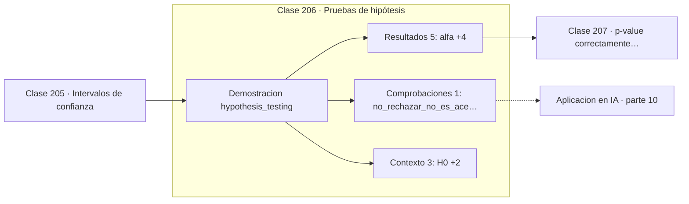

# 206 — Pruebas de hipótesis

> [⬅️ 205 Intervalos de confianza](../205-intervalos-de-confianza/README.md) · [📚 Parte 10](../README.md) · [🏠 Programa](../../../README.md) · [207 p-value correctamente interpretado ➡️](../207-p-value-correctamente-interpretado/README.md)

**Parte:** 10 — Estadística e inferencia · **Nivel:** `universitario-avanzado` · **Horas estimadas:** 4
**Motor:** `engines.part10` · **Demostración:** `hypothesis_testing` · **Clase 6 de 20** de la parte

---

## 🎯 Propósito

**Una prueba de hipótesis nunca acepta la nula: solo la rechaza o se queda sin evidencia.**

Descriptiva, muestreo, estimadores, intervalos de confianza, pruebas de hipótesis, p-value, potencia, verosimilitud, MAP, inferencia bayesiana, bootstrap y A/B testing.

## ✅ Resultados de aprendizaje

Al terminar podrás:

1. Explicar **Pruebas de hipótesis** con lenguaje cotidiano y con notación matemática.
2. Resolver un caso pequeño a mano y anticipar el orden de magnitud del resultado.
3. Ejecutar y modificar `lab.py`, que corre la demostración `hypothesis_testing`.
4. Interpretar las 9 salidas del laboratorio y decir qué comprueba cada una.
5. Detectar el error típico de esta parte: evaluar sobre datos que participaron en la selección del modelo.

## 🧩 Fórmulas de la clase

```text
H0: μ = μ₀   frente a   H1: μ ≠ μ₀
z = (x̄ − μ₀) / (s/√n)
rechazar si |z| > z_{α/2}  ó  p < α
```

## 🗺️ Ubicación en el programa



## 📖 Fundamentos

Una prueba de hipótesis es un procedimiento de decisión con una estructura fija que
conviene ejecutar siempre en el mismo orden: enunciar H0 y H1, fijar `α`, elegir el
estadístico, calcular su valor y su p-value, y decidir. Fijar `α` **antes** de ver los
datos no es un formalismo: es lo único que impide ajustar el umbral al resultado.

La lógica es la de la reducción al absurdo probabilística. Se supone H0 cierta, se calcula
cuán raros serían los datos observados bajo ese supuesto, y si son suficientemente raros
se rechaza H0. Lo que no se puede hacer es el paso simétrico: no rechazar **no** demuestra
que H0 sea cierta, igual que no encontrar pruebas no demuestra inocencia.

Por eso el vocabulario correcto es «no se rechaza H0», nunca «se acepta H0». Un resultado
no significativo es compatible con dos escenarios muy distintos: que no haya efecto, o que
el estudio no tuviera potencia para detectarlo. Distinguirlos exige la clase 209.

La decisión también depende de si el contraste es de **una o dos colas**. La versión de dos
colas contrasta «distinto de», la de una cola «mayor que» y reparte todo `α` en un lado.
Cambiar a una cola después de ver la dirección del efecto duplica de hecho la tasa de
falsos positivos, y es una de las formas más comunes de p-hacking.

## 🧮 Ejemplo trabajado

Contraste bilateral sobre una media con n = 20.

```text
H0: μ = 12,0        H1: μ ≠ 12,0        α = 0,05

media muestral  = 12,6050
error estándar  =  0,1930
z = (12,6050 − 12,0) / 0,1930 = 3,1353

valor crítico bilateral: ±1,96
|3,1353| > 1,96   →  se rechaza H0

p-value = 2·P(Z > 3,1353) = 0,00172

Redacción correcta:
  "se rechaza H0 al 5 %; la media difiere de 12,0"
Redacción incorrecta:
  "queda demostrado que μ = 12,605"
```

## 🔬 Qué ejecuta el laboratorio

`hypothesis_testing` — Estructura completa de una prueba de hipótesis.

| Grupo | Salidas |
|---|---|
| 🔢 Resultados numéricos (5) | `alfa`, `media_muestral`, `error_estandar`, `estadistico_z`, `p_value` |
| ✅ Comprobaciones de invariante (1) | `no_rechazar_no_es_aceptar` |

Las claves booleanas no son adorno: si alguna fuera `False`, el resultado numérico
no sería fiable aunque el programa terminase sin error.

```bash
python classes/part-10-estadistica-e-inferencia/206-pruebas-de-hipotesis/lab.py
compmath run 206
```

> [!TIP]
> Antes de ejecutar, **escribe tu predicción**. Un laboratorio que confirma lo que
> esperabas enseña tanto como uno que te contradice, pero solo si la predicción
> existía antes del resultado.

## ⚠️ Errores conceptuales frecuentes

1. Escribir «se acepta H0» ante un resultado no significativo.
2. Elegir α después de ver el p-value.
3. Pasar a una cola tras conocer la dirección del efecto.

## 🚀 Dónde se usa de verdad

Comparación de modelos, validación de cambios en producción, control de calidad y ensayos
clínicos.

## 🤖 Conexión con IA

Evaluar un modelo es inferencia estadística: métricas con intervalo, comparaciones múltiples corregidas y detección de leakage.

## 📓 Notebooks

| Archivo | Para qué |
|---|---|
| [`notebook.ipynb`](notebook.ipynb) | recorrido guiado con la demostración ejecutada |
| [`notebook_student.ipynb`](notebook_student.ipynb) | versión con `TODO` para resolver |
| [`notebook_solution.ipynb`](notebook_solution.ipynb) | solución de referencia verificada |

## 📝 Evaluación

| Criterio | Peso |
|---|---:|
| Comprensión conceptual | 25 % |
| Resolución manual | 25 % |
| Implementación y verificación | 25 % |
| Interpretación y comunicación | 15 % |
| Conexión con aplicación real | 10 % |

Detalle y criterios de error crítico en [`assessment.md`](assessment.md).

## ❓ Preguntas de comprobación

1. ¿Cuál es la entrada, cuál la salida y qué unidades tienen?
2. ¿Qué operación domina el comportamiento del resultado?
3. ¿Qué caso extremo revelaría un error conceptual?
4. ¿Cómo verificarías el resultado por un método independiente?
5. ¿Dónde aparece esto en experimentación de producto?

Si necesitas releer el código para responderlas, la clase todavía no está superada.

## 📥 Entregable

`notebook_student.ipynb` resuelto más un párrafo que explique el resultado **sin citar
código**: qué entra, qué sale, qué invariante se comprueba y qué pasaría en un caso límite.

## 🔗 Referencias

- [Wasserman, L. *All of Statistics*, Springer, 2004, cap. 10](https://link.springer.com/book/10.1007/978-0-387-21736-9) — *uso:* desarrollo formal del tema en «Pruebas de hipótesis».
- [Casella, G.; Berger, R. *Statistical Inference*, 2ª ed., Duxbury, 2002, cap. 8](https://www.cengage.com/) — *uso:* obra de referencia consultada en «Pruebas de hipótesis».

Bibliografía completa de la parte en [`../../../docs/BIBLIOGRAPHY.md`](../../../docs/BIBLIOGRAPHY.md) · localizador verificable de cada obra en [`sources/bibliography.json`](../../../sources/bibliography.json).

## 📂 Material de la clase

[`intuition.md`](intuition.md) · [`theory.md`](theory.md) · [`derivation.md`](derivation.md) · [`exercises.md`](exercises.md) · [`assessment.md`](assessment.md) · [`where-is-this-used.md`](where-is-this-used.md) · [`lesson.yaml`](lesson.yaml)

---

> [⬅️ 205 Intervalos de confianza](../205-intervalos-de-confianza/README.md) · [📚 Parte 10](../README.md) · [🏠 Programa](../../../README.md) · [207 p-value correctamente interpretado ➡️](../207-p-value-correctamente-interpretado/README.md)
