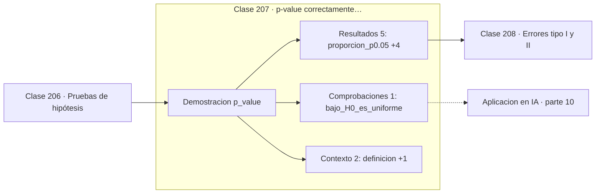

# 207 — p-value correctamente interpretado

> [⬅️ 206 Pruebas de hipótesis](../206-pruebas-de-hipotesis/README.md) · [📚 Parte 10](../README.md) · [🏠 Programa](../../../README.md) · [208 Errores tipo I y II ➡️](../208-errores-tipo-i-y-ii/README.md)

**Parte:** 10 — Estadística e inferencia · **Nivel:** `universitario-avanzado` · **Horas estimadas:** 4
**Motor:** `engines.part10` · **Demostración:** `p_value` · **Clase 7 de 20** de la parte

---

## 🎯 Propósito

**El p-value mide la rareza de los datos bajo H0, no la probabilidad de que H0 sea cierta.**

Descriptiva, muestreo, estimadores, intervalos de confianza, pruebas de hipótesis, p-value, potencia, verosimilitud, MAP, inferencia bayesiana, bootstrap y A/B testing.

## ✅ Resultados de aprendizaje

Al terminar podrás:

1. Explicar **p-value correctamente interpretado** con lenguaje cotidiano y con notación matemática.
2. Resolver un caso pequeño a mano y anticipar el orden de magnitud del resultado.
3. Ejecutar y modificar `lab.py`, que corre la demostración `p_value`.
4. Interpretar las 8 salidas del laboratorio y decir qué comprueba cada una.
5. Detectar el error típico de esta parte: p-hacking por comparaciones múltiples sin corrección.

## 🧩 Fórmulas de la clase

```text
p = P(estadístico tan o más extremo | H0 cierta)
p ≠ P(H0 | datos)
bajo H0, el p-value se distribuye Uniforme(0,1)
```

## 🗺️ Ubicación en el programa



## 📖 Fundamentos

El p-value responde a una pregunta muy concreta: **si la hipótesis nula fuera cierta**,
¿con qué frecuencia se verían datos al menos tan extremos como los observados? Es una
probabilidad condicionada a H0, no una probabilidad **de** H0. Esa inversión ilegítima es
la misma falacia del fiscal de la clase 186, aplicada a la práctica científica.

Hay un hecho que aclara todo lo demás: **bajo H0, el p-value es uniforme en el intervalo
unitario**. Cualquier valor es igual de probable. Por eso rechazar con `p < 0,05` produce
exactamente un 5 % de falsos positivos cuando no hay ningún efecto; el umbral no es
mágico, es simplemente la fracción de la uniforme que se decide sacrificar.

De la uniformidad se deduce el mecanismo del **p-hacking**. Si se prueban 20 análisis
distintos sobre datos sin efecto, la probabilidad de que alguno baje de 0,05 es
`1 − 0,95²⁰ ≈ 64 %`. Probar variantes, subgrupos, transformaciones o momentos de parada
hasta obtener significancia no es análisis exploratorio: es fabricar resultados. La defensa
es preinscribir el análisis y corregir por comparaciones múltiples.

Y hay una última confusión, independiente de las anteriores: **significancia no es
relevancia**. Con n suficientemente grande, cualquier diferencia por minúscula que sea
resulta significativa. Un p-value pequeño dice que el efecto probablemente no es cero; no
dice que importe. Por eso hay que reportar siempre el tamaño del efecto y su intervalo.

## 🧮 Ejemplo trabajado

Distribución del p-value cuando no hay efecto alguno.

```text
100 000 experimentos simulados con H0 cierta

  media de los p-values          = 0,49789    ≈ 0,5 (uniforme)
  proporción con p < 0,05        = 0,05750    ≈ 5 %
  proporción con p < 0,01        = 0,01417    ≈ 1 %

El 5 % de los estudios "encuentra" un efecto inexistente.

Comparaciones múltiples sin corrección:
  k = 1    P(algún falso positivo) = 5 %
  k = 5                            = 23 %
  k = 20                           = 64 %
  k = 100                          = 99,4 %

Corrección de Bonferroni: usar α/k en cada contraste.
```

## 🔬 Qué ejecuta el laboratorio

`p_value` — Qué mide y qué no mide un p-value.

| Grupo | Salidas |
|---|---|
| 🔢 Resultados numéricos (5) | `proporcion_p<0.05`, `proporcion_p<0.01`, `media_de_los_p`, `riesgo_de_20_pruebas`, `correccion_de_Bonferroni_alfa` |
| ✅ Comprobaciones de invariante (1) | `bajo_H0_es_uniforme` |

Las claves booleanas no son adorno: si alguna fuera `False`, el resultado numérico
no sería fiable aunque el programa terminase sin error.

```bash
python classes/part-10-estadistica-e-inferencia/207-p-value-correctamente-interpretado/lab.py
compmath run 207
```

> [!TIP]
> Antes de ejecutar, **escribe tu predicción**. Un laboratorio que confirma lo que
> esperabas enseña tanto como uno que te contradice, pero solo si la predicción
> existía antes del resultado.

## ⚠️ Errores conceptuales frecuentes

1. Leer p = 0,03 como «hay un 3 % de probabilidad de que H0 sea cierta».
2. Probar múltiples análisis y reportar solo el significativo.
3. Confundir significancia estadística con importancia práctica.

## 🚀 Dónde se usa de verdad

Interpretación de literatura científica, evaluación de experimentos A/B, comparación de
modelos y auditoría de resultados publicados.

## 🤖 Conexión con IA

Evaluar un modelo es inferencia estadística: métricas con intervalo, comparaciones múltiples corregidas y detección de leakage.

## 📓 Notebooks

| Archivo | Para qué |
|---|---|
| [`notebook.ipynb`](notebook.ipynb) | recorrido guiado con la demostración ejecutada |
| [`notebook_student.ipynb`](notebook_student.ipynb) | versión con `TODO` para resolver |
| [`notebook_solution.ipynb`](notebook_solution.ipynb) | solución de referencia verificada |

## 📝 Evaluación

| Criterio | Peso |
|---|---:|
| Comprensión conceptual | 25 % |
| Resolución manual | 25 % |
| Implementación y verificación | 25 % |
| Interpretación y comunicación | 15 % |
| Conexión con aplicación real | 10 % |

Detalle y criterios de error crítico en [`assessment.md`](assessment.md).

## ❓ Preguntas de comprobación

1. ¿Cuál es la entrada, cuál la salida y qué unidades tienen?
2. ¿Qué operación domina el comportamiento del resultado?
3. ¿Qué caso extremo revelaría un error conceptual?
4. ¿Cómo verificarías el resultado por un método independiente?
5. ¿Dónde aparece esto en experimentación de producto?

Si necesitas releer el código para responderlas, la clase todavía no está superada.

## 📥 Entregable

`notebook_student.ipynb` resuelto más un párrafo que explique el resultado **sin citar
código**: qué entra, qué sale, qué invariante se comprueba y qué pasaría en un caso límite.

## 🔗 Referencias

- [Wasserman, L. *All of Statistics*, Springer, 2004, cap. 10](https://link.springer.com/book/10.1007/978-0-387-21736-9) — *uso:* desarrollo formal del tema en «p-value correctamente interpretado».
- [Wasserstein, R.; Lazar, N. *The ASA statement on p-values*, The American Statistician, 2016](https://doi.org/10.1080/00031305.2016.1154108) — *uso:* artículo de origen consultado en «p-value correctamente interpretado».

Bibliografía completa de la parte en [`../../../docs/BIBLIOGRAPHY.md`](../../../docs/BIBLIOGRAPHY.md) · localizador verificable de cada obra en [`sources/bibliography.json`](../../../sources/bibliography.json).

## 📂 Material de la clase

[`intuition.md`](intuition.md) · [`theory.md`](theory.md) · [`derivation.md`](derivation.md) · [`exercises.md`](exercises.md) · [`assessment.md`](assessment.md) · [`where-is-this-used.md`](where-is-this-used.md) · [`lesson.yaml`](lesson.yaml)

---

> [⬅️ 206 Pruebas de hipótesis](../206-pruebas-de-hipotesis/README.md) · [📚 Parte 10](../README.md) · [🏠 Programa](../../../README.md) · [208 Errores tipo I y II ➡️](../208-errores-tipo-i-y-ii/README.md)
