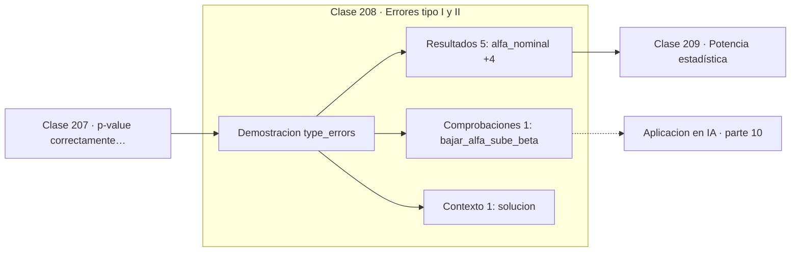

# 208 — Errores tipo I y II

> [⬅️ 207 p-value correctamente interpretado](../207-p-value-correctamente-interpretado/README.md) · [📚 Parte 10](../README.md) · [🏠 Programa](../../../README.md) · [209 Potencia estadística ➡️](../209-potencia-estadistica/README.md)

**Parte:** 10 — Estadística e inferencia · **Nivel:** `universitario-avanzado` · **Horas estimadas:** 4
**Motor:** `engines.part10` · **Demostración:** `type_errors` · **Clase 8 de 20** de la parte

---

## 🎯 Propósito

**Bajar la tasa de falsos positivos sube la de falsos negativos: el compromiso es inevitable.**

Descriptiva, muestreo, estimadores, intervalos de confianza, pruebas de hipótesis, p-value, potencia, verosimilitud, MAP, inferencia bayesiana, bootstrap y A/B testing.

## ✅ Resultados de aprendizaje

Al terminar podrás:

1. Explicar **Errores tipo I y II** con lenguaje cotidiano y con notación matemática.
2. Resolver un caso pequeño a mano y anticipar el orden de magnitud del resultado.
3. Ejecutar y modificar `lab.py`, que corre la demostración `type_errors`.
4. Interpretar las 7 salidas del laboratorio y decir qué comprueba cada una.
5. Detectar el error típico de esta parte: confundir significancia estadística con relevancia práctica.

## 🧩 Fórmulas de la clase

```text
α = P(rechazar H0 | H0 cierta)   error tipo I
β = P(no rechazar H0 | H0 falsa)  error tipo II
potencia = 1 − β
```

## 🗺️ Ubicación en el programa



## 📖 Fundamentos

Toda prueba puede fallar de dos maneras. El **error tipo I** es una falsa alarma: rechazar
una nula que era cierta. El **error tipo II** es un fallo de detección: no rechazar una
nula que era falsa. Sus tasas se llaman `α` y `β`, y no se pueden minimizar ambas a la vez
con una muestra fija.

La razón es geométrica. Mover el umbral de decisión hacia la derecha reduce las falsas
alarmas y aumenta los fallos de detección; moverlo hacia la izquierda hace lo contrario. Es
exactamente el mismo compromiso que en clasificación entre precisión y exhaustividad, y la
curva ROC es su representación gráfica.

Cuál de los dos errores duele más es una decisión **del dominio, no de la estadística**. En
un cribado de cáncer un falso negativo es mucho peor que un falso positivo, y conviene un
`α` alto. En un juicio penal la asimetría es la opuesta. El convenio de `α = 0,05` es una
herencia histórica de Fisher, no un resultado matemático, y en física de partículas se usa
un umbral equivalente a cinco sigmas.

La única forma de reducir ambos errores simultáneamente es **aumentar el tamaño muestral**,
porque estrecha las distribuciones y reduce su solapamiento. Ese es el contenido de la
clase siguiente y la razón por la que el cálculo de potencia debe hacerse antes de recoger
datos.

## 🧮 Ejemplo trabajado

Tasas observadas con α nominal 0,05 y un efecto real de media desviación.

```text
Bajo H0 cierta (efecto nulo):
  tasa de error tipo I observada = 0,0683      ≈ α

Bajo H1 cierta (efecto d = 0,5):
  tasa de error tipo II (β)      = 0,2083
  potencia (1 − β)               = 0,7917

Compromiso al mover el umbral:
     α        β       potencia
  0,100    0,133      0,867
  0,050    0,208      0,792
  0,010    0,392      0,608
  0,001    0,616      0,384

Bajar α diez veces casi duplica β. Solo subir n mejora ambos.
```

## 🔬 Qué ejecuta el laboratorio

`type_errors` — Errores tipo I y II: el compromiso es inevitable.

| Grupo | Salidas |
|---|---|
| 🔢 Resultados numéricos (5) | `alfa_nominal`, `tasa_error_tipo_I_observada`, `efecto_real`, `tasa_error_tipo_II_(beta)`, `potencia_1-beta` |
| ✅ Comprobaciones de invariante (1) | `bajar_alfa_sube_beta` |

Las claves booleanas no son adorno: si alguna fuera `False`, el resultado numérico
no sería fiable aunque el programa terminase sin error.

```bash
python classes/part-10-estadistica-e-inferencia/208-errores-tipo-i-y-ii/lab.py
compmath run 208
```

> [!TIP]
> Antes de ejecutar, **escribe tu predicción**. Un laboratorio que confirma lo que
> esperabas enseña tanto como uno que te contradice, pero solo si la predicción
> existía antes del resultado.

## ⚠️ Errores conceptuales frecuentes

1. Bajar α sin comprobar qué le pasa a la potencia.
2. Tratar α = 0,05 como una constante universal.
3. Ignorar cuál de los dos errores es más costoso en el dominio concreto.

## 🚀 Dónde se usa de verdad

Umbrales de clasificadores, sistemas de alerta, cribado médico, detección de fraude y
criterios de parada en monitorización.

## 🤖 Conexión con IA

Evaluar un modelo es inferencia estadística: métricas con intervalo, comparaciones múltiples corregidas y detección de leakage.

## 📓 Notebooks

| Archivo | Para qué |
|---|---|
| [`notebook.ipynb`](notebook.ipynb) | recorrido guiado con la demostración ejecutada |
| [`notebook_student.ipynb`](notebook_student.ipynb) | versión con `TODO` para resolver |
| [`notebook_solution.ipynb`](notebook_solution.ipynb) | solución de referencia verificada |

## 📝 Evaluación

| Criterio | Peso |
|---|---:|
| Comprensión conceptual | 25 % |
| Resolución manual | 25 % |
| Implementación y verificación | 25 % |
| Interpretación y comunicación | 15 % |
| Conexión con aplicación real | 10 % |

Detalle y criterios de error crítico en [`assessment.md`](assessment.md).

## ❓ Preguntas de comprobación

1. ¿Cuál es la entrada, cuál la salida y qué unidades tienen?
2. ¿Qué operación domina el comportamiento del resultado?
3. ¿Qué caso extremo revelaría un error conceptual?
4. ¿Cómo verificarías el resultado por un método independiente?
5. ¿Dónde aparece esto en experimentación de producto?

Si necesitas releer el código para responderlas, la clase todavía no está superada.

## 📥 Entregable

`notebook_student.ipynb` resuelto más un párrafo que explique el resultado **sin citar
código**: qué entra, qué sale, qué invariante se comprueba y qué pasaría en un caso límite.

## 🔗 Referencias

- [Wasserman, L. *All of Statistics*, Springer, 2004, cap. 10](https://link.springer.com/book/10.1007/978-0-387-21736-9)
- [Cohen, J. *Statistical Power Analysis for the Behavioral Sciences*, 2ª ed., Routledge, 1988](https://doi.org/10.4324/9780203771587)

Bibliografía completa de la parte en [`../../../docs/BIBLIOGRAPHY.md`](../../../docs/BIBLIOGRAPHY.md).

## 📂 Material de la clase

[`intuition.md`](intuition.md) · [`theory.md`](theory.md) · [`derivation.md`](derivation.md) · [`exercises.md`](exercises.md) · [`assessment.md`](assessment.md) · [`where-is-this-used.md`](where-is-this-used.md) · [`lesson.yaml`](lesson.yaml)

---

> [⬅️ 207 p-value correctamente interpretado](../207-p-value-correctamente-interpretado/README.md) · [📚 Parte 10](../README.md) · [🏠 Programa](../../../README.md) · [209 Potencia estadística ➡️](../209-potencia-estadistica/README.md)
