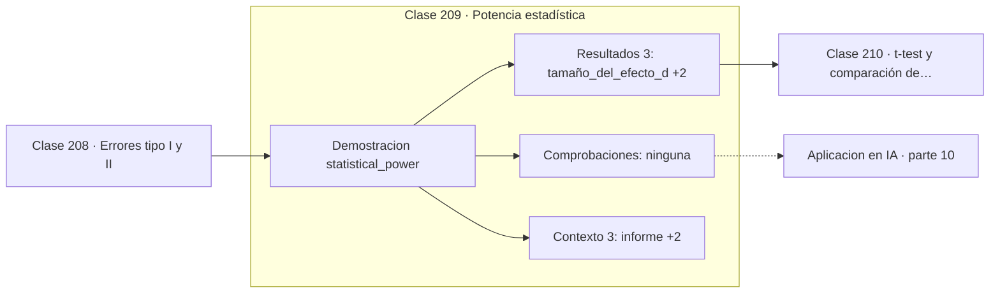

# 209 — Potencia estadística

> [⬅️ 208 Errores tipo I y II](../208-errores-tipo-i-y-ii/README.md) · [📚 Parte 10](../README.md) · [🏠 Programa](../../../README.md) · [210 t-test y comparación de medias ➡️](../210-t-test-y-comparacion-de-medias/README.md)

**Parte:** 10 — Estadística e inferencia · **Nivel:** `universitario-avanzado` · **Horas estimadas:** 4
**Motor:** `engines.part10` · **Demostración:** `statistical_power` · **Clase 9 de 20** de la parte

---

## 🎯 Propósito

**Sin potencia declarada, un resultado no significativo no distingue entre no hay efecto y no hay datos.**

Descriptiva, muestreo, estimadores, intervalos de confianza, pruebas de hipótesis, p-value, potencia, verosimilitud, MAP, inferencia bayesiana, bootstrap y A/B testing.

## ✅ Resultados de aprendizaje

Al terminar podrás:

1. Explicar **Potencia estadística** con lenguaje cotidiano y con notación matemática.
2. Resolver un caso pequeño a mano y anticipar el orden de magnitud del resultado.
3. Ejecutar y modificar `lab.py`, que corre la demostración `statistical_power`.
4. Interpretar las 6 salidas del laboratorio y decir qué comprueba cada una.
5. Detectar el error típico de esta parte: evaluar sobre datos que participaron en la selección del modelo.

## 🧩 Fórmulas de la clase

```text
potencia = 1 − β = P(rechazar H0 | H1 cierta)
d de Cohen = (μ₁ − μ₀) / σ
n ≈ 16/d²  para 80 % de potencia con α = 0,05
```

## 🗺️ Ubicación en el programa



## 📖 Fundamentos

La potencia es la probabilidad de detectar un efecto que realmente existe. Depende de tres
cosas: el tamaño del efecto, el nivel `α` y el tamaño muestral. Fijadas las dos primeras,
es el `n` el que decide, y por eso el cálculo de potencia es un paso de **diseño**, no de
análisis.

Un estudio con potencia baja tiene un problema doble, y el segundo es el que casi nadie
menciona. El primero es obvio: probablemente no detectará el efecto. El segundo es más
grave: **si lo detecta, la magnitud estimada estará inflada**, porque solo las muestras
con desviación favorable superan el umbral. Es el fenómeno de la maldición del ganador, y
explica buena parte de la crisis de replicación.

El **tamaño del efecto** —la d de Cohen, la diferencia en unidades de desviación— es la
pieza que hay que estimar antes de empezar, a partir de literatura previa o de un estudio
piloto. Es independiente de `n`, a diferencia del p-value, y es lo que debe reportarse
junto a la significancia.

La regla práctica `n ≈ 16/d²` da el orden de magnitud para un 80 % de potencia. Detectar un
efecto mediano necesita unas 64 observaciones por grupo; detectar uno pequeño de `d = 0,2`
necesita unas 400. Descubrir eso al terminar el experimento, y no al planificarlo, es
descubrir que el estudio nunca pudo concluir nada.

## 🧮 Ejemplo trabajado

Potencia frente a tamaño muestral con efecto d = 0,5 y α = 0,05.

```text
d = 0,5      α = 0,05

     n      potencia
    10       0,3526
    30       0,7819
    64       0,9666
   100       0,9963

n necesario para 80 % de potencia: 32 por grupo
regla práctica 16/d² = 16/0,25 = 64 (conservadora, dos grupos)

Con n = 10 y resultado no significativo:
  la probabilidad de detectar el efecto era del 35 %
  no rechazar no informa casi nada

Efectos pequeños (d = 0,2) exigen n ≈ 400 por grupo.
```

## 🔬 Qué ejecuta el laboratorio

`statistical_power` — Potencia en función del tamaño muestral.

| Grupo | Salidas |
|---|---|
| 🔢 Resultados numéricos (3) | `tamaño_del_efecto_d`, `alfa`, `n_para_potencia_80%` |
| ✅ Comprobaciones de invariante (0) | — |

Las claves booleanas no son adorno: si alguna fuera `False`, el resultado numérico
no sería fiable aunque el programa terminase sin error.

```bash
python classes/part-10-estadistica-e-inferencia/209-potencia-estadistica/lab.py
compmath run 209
```

> [!TIP]
> Antes de ejecutar, **escribe tu predicción**. Un laboratorio que confirma lo que
> esperabas enseña tanto como uno que te contradice, pero solo si la predicción
> existía antes del resultado.

## ⚠️ Errores conceptuales frecuentes

1. Calcular la potencia después del experimento en vez de antes.
2. Interpretar un no significativo de un estudio pequeño como ausencia de efecto.
3. Confiar en la magnitud estimada de un efecto detectado con potencia baja.

## 🚀 Dónde se usa de verdad

Planificación de experimentos A/B, dimensionado de ensayos clínicos, diseño de estudios de
usabilidad y evaluación de si una comparación de modelos puede concluir algo.

## 🤖 Conexión con IA

Evaluar un modelo es inferencia estadística: métricas con intervalo, comparaciones múltiples corregidas y detección de leakage.

## 📓 Notebooks

| Archivo | Para qué |
|---|---|
| [`notebook.ipynb`](notebook.ipynb) | recorrido guiado con la demostración ejecutada |
| [`notebook_student.ipynb`](notebook_student.ipynb) | versión con `TODO` para resolver |
| [`notebook_solution.ipynb`](notebook_solution.ipynb) | solución de referencia verificada |

## 📝 Evaluación

| Criterio | Peso |
|---|---:|
| Comprensión conceptual | 25 % |
| Resolución manual | 25 % |
| Implementación y verificación | 25 % |
| Interpretación y comunicación | 15 % |
| Conexión con aplicación real | 10 % |

Detalle y criterios de error crítico en [`assessment.md`](assessment.md).

## ❓ Preguntas de comprobación

1. ¿Cuál es la entrada, cuál la salida y qué unidades tienen?
2. ¿Qué operación domina el comportamiento del resultado?
3. ¿Qué caso extremo revelaría un error conceptual?
4. ¿Cómo verificarías el resultado por un método independiente?
5. ¿Dónde aparece esto en experimentación de producto?

Si necesitas releer el código para responderlas, la clase todavía no está superada.

## 📥 Entregable

`notebook_student.ipynb` resuelto más un párrafo que explique el resultado **sin citar
código**: qué entra, qué sale, qué invariante se comprueba y qué pasaría en un caso límite.

## 🔗 Referencias

- [Cohen, J. *Statistical Power Analysis for the Behavioral Sciences*, 2ª ed., Routledge, 1988](https://doi.org/10.4324/9780203771587) — *uso:* desarrollo formal del tema en «Potencia estadística».
- [Button, K. et al. *Power failure: why small sample size undermines the reliability of neuroscience*, Nature Reviews Neuroscience, 2013](https://doi.org/10.1038/nrn3475) — *uso:* artículo de origen consultado en «Potencia estadística».

Bibliografía completa de la parte en [`../../../docs/BIBLIOGRAPHY.md`](../../../docs/BIBLIOGRAPHY.md) · localizador verificable de cada obra en [`sources/bibliography.json`](../../../sources/bibliography.json).

## 📂 Material de la clase

[`intuition.md`](intuition.md) · [`theory.md`](theory.md) · [`derivation.md`](derivation.md) · [`exercises.md`](exercises.md) · [`assessment.md`](assessment.md) · [`where-is-this-used.md`](where-is-this-used.md) · [`lesson.yaml`](lesson.yaml)

---

> [⬅️ 208 Errores tipo I y II](../208-errores-tipo-i-y-ii/README.md) · [📚 Parte 10](../README.md) · [🏠 Programa](../../../README.md) · [210 t-test y comparación de medias ➡️](../210-t-test-y-comparacion-de-medias/README.md)
