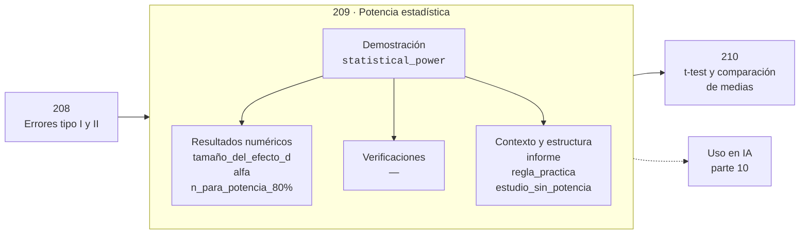

# 209 — Potencia estadística

> [⬅️ 208 Errores tipo I y II](../208-errores-tipo-i-y-ii/README.md) · [📚 Parte 10](../README.md) · [🏠 Programa](../../../README.md) · [210 t-test y comparación de medias ➡️](../210-t-test-y-comparacion-de-medias/README.md)

**Parte:** 10 — Estadística e inferencia · **Nivel:** `universitario-avanzado` · **Horas estimadas:** 4
**Motor:** `engines.part10` · **Demostración:** `statistical_power` · **Clase 9 de 20** de la parte

---

## 🎯 Propósito

Descriptiva, muestreo, estimadores, intervalos de confianza, pruebas de hipótesis, p-value, potencia, verosimilitud, MAP, inferencia bayesiana, bootstrap y A/B testing.

Esta clase concreta ese objetivo sobre **Potencia estadística**: qué es, cómo se
calcula a mano, cómo se implementa sin ocultar el procedimiento y cómo se verifica
que el resultado es correcto y no solo plausible.

## ✅ Resultados de aprendizaje

Al terminar podrás:

1. Explicar **Potencia estadística** con lenguaje cotidiano y con notación matemática.
2. Resolver un caso pequeño a mano y anticipar el orden de magnitud del resultado.
3. Ejecutar y modificar `lab.py`, que corre la demostración `statistical_power`.
4. Interpretar las 6 salidas del laboratorio y decir qué comprueba cada una.
5. Detectar el error típico de esta parte: evaluar sobre datos que participaron en la selección del modelo.

## 🗺️ Ubicación en el programa



## 🧠 Idea rectora de la parte 10

> Correlación no implica causalidad, pero causalidad sí restringe la correlación.

## 🔬 Qué ejecuta el laboratorio

`statistical_power` — Potencia en función del tamaño muestral.

| Grupo | Salidas |
|---|---|
| 🔢 Resultados numéricos (3) | `tamaño_del_efecto_d`, `alfa`, `n_para_potencia_80%` |
| ✅ Comprobaciones de invariante (0) | — |

Las claves booleanas no son adorno: si alguna fuera `False`, el resultado numérico
no sería fiable aunque el programa terminase sin error.

```bash
python classes/part-10-estadistica-e-inferencia/209-potencia-estadistica/lab.py
compmath run 209
```

> [!TIP]
> Antes de ejecutar, **escribe tu predicción**. Un laboratorio que confirma lo que
> esperabas enseña tanto como uno que te contradice, pero solo si la predicción
> existía antes del resultado.

## ⚠️ Errores frecuentes en esta parte

- p-hacking por comparaciones múltiples sin corrección.
- Confundir significancia estadística con relevancia práctica.
- Evaluar sobre datos que participaron en la selección del modelo.

## 🤖 Conexión con IA

Evaluar un modelo es inferencia estadística: métricas con intervalo, comparaciones múltiples corregidas y detección de leakage.

## 📓 Notebooks

| Archivo | Para qué |
|---|---|
| [`notebook.ipynb`](notebook.ipynb) | recorrido guiado con la demostración ejecutada |
| [`notebook_student.ipynb`](notebook_student.ipynb) | versión con `TODO` para resolver |
| [`notebook_solution.ipynb`](notebook_solution.ipynb) | solución de referencia verificada |

## 📝 Evaluación

| Criterio | Peso |
|---|---:|
| Comprensión conceptual | 25 % |
| Resolución manual | 25 % |
| Implementación y verificación | 25 % |
| Interpretación y comunicación | 15 % |
| Conexión con aplicación real | 10 % |

Detalle y criterios de error crítico en [`assessment.md`](assessment.md).

## ❓ Preguntas de comprobación

1. ¿Cuál es la entrada, cuál la salida y qué unidades tienen?
2. ¿Qué operación domina el comportamiento del resultado?
3. ¿Qué caso extremo revelaría un error conceptual?
4. ¿Cómo verificarías el resultado por un método independiente?
5. ¿Dónde aparece esto en experimentación de producto?

Si necesitas releer el código para responderlas, la clase todavía no está superada.

## 📥 Entregable

`notebook_student.ipynb` resuelto más un párrafo que explique el resultado **sin citar
código**: qué entra, qué sale, qué invariante se comprueba y qué pasaría en un caso límite.

## 🔗 Referencias

- Wasserman, L. *All of Statistics*. Springer, 2004.
- Gelman, A. et al. *Bayesian Data Analysis*. 3ª ed., CRC, 2013.
- Efron, B.; Tibshirani, R. *An Introduction to the Bootstrap*. Chapman & Hall, 1993.

## 📂 Material de la clase

[`intuition.md`](intuition.md) · [`theory.md`](theory.md) · [`derivation.md`](derivation.md) · [`exercises.md`](exercises.md) · [`assessment.md`](assessment.md) · [`where-is-this-used.md`](where-is-this-used.md) · [`lesson.yaml`](lesson.yaml)

---

> [⬅️ 208 Errores tipo I y II](../208-errores-tipo-i-y-ii/README.md) · [📚 Parte 10](../README.md) · [🏠 Programa](../../../README.md) · [210 t-test y comparación de medias ➡️](../210-t-test-y-comparacion-de-medias/README.md)
