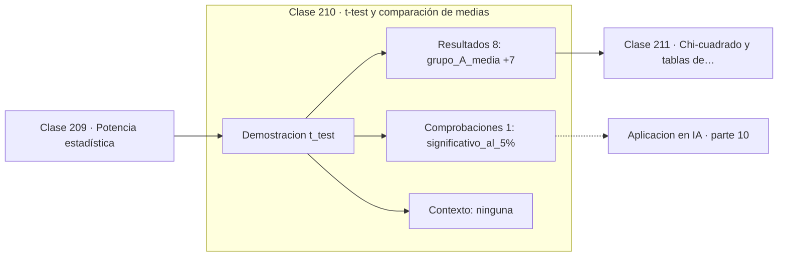

# 210 — t-test y comparación de medias

> [⬅️ 209 Potencia estadística](../209-potencia-estadistica/README.md) · [📚 Parte 10](../README.md) · [🏠 Programa](../../../README.md) · [211 Chi-cuadrado y tablas de contingencia ➡️](../211-chi-cuadrado-y-tablas-de-contingencia/README.md)

**Parte:** 10 — Estadística e inferencia · **Nivel:** `universitario-avanzado` · **Horas estimadas:** 4
**Motor:** `engines.part10` · **Demostración:** `t_test` · **Clase 10 de 20** de la parte

---

## 🎯 Propósito

**La t de Student compara medias cuando la varianza poblacional es desconocida.**

Descriptiva, muestreo, estimadores, intervalos de confianza, pruebas de hipótesis, p-value, potencia, verosimilitud, MAP, inferencia bayesiana, bootstrap y A/B testing.

## ✅ Resultados de aprendizaje

Al terminar podrás:

1. Explicar **t-test y comparación de medias** con lenguaje cotidiano y con notación matemática.
2. Resolver un caso pequeño a mano y anticipar el orden de magnitud del resultado.
3. Ejecutar y modificar `lab.py`, que corre la demostración `t_test`.
4. Interpretar las 9 salidas del laboratorio y decir qué comprueba cada una.
5. Detectar el error típico de esta parte: p-hacking por comparaciones múltiples sin corrección.

## 🧩 Fórmulas de la clase

```text
t = (x̄₁ − x̄₂) / (s_p·√(1/n₁ + 1/n₂))
s_p² = ((n₁−1)s₁² + (n₂−1)s₂²) / (n₁+n₂−2)
gl = n₁ + n₂ − 2
```

## 🗺️ Ubicación en el programa



## 📖 Fundamentos

Cuando se compara la media de dos grupos y no se conoce la varianza poblacional, sustituir
`σ` por su estimación introduce incertidumbre adicional. La distribución t la absorbe con
colas más pesadas que la normal: para el mismo nivel de confianza exige valores más
extremos, y esa penalización se relaja al crecer los grados de libertad.

El estadístico tiene una lectura directa: es la diferencia observada dividida entre el
ruido esperado de esa diferencia. Un `t` de 2,7 significa que los grupos están separados
por 2,7 veces la incertidumbre de la medición, lo cual es difícil de explicar por azar.

La versión clásica supone **normalidad aproximada, independencia y varianzas similares**.
La normalidad es la menos crítica gracias al TCL; la independencia es la más crítica y la
más violada, típicamente con medidas repetidas del mismo sujeto, que exigen la versión
pareada. Con varianzas muy distintas se usa la corrección de Welch, que es hoy el valor por
defecto en la mayoría de bibliotecas.

El t-test da un p-value, pero lo que hay que reportar es la **diferencia con su intervalo
de confianza**. «Los grupos difieren en 11,3 puntos, IC 95 % [2,9 , 19,6]» comunica
magnitud y precisión; «p = 0,009» solo comunica que la diferencia no es cero.

## 🧮 Ejemplo trabajado

Dos grupos independientes de 25 observaciones cada uno.

```text
grupo A: media  94,2816
grupo B: media 105,5441
diferencia      11,2626

desviación combinada s_p = 14,6574
SE de la diferencia = 14,6574·√(1/25 + 1/25) = 4,1457

t = 11,2626 / 4,1457 = 2,7167       gl = 48

valor crítico bilateral al 5 %: ±2,011
|2,7167| > 2,011  →  se rechaza H0
p ≈ 0,0091

IC 95 % de la diferencia:
  11,2626 ± 2,011 × 4,1457 = (2,926 , 19,600)

Reportar el intervalo, no solo el p-value.
```

## 🔬 Qué ejecuta el laboratorio

`t_test` — t-test de dos muestras independientes.

| Grupo | Salidas |
|---|---|
| 🔢 Resultados numéricos (8) | `grupo_A_media`, `grupo_B_media`, `diferencia`, `desviacion_combinada`, `estadistico_t`, `grados_de_libertad`, `valor_critico_aprox_2.01`, `d_de_Cohen` |
| ✅ Comprobaciones de invariante (1) | `significativo_al_5%` |

Las claves booleanas no son adorno: si alguna fuera `False`, el resultado numérico
no sería fiable aunque el programa terminase sin error.

```bash
python classes/part-10-estadistica-e-inferencia/210-t-test-y-comparacion-de-medias/lab.py
compmath run 210
```

> [!TIP]
> Antes de ejecutar, **escribe tu predicción**. Un laboratorio que confirma lo que
> esperabas enseña tanto como uno que te contradice, pero solo si la predicción
> existía antes del resultado.

## ⚠️ Errores conceptuales frecuentes

1. Aplicar el test independiente a medidas pareadas.
2. Ignorar varianzas muy dispares en vez de usar Welch.
3. Reportar solo el p-value y omitir la diferencia y su intervalo.

## 🚀 Dónde se usa de verdad

Comparación de dos variantes en A/B testing, contraste de métricas entre dos modelos,
ensayos clínicos de dos brazos y estudios de rendimiento antes y después.

## 🤖 Conexión con IA

Evaluar un modelo es inferencia estadística: métricas con intervalo, comparaciones múltiples corregidas y detección de leakage.

## 📓 Notebooks

| Archivo | Para qué |
|---|---|
| [`notebook.ipynb`](notebook.ipynb) | recorrido guiado con la demostración ejecutada |
| [`notebook_student.ipynb`](notebook_student.ipynb) | versión con `TODO` para resolver |
| [`notebook_solution.ipynb`](notebook_solution.ipynb) | solución de referencia verificada |

## 📝 Evaluación

| Criterio | Peso |
|---|---:|
| Comprensión conceptual | 25 % |
| Resolución manual | 25 % |
| Implementación y verificación | 25 % |
| Interpretación y comunicación | 15 % |
| Conexión con aplicación real | 10 % |

Detalle y criterios de error crítico en [`assessment.md`](assessment.md).

## ❓ Preguntas de comprobación

1. ¿Cuál es la entrada, cuál la salida y qué unidades tienen?
2. ¿Qué operación domina el comportamiento del resultado?
3. ¿Qué caso extremo revelaría un error conceptual?
4. ¿Cómo verificarías el resultado por un método independiente?
5. ¿Dónde aparece esto en experimentación de producto?

Si necesitas releer el código para responderlas, la clase todavía no está superada.

## 📥 Entregable

`notebook_student.ipynb` resuelto más un párrafo que explique el resultado **sin citar
código**: qué entra, qué sale, qué invariante se comprueba y qué pasaría en un caso límite.

## 🔗 Referencias

- [Wasserman, L. *All of Statistics*, Springer, 2004, cap. 10](https://link.springer.com/book/10.1007/978-0-387-21736-9)
- [Student. *The probable error of a mean*, Biometrika, 1908](https://doi.org/10.2307/2331554)

Bibliografía completa de la parte en [`../../../docs/BIBLIOGRAPHY.md`](../../../docs/BIBLIOGRAPHY.md).

## 📂 Material de la clase

[`intuition.md`](intuition.md) · [`theory.md`](theory.md) · [`derivation.md`](derivation.md) · [`exercises.md`](exercises.md) · [`assessment.md`](assessment.md) · [`where-is-this-used.md`](where-is-this-used.md) · [`lesson.yaml`](lesson.yaml)

---

> [⬅️ 209 Potencia estadística](../209-potencia-estadistica/README.md) · [📚 Parte 10](../README.md) · [🏠 Programa](../../../README.md) · [211 Chi-cuadrado y tablas de contingencia ➡️](../211-chi-cuadrado-y-tablas-de-contingencia/README.md)
