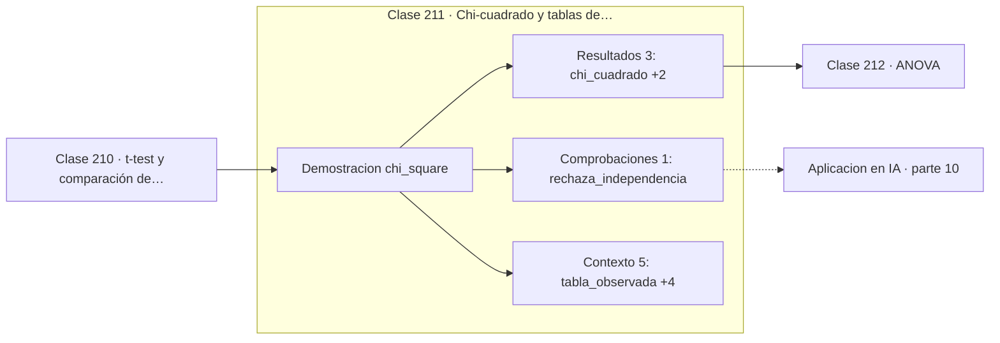

# 211 — Chi-cuadrado y tablas de contingencia

> [⬅️ 210 t-test y comparación de medias](../210-t-test-y-comparacion-de-medias/README.md) · [📚 Parte 10](../README.md) · [🏠 Programa](../../../README.md) · [212 ANOVA ➡️](../212-anova/README.md)

**Parte:** 10 — Estadística e inferencia · **Nivel:** `universitario-avanzado` · **Horas estimadas:** 4
**Motor:** `engines.part10` · **Demostración:** `chi_square` · **Clase 11 de 20** de la parte

---

## 🎯 Propósito

**Chi-cuadrado compara frecuencias observadas con las esperadas bajo independencia.**

Descriptiva, muestreo, estimadores, intervalos de confianza, pruebas de hipótesis, p-value, potencia, verosimilitud, MAP, inferencia bayesiana, bootstrap y A/B testing.

## ✅ Resultados de aprendizaje

Al terminar podrás:

1. Explicar **Chi-cuadrado y tablas de contingencia** con lenguaje cotidiano y con notación matemática.
2. Resolver un caso pequeño a mano y anticipar el orden de magnitud del resultado.
3. Ejecutar y modificar `lab.py`, que corre la demostración `chi_square`.
4. Interpretar las 9 salidas del laboratorio y decir qué comprueba cada una.
5. Detectar el error típico de esta parte: confundir significancia estadística con relevancia práctica.

## 🧩 Fórmulas de la clase

```text
χ² = Σ (O − E)² / E
E_ij = (total fila i × total columna j) / n
gl = (filas − 1)·(columnas − 1)
```

## 🗺️ Ubicación en el programa



## 📖 Fundamentos

Cuando las dos variables son categóricas, la comparación de medias no aplica y el
instrumento natural es la **tabla de contingencia**: el recuento cruzado de categorías. La
pregunta es si la distribución de una variable cambia según el valor de la otra, es decir,
si son independientes.

La tabla **esperada** bajo independencia se construye con la regla del producto de la clase
185: si las variables fueran independientes, la proporción conjunta sería el producto de
las marginales, y multiplicando por `n` se obtiene la frecuencia esperada de cada celda. El
estadístico suma las discrepancias al cuadrado normalizadas por lo esperado.

Normalizar por `E` es esencial: una diferencia de 5 en una celda donde se esperaban 10 es
enorme, y en una donde se esperaban 1000 es ruido. Los grados de libertad,
`(f−1)·(c−1)`, cuentan cuántas celdas quedan libres una vez fijados los totales marginales.

El test tiene dos condiciones prácticas. Trabaja con **frecuencias absolutas**, nunca con
porcentajes: aplicarlo a porcentajes convierte cualquier tabla en una de n = 100 y falsea
el resultado. Y exige frecuencias esperadas razonables —la regla habitual es al menos 5 por
celda—; con celdas pequeñas corresponde el test exacto de Fisher.

## 🧮 Ejemplo trabajado

Tabla 2×2 con 100 observaciones.

```text
observado          C1    C2   | total
  F1               30    20   |  50
  F2               15    35   |  50
-----------------------------------
  total            45    55   | 100

esperado bajo independencia  E = fila × columna / n
  F1: 50·45/100 = 22,5     50·55/100 = 27,5
  F2: 22,5                 27,5

χ² = (30−22,5)²/22,5 + (20−27,5)²/27,5
   + (15−22,5)²/22,5 + (35−27,5)²/27,5
   = 2,5 + 2,045 + 2,5 + 2,045 = 9,0909

gl = (2−1)(2−1) = 1        valor crítico al 5 % = 3,841
9,0909 > 3,841  →  se rechaza la independencia
p ≈ 0,0026
```

## 🔬 Qué ejecuta el laboratorio

`chi_square` — Chi-cuadrado de independencia sobre una tabla de contingencia.

| Grupo | Salidas |
|---|---|
| 🔢 Resultados numéricos (3) | `chi_cuadrado`, `grados_de_libertad`, `valor_critico_5%` |
| ✅ Comprobaciones de invariante (1) | `rechaza_independencia` |

Las claves booleanas no son adorno: si alguna fuera `False`, el resultado numérico
no sería fiable aunque el programa terminase sin error.

```bash
python classes/part-10-estadistica-e-inferencia/211-chi-cuadrado-y-tablas-de-contingencia/lab.py
compmath run 211
```

> [!TIP]
> Antes de ejecutar, **escribe tu predicción**. Un laboratorio que confirma lo que
> esperabas enseña tanto como uno que te contradice, pero solo si la predicción
> existía antes del resultado.

## ⚠️ Errores conceptuales frecuentes

1. Aplicar el test a porcentajes en vez de a recuentos.
2. Usarlo con frecuencias esperadas menores que 5.
3. Concluir causalidad a partir de una asociación significativa.

## 🚀 Dónde se usa de verdad

Análisis de encuestas, matrices de confusión, comparación de tasas por segmento y
detección de asociación entre variables categóricas.

## 🤖 Conexión con IA

Evaluar un modelo es inferencia estadística: métricas con intervalo, comparaciones múltiples corregidas y detección de leakage.

## 📓 Notebooks

| Archivo | Para qué |
|---|---|
| [`notebook.ipynb`](notebook.ipynb) | recorrido guiado con la demostración ejecutada |
| [`notebook_student.ipynb`](notebook_student.ipynb) | versión con `TODO` para resolver |
| [`notebook_solution.ipynb`](notebook_solution.ipynb) | solución de referencia verificada |

## 📝 Evaluación

| Criterio | Peso |
|---|---:|
| Comprensión conceptual | 25 % |
| Resolución manual | 25 % |
| Implementación y verificación | 25 % |
| Interpretación y comunicación | 15 % |
| Conexión con aplicación real | 10 % |

Detalle y criterios de error crítico en [`assessment.md`](assessment.md).

## ❓ Preguntas de comprobación

1. ¿Cuál es la entrada, cuál la salida y qué unidades tienen?
2. ¿Qué operación domina el comportamiento del resultado?
3. ¿Qué caso extremo revelaría un error conceptual?
4. ¿Cómo verificarías el resultado por un método independiente?
5. ¿Dónde aparece esto en experimentación de producto?

Si necesitas releer el código para responderlas, la clase todavía no está superada.

## 📥 Entregable

`notebook_student.ipynb` resuelto más un párrafo que explique el resultado **sin citar
código**: qué entra, qué sale, qué invariante se comprueba y qué pasaría en un caso límite.

## 🔗 Referencias

- [Wasserman, L. *All of Statistics*, Springer, 2004, cap. 10](https://link.springer.com/book/10.1007/978-0-387-21736-9) — *uso:* desarrollo formal del tema en «Chi-cuadrado y tablas de contingencia».
- [Agresti, A. *Categorical Data Analysis*, 3ª ed., Wiley, 2013](https://doi.org/10.1002/9780470594001) — *uso:* desarrollo formal del tema en «Chi-cuadrado y tablas de contingencia».

Bibliografía completa de la parte en [`../../../docs/BIBLIOGRAPHY.md`](../../../docs/BIBLIOGRAPHY.md) · localizador verificable de cada obra en [`sources/bibliography.json`](../../../sources/bibliography.json).

## 📂 Material de la clase

[`intuition.md`](intuition.md) · [`theory.md`](theory.md) · [`derivation.md`](derivation.md) · [`exercises.md`](exercises.md) · [`assessment.md`](assessment.md) · [`where-is-this-used.md`](where-is-this-used.md) · [`lesson.yaml`](lesson.yaml)

---

> [⬅️ 210 t-test y comparación de medias](../210-t-test-y-comparacion-de-medias/README.md) · [📚 Parte 10](../README.md) · [🏠 Programa](../../../README.md) · [212 ANOVA ➡️](../212-anova/README.md)
