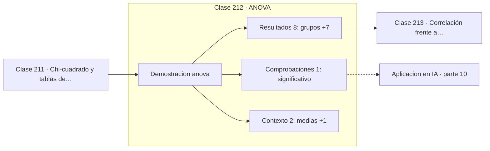

# 212 — ANOVA

> [⬅️ 211 Chi-cuadrado y tablas de contingencia](../211-chi-cuadrado-y-tablas-de-contingencia/README.md) · [📚 Parte 10](../README.md) · [🏠 Programa](../../../README.md) · [213 Correlación frente a causalidad ➡️](../213-correlacion-frente-a-causalidad/README.md)

**Parte:** 10 — Estadística e inferencia · **Nivel:** `universitario-avanzado` · **Horas estimadas:** 4
**Motor:** `engines.part10` · **Demostración:** `anova` · **Clase 12 de 20** de la parte

---

## 🎯 Propósito

**ANOVA compara varias medias a la vez sin inflar la tasa de falsos positivos.**

Descriptiva, muestreo, estimadores, intervalos de confianza, pruebas de hipótesis, p-value, potencia, verosimilitud, MAP, inferencia bayesiana, bootstrap y A/B testing.

## ✅ Resultados de aprendizaje

Al terminar podrás:

1. Explicar **ANOVA** con lenguaje cotidiano y con notación matemática.
2. Resolver un caso pequeño a mano y anticipar el orden de magnitud del resultado.
3. Ejecutar y modificar `lab.py`, que corre la demostración `anova`.
4. Interpretar las 11 salidas del laboratorio y decir qué comprueba cada una.
5. Detectar el error típico de esta parte: evaluar sobre datos que participaron en la selección del modelo.

## 🧩 Fórmulas de la clase

```text
SS_total = SS_entre + SS_dentro
F = (SS_entre/gl_entre) / (SS_dentro/gl_dentro)
k grupos ⟹ C(k,2) comparaciones por pares
```

## 🗺️ Ubicación en el programa



## 📖 Fundamentos

Con tres o más grupos, hacer todos los t-tests por pares infla la tasa de falsos positivos:
con 3 grupos son 3 comparaciones y la probabilidad de alguna falsa alarma sube del 5 % al
14 %; con 5 grupos son 10 comparaciones y sube al 40 %. ANOVA resuelve el problema con un
único contraste global.

Su mecanismo es una **descomposición de la variabilidad**, y es la misma idea del teorema
de Pitágoras aplicada a sumas de cuadrados. La variación total de los datos respecto de la
gran media se parte exactamente en dos: la variación **entre** grupos, que refleja las
diferencias de medias, y la variación **dentro** de cada grupo, que es ruido.

El estadístico `F` es el cociente entre ambas, cada una dividida por sus grados de
libertad. Si los grupos no difieren, ambas estiman la misma varianza y `F` ronda 1. Si
difieren, la variación entre grupos crece y `F` se dispara. El nombre honra a Fisher, que
lo desarrolló para experimentos agrícolas.

ANOVA solo dice **si hay alguna diferencia**, no cuál. Para localizarla hacen falta
contrastes posteriores con corrección —Tukey, Bonferroni o Holm—, y hacerlos sin corregir
devuelve el problema al punto de partida. Los supuestos son los del t-test extendidos:
independencia, normalidad aproximada y homogeneidad de varianzas.

## 🧮 Ejemplo trabajado

Tres grupos, descomposición completa de la variabilidad.

```text
medias de los grupos: 51,0576   54,4184   56,2285
gran media: 53,9015

SS_entre  =   275,3983      gl = k − 1  = 2
SS_dentro = 1 610,7534      gl = n − k  = 57
SS_total  = 1 886,1516      comprobación: 275,40 + 1610,75 ✓

MS_entre  = 275,3983 / 2  = 137,699
MS_dentro = 1610,7534 / 57 =  28,259

F = 137,699 / 28,259 = 4,873
valor crítico F(2,57) al 5 % ≈ 3,16
4,873 > 3,16  →  al menos un grupo difiere      p ≈ 0,011

Inflación sin ANOVA:
  3 t-tests sin corregir → P(falso positivo) ≈ 14 %
```

## 🔬 Qué ejecuta el laboratorio

`anova` — ANOVA de un factor: descomposición de la variabilidad.

| Grupo | Salidas |
|---|---|
| 🔢 Resultados numéricos (8) | `grupos`, `gran_media`, `SS_entre`, `SS_dentro`, `SS_total`, `estadistico_F`, `valor_critico_aprox_3.16`, `eta_cuadrado` |
| ✅ Comprobaciones de invariante (1) | `significativo` |

Las claves booleanas no son adorno: si alguna fuera `False`, el resultado numérico
no sería fiable aunque el programa terminase sin error.

```bash
python classes/part-10-estadistica-e-inferencia/212-anova/lab.py
compmath run 212
```

> [!TIP]
> Antes de ejecutar, **escribe tu predicción**. Un laboratorio que confirma lo que
> esperabas enseña tanto como uno que te contradice, pero solo si la predicción
> existía antes del resultado.

## ⚠️ Errores conceptuales frecuentes

1. Encadenar t-tests por pares sin corregir el nivel.
2. Concluir qué grupo difiere a partir del F global.
3. Aplicar ANOVA con varianzas muy dispares entre grupos.

## 🚀 Dónde se usa de verdad

Comparación de más de dos variantes en un experimento, evaluación de varias
configuraciones de modelo, diseño factorial y estudios multicentro.

## 🤖 Conexión con IA

Evaluar un modelo es inferencia estadística: métricas con intervalo, comparaciones múltiples corregidas y detección de leakage.

## 📓 Notebooks

| Archivo | Para qué |
|---|---|
| [`notebook.ipynb`](notebook.ipynb) | recorrido guiado con la demostración ejecutada |
| [`notebook_student.ipynb`](notebook_student.ipynb) | versión con `TODO` para resolver |
| [`notebook_solution.ipynb`](notebook_solution.ipynb) | solución de referencia verificada |

## 📝 Evaluación

| Criterio | Peso |
|---|---:|
| Comprensión conceptual | 25 % |
| Resolución manual | 25 % |
| Implementación y verificación | 25 % |
| Interpretación y comunicación | 15 % |
| Conexión con aplicación real | 10 % |

Detalle y criterios de error crítico en [`assessment.md`](assessment.md).

## ❓ Preguntas de comprobación

1. ¿Cuál es la entrada, cuál la salida y qué unidades tienen?
2. ¿Qué operación domina el comportamiento del resultado?
3. ¿Qué caso extremo revelaría un error conceptual?
4. ¿Cómo verificarías el resultado por un método independiente?
5. ¿Dónde aparece esto en experimentación de producto?

Si necesitas releer el código para responderlas, la clase todavía no está superada.

## 📥 Entregable

`notebook_student.ipynb` resuelto más un párrafo que explique el resultado **sin citar
código**: qué entra, qué sale, qué invariante se comprueba y qué pasaría en un caso límite.

## 🔗 Referencias

- [Wasserman, L. *All of Statistics*, Springer, 2004, cap. 10](https://link.springer.com/book/10.1007/978-0-387-21736-9) — *uso:* desarrollo formal del tema en «ANOVA».
- [Fisher, R. A. *The Design of Experiments*, Oliver & Boyd, 1935](https://archive.org/details/in.ernet.dli.2015.502684) — *uso:* obra de referencia consultada en «ANOVA».

Bibliografía completa de la parte en [`../../../docs/BIBLIOGRAPHY.md`](../../../docs/BIBLIOGRAPHY.md) · localizador verificable de cada obra en [`sources/bibliography.json`](../../../sources/bibliography.json).

## 📂 Material de la clase

[`intuition.md`](intuition.md) · [`theory.md`](theory.md) · [`derivation.md`](derivation.md) · [`exercises.md`](exercises.md) · [`assessment.md`](assessment.md) · [`where-is-this-used.md`](where-is-this-used.md) · [`lesson.yaml`](lesson.yaml)

---

> [⬅️ 211 Chi-cuadrado y tablas de contingencia](../211-chi-cuadrado-y-tablas-de-contingencia/README.md) · [📚 Parte 10](../README.md) · [🏠 Programa](../../../README.md) · [213 Correlación frente a causalidad ➡️](../213-correlacion-frente-a-causalidad/README.md)
