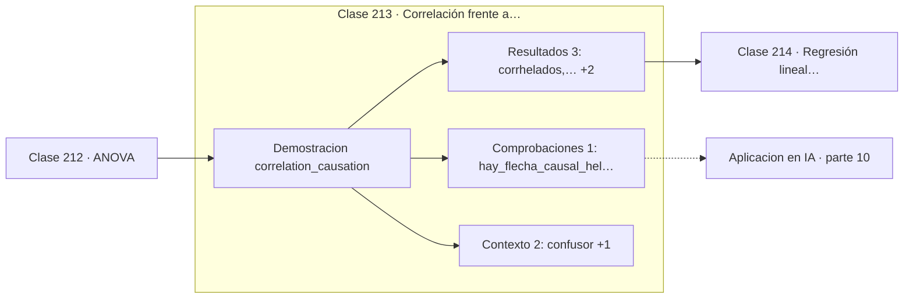

# 213 — Correlación frente a causalidad

> [⬅️ 212 ANOVA](../212-anova/README.md) · [📚 Parte 10](../README.md) · [🏠 Programa](../../../README.md) · [214 Regresión lineal estadística ➡️](../214-regresion-lineal-estadistica/README.md)

**Parte:** 10 — Estadística e inferencia · **Nivel:** `universitario-avanzado` · **Horas estimadas:** 4
**Motor:** `engines.part10` · **Demostración:** `correlation_causation` · **Clase 13 de 20** de la parte

---

## 🎯 Propósito

**Un confusor basta para fabricar correlación fuerte entre variables que no se tocan.**

Descriptiva, muestreo, estimadores, intervalos de confianza, pruebas de hipótesis, p-value, potencia, verosimilitud, MAP, inferencia bayesiana, bootstrap y A/B testing.

## ✅ Resultados de aprendizaje

Al terminar podrás:

1. Explicar **Correlación frente a causalidad** con lenguaje cotidiano y con notación matemática.
2. Resolver un caso pequeño a mano y anticipar el orden de magnitud del resultado.
3. Ejecutar y modificar `lab.py`, que corre la demostración `correlation_causation`.
4. Interpretar las 6 salidas del laboratorio y decir qué comprueba cada una.
5. Detectar el error típico de esta parte: p-hacking por comparaciones múltiples sin corrección.

## 🧩 Fórmulas de la clase

```text
corr(X,Y) alta ⇏ X → Y
confusor Z: Z → X y Z → Y
aleatorizar la asignación rompe todas las flechas hacia el tratamiento
```

## 🗺️ Ubicación en el programa



## 📖 Fundamentos

Que dos variables se muevan juntas admite al menos cuatro explicaciones distintas: X causa
Y, Y causa X, una tercera variable Z causa ambas, o es coincidencia en una muestra pequeña.
La correlación no distingue entre ellas, y elegir la primera por defecto es el error de
interpretación más caro de la estadística aplicada.

El caso escolar —venta de helados y ahogamientos— tiene la estructura completa. Ambas
variables suben con la temperatura, y por eso correlacionan entre sí sin que ninguna cause
la otra. La **variable de confusión** es la temperatura, y basta condicionar sobre ella
para que la asociación se desvanezca.

Hay dos formas de romper el problema. La primera es **aleatorizar**: si el tratamiento se
asigna al azar, ninguna variable previa —ni las conocidas ni las que se ignoran— puede
influir en quién lo recibe, y la diferencia observada sí admite lectura causal. Es la razón
de ser del ensayo controlado aleatorizado. La segunda es **controlar** los confusores
conocidos mediante estratificación o regresión, con la limitación evidente de que solo
funciona con los que se han identificado.

La inferencia causal moderna —grafos causales, criterio de puerta trasera, contrafactuales—
formaliza cuándo un ajuste es válido y cuándo introduce sesgo nuevo. Un resultado
contraintuitivo: controlar por una variable equivocada, como un colisionador, **crea**
asociación espuria en vez de eliminarla. Ajustar por todo lo disponible no es una
estrategia segura.

## 🧮 Ejemplo trabajado

Helados, ahogamientos y temperatura.

```text
corr(helados, ahogamientos)   = 0,5759
corr(temperatura, helados)    = 0,9205
corr(temperatura, ahogamientos) = 0,6306

Estructura causal real:
  temperatura → helados
  temperatura → ahogamientos
  helados     ↛ ahogamientos

Al condicionar sobre temperatura, la correlación
entre helados y ahogamientos se desvanece.

Prohibir el helado no reduciría ni un ahogamiento.

Detección:
  aleatorizar la asignación, o
  controlar explícitamente el confusor.
```

## 🔬 Qué ejecuta el laboratorio

`correlation_causation` — Una variable de confusión genera correlación sin causalidad.

| Grupo | Salidas |
|---|---|
| 🔢 Resultados numéricos (3) | `corr(helados, ahogamientos)`, `corr(temperatura, helados)`, `corr(temperatura, ahogamientos)` |
| ✅ Comprobaciones de invariante (1) | `hay_flecha_causal_helados→ahogamientos` |

Las claves booleanas no son adorno: si alguna fuera `False`, el resultado numérico
no sería fiable aunque el programa terminase sin error.

```bash
python classes/part-10-estadistica-e-inferencia/213-correlacion-frente-a-causalidad/lab.py
compmath run 213
```

> [!TIP]
> Antes de ejecutar, **escribe tu predicción**. Un laboratorio que confirma lo que
> esperabas enseña tanto como uno que te contradice, pero solo si la predicción
> existía antes del resultado.

## ⚠️ Errores conceptuales frecuentes

1. Leer una correlación fuerte como evidencia causal.
2. Controlar por todas las variables disponibles sin criterio.
3. Olvidar que la causalidad inversa explica igual de bien los datos observacionales.

## 🚀 Dónde se usa de verdad

Evaluación de campañas y políticas, atribución de conversiones, análisis de sesgo en
modelos y diseño de experimentos controlados.

## 🤖 Conexión con IA

Evaluar un modelo es inferencia estadística: métricas con intervalo, comparaciones múltiples corregidas y detección de leakage.

## 📓 Notebooks

| Archivo | Para qué |
|---|---|
| [`notebook.ipynb`](notebook.ipynb) | recorrido guiado con la demostración ejecutada |
| [`notebook_student.ipynb`](notebook_student.ipynb) | versión con `TODO` para resolver |
| [`notebook_solution.ipynb`](notebook_solution.ipynb) | solución de referencia verificada |

## 📝 Evaluación

| Criterio | Peso |
|---|---:|
| Comprensión conceptual | 25 % |
| Resolución manual | 25 % |
| Implementación y verificación | 25 % |
| Interpretación y comunicación | 15 % |
| Conexión con aplicación real | 10 % |

Detalle y criterios de error crítico en [`assessment.md`](assessment.md).

## ❓ Preguntas de comprobación

1. ¿Cuál es la entrada, cuál la salida y qué unidades tienen?
2. ¿Qué operación domina el comportamiento del resultado?
3. ¿Qué caso extremo revelaría un error conceptual?
4. ¿Cómo verificarías el resultado por un método independiente?
5. ¿Dónde aparece esto en experimentación de producto?

Si necesitas releer el código para responderlas, la clase todavía no está superada.

## 📥 Entregable

`notebook_student.ipynb` resuelto más un párrafo que explique el resultado **sin citar
código**: qué entra, qué sale, qué invariante se comprueba y qué pasaría en un caso límite.

## 🔗 Referencias

- [Pearl, J.; Mackenzie, D. *The Book of Why*, Basic Books, 2018](https://bayes.cs.ucla.edu/WHY/) — *uso:* obra de referencia consultada en «Correlación frente a causalidad».
- [Hernán, M.; Robins, J. *Causal Inference: What If*, CRC, 2020](https://miguelhernan.org/whatifbook) — *uso:* obra de referencia consultada en «Correlación frente a causalidad».

Bibliografía completa de la parte en [`../../../docs/BIBLIOGRAPHY.md`](../../../docs/BIBLIOGRAPHY.md) · localizador verificable de cada obra en [`sources/bibliography.json`](../../../sources/bibliography.json).

## 📂 Material de la clase

[`intuition.md`](intuition.md) · [`theory.md`](theory.md) · [`derivation.md`](derivation.md) · [`exercises.md`](exercises.md) · [`assessment.md`](assessment.md) · [`where-is-this-used.md`](where-is-this-used.md) · [`lesson.yaml`](lesson.yaml)

---

> [⬅️ 212 ANOVA](../212-anova/README.md) · [📚 Parte 10](../README.md) · [🏠 Programa](../../../README.md) · [214 Regresión lineal estadística ➡️](../214-regresion-lineal-estadistica/README.md)
