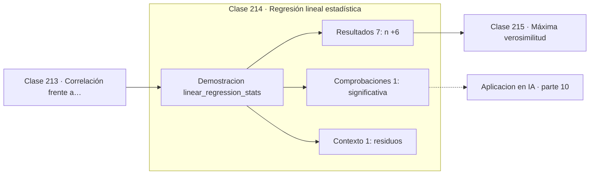

# 214 — Regresión lineal estadística

> [⬅️ 213 Correlación frente a causalidad](../213-correlacion-frente-a-causalidad/README.md) · [📚 Parte 10](../README.md) · [🏠 Programa](../../../README.md) · [215 Máxima verosimilitud ➡️](../215-maxima-verosimilitud/README.md)

**Parte:** 10 — Estadística e inferencia · **Nivel:** `universitario-avanzado` · **Horas estimadas:** 4
**Motor:** `engines.part10` · **Demostración:** `linear_regression_stats` · **Clase 14 de 20** de la parte

---

## 🎯 Propósito

**Un R² alto no valida el modelo: los residuos son los que lo hacen.**

Descriptiva, muestreo, estimadores, intervalos de confianza, pruebas de hipótesis, p-value, potencia, verosimilitud, MAP, inferencia bayesiana, bootstrap y A/B testing.

## ✅ Resultados de aprendizaje

Al terminar podrás:

1. Explicar **Regresión lineal estadística** con lenguaje cotidiano y con notación matemática.
2. Resolver un caso pequeño a mano y anticipar el orden de magnitud del resultado.
3. Ejecutar y modificar `lab.py`, que corre la demostración `linear_regression_stats`.
4. Interpretar las 9 salidas del laboratorio y decir qué comprueba cada una.
5. Detectar el error típico de esta parte: confundir significancia estadística con relevancia práctica.

## 🧩 Fórmulas de la clase

```text
ŷ = b₀ + b₁x,   b₁ = Σ(x−x̄)(y−ȳ) / Σ(x−x̄)²
R² = 1 − SS_res / SS_tot
t = b₁ / SE(b₁),  gl = n − 2
```

## 🗺️ Ubicación en el programa



## 📖 Fundamentos

La regresión lineal ajusta la recta que minimiza la suma de residuos al cuadrado. Vista
desde el álgebra lineal es la proyección de la parte 05; vista desde la estadística, cada
coeficiente es un **estimador** con su error estándar, su intervalo de confianza y su
contraste de significancia.

El **coeficiente de determinación** `R²` mide qué fracción de la variabilidad de `y`
explica el modelo. Es útil pero se sobreinterpreta: un `R²` alto no garantiza que el
modelo sea correcto, ni que la relación sea causal, ni que sirva para predecir fuera del
rango observado. Añadir variables sin sentido siempre sube el `R²`, y por eso existe el
`R²` ajustado.

Lo que sí valida el modelo son los **residuos**. Deben aparecer sin estructura: sin
curvatura —que indicaría relación no lineal—, sin embudo —que indicaría varianza no
constante— y sin patrón temporal —que indicaría dependencia—. El cuarteto de Anscombe
construye cuatro conjuntos con idénticos coeficientes y `R²` de los que solo uno merece una
recta.

La significancia de la pendiente contrasta `H0: b₁ = 0`, es decir, que `x` no aporta nada.
Como en toda la parte, lo que hay que reportar es la pendiente con su intervalo: dice
cuánto cambia `y` por unidad de `x` y con qué precisión, que es la información útil para
decidir.

## 🧮 Ejemplo trabajado

Ocho puntos con relación casi perfectamente lineal.

```text
n = 8

intercepto b₀ = 0,1750
pendiente  b₁ = 1,9917

R² = 0,998227           SS_residual = 0,295833
SE(b₁) = 0,034263

t = 1,9917 / 0,034263 = 58,13     gl = 6
p < 0,0001   →  la pendiente es claramente distinta de cero

IC 95 % de la pendiente:
  1,9917 ± 2,447 × 0,034263 = (1,9078 , 2,0755)

Lectura: cada unidad de x aumenta y en ≈ 1,99, con
una precisión de ±0,08. Eso es lo que hay que reportar.
```

## 🔬 Qué ejecuta el laboratorio

`linear_regression_stats` — Regresión lineal con R², error estándar y significancia.

| Grupo | Salidas |
|---|---|
| 🔢 Resultados numéricos (7) | `n`, `intercepto`, `pendiente`, `R²`, `SS_residual`, `error_estandar_pendiente`, `t_de_la_pendiente` |
| ✅ Comprobaciones de invariante (1) | `significativa` |

Las claves booleanas no son adorno: si alguna fuera `False`, el resultado numérico
no sería fiable aunque el programa terminase sin error.

```bash
python classes/part-10-estadistica-e-inferencia/214-regresion-lineal-estadistica/lab.py
compmath run 214
```

> [!TIP]
> Antes de ejecutar, **escribe tu predicción**. Un laboratorio que confirma lo que
> esperabas enseña tanto como uno que te contradice, pero solo si la predicción
> existía antes del resultado.

## ⚠️ Errores conceptuales frecuentes

1. Validar el modelo solo por el R² sin mirar los residuos.
2. Extrapolar fuera del rango de los datos observados.
3. Leer la pendiente como efecto causal en datos observacionales.

## 🚀 Dónde se usa de verdad

Modelos base en aprendizaje automático, análisis de tendencias, calibración de
instrumentos y estimación de elasticidades.

## 🤖 Conexión con IA

Evaluar un modelo es inferencia estadística: métricas con intervalo, comparaciones múltiples corregidas y detección de leakage.

## 📓 Notebooks

| Archivo | Para qué |
|---|---|
| [`notebook.ipynb`](notebook.ipynb) | recorrido guiado con la demostración ejecutada |
| [`notebook_student.ipynb`](notebook_student.ipynb) | versión con `TODO` para resolver |
| [`notebook_solution.ipynb`](notebook_solution.ipynb) | solución de referencia verificada |

## 📝 Evaluación

| Criterio | Peso |
|---|---:|
| Comprensión conceptual | 25 % |
| Resolución manual | 25 % |
| Implementación y verificación | 25 % |
| Interpretación y comunicación | 15 % |
| Conexión con aplicación real | 10 % |

Detalle y criterios de error crítico en [`assessment.md`](assessment.md).

## ❓ Preguntas de comprobación

1. ¿Cuál es la entrada, cuál la salida y qué unidades tienen?
2. ¿Qué operación domina el comportamiento del resultado?
3. ¿Qué caso extremo revelaría un error conceptual?
4. ¿Cómo verificarías el resultado por un método independiente?
5. ¿Dónde aparece esto en experimentación de producto?

Si necesitas releer el código para responderlas, la clase todavía no está superada.

## 📥 Entregable

`notebook_student.ipynb` resuelto más un párrafo que explique el resultado **sin citar
código**: qué entra, qué sale, qué invariante se comprueba y qué pasaría en un caso límite.

## 📚 Bibliografía de la clase

Esta clase enseña **Estadística e inferencia · Metodología experimental · Inferencia bayesiana**. Cada obra dice qué aporta aquí y cómo se comprobó su localizador:

- [Wasserman, L. *All of Statistics*, Springer, 2004, cap. 13](https://link.springer.com/book/10.1007/978-0-387-21736-9) — Estadística e inferencia: el tema de esta clase · ISBN-13 `9780387217369` verificado en International ISBN Agency (2026-08-19).
- [Anscombe, F. J. *Graphs in statistical analysis*, The American Statistician, 1973](https://doi.org/10.1080/00031305.1973.10478966) — Estadística e inferencia y Metodología experimental: el tema de esta clase · DOI `10.1080/00031305.1973.10478966` verificado en Crossref (2026-08-19).

Bibliografía de todas las clases, con el porqué de cada obra, en [`docs/BIBLIOGRAPHY.md`](../../../docs/BIBLIOGRAPHY.md) · localizador y estado de cada obra en [`sources/bibliography.json`](../../../sources/bibliography.json).

## 📂 Material de la clase

[`intuition.md`](intuition.md) · [`theory.md`](theory.md) · [`derivation.md`](derivation.md) · [`exercises.md`](exercises.md) · [`assessment.md`](assessment.md) · [`where-is-this-used.md`](where-is-this-used.md) · [`lesson.yaml`](lesson.yaml)

---

> [⬅️ 213 Correlación frente a causalidad](../213-correlacion-frente-a-causalidad/README.md) · [📚 Parte 10](../README.md) · [🏠 Programa](../../../README.md) · [215 Máxima verosimilitud ➡️](../215-maxima-verosimilitud/README.md)
