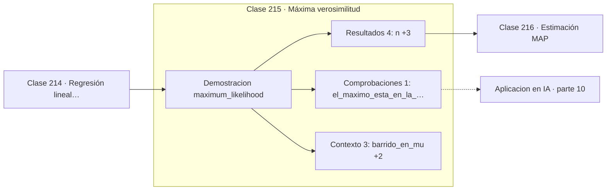

# 215 — Máxima verosimilitud

> [⬅️ 214 Regresión lineal estadística](../214-regresion-lineal-estadistica/README.md) · [📚 Parte 10](../README.md) · [🏠 Programa](../../../README.md) · [216 Estimación MAP ➡️](../216-estimacion-map/README.md)

**Parte:** 10 — Estadística e inferencia · **Nivel:** `universitario-avanzado` · **Horas estimadas:** 4
**Motor:** `engines.part10` · **Demostración:** `maximum_likelihood` · **Clase 15 de 20** de la parte

---

## 🎯 Propósito

**La máxima verosimilitud elige el parámetro que hace más probables los datos observados.**

Descriptiva, muestreo, estimadores, intervalos de confianza, pruebas de hipótesis, p-value, potencia, verosimilitud, MAP, inferencia bayesiana, bootstrap y A/B testing.

## ✅ Resultados de aprendizaje

Al terminar podrás:

1. Explicar **Máxima verosimilitud** con lenguaje cotidiano y con notación matemática.
2. Resolver un caso pequeño a mano y anticipar el orden de magnitud del resultado.
3. Ejecutar y modificar `lab.py`, que corre la demostración `maximum_likelihood`.
4. Interpretar las 8 salidas del laboratorio y decir qué comprueba cada una.
5. Detectar el error típico de esta parte: evaluar sobre datos que participaron en la selección del modelo.

## 🧩 Fórmulas de la clase

```text
L(θ) = Π f(xᵢ | θ)
ℓ(θ) = Σ log f(xᵢ | θ)
para la normal: μ̂ = x̄,  σ̂² = Σ(xᵢ − x̄)²/n
```

## 🗺️ Ubicación en el programa



## 📖 Fundamentos

La máxima verosimilitud invierte la pregunta habitual. En vez de fijar el parámetro y
preguntar qué datos son probables, fija los datos observados y pregunta qué valor del
parámetro los habría hecho más probables. Ese valor es el estimador MLE.

Se trabaja siempre con el **logaritmo** de la verosimilitud, por dos razones. La primera es
algebraica: convierte productos en sumas y las derivadas se vuelven manejables. La segunda
es numérica y decisiva: multiplicar mil densidades menores que 1 produce subdesbordamiento
a cero en punto flotante, mientras que sumar mil logaritmos no tiene ese problema. Es la
misma lección de la parte 01.

Para la normal el resultado es especialmente limpio: el MLE de la media es la media
muestral, y el de la varianza es la versión que divide entre `n`, que es sesgada. Eso ya
dice algo importante: el MLE **no tiene por qué ser insesgado**, aunque sí es consistente y
asintóticamente eficiente bajo condiciones de regularidad.

El vínculo con el aprendizaje automático es de identidad, no de analogía. Minimizar el
error cuadrático medio **es** maximizar la verosimilitud bajo ruido gaussiano; minimizar la
entropía cruzada **es** maximizar la verosimilitud bajo un modelo categórico. Las funciones
de pérdida no se inventan: se derivan del modelo probabilístico que se supone para los
datos.

## 🧮 Ejemplo trabajado

Ajuste normal por máxima verosimilitud sobre 20 observaciones.

```text
n = 20

μ̂ (MLE) = 12,6050        coincide con la media muestral
σ̂ (MLE) =  0,8411        divide entre n, no entre n−1

log-verosimilitud máxima = −24,9182

Barrido en μ manteniendo σ̂:
  μ = 11,61   →  ℓ = −39,0530
  μ = 12,11   →  ℓ = −28,4519
  μ = 12,61   →  ℓ = −24,9182     ← máximo
  μ = 13,11   →  ℓ = −28,4519
  μ = 13,61   →  ℓ = −39,0530

La curva es simétrica y su máximo cae en la media muestral.
Su curvatura en el máximo determina la precisión del estimador.
```

## 🔬 Qué ejecuta el laboratorio

`maximum_likelihood` — MLE para la normal: la media muestral maximiza la verosimilitud.

| Grupo | Salidas |
|---|---|
| 🔢 Resultados numéricos (4) | `n`, `mu_MLE`, `sigma_MLE`, `log_verosimilitud_maxima` |
| ✅ Comprobaciones de invariante (1) | `el_maximo_esta_en_la_media` |

Las claves booleanas no son adorno: si alguna fuera `False`, el resultado numérico
no sería fiable aunque el programa terminase sin error.

```bash
python classes/part-10-estadistica-e-inferencia/215-maxima-verosimilitud/lab.py
compmath run 215
```

> [!TIP]
> Antes de ejecutar, **escribe tu predicción**. Un laboratorio que confirma lo que
> esperabas enseña tanto como uno que te contradice, pero solo si la predicción
> existía antes del resultado.

## ⚠️ Errores conceptuales frecuentes

1. Multiplicar verosimilitudes en vez de sumar logaritmos.
2. Suponer que el MLE es insesgado.
3. Comparar verosimilitudes de modelos con distinto número de parámetros sin penalizar.

## 🚀 Dónde se usa de verdad

Derivación de funciones de pérdida, ajuste de modelos paramétricos, criterios AIC y BIC y
entrenamiento de modelos generativos.

## 🤖 Conexión con IA

Evaluar un modelo es inferencia estadística: métricas con intervalo, comparaciones múltiples corregidas y detección de leakage.

## 📓 Notebooks

| Archivo | Para qué |
|---|---|
| [`notebook.ipynb`](notebook.ipynb) | recorrido guiado con la demostración ejecutada |
| [`notebook_student.ipynb`](notebook_student.ipynb) | versión con `TODO` para resolver |
| [`notebook_solution.ipynb`](notebook_solution.ipynb) | solución de referencia verificada |

## 📝 Evaluación

| Criterio | Peso |
|---|---:|
| Comprensión conceptual | 25 % |
| Resolución manual | 25 % |
| Implementación y verificación | 25 % |
| Interpretación y comunicación | 15 % |
| Conexión con aplicación real | 10 % |

Detalle y criterios de error crítico en [`assessment.md`](assessment.md).

## ❓ Preguntas de comprobación

1. ¿Cuál es la entrada, cuál la salida y qué unidades tienen?
2. ¿Qué operación domina el comportamiento del resultado?
3. ¿Qué caso extremo revelaría un error conceptual?
4. ¿Cómo verificarías el resultado por un método independiente?
5. ¿Dónde aparece esto en experimentación de producto?

Si necesitas releer el código para responderlas, la clase todavía no está superada.

## 📥 Entregable

`notebook_student.ipynb` resuelto más un párrafo que explique el resultado **sin citar
código**: qué entra, qué sale, qué invariante se comprueba y qué pasaría en un caso límite.

## 📚 Bibliografía de la clase

Esta clase enseña **Estadística e inferencia · Metodología experimental · Inferencia bayesiana**. Cada obra dice qué aporta aquí y cómo se comprobó su localizador:

- [Wasserman, L. *All of Statistics*, Springer, 2004, cap. 9](https://link.springer.com/book/10.1007/978-0-387-21736-9) — Estadística e inferencia: el tema de esta clase · ISBN-13 `9780387217369` verificado en International ISBN Agency (2026-08-19).
- [Murphy, K. *Probabilistic Machine Learning: An Introduction*, MIT Press, 2022](https://probml.github.io/pml-book/book1.html) — Machine learning y Probabilidad: conexión declarada de esta parte · URL de la fuente primaria comprobada en sitio oficial del autor (2026-08-19).

Bibliografía de todas las clases, con el porqué de cada obra, en [`docs/BIBLIOGRAPHY.md`](../../../docs/BIBLIOGRAPHY.md) · localizador y estado de cada obra en [`sources/bibliography.json`](../../../sources/bibliography.json).

## 📂 Material de la clase

[`intuition.md`](intuition.md) · [`theory.md`](theory.md) · [`derivation.md`](derivation.md) · [`exercises.md`](exercises.md) · [`assessment.md`](assessment.md) · [`where-is-this-used.md`](where-is-this-used.md) · [`lesson.yaml`](lesson.yaml)

---

> [⬅️ 214 Regresión lineal estadística](../214-regresion-lineal-estadistica/README.md) · [📚 Parte 10](../README.md) · [🏠 Programa](../../../README.md) · [216 Estimación MAP ➡️](../216-estimacion-map/README.md)
