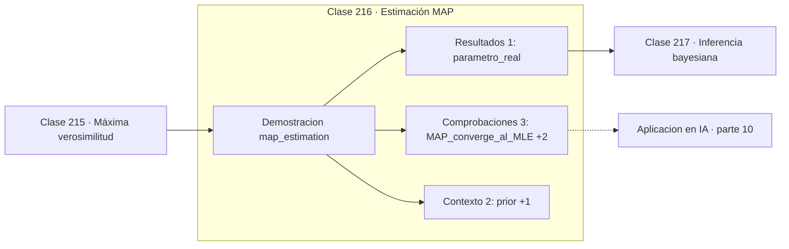

# 216 — Estimación MAP

> [⬅️ 215 Máxima verosimilitud](../215-maxima-verosimilitud/README.md) · [📚 Parte 10](../README.md) · [🏠 Programa](../../../README.md) · [217 Inferencia bayesiana ➡️](../217-inferencia-bayesiana/README.md)

**Parte:** 10 — Estadística e inferencia · **Nivel:** `universitario-avanzado` · **Horas estimadas:** 4
**Motor:** `engines.part10` · **Demostración:** `map_estimation` · **Clase 16 de 20** de la parte

---

## 🎯 Propósito

**MAP es verosimilitud más prior, y ese prior es exactamente la regularización.**

Descriptiva, muestreo, estimadores, intervalos de confianza, pruebas de hipótesis, p-value, potencia, verosimilitud, MAP, inferencia bayesiana, bootstrap y A/B testing.

## ✅ Resultados de aprendizaje

Al terminar podrás:

1. Explicar **Estimación MAP** con lenguaje cotidiano y con notación matemática.
2. Resolver un caso pequeño a mano y anticipar el orden de magnitud del resultado.
3. Ejecutar y modificar `lab.py`, que corre la demostración `map_estimation`.
4. Interpretar las 6 salidas del laboratorio y decir qué comprueba cada una.
5. Detectar el error típico de esta parte: p-hacking por comparaciones múltiples sin corrección.

## 🧩 Fórmulas de la clase

```text
θ_MAP = argmax [ log L(θ) + log p(θ) ]
prior uniforme ⟹ MAP = MLE
prior gaussiano ⟹ penalización L2;  prior Laplace ⟹ L1
```

## 🗺️ Ubicación en el programa



## 📖 Fundamentos

La estimación MAP añade a la verosimilitud una creencia previa sobre el parámetro y
maximiza la posterior. Formalmente es un cambio pequeño —sumar `log p(θ)` al objetivo—
pero cambia el comportamiento del estimador cuando hay pocos datos, que es justo cuando
hace falta ayuda.

La equivalencia con la **regularización** es exacta y merece verse una vez con detalle. Un
prior gaussiano centrado en cero aporta un término `−λ‖θ‖²` al objetivo, que es la
penalización L2 o *weight decay*. Un prior de Laplace aporta `−λ‖θ‖₁`, que es Lasso y
produce soluciones dispersas. Regularizar no es un truco de ingeniería: es declarar una
creencia previa.

El comportamiento asintótico es el esperado: al crecer `n`, la verosimilitud domina y el
MAP converge al MLE. El prior importa cuando la evidencia es escasa, se diluye cuando
abunda, y desaparece por completo si es uniforme. Esa es la respuesta a la objeción de que
el prior contamina el resultado.

La diferencia con la inferencia bayesiana completa de la clase siguiente es que MAP se
queda con un **punto**: el máximo de la posterior. Es rápido y encaja con cualquier
optimizador, pero descarta toda la información sobre incertidumbre. Y en dimensión alta el
máximo puede estar en una región de probabilidad casi nula, lo que hace de MAP un resumen
engañoso de la posterior.

## 🧮 Ejemplo trabajado

Prior sesgado hacia 0,8 frente a un parámetro real de 0,4.

```text
parámetro real = 0,40      prior = Beta(8,2), centrado en 0,8

     n     MLE      MAP     distancia MAP al real
     5   0,6000   0,7692        0,3692
    20   0,4500   0,5357        0,1357
   100   0,4100   0,4340        0,0340
  1000   0,4030   0,4055        0,0055

Con n = 5 el prior domina y empeora la estimación.
Con n = 1000 el prior es irrelevante: MAP → MLE.

Equivalencias:
  prior uniforme   →  MAP = MLE
  prior gaussiano  →  regularización L2
  prior Laplace    →  regularización L1
```

## 🔬 Qué ejecuta el laboratorio

`map_estimation` — MAP: verosimilitud más prior, y su límite con muchos datos.

| Grupo | Salidas |
|---|---|
| 🔢 Resultados numéricos (1) | `parametro_real` |
| ✅ Comprobaciones de invariante (3) | `MAP_converge_al_MLE`, `el_prior_domina_con_pocos_datos`, `MAP_con_prior_uniforme_es_MLE` |

Las claves booleanas no son adorno: si alguna fuera `False`, el resultado numérico
no sería fiable aunque el programa terminase sin error.

```bash
python classes/part-10-estadistica-e-inferencia/216-estimacion-map/lab.py
compmath run 216
```

> [!TIP]
> Antes de ejecutar, **escribe tu predicción**. Un laboratorio que confirma lo que
> esperabas enseña tanto como uno que te contradice, pero solo si la predicción
> existía antes del resultado.

## ⚠️ Errores conceptuales frecuentes

1. Usar un prior fuerte con pocos datos y presentar el resultado como empírico.
2. Creer que MAP resume bien la posterior en dimensión alta.
3. No declarar el prior elegido al reportar una estimación MAP.

## 🚀 Dónde se usa de verdad

Weight decay y Lasso, suavizado de Laplace en modelos de lenguaje, estimación con datos
escasos y calibración con conocimiento del dominio.

## 🤖 Conexión con IA

Evaluar un modelo es inferencia estadística: métricas con intervalo, comparaciones múltiples corregidas y detección de leakage.

## 📓 Notebooks

| Archivo | Para qué |
|---|---|
| [`notebook.ipynb`](notebook.ipynb) | recorrido guiado con la demostración ejecutada |
| [`notebook_student.ipynb`](notebook_student.ipynb) | versión con `TODO` para resolver |
| [`notebook_solution.ipynb`](notebook_solution.ipynb) | solución de referencia verificada |

## 📝 Evaluación

| Criterio | Peso |
|---|---:|
| Comprensión conceptual | 25 % |
| Resolución manual | 25 % |
| Implementación y verificación | 25 % |
| Interpretación y comunicación | 15 % |
| Conexión con aplicación real | 10 % |

Detalle y criterios de error crítico en [`assessment.md`](assessment.md).

## ❓ Preguntas de comprobación

1. ¿Cuál es la entrada, cuál la salida y qué unidades tienen?
2. ¿Qué operación domina el comportamiento del resultado?
3. ¿Qué caso extremo revelaría un error conceptual?
4. ¿Cómo verificarías el resultado por un método independiente?
5. ¿Dónde aparece esto en experimentación de producto?

Si necesitas releer el código para responderlas, la clase todavía no está superada.

## 📥 Entregable

`notebook_student.ipynb` resuelto más un párrafo que explique el resultado **sin citar
código**: qué entra, qué sale, qué invariante se comprueba y qué pasaría en un caso límite.

## 📚 Bibliografía de la clase

Esta clase enseña **Estadística e inferencia · Metodología experimental · Inferencia bayesiana**. Cada obra dice qué aporta aquí y cómo se comprobó su localizador:

- [Murphy, K. *Probabilistic Machine Learning: An Introduction*, MIT Press, 2022](https://probml.github.io/pml-book/book1.html) — Machine learning y Probabilidad: conexión declarada de esta parte · URL de la fuente primaria comprobada en sitio oficial del autor (2026-08-19).
- [Bishop, C. *Pattern Recognition and Machine Learning*, Springer, 2006, cap. 3](https://www.microsoft.com/en-us/research/publication/pattern-recognition-machine-learning/) — Inferencia bayesiana: el tema de esta clase · URL de la fuente primaria comprobada en www.microsoft.com (2026-08-19).

Bibliografía de todas las clases, con el porqué de cada obra, en [`docs/BIBLIOGRAPHY.md`](../../../docs/BIBLIOGRAPHY.md) · localizador y estado de cada obra en [`sources/bibliography.json`](../../../sources/bibliography.json).

## 📂 Material de la clase

[`intuition.md`](intuition.md) · [`theory.md`](theory.md) · [`derivation.md`](derivation.md) · [`exercises.md`](exercises.md) · [`assessment.md`](assessment.md) · [`where-is-this-used.md`](where-is-this-used.md) · [`lesson.yaml`](lesson.yaml)

---

> [⬅️ 215 Máxima verosimilitud](../215-maxima-verosimilitud/README.md) · [📚 Parte 10](../README.md) · [🏠 Programa](../../../README.md) · [217 Inferencia bayesiana ➡️](../217-inferencia-bayesiana/README.md)
