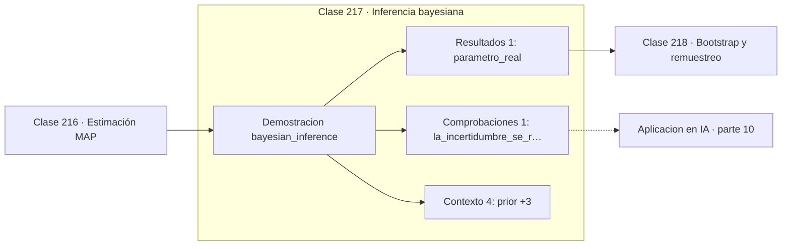

# 217 — Inferencia bayesiana

> [⬅️ 216 Estimación MAP](../216-estimacion-map/README.md) · [📚 Parte 10](../README.md) · [🏠 Programa](../../../README.md) · [218 Bootstrap y remuestreo ➡️](../218-bootstrap-y-remuestreo/README.md)

**Parte:** 10 — Estadística e inferencia · **Nivel:** `universitario-avanzado` · **Horas estimadas:** 4
**Motor:** `engines.part10` · **Demostración:** `bayesian_inference` · **Clase 17 de 20** de la parte

---

## 🎯 Propósito

**El intervalo creíble sí admite la lectura probabilística que el de confianza no admite.**

Descriptiva, muestreo, estimadores, intervalos de confianza, pruebas de hipótesis, p-value, potencia, verosimilitud, MAP, inferencia bayesiana, bootstrap y A/B testing.

## ✅ Resultados de aprendizaje

Al terminar podrás:

1. Explicar **Inferencia bayesiana** con lenguaje cotidiano y con notación matemática.
2. Resolver un caso pequeño a mano y anticipar el orden de magnitud del resultado.
3. Ejecutar y modificar `lab.py`, que corre la demostración `bayesian_inference`.
4. Interpretar las 6 salidas del laboratorio y decir qué comprueba cada una.
5. Detectar el error típico de esta parte: confundir significancia estadística con relevancia práctica.

## 🧩 Fórmulas de la clase

```text
p(θ | datos) ∝ p(datos | θ)·p(θ)
Beta(a,b) + k éxitos en n ⟹ Beta(a+k, b+n−k)
intervalo creíble al 95 %: región con masa posterior 0,95
```

## 🗺️ Ubicación en el programa



## 📖 Fundamentos

La inferencia bayesiana trata el parámetro como una variable aleatoria y devuelve su
**distribución completa** dada la evidencia. No un punto con una barra de error, sino una
función que asigna plausibilidad a cada valor posible. De ella se leen la media, la moda,
la desviación y cualquier intervalo que interese.

Esa diferencia de objeto produce una diferencia de interpretación. El **intervalo creíble**
al 95 % contiene el parámetro con probabilidad 0,95 **según la posterior**, y esa es
exactamente la frase que no se podía decir del intervalo de confianza en la clase 205. La
lectura intuitiva que todo el mundo quiere hacer es correcta aquí, y solo aquí.

La **conjugación** hace el cálculo trivial en casos favorables. Con prior Beta y
verosimilitud binomial, la posterior es Beta con parámetros actualizados: sumar los éxitos
a `a` y los fracasos a `b`. Un prior `Beta(1,1)` es uniforme y representa ignorancia
previa; con él, la media posterior es `(k+1)/(n+2)`, la regla de sucesión de Laplace.

Lo que el enfoque exige a cambio es **declarar el prior**. Esa exigencia se presenta a veces
como debilidad, pero es transparencia: todo análisis incorpora supuestos, y el bayesiano
obliga a escribirlos. La crítica seria no es filosófica sino computacional: fuera de los
casos conjugados la posterior no tiene forma cerrada y hay que recurrir a MCMC o a
inferencia variacional, que es adonde llega la parte 17.

## 🧮 Ejemplo trabajado

Prior uniforme y evidencia creciente sobre un parámetro real de 0,62.

```text
parámetro real = 0,62      prior = Beta(1,1) = uniforme

   n    posterior        media     desv.
   0    Beta(1,1)       0,5000    0,2887
  10    Beta(7,5)       0,5833    0,1370
  50    Beta(32,20)     0,6154    0,0669
 200    Beta(125,77)    0,6188    0,0340
1000    Beta(621,381)   0,6198    0,0153

La media se acerca al valor real y la desviación cae como 1/√n.

Intervalo creíble al 95 % con n = 1000:
  aproximadamente (0,590 , 0,650)

Lectura legítima:
  "hay un 95 % de probabilidad de que θ esté ahí"
Esa frase sería incorrecta para un intervalo de confianza.
```

## 🔬 Qué ejecuta el laboratorio

`bayesian_inference` — Actualización bayesiana conjugada Beta-Binomial.

| Grupo | Salidas |
|---|---|
| 🔢 Resultados numéricos (1) | `parametro_real` |
| ✅ Comprobaciones de invariante (1) | `la_incertidumbre_se_reduce` |

Las claves booleanas no son adorno: si alguna fuera `False`, el resultado numérico
no sería fiable aunque el programa terminase sin error.

```bash
python classes/part-10-estadistica-e-inferencia/217-inferencia-bayesiana/lab.py
compmath run 217
```

> [!TIP]
> Antes de ejecutar, **escribe tu predicción**. Un laboratorio que confirma lo que
> esperabas enseña tanto como uno que te contradice, pero solo si la predicción
> existía antes del resultado.

## ⚠️ Errores conceptuales frecuentes

1. No declarar el prior utilizado.
2. Tratar intervalo creíble e intervalo de confianza como sinónimos.
3. Actualizar dos veces con la misma evidencia.

## 🚀 Dónde se usa de verdad

Tests A/B bayesianos, bandidos multibrazo, cuantificación de incertidumbre en modelos y
estimación con datos escasos.

## 🤖 Conexión con IA

Evaluar un modelo es inferencia estadística: métricas con intervalo, comparaciones múltiples corregidas y detección de leakage.

## 📓 Notebooks

| Archivo | Para qué |
|---|---|
| [`notebook.ipynb`](notebook.ipynb) | recorrido guiado con la demostración ejecutada |
| [`notebook_student.ipynb`](notebook_student.ipynb) | versión con `TODO` para resolver |
| [`notebook_solution.ipynb`](notebook_solution.ipynb) | solución de referencia verificada |

## 📝 Evaluación

| Criterio | Peso |
|---|---:|
| Comprensión conceptual | 25 % |
| Resolución manual | 25 % |
| Implementación y verificación | 25 % |
| Interpretación y comunicación | 15 % |
| Conexión con aplicación real | 10 % |

Detalle y criterios de error crítico en [`assessment.md`](assessment.md).

## ❓ Preguntas de comprobación

1. ¿Cuál es la entrada, cuál la salida y qué unidades tienen?
2. ¿Qué operación domina el comportamiento del resultado?
3. ¿Qué caso extremo revelaría un error conceptual?
4. ¿Cómo verificarías el resultado por un método independiente?
5. ¿Dónde aparece esto en experimentación de producto?

Si necesitas releer el código para responderlas, la clase todavía no está superada.

## 📥 Entregable

`notebook_student.ipynb` resuelto más un párrafo que explique el resultado **sin citar
código**: qué entra, qué sale, qué invariante se comprueba y qué pasaría en un caso límite.

## 🔗 Referencias

- [Gelman, A. et al. *Bayesian Data Analysis*, 3ª ed., CRC, 2013](http://www.stat.columbia.edu/~gelman/book/)
- [McElreath, R. *Statistical Rethinking*, 2ª ed., CRC, 2020](https://xcelab.net/rm/statistical-rethinking/)

Bibliografía completa de la parte en [`../../../docs/BIBLIOGRAPHY.md`](../../../docs/BIBLIOGRAPHY.md).

## 📂 Material de la clase

[`intuition.md`](intuition.md) · [`theory.md`](theory.md) · [`derivation.md`](derivation.md) · [`exercises.md`](exercises.md) · [`assessment.md`](assessment.md) · [`where-is-this-used.md`](where-is-this-used.md) · [`lesson.yaml`](lesson.yaml)

---

> [⬅️ 216 Estimación MAP](../216-estimacion-map/README.md) · [📚 Parte 10](../README.md) · [🏠 Programa](../../../README.md) · [218 Bootstrap y remuestreo ➡️](../218-bootstrap-y-remuestreo/README.md)
