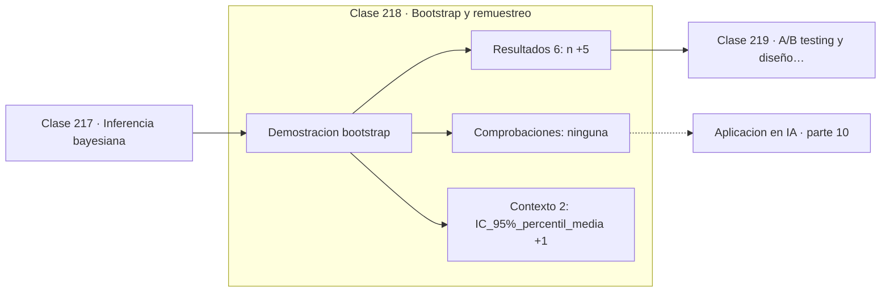

# 218 — Bootstrap y remuestreo

> [⬅️ 217 Inferencia bayesiana](../217-inferencia-bayesiana/README.md) · [📚 Parte 10](../README.md) · [🏠 Programa](../../../README.md) · [219 A/B testing y diseño experimental ➡️](../219-a-b-testing-y-diseno-experimental/README.md)

**Parte:** 10 — Estadística e inferencia · **Nivel:** `universitario-avanzado` · **Horas estimadas:** 4
**Motor:** `engines.part10` · **Demostración:** `bootstrap` · **Clase 18 de 20** de la parte

---

## 🎯 Propósito

**El bootstrap estima la variabilidad remuestreando los datos, sin suponer distribución.**

Descriptiva, muestreo, estimadores, intervalos de confianza, pruebas de hipótesis, p-value, potencia, verosimilitud, MAP, inferencia bayesiana, bootstrap y A/B testing.

## ✅ Resultados de aprendizaje

Al terminar podrás:

1. Explicar **Bootstrap y remuestreo** con lenguaje cotidiano y con notación matemática.
2. Resolver un caso pequeño a mano y anticipar el orden de magnitud del resultado.
3. Ejecutar y modificar `lab.py`, que corre la demostración `bootstrap`.
4. Interpretar las 8 salidas del laboratorio y decir qué comprueba cada una.
5. Detectar el error típico de esta parte: evaluar sobre datos que participaron en la selección del modelo.

## 🧩 Fórmulas de la clase

```text
remuestrear n observaciones con reposición, B veces
SE_bootstrap = desviación estándar de las B réplicas
IC percentil: cuantiles 2,5 % y 97,5 % de las réplicas
```

## 🗺️ Ubicación en el programa



## 📖 Fundamentos

El bootstrap parte de una idea que suena a trampa: usar la muestra como si fuera la
población. Se extraen `B` muestras del mismo tamaño **con reposición** de los datos
originales, se calcula el estadístico en cada una, y la dispersión de esas `B` réplicas
estima la variabilidad del estadístico.

Su valor está en que funciona para estadísticos **sin fórmula cerrada**. Para la media
existe `σ/√n`, pero para la mediana, el percentil 95, la razón de dos medias, el
coeficiente de correlación o una métrica de evaluación de un modelo, deducir el error
estándar analíticamente es difícil o imposible. El bootstrap lo obtiene igual en todos los
casos, cambiando análisis por cómputo.

El **intervalo percentil** se lee directamente de los cuantiles de las réplicas, sin
suponer normalidad ni simetría. Con distribuciones asimétricas produce intervalos
asimétricos, que es lo correcto, mientras que el intervalo `±1,96·SE` fuerza simetría
aunque los datos no la tengan.

No es magia y tiene límites claros. Sigue exigiendo que la muestra sea representativa —el
bootstrap no arregla el sesgo de selección de la clase 202— y falla con estadísticos de
valores extremos, como el máximo, porque el remuestreo no puede generar valores que no
estaban. Con datos dependientes hay que usar variantes por bloques.

## 🧮 Ejemplo trabajado

Bootstrap de la media con 20 observaciones y 10 000 réplicas.

```text
n = 20        B = 10 000
media observada = 12,6050

SE bootstrap = 0,188371
SE teórico   = 0,192965        coinciden al 2 %      ✓

IC 95 % percentil: (12,235 , 12,980)
IC 95 % paramétrico: (12,227 , 12,983)

Ventaja real: la mediana no tiene fórmula sencilla de SE,
y el bootstrap la da con el mismo procedimiento.

Límite: para el máximo el bootstrap subestima gravemente
la variabilidad, porque nunca genera valores nuevos.
```

## 🔬 Qué ejecuta el laboratorio

`bootstrap` — Bootstrap: estimar la variabilidad sin suponer la distribución.

| Grupo | Salidas |
|---|---|
| 🔢 Resultados numéricos (6) | `n`, `replicas`, `media_observada`, `SE_bootstrap_de_la_media`, `SE_teorico`, `SE_bootstrap_de_la_mediana` |
| ✅ Comprobaciones de invariante (0) | — |

Las claves booleanas no son adorno: si alguna fuera `False`, el resultado numérico
no sería fiable aunque el programa terminase sin error.

```bash
python classes/part-10-estadistica-e-inferencia/218-bootstrap-y-remuestreo/lab.py
compmath run 218
```

> [!TIP]
> Antes de ejecutar, **escribe tu predicción**. Un laboratorio que confirma lo que
> esperabas enseña tanto como uno que te contradice, pero solo si la predicción
> existía antes del resultado.

## ⚠️ Errores conceptuales frecuentes

1. Remuestrear sin reposición: se recupera siempre la muestra original.
2. Usarlo con estadísticos de extremos como máximos o mínimos.
3. Creer que corrige un muestreo sesgado.

## 🚀 Dónde se usa de verdad

Intervalos de confianza para métricas de modelos, comparación de algoritmos, estimación de
incertidumbre en estadísticos complejos y bagging.

## 🤖 Conexión con IA

Evaluar un modelo es inferencia estadística: métricas con intervalo, comparaciones múltiples corregidas y detección de leakage.

## 📓 Notebooks

| Archivo | Para qué |
|---|---|
| [`notebook.ipynb`](notebook.ipynb) | recorrido guiado con la demostración ejecutada |
| [`notebook_student.ipynb`](notebook_student.ipynb) | versión con `TODO` para resolver |
| [`notebook_solution.ipynb`](notebook_solution.ipynb) | solución de referencia verificada |

## 📝 Evaluación

| Criterio | Peso |
|---|---:|
| Comprensión conceptual | 25 % |
| Resolución manual | 25 % |
| Implementación y verificación | 25 % |
| Interpretación y comunicación | 15 % |
| Conexión con aplicación real | 10 % |

Detalle y criterios de error crítico en [`assessment.md`](assessment.md).

## ❓ Preguntas de comprobación

1. ¿Cuál es la entrada, cuál la salida y qué unidades tienen?
2. ¿Qué operación domina el comportamiento del resultado?
3. ¿Qué caso extremo revelaría un error conceptual?
4. ¿Cómo verificarías el resultado por un método independiente?
5. ¿Dónde aparece esto en experimentación de producto?

Si necesitas releer el código para responderlas, la clase todavía no está superada.

## 📥 Entregable

`notebook_student.ipynb` resuelto más un párrafo que explique el resultado **sin citar
código**: qué entra, qué sale, qué invariante se comprueba y qué pasaría en un caso límite.

## 📚 Bibliografía de la clase

Esta clase enseña **Estadística e inferencia · Metodología experimental · Inferencia bayesiana**. Cada obra dice qué aporta aquí y cómo se comprobó su localizador:

- [Efron, B.; Tibshirani, R. *An Introduction to the Bootstrap*, Chapman & Hall, 1993](https://doi.org/10.1201/9780429246593) — Estadística e inferencia: el tema de esta clase · ISBN-13 `9780429246593` verificado en International ISBN Agency (2026-08-19).
- [Wasserman, L. *All of Statistics*, Springer, 2004, cap. 8](https://link.springer.com/book/10.1007/978-0-387-21736-9) — Estadística e inferencia: el tema de esta clase · ISBN-13 `9780387217369` verificado en International ISBN Agency (2026-08-19).

Bibliografía de todas las clases, con el porqué de cada obra, en [`docs/BIBLIOGRAPHY.md`](../../../docs/BIBLIOGRAPHY.md) · localizador y estado de cada obra en [`sources/bibliography.json`](../../../sources/bibliography.json).

## 📂 Material de la clase

[`intuition.md`](intuition.md) · [`theory.md`](theory.md) · [`derivation.md`](derivation.md) · [`exercises.md`](exercises.md) · [`assessment.md`](assessment.md) · [`where-is-this-used.md`](where-is-this-used.md) · [`lesson.yaml`](lesson.yaml)

---

> [⬅️ 217 Inferencia bayesiana](../217-inferencia-bayesiana/README.md) · [📚 Parte 10](../README.md) · [🏠 Programa](../../../README.md) · [219 A/B testing y diseño experimental ➡️](../219-a-b-testing-y-diseno-experimental/README.md)
