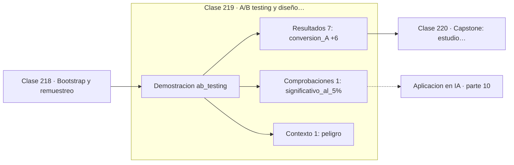

# 219 — A/B testing y diseño experimental

> [⬅️ 218 Bootstrap y remuestreo](../218-bootstrap-y-remuestreo/README.md) · [📚 Parte 10](../README.md) · [🏠 Programa](../../../README.md) · [220 Capstone: estudio estadístico reproducible ➡️](../220-capstone-estudio-estadistico-reproducible/README.md)

**Parte:** 10 — Estadística e inferencia · **Nivel:** `universitario-avanzado` · **Horas estimadas:** 4
**Motor:** `engines.part10` · **Demostración:** `ab_testing` · **Clase 19 de 20** de la parte

---

## 🎯 Propósito

**Un A/B test se diseña antes de recogerlo: tamaño muestral, métrica y criterio de parada.**

Descriptiva, muestreo, estimadores, intervalos de confianza, pruebas de hipótesis, p-value, potencia, verosimilitud, MAP, inferencia bayesiana, bootstrap y A/B testing.

## ✅ Resultados de aprendizaje

Al terminar podrás:

1. Explicar **A/B testing y diseño experimental** con lenguaje cotidiano y con notación matemática.
2. Resolver un caso pequeño a mano y anticipar el orden de magnitud del resultado.
3. Ejecutar y modificar `lab.py`, que corre la demostración `ab_testing`.
4. Interpretar las 9 salidas del laboratorio y decir qué comprueba cada una.
5. Detectar el error típico de esta parte: p-hacking por comparaciones múltiples sin corrección.

## 🧩 Fórmulas de la clase

```text
z = (p̂_B − p̂_A) / √(p̂(1−p̂)(1/n_A + 1/n_B))
lift relativo = (p_B − p_A) / p_A
n por grupo ≈ 16·p(1−p) / Δ²  para 80 % de potencia
```

## 🗺️ Ubicación en el programa



## 📖 Fundamentos

Un A/B test es un ensayo controlado aleatorizado aplicado a producto. La aleatorización es
lo que le da valor causal: si la asignación al grupo es al azar, las diferencias
observadas se atribuyen al cambio y no a características previas de los usuarios. Sin
aleatorización es un estudio observacional con todos los confusores de la clase 213.

Tres decisiones deben tomarse **antes** de recoger datos: la métrica principal, el tamaño
del efecto mínimo relevante, y el tamaño muestral que da potencia suficiente para
detectarlo. Sin esas tres, el experimento no puede concluir nada aunque se ejecute
perfectamente.

El error operativo más destructivo es el **peeking**: mirar el resultado a diario y parar
cuando aparece `p < 0,05`. Ese procedimiento multiplica la tasa de falsos positivos por
tres o más, porque da múltiples oportunidades de cruzar el umbral por azar. Las soluciones
son fijar la duración de antemano o usar métodos de parada secuencial diseñados para ello.

Y hay que separar significancia de relevancia. Un lift del 17 % con `p = 0,0098` es un
resultado sólido; el mismo `p` con un lift del 0,3 % puede no justificar el coste del
cambio. Lo que se decide no es si el efecto es distinto de cero, sino si merece la pena, y
para eso hace falta el intervalo del efecto, no el p-value.

## 🧮 Ejemplo trabajado

Experimento de conversión con 4 000 usuarios por grupo.

```text
grupo A (control):    conversión 0,10350
grupo B (variante):   conversión 0,12175
diferencia absoluta:  0,01825
lift relativo:        17,63 %

n por grupo = 4 000
proporción combinada p̂ = 0,112625
SE = √(0,112625 · 0,887375 · (1/4000 + 1/4000)) = 0,007070

z = 0,01825 / 0,007070 = 2,5817
p = 0,00983     →  significativo al 5 %

IC 95 % de la diferencia:
  0,01825 ± 1,96 × 0,007070 = (0,00439 , 0,03211)
  lift entre 4,2 % y 31,0 %

Peeking diario durante 14 días sin corrección:
  tasa real de falsos positivos ≈ 20 %, no 5 %.
```

## 🔬 Qué ejecuta el laboratorio

`ab_testing` — A/B test de proporciones con tamaño muestral y significancia.

| Grupo | Salidas |
|---|---|
| 🔢 Resultados numéricos (7) | `conversion_A`, `conversion_B`, `lift_relativo_%`, `n_por_grupo`, `estadistico_z`, `p_value`, `n_requerido_para_80%_de_potencia` |
| ✅ Comprobaciones de invariante (1) | `significativo_al_5%` |

Las claves booleanas no son adorno: si alguna fuera `False`, el resultado numérico
no sería fiable aunque el programa terminase sin error.

```bash
python classes/part-10-estadistica-e-inferencia/219-a-b-testing-y-diseno-experimental/lab.py
compmath run 219
```

> [!TIP]
> Antes de ejecutar, **escribe tu predicción**. Un laboratorio que confirma lo que
> esperabas enseña tanto como uno que te contradice, pero solo si la predicción
> existía antes del resultado.

## ⚠️ Errores conceptuales frecuentes

1. Parar el experimento en cuanto el p-value baja de 0,05.
2. Cambiar la métrica principal después de ver los resultados.
3. Confundir significancia con impacto suficiente para justificar el cambio.

## 🚀 Dónde se usa de verdad

Experimentación de producto, comparación de modelos en producción, optimización de
conversión y despliegues progresivos.

## 🤖 Conexión con IA

Evaluar un modelo es inferencia estadística: métricas con intervalo, comparaciones múltiples corregidas y detección de leakage.

## 📓 Notebooks

| Archivo | Para qué |
|---|---|
| [`notebook.ipynb`](notebook.ipynb) | recorrido guiado con la demostración ejecutada |
| [`notebook_student.ipynb`](notebook_student.ipynb) | versión con `TODO` para resolver |
| [`notebook_solution.ipynb`](notebook_solution.ipynb) | solución de referencia verificada |

## 📝 Evaluación

| Criterio | Peso |
|---|---:|
| Comprensión conceptual | 25 % |
| Resolución manual | 25 % |
| Implementación y verificación | 25 % |
| Interpretación y comunicación | 15 % |
| Conexión con aplicación real | 10 % |

Detalle y criterios de error crítico en [`assessment.md`](assessment.md).

## ❓ Preguntas de comprobación

1. ¿Cuál es la entrada, cuál la salida y qué unidades tienen?
2. ¿Qué operación domina el comportamiento del resultado?
3. ¿Qué caso extremo revelaría un error conceptual?
4. ¿Cómo verificarías el resultado por un método independiente?
5. ¿Dónde aparece esto en experimentación de producto?

Si necesitas releer el código para responderlas, la clase todavía no está superada.

## 📥 Entregable

`notebook_student.ipynb` resuelto más un párrafo que explique el resultado **sin citar
código**: qué entra, qué sale, qué invariante se comprueba y qué pasaría en un caso límite.

## 🔗 Referencias

- [Kohavi, R.; Tang, D.; Xu, Y. *Trustworthy Online Controlled Experiments*, Cambridge, 2020](https://experimentguide.com/)
- [Wasserman, L. *All of Statistics*, Springer, 2004, cap. 10](https://link.springer.com/book/10.1007/978-0-387-21736-9)

Bibliografía completa de la parte en [`../../../docs/BIBLIOGRAPHY.md`](../../../docs/BIBLIOGRAPHY.md).

## 📂 Material de la clase

[`intuition.md`](intuition.md) · [`theory.md`](theory.md) · [`derivation.md`](derivation.md) · [`exercises.md`](exercises.md) · [`assessment.md`](assessment.md) · [`where-is-this-used.md`](where-is-this-used.md) · [`lesson.yaml`](lesson.yaml)

---

> [⬅️ 218 Bootstrap y remuestreo](../218-bootstrap-y-remuestreo/README.md) · [📚 Parte 10](../README.md) · [🏠 Programa](../../../README.md) · [220 Capstone: estudio estadístico reproducible ➡️](../220-capstone-estudio-estadistico-reproducible/README.md)
