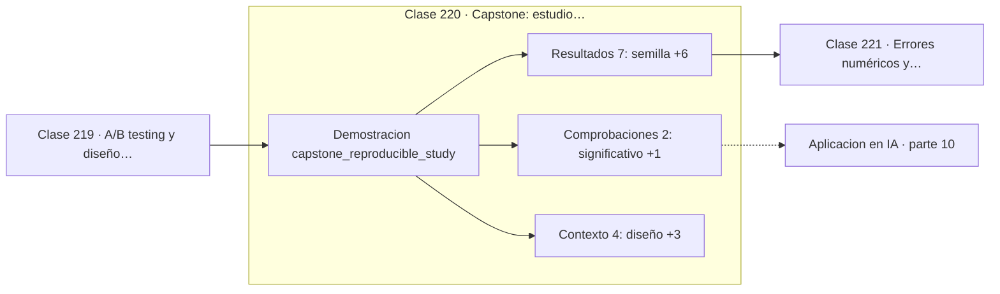

# 220 — Capstone: estudio estadístico reproducible

> [⬅️ 219 A/B testing y diseño experimental](../219-a-b-testing-y-diseno-experimental/README.md) · [📚 Parte 10](../README.md) · [🏠 Programa](../../../README.md) · [221 Errores numéricos y convergencia ➡️](../../part-11-metodos-numericos-y-computacion-cientifica/221-errores-numericos-y-convergencia/README.md)

**Parte:** 10 — Estadística e inferencia · **Nivel:** `universitario-avanzado` · **Horas estimadas:** 4
**Motor:** `engines.part10` · **Demostración:** `capstone_reproducible_study` · **Clase 20 de 20** de la parte

---

## 🎯 Propósito

**Un estudio creíble declara su semilla, su intervalo y lo que no puede concluir.**

Descriptiva, muestreo, estimadores, intervalos de confianza, pruebas de hipótesis, p-value, potencia, verosimilitud, MAP, inferencia bayesiana, bootstrap y A/B testing.

## ✅ Resultados de aprendizaje

Al terminar podrás:

1. Explicar **Capstone: estudio estadístico reproducible** con lenguaje cotidiano y con notación matemática.
2. Resolver un caso pequeño a mano y anticipar el orden de magnitud del resultado.
3. Ejecutar y modificar `lab.py`, que corre la demostración `capstone_reproducible_study`.
4. Interpretar las 13 salidas del laboratorio y decir qué comprueba cada una.
5. Detectar el error típico de esta parte: confundir significancia estadística con relevancia práctica.

## 🧩 Fórmulas de la clase

```text
reportar: efecto, IC, n, α, potencia y semilla
IC paramétrico frente a IC bootstrap como comprobación cruzada
d de Cohen = diferencia / desviación combinada
```

## 🗺️ Ubicación en el programa



## 📖 Fundamentos

El capstone ejecuta un estudio completo con la disciplina de la parte entera: diseño de
dos grupos independientes, semilla fija, análisis decidido de antemano, y reporte que
incluye tanto lo que se concluye como lo que no. El objetivo no es obtener un resultado
llamativo sino uno **defendible**.

La **reproducibilidad** empieza por la semilla. Un análisis que no se puede reejecutar y
obtener los mismos números no es verificable, y no serlo es un defecto tan grave como un
error de cálculo. Fijar la semilla, versionar los datos y dejar el código ejecutable es lo
mínimo exigible.

El reporte debe llevar el **efecto con su intervalo**, no solo el p-value. Y conviene
calcular el intervalo por dos vías —paramétrica y bootstrap— porque su coincidencia es
evidencia de que los supuestos se sostienen, y su discrepancia es una señal de alarma que
merece investigarse antes de publicar.

Por último, un estudio honesto **declara sus límites**: la población a la que se puede
extrapolar, los supuestos que se han hecho, las comparaciones que se han realizado y las
preguntas que este diseño no puede responder. Escribir esa sección obliga a mirar las
debilidades, y esa mirada es lo que separa el análisis del marketing con números.

## 🧮 Ejemplo trabajado

Estudio de dos grupos con n = 60 por brazo, semilla fija.

```text
semilla = 20260827
diseño: dos grupos independientes, n = 60 cada uno

media control      = 73,1961
media tratamiento  = 75,2439
diferencia         =  2,0478

IC 95 % paramétrico: (−0,9648 , 5,0604)
IC 95 % bootstrap:   (−0,9531 , 5,0442)      coinciden   ✓

El intervalo contiene el cero → no se rechaza H0.
p ≈ 0,18       d de Cohen ≈ 0,25 (efecto pequeño)

Potencia para d = 0,25 con n = 60 por grupo: ≈ 30 %
→ el estudio no tenía potencia para detectarlo

Conclusión honesta: no hay evidencia suficiente; el diseño
no permite descartar un efecto de hasta 5 puntos.
```

## 🔬 Qué ejecuta el laboratorio

`capstone_reproducible_study` — Capstone: estudio completo, reproducible y con límites declarados.

| Grupo | Salidas |
|---|---|
| 🔢 Resultados numéricos (7) | `semilla`, `media_control`, `media_tratamiento`, `diferencia`, `estadistico_t`, `d_de_Cohen`, `potencia_aproximada` |
| ✅ Comprobaciones de invariante (2) | `significativo`, `reproducible` |

Las claves booleanas no son adorno: si alguna fuera `False`, el resultado numérico
no sería fiable aunque el programa terminase sin error.

```bash
python classes/part-10-estadistica-e-inferencia/220-capstone-estudio-estadistico-reproducible/lab.py
compmath run 220
```

> [!TIP]
> Antes de ejecutar, **escribe tu predicción**. Un laboratorio que confirma lo que
> esperabas enseña tanto como uno que te contradice, pero solo si la predicción
> existía antes del resultado.

## ⚠️ Errores conceptuales frecuentes

1. Publicar sin semilla ni código ejecutable.
2. Reportar el p-value sin el tamaño del efecto ni su intervalo.
3. Omitir la sección de limitaciones y las comparaciones realizadas.

## 🚀 Dónde se usa de verdad

Informes técnicos, tarjetas de modelo, publicaciones científicas, auditorías internas y
documentación de experimentos de producto.

## 🤖 Conexión con IA

Evaluar un modelo es inferencia estadística: métricas con intervalo, comparaciones múltiples corregidas y detección de leakage.

## 📓 Notebooks

| Archivo | Para qué |
|---|---|
| [`notebook.ipynb`](notebook.ipynb) | recorrido guiado con la demostración ejecutada |
| [`notebook_student.ipynb`](notebook_student.ipynb) | versión con `TODO` para resolver |
| [`notebook_solution.ipynb`](notebook_solution.ipynb) | solución de referencia verificada |

## 📝 Evaluación

| Criterio | Peso |
|---|---:|
| Comprensión conceptual | 25 % |
| Resolución manual | 25 % |
| Implementación y verificación | 25 % |
| Interpretación y comunicación | 15 % |
| Conexión con aplicación real | 10 % |

Detalle y criterios de error crítico en [`assessment.md`](assessment.md).

## ❓ Preguntas de comprobación

1. ¿Cuál es la entrada, cuál la salida y qué unidades tienen?
2. ¿Qué operación domina el comportamiento del resultado?
3. ¿Qué caso extremo revelaría un error conceptual?
4. ¿Cómo verificarías el resultado por un método independiente?
5. ¿Dónde aparece esto en experimentación de producto?

Si necesitas releer el código para responderlas, la clase todavía no está superada.

## 📥 Entregable

`notebook_student.ipynb` resuelto más un párrafo que explique el resultado **sin citar
código**: qué entra, qué sale, qué invariante se comprueba y qué pasaría en un caso límite.

## 🔗 Referencias

- [Kohavi, R.; Tang, D.; Xu, Y. *Trustworthy Online Controlled Experiments*, Cambridge, 2020](https://experimentguide.com/) — *uso:* obra de referencia consultada en «Capstone: estudio estadístico reproducible».
- [Wilson, G. et al. *Good enough practices in scientific computing*, PLOS Computational Biology, 2017](https://doi.org/10.1371/journal.pcbi.1005510) — *uso:* artículo de origen consultado en «Capstone: estudio estadístico reproducible».

Bibliografía completa de la parte en [`../../../docs/BIBLIOGRAPHY.md`](../../../docs/BIBLIOGRAPHY.md) · localizador verificable de cada obra en [`sources/bibliography.json`](../../../sources/bibliography.json).

## 📂 Material de la clase

[`intuition.md`](intuition.md) · [`theory.md`](theory.md) · [`derivation.md`](derivation.md) · [`exercises.md`](exercises.md) · [`assessment.md`](assessment.md) · [`where-is-this-used.md`](where-is-this-used.md) · [`lesson.yaml`](lesson.yaml)

---

> [⬅️ 219 A/B testing y diseño experimental](../219-a-b-testing-y-diseno-experimental/README.md) · [📚 Parte 10](../README.md) · [🏠 Programa](../../../README.md) · [221 Errores numéricos y convergencia ➡️](../../part-11-metodos-numericos-y-computacion-cientifica/221-errores-numericos-y-convergencia/README.md)
