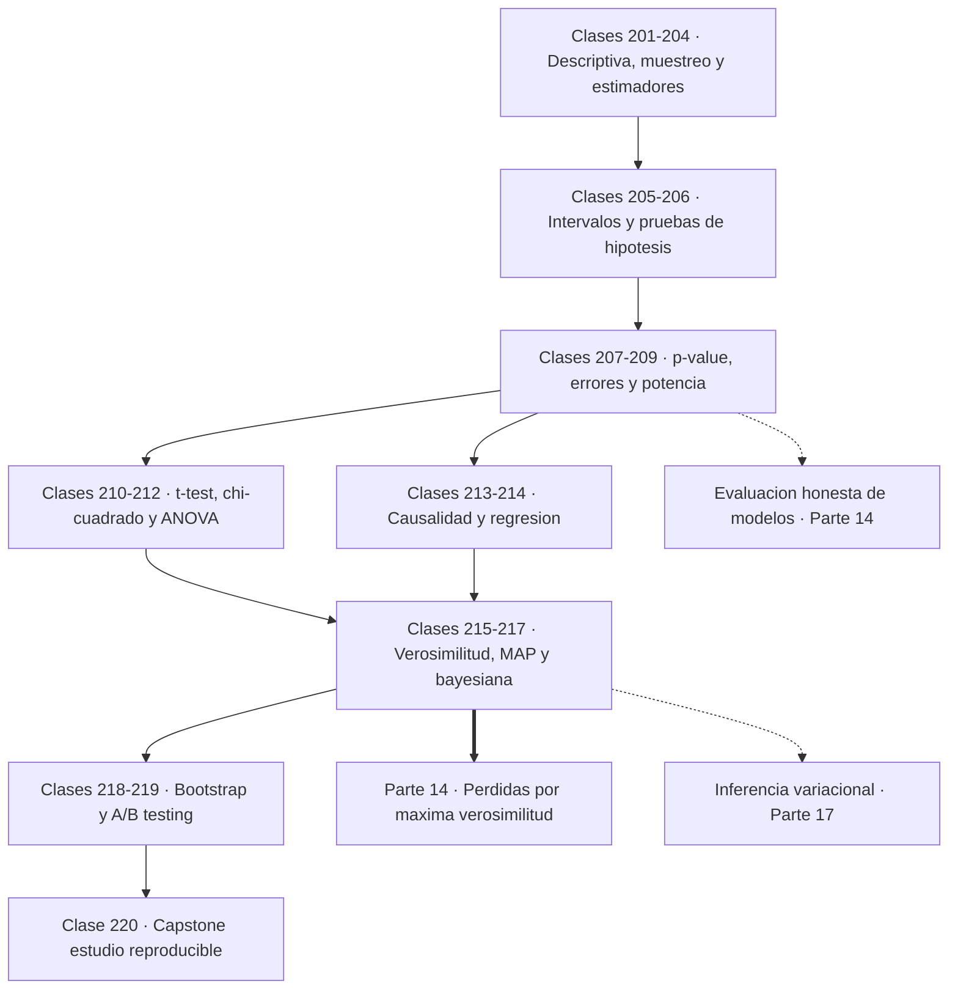

# 📊 Parte 10 — Estadística e inferencia

> [⬅️ Parte 09 — Probabilidad y procesos aleatorios](../part-09-probabilidad-y-procesos-aleatorios/README.md) · [🏠 Programa](../../README.md) · [📇 Catálogo](../README.md) · [Parte 11 — Métodos numéricos y computación científica ➡️](../part-11-metodos-numericos-y-computacion-cientifica/README.md)

**Nivel:** `universitario-avanzado` · **Clases:** 20 · **Horas estimadas:** 80 · **Motor:** [`part10.py`](../../src/computational_math/engines/part10.py)

---

## 🎯 De qué trata esta parte

Descriptiva, muestreo, estimadores, intervalos de confianza, pruebas de hipótesis, p-value, potencia, verosimilitud, MAP, inferencia bayesiana, bootstrap y A/B testing.

La probabilidad va de la causa al efecto: dado un modelo, ¿qué datos son plausibles? La
estadística recorre el camino inverso: dados unos datos, ¿qué modelo los explica y con cuánta
confianza? Esa inversión es más difícil, más frágil y más fácil de hacer mal, y es donde se
pierde la mayor parte de la credibilidad de los resultados publicados.

Las clases 201 a 204 preparan el terreno. La estadística descriptiva resume; el muestreo
condiciona todo lo que vendrá después. La lección más cara está en la clase 202: **el sesgo
de selección no se corrige con más datos**. Una muestra sesgada de un millón de personas es
peor que una muestra aleatoria de mil, porque el error sistemático no se diluye al crecer n,
y encima la mayor precisión hace más convincente la conclusión equivocada.

Las clases 205 a 209 son el núcleo de la inferencia frecuentista y contienen los tres errores
de interpretación más extendidos de toda la ciencia aplicada. Un intervalo de confianza del
95 % **no** dice que el parámetro esté ahí con probabilidad 0,95: describe un procedimiento
que, repetido muchas veces, atrapa el parámetro el 95 % de las veces. Un p-value **no** es la
probabilidad de que la hipótesis nula sea cierta: es la probabilidad de ver datos así de
extremos si la nula fuera cierta. Y un resultado no significativo en un estudio sin potencia
declarada **no significa nada**: no distingue entre «no hay efecto» y «no había datos
suficientes para verlo».

Las clases 210 a 214 son las pruebas de trabajo: t-test para medias, chi-cuadrado para tablas
de contingencia, ANOVA para varios grupos y regresión lineal con su lectura estadística. Cada
una tiene supuestos, y aplicarlas sin comprobarlos es la forma habitual de producir p-values
que no significan lo que parece. La clase 213 se dedica entera a la confusión más famosa:
correlación no implica causalidad, y un confusor basta para fabricar una correlación fuerte
entre dos variables que no se tocan.

Las clases 215 a 218 introducen el punto de vista de la verosimilitud y el bayesiano. La
máxima verosimilitud es el principio que fundamenta casi toda función de pérdida en
aprendizaje automático; MAP le añade un prior, y ese prior **es** la regularización. La
inferencia bayesiana devuelve una distribución entera sobre el parámetro, y su intervalo
creíble sí admite la lectura probabilística que el intervalo de confianza no admite. El
bootstrap cierra el bloque con una idea casi tramposa por lo simple: remuestrear los propios
datos para estimar la variabilidad, sin suponer ninguna distribución poblacional.

El cierre (219 y 220) baja a la práctica: A/B testing con tamaño muestral calculado de
antemano, y un estudio completo, reproducible, con semilla fija, intervalos declarados y
limitaciones explícitas. Esa disciplina —fijar el análisis antes de ver los datos, reportar la
incertidumbre, corregir por comparaciones múltiples y declarar lo que el estudio no puede
concluir— es lo que separa un resultado de una anécdota con números.

Para quien viene de la inteligencia artificial, esta parte es la que enseña a **evaluar**.
Comparar dos modelos por su exactitud puntual sin intervalo de confianza, elegir la mejor
configuración entre veinte y reportar su rendimiento sin corregir por selección, o medir sobre
datos que participaron en el ajuste, son exactamente los errores que esta parte nombra y
desarma.

## 🗺️ Mapa conceptual



## 🧠 Ideas centrales

- El p-value es P(datos tan extremos | H0), nunca P(H0 | datos).
- Un intervalo de confianza describe el procedimiento, no una probabilidad del parámetro.
- Sin potencia declarada, un resultado no significativo no dice nada.
- Correlación no implica causalidad, pero causalidad sí restringe la correlación.
- El bootstrap estima la variabilidad sin suponer la distribución poblacional.

## 🤖 Por qué importa en IA

> [!IMPORTANT]
> Evaluar un modelo es inferencia estadística: métricas con intervalo, comparaciones múltiples corregidas y detección de leakage.

## ⚠️ Errores frecuentes de esta parte

- p-hacking por comparaciones múltiples sin corrección.
- Confundir significancia estadística con relevancia práctica.
- Evaluar sobre datos que participaron en la selección del modelo.

## 🧭 Secuencia de la parte

```mermaid
flowchart LR
    subgraph B1["Bloque 1"]
        direction TB
        L201["201 · Estadística descriptiva"]
        L202["202 · Población, muestra y sesgo…"]
        L203["203 · Muestreo y distribuciones…"]
        L204["204 · Estimadores y propiedades"]
        L205["205 · Intervalos de confianza"]
        L201 --> L202
        L202 --> L203
        L203 --> L204
        L204 --> L205
    end
    subgraph B2["Bloque 2"]
        direction TB
        L206["206 · Pruebas de hipótesis"]
        L207["207 · p-value correctamente…"]
        L208["208 · Errores tipo I y II"]
        L209["209 · Potencia estadística"]
        L210["210 · t-test y comparación de medias"]
        L206 --> L207
        L207 --> L208
        L208 --> L209
        L209 --> L210
    end
    subgraph B3["Bloque 3"]
        direction TB
        L211["211 · Chi-cuadrado y tablas de…"]
        L212["212 · ANOVA"]
        L213["213 · Correlación frente a…"]
        L214["214 · Regresión lineal estadística"]
        L215["215 · Máxima verosimilitud"]
        L211 --> L212
        L212 --> L213
        L213 --> L214
        L214 --> L215
    end
    subgraph B4["Bloque 4"]
        direction TB
        L216["216 · Estimación MAP"]
        L217["217 · Inferencia bayesiana"]
        L218["218 · Bootstrap y remuestreo"]
        L219["219 · A/B testing y diseño…"]
        L220["220 · Capstone: estudio…"]
        L216 --> L217
        L217 --> L218
        L218 --> L219
        L219 --> L220
    end
    L205 --> L206
    L210 --> L211
    L215 --> L216
```



## 📚 Las clases

| # | Clase | Demostración | Idea central |
|---|---|---|---|
| `201` | [Estadística descriptiva](201-estadistica-descriptiva/README.md) | `descriptive_statistics` | Centro, dispersión y forma responden preguntas distintas y ninguna basta sola. |
| `202` | [Población, muestra y sesgo de selección](202-poblacion-muestra-y-sesgo-de-seleccion/README.md) | `population_sample` | El sesgo de selección no se corrige con más datos: solo se vuelve más convincente. |
| `203` | [Muestreo y distribuciones muestrales](203-muestreo-y-distribuciones-muestrales/README.md) | `sampling_distributions` | El estadístico también tiene distribución, y esa distribución es la que permite inferir. |
| `204` | [Estimadores y propiedades](204-estimadores-y-propiedades/README.md) | `estimators` | Insesgado no significa bueno: hay que mirar también la varianza. |
| `205` | [Intervalos de confianza](205-intervalos-de-confianza/README.md) | `confidence_intervals` | El 95 % de un intervalo de confianza es una propiedad del procedimiento, no del parámetro. |
| `206` | [Pruebas de hipótesis](206-pruebas-de-hipotesis/README.md) | `hypothesis_testing` | Una prueba de hipótesis nunca acepta la nula: solo la rechaza o se queda sin evidencia. |
| `207` | [p-value correctamente interpretado](207-p-value-correctamente-interpretado/README.md) | `p_value` | El p-value mide la rareza de los datos bajo H0, no la probabilidad de que H0 sea cierta. |
| `208` | [Errores tipo I y II](208-errores-tipo-i-y-ii/README.md) | `type_errors` | Bajar la tasa de falsos positivos sube la de falsos negativos: el compromiso es inevitable. |
| `209` | [Potencia estadística](209-potencia-estadistica/README.md) | `statistical_power` | Sin potencia declarada, un resultado no significativo no distingue entre no hay efecto y no hay datos. |
| `210` | [t-test y comparación de medias](210-t-test-y-comparacion-de-medias/README.md) | `t_test` | La t de Student compara medias cuando la varianza poblacional es desconocida. |
| `211` | [Chi-cuadrado y tablas de contingencia](211-chi-cuadrado-y-tablas-de-contingencia/README.md) | `chi_square` | Chi-cuadrado compara frecuencias observadas con las esperadas bajo independencia. |
| `212` | [ANOVA](212-anova/README.md) | `anova` | ANOVA compara varias medias a la vez sin inflar la tasa de falsos positivos. |
| `213` | [Correlación frente a causalidad](213-correlacion-frente-a-causalidad/README.md) | `correlation_causation` | Un confusor basta para fabricar correlación fuerte entre variables que no se tocan. |
| `214` | [Regresión lineal estadística](214-regresion-lineal-estadistica/README.md) | `linear_regression_stats` | Un R² alto no valida el modelo: los residuos son los que lo hacen. |
| `215` | [Máxima verosimilitud](215-maxima-verosimilitud/README.md) | `maximum_likelihood` | La máxima verosimilitud elige el parámetro que hace más probables los datos observados. |
| `216` | [Estimación MAP](216-estimacion-map/README.md) | `map_estimation` | MAP es verosimilitud más prior, y ese prior es exactamente la regularización. |
| `217` | [Inferencia bayesiana](217-inferencia-bayesiana/README.md) | `bayesian_inference` | El intervalo creíble sí admite la lectura probabilística que el de confianza no admite. |
| `218` | [Bootstrap y remuestreo](218-bootstrap-y-remuestreo/README.md) | `bootstrap` | El bootstrap estima la variabilidad remuestreando los datos, sin suponer distribución. |
| `219` | [A/B testing y diseño experimental](219-a-b-testing-y-diseno-experimental/README.md) | `ab_testing` | Un A/B test se diseña antes de recogerlo: tamaño muestral, métrica y criterio de parada. |
| `220` | [Capstone: estudio estadístico reproducible](220-capstone-estudio-estadistico-reproducible/README.md) | `capstone_reproducible_study` | Un estudio creíble declara su semilla, su intervalo y lo que no puede concluir. |

## 📖 Glosario de la parte (36 términos)

Definiciones precisas en [`GLOSARIO.md`](GLOSARIO.md).

## 🧰 Stack de referencia

`statistics`, `random`, `math`, `scipy (opcional)`

Los laboratorios se ejecutan con biblioteca estándar; estas herramientas aparecen
como contraste profesional, no como requisito.

## 🧪 Ejecutar toda la parte

```bash
compmath run --part 10
compmath catalog --part 10
```

## 📊 Evaluación de la parte

| Componente | Peso |
|---|---:|
| Clases y ejercicios | 40 % |
| Laboratorios y notebooks | 25 % |
| Explicación oral o escrita | 15 % |
| Capstone ([220](220-capstone-estudio-estadistico-reproducible/README.md)) | 20 % |

## 📖 Bibliografía

- Wasserman, L. *All of Statistics*. Springer, 2004.
- Gelman, A. et al. *Bayesian Data Analysis*. 3ª ed., CRC, 2013.
- Efron, B.; Tibshirani, R. *An Introduction to the Bootstrap*. Chapman & Hall, 1993.

---

> [⬅️ Parte 09 — Probabilidad y procesos aleatorios](../part-09-probabilidad-y-procesos-aleatorios/README.md) · [🏠 Programa](../../README.md) · [📇 Catálogo](../README.md) · [Parte 11 — Métodos numéricos y computación científica ➡️](../part-11-metodos-numericos-y-computacion-cientifica/README.md)
