# 📊 Parte 10 — Estadística e inferencia

> [⬅️ Parte 09 — Probabilidad y procesos aleatorios](../part-09-probabilidad-y-procesos-aleatorios/README.md) · [🏠 Programa](../../README.md) · [📇 Catálogo](../README.md) · [Parte 11 — Métodos numéricos y computación científica ➡️](../part-11-metodos-numericos-y-computacion-cientifica/README.md)

**Nivel:** `universitario-avanzado` · **Clases:** 20 · **Horas estimadas:** 80 · **Motor:** [`part10.py`](../../src/computational_math/engines/part10.py)

---

## 🎯 De qué trata esta parte

Descriptiva, muestreo, estimadores, intervalos de confianza, pruebas de hipótesis, p-value, potencia, verosimilitud, MAP, inferencia bayesiana, bootstrap y A/B testing.

## 🧠 Ideas centrales

- El p-value es P(datos tan extremos | H0), nunca P(H0 | datos).
- Un intervalo de confianza describe el procedimiento, no una probabilidad del parámetro.
- Sin potencia declarada, un resultado no significativo no dice nada.
- Correlación no implica causalidad, pero causalidad sí restringe la correlación.
- El bootstrap estima la variabilidad sin suponer la distribución poblacional.

## 🤖 Por qué importa en IA

> [!IMPORTANT]
> Evaluar un modelo es inferencia estadística: métricas con intervalo, comparaciones múltiples corregidas y detección de leakage.

## ⚠️ Errores frecuentes de esta parte

- p-hacking por comparaciones múltiples sin corrección.
- Confundir significancia estadística con relevancia práctica.
- Evaluar sobre datos que participaron en la selección del modelo.

## 🧭 Secuencia de la parte

```mermaid
flowchart LR
    subgraph B1["Bloque 1"]
        direction TB
        L201["201<br/>Estadística descriptiva"]
        L202["202<br/>Población, muestra y<br/>sesgo de selección"]
        L203["203<br/>Muestreo y<br/>distribuciones<br/>muestrales"]
        L204["204<br/>Estimadores y<br/>propiedades"]
        L205["205<br/>Intervalos de confianza"]
        L201 --> L202
        L202 --> L203
        L203 --> L204
        L204 --> L205
    end
    subgraph B2["Bloque 2"]
        direction TB
        L206["206<br/>Pruebas de hipótesis"]
        L207["207<br/>p-value correctamente<br/>interpretado"]
        L208["208<br/>Errores tipo I y II"]
        L209["209<br/>Potencia estadística"]
        L210["210<br/>t-test y comparación de<br/>medias"]
        L206 --> L207
        L207 --> L208
        L208 --> L209
        L209 --> L210
    end
    subgraph B3["Bloque 3"]
        direction TB
        L211["211<br/>Chi-cuadrado y tablas de<br/>contingencia"]
        L212["212<br/>ANOVA"]
        L213["213<br/>Correlación frente a<br/>causalidad"]
        L214["214<br/>Regresión lineal<br/>estadística"]
        L215["215<br/>Máxima verosimilitud"]
        L211 --> L212
        L212 --> L213
        L213 --> L214
        L214 --> L215
    end
    subgraph B4["Bloque 4"]
        direction TB
        L216["216<br/>Estimación MAP"]
        L217["217<br/>Inferencia bayesiana"]
        L218["218<br/>Bootstrap y remuestreo"]
        L219["219<br/>A/B testing y diseño<br/>experimental"]
        L220["220<br/>Capstone: estudio<br/>estadístico reproducible"]
        L216 --> L217
        L217 --> L218
        L218 --> L219
        L219 --> L220
    end
    L205 --> L206
    L210 --> L211
    L215 --> L216
```



## 📚 Las clases

| # | Clase | Demostración | Idea central |
|---|---|---|---|
| `201` | [Estadística descriptiva](201-estadistica-descriptiva/README.md) | `descriptive_statistics` | Centro, dispersión y forma: tres preguntas distintas. |
| `202` | [Población, muestra y sesgo de selección](202-poblacion-muestra-y-sesgo-de-seleccion/README.md) | `population_sample` | Sesgo de selección: la muestra no representa a la población. |
| `203` | [Muestreo y distribuciones muestrales](203-muestreo-y-distribuciones-muestrales/README.md) | `sampling_distributions` | La distribución de la media muestral y su error estándar. |
| `204` | [Estimadores y propiedades](204-estimadores-y-propiedades/README.md) | `estimators` | Sesgo, varianza y consistencia de dos estimadores de la varianza. |
| `205` | [Intervalos de confianza](205-intervalos-de-confianza/README.md) | `confidence_intervals` | Un IC 95 % describe el procedimiento, no una probabilidad del parámetro. |
| `206` | [Pruebas de hipótesis](206-pruebas-de-hipotesis/README.md) | `hypothesis_testing` | Estructura completa de una prueba de hipótesis. |
| `207` | [p-value correctamente interpretado](207-p-value-correctamente-interpretado/README.md) | `p_value` | Qué mide y qué no mide un p-value. |
| `208` | [Errores tipo I y II](208-errores-tipo-i-y-ii/README.md) | `type_errors` | Errores tipo I y II: el compromiso es inevitable. |
| `209` | [Potencia estadística](209-potencia-estadistica/README.md) | `statistical_power` | Potencia en función del tamaño muestral. |
| `210` | [t-test y comparación de medias](210-t-test-y-comparacion-de-medias/README.md) | `t_test` | t-test de dos muestras independientes. |
| `211` | [Chi-cuadrado y tablas de contingencia](211-chi-cuadrado-y-tablas-de-contingencia/README.md) | `chi_square` | Chi-cuadrado de independencia sobre una tabla de contingencia. |
| `212` | [ANOVA](212-anova/README.md) | `anova` | ANOVA de un factor: descomposición de la variabilidad. |
| `213` | [Correlación frente a causalidad](213-correlacion-frente-a-causalidad/README.md) | `correlation_causation` | Una variable de confusión genera correlación sin causalidad. |
| `214` | [Regresión lineal estadística](214-regresion-lineal-estadistica/README.md) | `linear_regression_stats` | Regresión lineal con R², error estándar y significancia. |
| `215` | [Máxima verosimilitud](215-maxima-verosimilitud/README.md) | `maximum_likelihood` | MLE para la normal: la media muestral maximiza la verosimilitud. |
| `216` | [Estimación MAP](216-estimacion-map/README.md) | `map_estimation` | MAP: verosimilitud más prior, y su límite con muchos datos. |
| `217` | [Inferencia bayesiana](217-inferencia-bayesiana/README.md) | `bayesian_inference` | Actualización bayesiana conjugada Beta-Binomial. |
| `218` | [Bootstrap y remuestreo](218-bootstrap-y-remuestreo/README.md) | `bootstrap` | Bootstrap: estimar la variabilidad sin suponer la distribución. |
| `219` | [A/B testing y diseño experimental](219-a-b-testing-y-diseno-experimental/README.md) | `ab_testing` | A/B test de proporciones con tamaño muestral y significancia. |
| `220` | [Capstone: estudio estadístico reproducible](220-capstone-estudio-estadistico-reproducible/README.md) | `capstone_reproducible_study` | Capstone: estudio completo, reproducible y con límites declarados. |

## 🧰 Stack de referencia

`statistics`, `random`, `math`, `scipy (opcional)`

Los laboratorios se ejecutan con biblioteca estándar; estas herramientas aparecen
como contraste profesional, no como requisito.

## 🧪 Ejecutar toda la parte

```bash
compmath run --part 10
compmath catalog --part 10
```

## 📊 Evaluación de la parte

| Componente | Peso |
|---|---:|
| Clases y ejercicios | 40 % |
| Laboratorios y notebooks | 25 % |
| Explicación oral o escrita | 15 % |
| Capstone ([220](220-capstone-estudio-estadistico-reproducible/README.md)) | 20 % |

## 📖 Bibliografía

- Wasserman, L. *All of Statistics*. Springer, 2004.
- Gelman, A. et al. *Bayesian Data Analysis*. 3ª ed., CRC, 2013.
- Efron, B.; Tibshirani, R. *An Introduction to the Bootstrap*. Chapman & Hall, 1993.

---

> [⬅️ Parte 09 — Probabilidad y procesos aleatorios](../part-09-probabilidad-y-procesos-aleatorios/README.md) · [🏠 Programa](../../README.md) · [📇 Catálogo](../README.md) · [Parte 11 — Métodos numéricos y computación científica ➡️](../part-11-metodos-numericos-y-computacion-cientifica/README.md)
