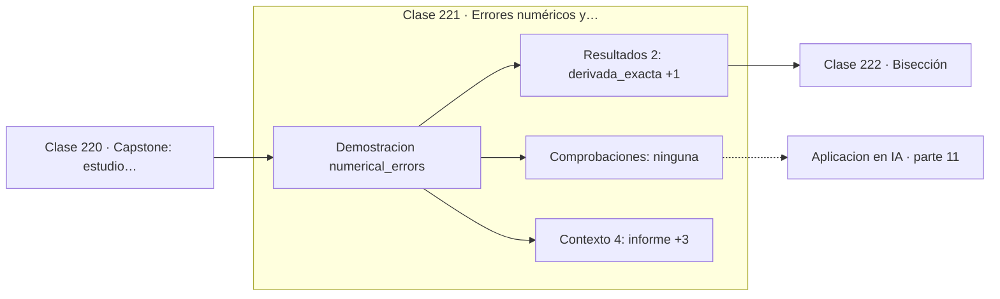

# 221 — Errores numéricos y convergencia

> [⬅️ 220 Capstone: estudio estadístico reproducible](../../part-10-estadistica-e-inferencia/220-capstone-estudio-estadistico-reproducible/README.md) · [📚 Parte 11](../README.md) · [🏠 Programa](../../../README.md) · [222 Bisección ➡️](../222-biseccion/README.md)

**Parte:** 11 — Métodos numéricos y computación científica · **Nivel:** `cientifico` · **Horas estimadas:** 4
**Motor:** `engines.part11` · **Demostración:** `numerical_errors` · **Clase 1 de 20** de la parte

---

## 🎯 Propósito

**Reducir el paso mejora hasta que el redondeo toma el control y empeora.**

Raíces, interpolación, splines, diferenciación y cuadratura numérica, sistemas lineales iterativos, mínimos cuadrados y ecuaciones diferenciales.

## ✅ Resultados de aprendizaje

Al terminar podrás:

1. Explicar **Errores numéricos y convergencia** con lenguaje cotidiano y con notación matemática.
2. Resolver un caso pequeño a mano y anticipar el orden de magnitud del resultado.
3. Ejecutar y modificar `lab.py`, que corre la demostración `numerical_errors`.
4. Interpretar las 6 salidas del laboratorio y decir qué comprueba cada una.
5. Detectar el error típico de esta parte: usar tolerancia absoluta cuando la escala del problema es grande.

## 🧩 Fórmulas de la clase

```text
error total ≈ C₁·hᵖ + C₂·ε/h
diferencia adelantada: O(h);  central: O(h²)
h óptimo de la central ≈ ε^(1/3) ≈ 6·10⁻⁶
```

## 🗺️ Ubicación en el programa



## 📖 Fundamentos

Todo método numérico arrastra dos errores de naturaleza opuesta. El **error de
truncamiento** proviene de la aproximación matemática —cortar una serie de Taylor,
sustituir una curva por una recta— y se reduce al hacer el paso más pequeño. El **error de
redondeo** proviene de la aritmética de precisión finita y **crece** al reducir el paso,
porque restar dos números casi iguales y dividir por algo diminuto amplifica el ruido.

La suma de ambos tiene un mínimo. Existe un `h` óptimo, y por debajo de él afinar más
empeora el resultado. Esto contradice la intuición de que «más pequeño es más preciso», y
es la razón de que una derivada numérica con `h = 10⁻¹⁵` sea basura mientras que con
`h = 10⁻⁶` sea buena.

El **orden** de un método es la potencia de `h` en el término de truncamiento, y es la
cifra que permite predecir el comportamiento sin ejecutar nada. Un método de orden 1
divide el error por 2 al duplicar el trabajo; uno de orden 2 lo divide por 4; uno de orden
4, por 16. Esa diferencia es lo que decide entre segundos y horas de cómputo.

La consecuencia metodológica es que hay que **medir el orden empíricamente**. Ejecutar con
`h` y con `h/2`, calcular el cociente de errores y comprobar que sale lo que la teoría
predice, es la prueba más eficaz de que una implementación es correcta: un método de orden
4 cuyo error solo se divide por 2 tiene un error de programación.

## 🧮 Ejemplo trabajado

Derivada numérica de sen en x = 1, con distintos pasos.

```text
valor exacto: cos(1) = 0,5403023058681398

      h        error adelantada    error central
  1e-01          4,294e-02          9,00e-04
  1e-03          4,207e-04          9,00e-08
  1e-05          4,207e-06          9,04e-12
  1e-07          4,361e-08          6,07e-10   ← empeora
  1e-09          2,721e-08          2,72e-08   ← ruido
  1e-11          6,004e-06          6,00e-06   ← basura

La central es O(h²): h × 0,01 → error × 0,0001            ✓
hasta que el redondeo domina cerca de h ≈ 1e-6.

h óptimo aproximado para la central: ε^(1/3) ≈ 6e-6
```

## 🔬 Qué ejecuta el laboratorio

`numerical_errors` — Error de truncamiento frente a error de redondeo.

| Grupo | Salidas |
|---|---|
| 🔢 Resultados numéricos (2) | `derivada_exacta`, `h_optimo_aprox` |
| ✅ Comprobaciones de invariante (0) | — |

Las claves booleanas no son adorno: si alguna fuera `False`, el resultado numérico
no sería fiable aunque el programa terminase sin error.

```bash
python classes/part-11-metodos-numericos-y-computacion-cientifica/221-errores-numericos-y-convergencia/lab.py
compmath run 221
```

> [!TIP]
> Antes de ejecutar, **escribe tu predicción**. Un laboratorio que confirma lo que
> esperabas enseña tanto como uno que te contradice, pero solo si la predicción
> existía antes del resultado.

## ⚠️ Errores conceptuales frecuentes

1. Reducir h indefinidamente creyendo que siempre mejora.
2. Publicar un método sin haber medido su orden empírico.
3. Confundir precisión de la máquina con precisión del resultado.

## 🚀 Dónde se usa de verdad

Comprobación de gradientes numéricos frente a autodiferenciación, validación de
integradores y elección de pasos en simulación.

## 🤖 Conexión con IA

Los Neural ODE, los samplers de difusión y los optimizadores de segundo orden son métodos numéricos con parámetros aprendidos.

## 📓 Notebooks

| Archivo | Para qué |
|---|---|
| [`notebook.ipynb`](notebook.ipynb) | recorrido guiado con la demostración ejecutada |
| [`notebook_student.ipynb`](notebook_student.ipynb) | versión con `TODO` para resolver |
| [`notebook_solution.ipynb`](notebook_solution.ipynb) | solución de referencia verificada |

## 📝 Evaluación

| Criterio | Peso |
|---|---:|
| Comprensión conceptual | 25 % |
| Resolución manual | 25 % |
| Implementación y verificación | 25 % |
| Interpretación y comunicación | 15 % |
| Conexión con aplicación real | 10 % |

Detalle y criterios de error crítico en [`assessment.md`](assessment.md).

## ❓ Preguntas de comprobación

1. ¿Cuál es la entrada, cuál la salida y qué unidades tienen?
2. ¿Qué operación domina el comportamiento del resultado?
3. ¿Qué caso extremo revelaría un error conceptual?
4. ¿Cómo verificarías el resultado por un método independiente?
5. ¿Dónde aparece esto en simulación física?

Si necesitas releer el código para responderlas, la clase todavía no está superada.

## 📥 Entregable

`notebook_student.ipynb` resuelto más un párrafo que explique el resultado **sin citar
código**: qué entra, qué sale, qué invariante se comprueba y qué pasaría en un caso límite.

## 🔗 Referencias

- [Heath, M. *Scientific Computing: An Introductory Survey*, 2ª ed., SIAM, 2018, cap. 1](https://doi.org/10.1137/1.9781611975581)
- [Higham, N. *Accuracy and Stability of Numerical Algorithms*, 2ª ed., SIAM, 2002](https://doi.org/10.1137/1.9780898718027)

Bibliografía completa de la parte en [`../../../docs/BIBLIOGRAPHY.md`](../../../docs/BIBLIOGRAPHY.md).

## 📂 Material de la clase

[`intuition.md`](intuition.md) · [`theory.md`](theory.md) · [`derivation.md`](derivation.md) · [`exercises.md`](exercises.md) · [`assessment.md`](assessment.md) · [`where-is-this-used.md`](where-is-this-used.md) · [`lesson.yaml`](lesson.yaml)

---

> [⬅️ 220 Capstone: estudio estadístico reproducible](../../part-10-estadistica-e-inferencia/220-capstone-estudio-estadistico-reproducible/README.md) · [📚 Parte 11](../README.md) · [🏠 Programa](../../../README.md) · [222 Bisección ➡️](../222-biseccion/README.md)
