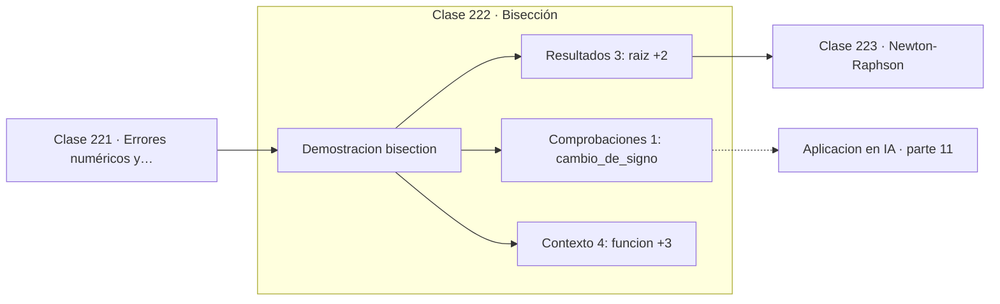

# 222 — Bisección

> [⬅️ 221 Errores numéricos y convergencia](../221-errores-numericos-y-convergencia/README.md) · [📚 Parte 11](../README.md) · [🏠 Programa](../../../README.md) · [223 Newton-Raphson ➡️](../223-newton-raphson/README.md)

**Parte:** 11 — Métodos numéricos y computación científica · **Nivel:** `cientifico` · **Horas estimadas:** 4
**Motor:** `engines.part11` · **Demostración:** `bisection` · **Clase 2 de 20** de la parte

---

## 🎯 Propósito

**Bisección es la única que nunca falla si hay cambio de signo, y por eso es la red de seguridad.**

Raíces, interpolación, splines, diferenciación y cuadratura numérica, sistemas lineales iterativos, mínimos cuadrados y ecuaciones diferenciales.

## ✅ Resultados de aprendizaje

Al terminar podrás:

1. Explicar **Bisección** con lenguaje cotidiano y con notación matemática.
2. Resolver un caso pequeño a mano y anticipar el orden de magnitud del resultado.
3. Ejecutar y modificar `lab.py`, que corre la demostración `bisection`.
4. Interpretar las 8 salidas del laboratorio y decir qué comprueba cada una.
5. Detectar el error típico de esta parte: iterar sin límite máximo y colgar el proceso.

## 🧩 Fórmulas de la clase

```text
si f(a)·f(b) < 0, hay raíz en (a,b)
amplitud tras n pasos: (b−a)/2ⁿ
n ≈ log₂((b−a)/tol) iteraciones
```

## 🗺️ Ubicación en el programa



## 📖 Fundamentos

La bisección se apoya en el teorema de Bolzano: si una función continua cambia de signo
entre dos puntos, hay al menos una raíz entre ellos. El método evalúa el punto medio,
mira el signo, y se queda con la mitad que sigue conteniendo el cambio. Cada paso reduce
exactamente a la mitad la incertidumbre.

Su virtud es la **garantía**. No hay condiciones adicionales, no hay puntos iniciales
malos, no diverge nunca. El número de iteraciones se conoce de antemano:
`log₂((b−a)/tol)`, unas 41 para pasar de un intervalo de amplitud 2 a la precisión de la
máquina. Esa previsibilidad es lo que la hace insustituible como respaldo.

Su defecto es la **lentitud**. Cada iteración gana un solo bit de precisión, mientras que
Newton duplica los dígitos correctos. Para el mismo problema, bisección necesita 41
evaluaciones donde Newton necesita 6. Cuando la evaluación de la función es cara, la
diferencia es determinante.

La limitación menos obvia es que **necesita un cambio de signo**, y por tanto no encuentra
raíces dobles como la de `x²`, donde la función toca el eje sin cruzarlo. Los métodos
robustos de producción, como Brent, combinan bisección con interpolación: usan la rápida
cuando funciona y caen a la garantizada cuando no.

## 🧮 Ejemplo trabajado

Raíz de x³ − 2x − 4 en el intervalo de 1 a 3.

```text
f(1) = −5 < 0        f(3) = 17 > 0        hay cambio de signo

iter    x        f(x)         amplitud
  1   2,0000    0,000000        1,000
  5   1,9375   −0,603760        0,0625
 10   2,0020    0,020000        0,00195
 20   2,0000    1,9e-05         1,9e-06
 41   2,0000   −4,55e-12        9,1e-13

raíz = 2,0        41 iteraciones para 12 dígitos

Predicción teórica: log₂(2 / 1e-12) ≈ 41                 ✓

Newton alcanza la misma precisión en 6 iteraciones,
pero necesita la derivada y un buen punto inicial.
```

## 🔬 Qué ejecuta el laboratorio

`bisection` — Bisección: lenta pero garantizada si hay cambio de signo.

| Grupo | Salidas |
|---|---|
| 🔢 Resultados numéricos (3) | `raiz`, `residuo`, `iteraciones_totales` |
| ✅ Comprobaciones de invariante (1) | `cambio_de_signo` |

Las claves booleanas no son adorno: si alguna fuera `False`, el resultado numérico
no sería fiable aunque el programa terminase sin error.

```bash
python classes/part-11-metodos-numericos-y-computacion-cientifica/222-biseccion/lab.py
compmath run 222
```

> [!TIP]
> Antes de ejecutar, **escribe tu predicción**. Un laboratorio que confirma lo que
> esperabas enseña tanto como uno que te contradice, pero solo si la predicción
> existía antes del resultado.

## ⚠️ Errores conceptuales frecuentes

1. Aplicarla sin comprobar el cambio de signo en el intervalo.
2. Esperar que encuentre raíces de multiplicidad par.
3. Usarla sin tope de iteraciones aunque su convergencia esté acotada.

## 🚀 Dónde se usa de verdad

Búsqueda robusta de raíces, calibración de umbrales, respaldo dentro de métodos híbridos y
búsqueda de puntos de cruce en curvas monótonas.

## 🤖 Conexión con IA

Los Neural ODE, los samplers de difusión y los optimizadores de segundo orden son métodos numéricos con parámetros aprendidos.

## 📓 Notebooks

| Archivo | Para qué |
|---|---|
| [`notebook.ipynb`](notebook.ipynb) | recorrido guiado con la demostración ejecutada |
| [`notebook_student.ipynb`](notebook_student.ipynb) | versión con `TODO` para resolver |
| [`notebook_solution.ipynb`](notebook_solution.ipynb) | solución de referencia verificada |

## 📝 Evaluación

| Criterio | Peso |
|---|---:|
| Comprensión conceptual | 25 % |
| Resolución manual | 25 % |
| Implementación y verificación | 25 % |
| Interpretación y comunicación | 15 % |
| Conexión con aplicación real | 10 % |

Detalle y criterios de error crítico en [`assessment.md`](assessment.md).

## ❓ Preguntas de comprobación

1. ¿Cuál es la entrada, cuál la salida y qué unidades tienen?
2. ¿Qué operación domina el comportamiento del resultado?
3. ¿Qué caso extremo revelaría un error conceptual?
4. ¿Cómo verificarías el resultado por un método independiente?
5. ¿Dónde aparece esto en simulación física?

Si necesitas releer el código para responderlas, la clase todavía no está superada.

## 📥 Entregable

`notebook_student.ipynb` resuelto más un párrafo que explique el resultado **sin citar
código**: qué entra, qué sale, qué invariante se comprueba y qué pasaría en un caso límite.

## 📚 Bibliografía de la clase

Esta clase enseña **Métodos numéricos · Computación científica · Ecuaciones diferenciales · Teoría de la aproximación · Álgebra lineal numérica**. Cada obra dice qué aporta aquí y cómo se comprobó su localizador:

- [Burden, R.; Faires, J. *Numerical Analysis*, 10ª ed., Cengage, 2015, cap. 2](https://openlibrary.org/isbn/9781305253667) — Métodos numéricos: el tema de esta clase · ISBN-13 `9781305253667` verificado en International ISBN Agency (2026-08-20).
- [Press, W. et al. *Numerical Recipes*, 3ª ed., Cambridge, 2007, cap. 9](https://numerical.recipes/) — Computación científica y Métodos numéricos: el tema de esta clase · URL de la fuente primaria comprobada en sitio de la obra o de su editorial (2026-08-19).

Bibliografía de todas las clases, con el porqué de cada obra, en [`docs/BIBLIOGRAPHY.md`](../../../docs/BIBLIOGRAPHY.md) · localizador y estado de cada obra en [`sources/bibliography.json`](../../../sources/bibliography.json).

## 📂 Material de la clase

[`intuition.md`](intuition.md) · [`theory.md`](theory.md) · [`derivation.md`](derivation.md) · [`exercises.md`](exercises.md) · [`assessment.md`](assessment.md) · [`where-is-this-used.md`](where-is-this-used.md) · [`lesson.yaml`](lesson.yaml)

---

> [⬅️ 221 Errores numéricos y convergencia](../221-errores-numericos-y-convergencia/README.md) · [📚 Parte 11](../README.md) · [🏠 Programa](../../../README.md) · [223 Newton-Raphson ➡️](../223-newton-raphson/README.md)
