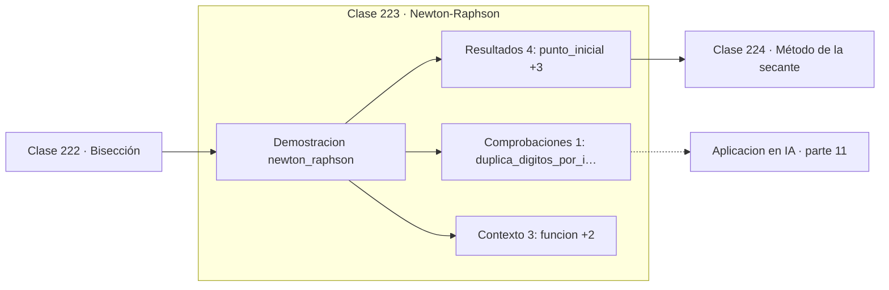

# 223 — Newton-Raphson

> [⬅️ 222 Bisección](../222-biseccion/README.md) · [📚 Parte 11](../README.md) · [🏠 Programa](../../../README.md) · [224 Método de la secante ➡️](../224-metodo-de-la-secante/README.md)

**Parte:** 11 — Métodos numéricos y computación científica · **Nivel:** `cientifico` · **Horas estimadas:** 4
**Motor:** `engines.part11` · **Demostración:** `newton_raphson` · **Clase 3 de 20** de la parte

---

## 🎯 Propósito

**Newton duplica los dígitos correctos en cada paso, pero solo si empieza cerca.**

Raíces, interpolación, splines, diferenciación y cuadratura numérica, sistemas lineales iterativos, mínimos cuadrados y ecuaciones diferenciales.

## ✅ Resultados de aprendizaje

Al terminar podrás:

1. Explicar **Newton-Raphson** con lenguaje cotidiano y con notación matemática.
2. Resolver un caso pequeño a mano y anticipar el orden de magnitud del resultado.
3. Ejecutar y modificar `lab.py`, que corre la demostración `newton_raphson`.
4. Interpretar las 8 salidas del laboratorio y decir qué comprueba cada una.
5. Detectar el error típico de esta parte: aplicar runge-kutta con paso fijo a un sistema rígido.

## 🧩 Fórmulas de la clase

```text
xₙ₊₁ = xₙ − f(xₙ)/f'(xₙ)
error: eₙ₊₁ ≈ C·eₙ²  (convergencia cuadrática)
falla si f'(xₙ) ≈ 0
```

## 🗺️ Ubicación en el programa



## 📖 Fundamentos

Newton-Raphson aproxima la función por su recta tangente en el punto actual y toma como
siguiente candidato el corte de esa recta con el eje. Es el método de la derivada aplicado
a la búsqueda de raíces, y su deducción cabe en dos líneas a partir del desarrollo de
Taylor de primer orden.

Su **convergencia cuadrática** es espectacular cuando funciona: si en un paso hay 3
dígitos correctos, en el siguiente hay 6, y en el siguiente 12. Por eso 6 iteraciones
bastan donde bisección necesita 41. La cuadraticidad se pierde en raíces múltiples, donde
degenera a convergencia lineal.

Los modos de fallo son reales y variados. Si la derivada se anula cerca del iterado, el
paso se dispara a infinito. Si el punto inicial está lejos, la iteración puede alejarse,
oscilar en un ciclo o converger a una raíz distinta de la buscada. Los fractales de Newton
son la representación gráfica de esa sensibilidad extrema al punto de partida.

Su generalización a varias dimensiones sustituye la derivada por el **Jacobiano** y la
división por la resolución de un sistema lineal. Esa versión es la que subyace a los
métodos de segundo orden en optimización: minimizar es buscar la raíz del gradiente, y
Newton aplicado al gradiente usa el Hessiano. La parte 12 desarrolla esa línea.

## 🧮 Ejemplo trabajado

Raíz de x³ − 2x − 4 desde x₀ = 3.

```text
f(x) = x³ − 2x − 4        f'(x) = 3x² − 2

iter      x           error
  1    2,320000     3,20e-01
  2    2,059716     5,97e-02
  3    2,003100     3,10e-03
  4    2,000009     9,58e-06
  5    2,000000     9,17e-11
  6    2,000000     0,00e+00

Los dígitos correctos se duplican: 1 → 2 → 3 → 5 → 10 → 16

6 iteraciones frente a las 41 de bisección.

Modo de fallo: desde x₀ = 0,8 se tiene f'(0,8) = −0,08,
el paso salta a x ≈ −65 y la iteración se descontrola.
```

## 🔬 Qué ejecuta el laboratorio

`newton_raphson` — Newton: convergencia cuadrática cerca de la raíz.

| Grupo | Salidas |
|---|---|
| 🔢 Resultados numéricos (4) | `punto_inicial`, `raiz`, `iteraciones`, `residuo` |
| ✅ Comprobaciones de invariante (1) | `duplica_digitos_por_iteracion` |

Las claves booleanas no son adorno: si alguna fuera `False`, el resultado numérico
no sería fiable aunque el programa terminase sin error.

```bash
python classes/part-11-metodos-numericos-y-computacion-cientifica/223-newton-raphson/lab.py
compmath run 223
```

> [!TIP]
> Antes de ejecutar, **escribe tu predicción**. Un laboratorio que confirma lo que
> esperabas enseña tanto como uno que te contradice, pero solo si la predicción
> existía antes del resultado.

## ⚠️ Errores conceptuales frecuentes

1. Usarlo sin salvaguarda cuando la derivada puede anularse.
2. Esperar convergencia cuadrática en raíces múltiples.
3. Omitir el tope de iteraciones y colgar el proceso en un ciclo.

## 🚀 Dónde se usa de verdad

Optimización de segundo orden, resolución de sistemas no lineales, cálculo de funciones
inversas y calibración de modelos.

## 🤖 Conexión con IA

Los Neural ODE, los samplers de difusión y los optimizadores de segundo orden son métodos numéricos con parámetros aprendidos.

## 📓 Notebooks

| Archivo | Para qué |
|---|---|
| [`notebook.ipynb`](notebook.ipynb) | recorrido guiado con la demostración ejecutada |
| [`notebook_student.ipynb`](notebook_student.ipynb) | versión con `TODO` para resolver |
| [`notebook_solution.ipynb`](notebook_solution.ipynb) | solución de referencia verificada |

## 📝 Evaluación

| Criterio | Peso |
|---|---:|
| Comprensión conceptual | 25 % |
| Resolución manual | 25 % |
| Implementación y verificación | 25 % |
| Interpretación y comunicación | 15 % |
| Conexión con aplicación real | 10 % |

Detalle y criterios de error crítico en [`assessment.md`](assessment.md).

## ❓ Preguntas de comprobación

1. ¿Cuál es la entrada, cuál la salida y qué unidades tienen?
2. ¿Qué operación domina el comportamiento del resultado?
3. ¿Qué caso extremo revelaría un error conceptual?
4. ¿Cómo verificarías el resultado por un método independiente?
5. ¿Dónde aparece esto en simulación física?

Si necesitas releer el código para responderlas, la clase todavía no está superada.

## 📥 Entregable

`notebook_student.ipynb` resuelto más un párrafo que explique el resultado **sin citar
código**: qué entra, qué sale, qué invariante se comprueba y qué pasaría en un caso límite.

## 🔗 Referencias

- [Burden, R.; Faires, J. *Numerical Analysis*, 10ª ed., Cengage, 2015, cap. 2](https://www.cengage.com/) — *uso:* obra de referencia consultada en «Newton-Raphson».
- [Nocedal, J.; Wright, S. *Numerical Optimization*, 2ª ed., Springer, 2006](https://doi.org/10.1007/978-0-387-40065-5) — *uso:* desarrollo formal del tema en «Newton-Raphson».

Bibliografía completa de la parte en [`../../../docs/BIBLIOGRAPHY.md`](../../../docs/BIBLIOGRAPHY.md) · localizador verificable de cada obra en [`sources/bibliography.json`](../../../sources/bibliography.json).

## 📂 Material de la clase

[`intuition.md`](intuition.md) · [`theory.md`](theory.md) · [`derivation.md`](derivation.md) · [`exercises.md`](exercises.md) · [`assessment.md`](assessment.md) · [`where-is-this-used.md`](where-is-this-used.md) · [`lesson.yaml`](lesson.yaml)

---

> [⬅️ 222 Bisección](../222-biseccion/README.md) · [📚 Parte 11](../README.md) · [🏠 Programa](../../../README.md) · [224 Método de la secante ➡️](../224-metodo-de-la-secante/README.md)
